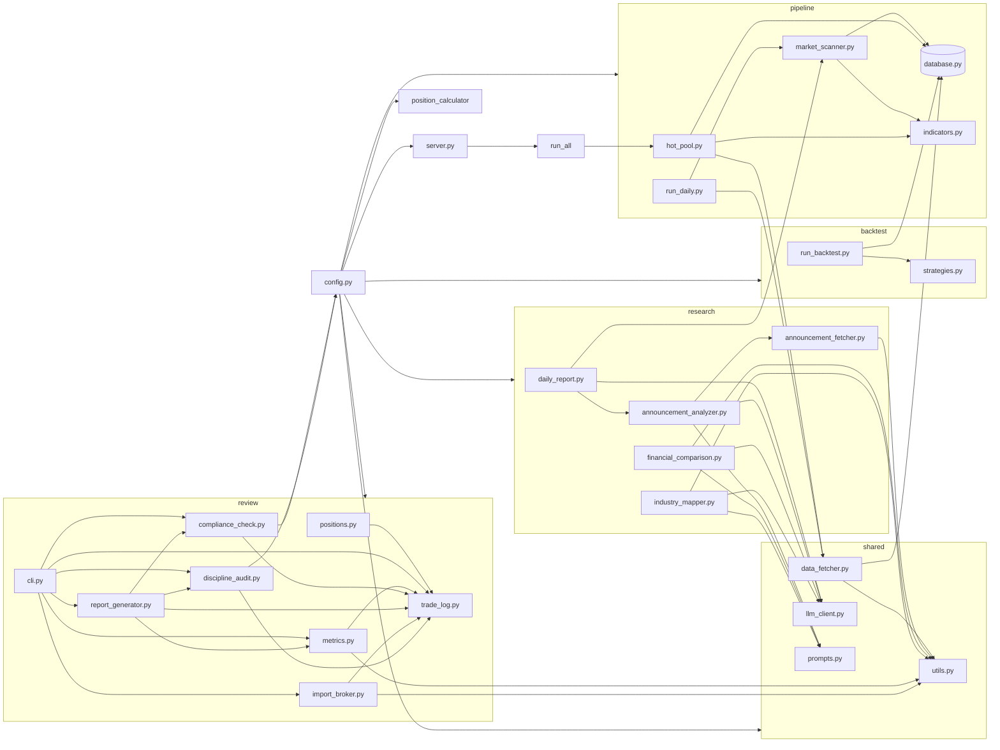
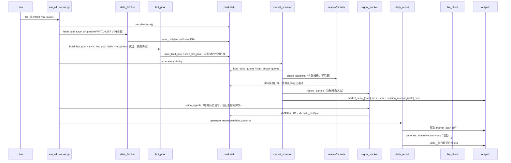
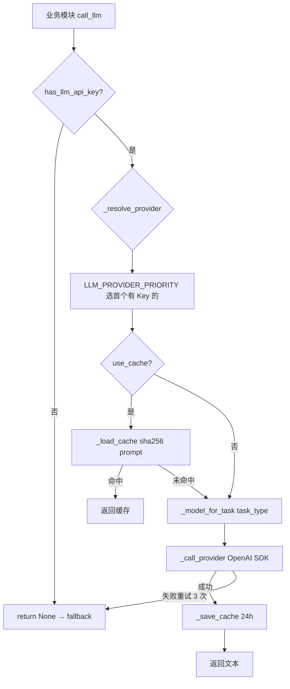
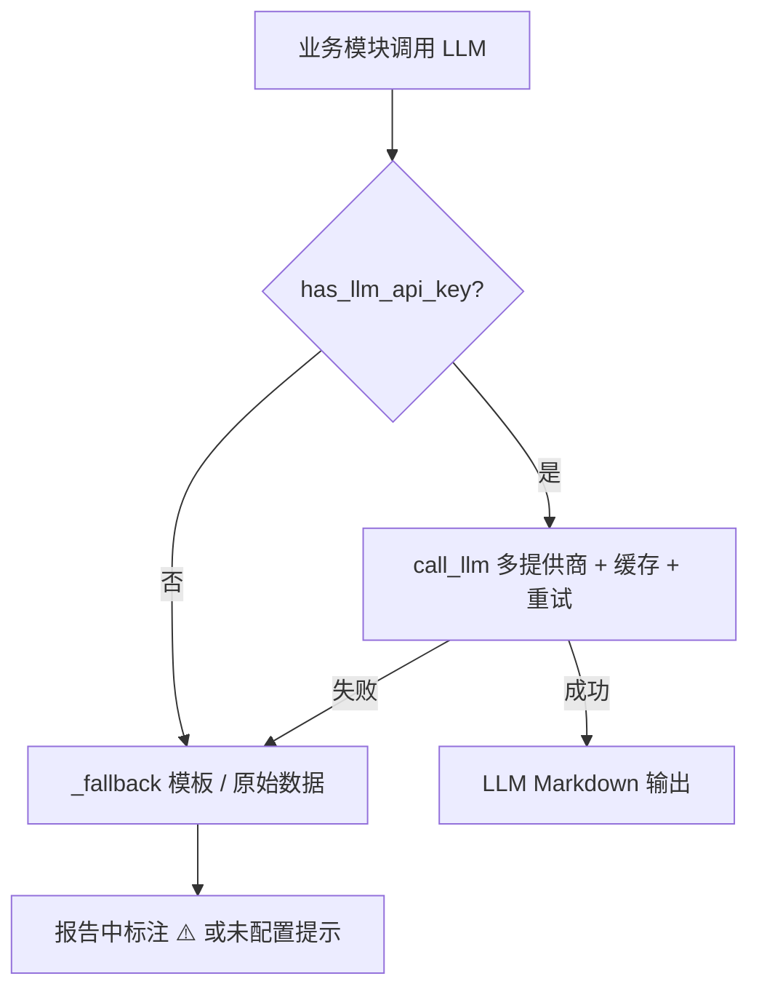
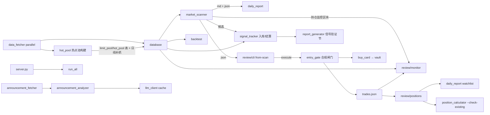

# Invest 项目架构与设计文档

> 版本：基于 2026-07-31 代码库（实战化改造后：持仓监控闭环、入场合规闸门、信号验证、回测同口径、超短热点池 HOT-S、券商成交导入与纪律审计）  
> 受众：后续迭代开发者  
> 项目路径：`e:\Billion\Invest`

---

## 1. 项目概览

### 1.1 定位

Invest 是一个面向 **Obsidian 投资知识库** 的本地 Python 工具集，由原 `AI/`（LLM 研究助手）与 `Quant/`（量化执行工具）合并而来。它不替代人工决策，而是承担三类自动化职责：

| 角色 | 职责 |
|------|------|
| **信息整理** | 行情抓取、公告/财报/产业链研究、每日日报 |
| **计算执行** | 技术指标、市场扫描、仓位计算、回测验证 |
| **纪律审计** | 交易日志、合规检查、周/月复盘报告 |

### 1.2 愿景

> **人负责战略与决策，AI/量化负责信息整理与计算，纪律负责执行。**

### 1.3 核心理念

- **配置集中化**：所有路径、API、规则参数统一在 `config.py`，禁止硬编码 vault 路径
- **模块独立可运行**：每个子目录均有 CLI 入口，可单独调试
- **优雅降级**：无 LLM Key、网络失败、数据源不可用时，仍输出原始数据或模板
- **Obsidian 原生输出**：Markdown + YAML frontmatter，支持 wikilink 与标签检索
- **投资体系对齐**：合规规则、仓位计算、策略命名均映射「投资体系 V5.0」

### 1.4 模块概览

| 模块 | 路径 | 职责 |
|------|------|------|
| 统一入口 | `run_all.py` | 盘前 pipeline + research 编排（取数→热点池构建→扫描→持仓监控→信号结算→日报） |
| **FastAPI 服务** | `server.py` | HTTP 触发盘前流程、状态查询、定时调度 |
| 配置 | `config.py` | 路径、API、股票池、合规规则、策略参数（`STRATEGY_PARAMS` 单一来源） |
| 仓位计算 | `position_calculator.py` | `calc_position` 风险预算股数（口径同 config.RISK_LIMITS） |
| 共享层 | `shared/` | 数据抓取、LLM 路由、工具函数 |
| 数据管道 | `pipeline/` | SQLite 缓存、指标、市场扫描（MD + JSON）、超短热点池、趋势动态池、三重滤网 |
| **超短热点池** | `pipeline/hot_pool.py` | 涨停/连板/炸板名单 + 强板块领涨股，热点池构建与日线补抓（HOT-S，1-5 天） |
| **龙头识别** | `pipeline/dragon_head.py` | 龙头评分（身位/梯队/强度/逻辑/情绪五维，S/A/B/C 等级），《如何识别真假龙头》可量化落地 |
| **趋势动态池** | `pipeline/trend_pool.py` | 强势板块 Top N → 东财成分股（名称模糊匹配）→ 剔除创业板 → 入池补抓日线（趋势候选来源） |
| **三重滤网** | `pipeline/trend_filters.py` | 周线 20 周均线 / 板块强度前 20% / 成交额≥20 日中位数 /（S2-A）MA20>MA60，纯函数 |
| **盘前操作清单** | `pipeline/daily_plan.py` | 明日操作计划：滤网全过候选带止损/股数/闸门预检 + 持仓行动 + 不交易条件 |
| **信号追踪** | `pipeline/signal_tracker.py` | 突破信号入库（含市场状态/滤网/系统1附注）、逐根回放结算、胜率/平均R 统计 + 市场状态分层（持有天数按系统分：HOT-S=5） |
| 研究助手 | `research/` | 日报、公告（fallback 链 + 防编造护栏 + PDF 提取）、财报、产业链、热点候选⑧催化判定 |
| 交易复盘 | `review/` | 交易日志、合规、周报月报（含纪律审计节） |
| **持仓监控** | `review/monitor.py` | 止损/无止损/退出通道警报、移动止损建议（+1R 保本 / +2R 兑现 1/3）、回撤状态自动推导 |
| **入场合规闸门** | `review/entry_gate.py` | 建仓前合规检查（单票/簇/组合总热度/市场状态门禁），高级违规拒绝，`--force` 留痕 |
| **金字塔加仓** | `review/pyramid.py` | 单位链聚合、0.5N 触发判定（与回测同函数）、加仓统一止损上移、三档风险 40/30/30 |
| **买入卡** | `review/buy_card.py` | 建仓后自动生成买入卡（写 vault 交易日志/） |
| 持仓视图 | `review/positions.py` | 开放持仓、风险敞口、未实现盈亏（market.db 收盘价） |
| **券商导入** | `review/import_broker.py` | 券商成交明细（MD 表/CSV）FIFO 配对落库（历史事实，不过入场闸门） |
| **纪律审计** | `review/discipline_audit.py` | 5 条行为纪律规则自动扫描（追高接回/闪电换仓/禁买板块/无止损/非系统交易） |
| 回测 | `backtest/` | Backtrader 策略验证、权益曲线图、批量回测汇总（参数与实盘共用 config） |
| 测试 | `tests/` | 指标、合规、持仓、监控、闸门、信号、参数、回测、热点池、趋势池、滤网、加仓、分批退出、热度门禁、批量回测、盘前清单、Web 控制台、龙头评分、K2.6 推理、事件日历、证据链等（427 用例） |

---

## 2. 架构总览

### 2.1 分层架构

```mermaid
flowchart TB
    subgraph Presentation["展示层（CLI + HTTP + Markdown 输出）"]
        RA[run_all.py]
        SV[server.py FastAPI]
        PR[pipeline/run_daily.py]
        RR[research/run_daily_report.py]
        RC[review/cli.py]
        RB[backtest/run_backtest.py]
        PC[position_calculator.py]
    end

    subgraph Business["业务逻辑层"]
        MS[market_scanner]
        DR[daily_report]
        AA[announcement_analyzer]
        AF[announcement_fetcher]
        FC[financial_comparison]
        IM[industry_mapper]
        IND[indicators]
        STR[strategies]
        MET[metrics]
        CC[compliance_check]
        RG[report_generator]
        POS[review/positions]
        MON[review/monitor]
        EG[review/entry_gate]
        BC[review/buy_card]
        ST[signal_tracker]
        HP[hot_pool]
    end

    subgraph Shared["共享服务层"]
        DF[data_fetcher]
        LLM[llm_client]
        PM[prompts]
        UT[utils]
    end

    subgraph Data["数据层"]
        DB[(SQLite market.db)]
        TJ[(trades.json)]
        AC[data/announcements/]
        LC[data/llm_cache/]
        OUT[output/*.md + *.json]
        VAULT[Obsidian vault 复盘目录]
    end

    subgraph External["外部依赖"]
        AK[AkShare]
        CN[巨潮 cninfo.com.cn]
        KIMI[Kimi/Moonshot API]
        DS[DeepSeek API]
        BT[Backtrader]
    end

    RA --> MS & DR
    RA --> HP
    SV --> RA
    PR --> MS
    RR --> DR
    RC --> MET & CC & RG & MS & EG
    RB --> STR
    PC --> POS & CC

    MS --> IND & DB & MON & ST
    MON --> IND & DB & TJ
    ST --> DB
    HP --> IND & DF & DB
    EG --> CC & BC
    BC --> VAULT
    DR --> AA & MS & LLM & POS
    AA --> AF & LLM
    AF --> CN & AC
    FC & IM --> LLM & PM
    MET --> TJ
    CC --> TJ
    RG --> TJ & VAULT & ST
    POS --> TJ & DB

    DF --> AK & DB
    LLM --> KIMI & DS & LC
    STR --> BT
    UT --> AK
```



### 2.2 模块依赖关系



### 2.3 盘前数据流



---

## 3. 技术栈

### 3.1 依赖清单

| 包 | 版本要求 | 用途 |
|----|----------|------|
| `openai` | >=1.30.0 | Kimi / DeepSeek / 自定义 OpenAI 兼容 API |
| `akshare` | >=1.14.0 | A 股行情、公告、财务、板块数据 |
| `pandas` | >=2.0.0 | 数据处理、SQL 读写 |
| `numpy` | >=1.24.0 | 指标计算 |
| `python-dotenv` | >=1.0.0 | 预留环境变量加载 |
| `requests` | >=2.31.0 | AkShare / 巨潮 HTTP |
| `tabulate` | >=0.9.0 | 预留表格输出 |
| `backtrader` | >=1.9.78 | 策略回测引擎 |
| `matplotlib` | >=3.7.0 | 回测资金曲线 + 回撤图 |
| `pytest` | >=7.0.0 | 单元测试 |
| `fastapi` | >=0.110.0 | HTTP 服务 |
| `uvicorn` | >=0.27.0 | ASGI 服务器 |
| `apscheduler` | >=3.10.0 | 定时盘前调度（可选） |
| `beautifulsoup4` | >=4.12.0 | 巨潮 HTML 公告解析 |
| `pypdf` | >=4.0.0 | 巨潮 PDF 公告正文提取（最多前 30 页） |

**已移除**：`anthropic`、`jinja2`（原预留依赖，当前代码未使用）。

### 3.2 选型理由

| 决策 | 理由 |
|------|------|
| **AkShare** | 免费、覆盖 A 股多数据源，适合个人研究；内置新浪/东财/同花顺 fallback |
| **SQLite** | 零运维、单文件、适合本地日线/板块缓存 |
| **OpenAI SDK + 多 base_url** | Kimi / DeepSeek / 自定义端点统一协议，切换成本低 |
| **Backtrader** | 成熟的事件驱动回测，自定义 Indicator 灵活 |
| **JSON 交易日志** | 人类可读、易手工编辑、与 Obsidian 工作流契合 |
| **FastAPI + APScheduler** | 轻量 HTTP 触发 + 可选定时任务，Obsidian/脚本均可集成 |
| **ThreadPoolExecutor 并行 fetch** | 在不引入 asyncio 的前提下加速日线抓取 |

---

## 4. 模块详解

### 4.1 根目录模块

#### `config.py` — 统一配置

**职责**：路径常量、LLM/AkShare 参数、股票池、合规规则、Obsidian 输出路径、服务与调度配置。

无函数，全部为模块级常量（见第 7 章配置速查）。`import os` 位于文件顶部。

**股票池设计**：
- `WATCHLIST`：管道扫描 + 数据抓取默认列表（10 只蓝筹）
- `RESEARCH_WATCHLIST`：`WATCHLIST` 子集，侧重产业研究标的
- 已废弃 `DEFAULT_WATCHLIST`，统一使用上述两个常量

#### `run_all.py` — 统一入口

**职责**：盘前一键编排 pipeline + research（取数→热点池构建→扫描→持仓监控→信号结算→日报）。

| 函数 | 签名 | 返回值 | 职责 |
|------|------|--------|------|
| `watchlist_with_positions` | `() -> list[str]` | 股票池 | `WATCHLIST` ∪ trades.json 未平仓代码（TradeLog 失败降级为 WATCHLIST） |
| `run_pipeline` | `(skip_fetch: bool = False, symbols: list[str] \| None = None) -> Path` | 扫描报告路径 | 初始化 DB → 可选并行 fetch（默认 `watchlist_with_positions()`）→ 热点池构建+日线补抓（`--skip-fetch` 跳过，失败降级不阻塞）→ run_scan（含持仓监控、信号入库）→ settle_signals |
| `run_research` | `(watchlist: list[str] \| None = None, sectors: list[str] \| None = None) -> Path` | 日报路径 | 调用 generate_report |
| `main` | `() -> None` | — | argparse CLI |

**依赖**：`config`, `pipeline.database`, `pipeline.market_scanner`, `pipeline.hot_pool`, `pipeline.signal_tracker`, `research.daily_report`, `review.positions`, `shared.data_fetcher.fetch_and_save_all_parallel`

#### `server.py` — FastAPI 服务 + Web 控制台

**职责**：HTTP 触发盘前流程、查询运行状态与最新输出、可选 APScheduler 定时调度；`GET /` 返回 Web 控制台页面（`web/console.html`，原生 HTML/JS 零新依赖），`/api/*` 端点为控制台提供数据与交易操作。交易写操作经 `_trade_lock` 串行，全部走 `review/trade_ops.py`（与 CLI 同一业务口径：合规闸门、force 留痕、买入卡、金字塔加仓、拆单卖出）；闸门拒绝返回 409 + 违规明细。

**Web API 端点**（控制台用）：`GET /api/overview`（顶部状态）、`GET /api/plan`（明日操作计划）、`GET /api/positions`（持仓摘要+热度条）、`GET /api/sell-check/{symbol}`（卖点检查单）、`POST /api/trades/add` / `from-scan` / `add-position` / `sell` / `update-stop`（交易写操作）。

**模块常量**：

| 常量 | 值 | 说明 |
|------|-----|------|
| `TASK_TIMEOUT` | 600 | 单任务超时（秒） |
| `_run_state` | dict | 全局运行状态（running、last_* 记录） |

**内部函数**：

| 函数 | 签名 | 返回值 |
|------|------|--------|
| `_now_iso` | `() -> str` | ISO 时间戳 |
| `_latest_file` | `(directory: Path, pattern: str = "*.md") -> Optional[Path]` | 目录内最新文件 |
| `_list_output_files` | `(directory: Path, limit: int = 10) -> list[dict]` | 输出文件列表（name/path/modified） |
| `_read_file_safe` | `(path: Optional[Path]) -> dict` | 安全读取文件内容 |
| `_run_with_timeout` | `(func, timeout: int = TASK_TIMEOUT) -> Any` | 线程池 + 超时执行 |
| `_do_pipeline` | `(skip_fetch: bool = False, symbols: list[str] \| None = None) -> dict` | 调用 run_pipeline |
| `_do_research` | `(watchlist: list[str] \| None = None, sectors: list[str] \| None = None) -> dict` | 调用 run_research |
| `_do_pre_market` | `(skip_fetch: bool = False, symbols: list[str] \| None = None) -> dict` | pipeline + research |
| `_execute_task` | `(task_name: str, func, state_key: str) -> dict` | 串行任务执行与状态更新 |
| `_parse_schedule_time` | `(time_str: str) -> tuple[int, int]` | 解析 HH:MM |
| `_scheduled_pre_market` | `() -> None` | 定时盘前回调 |
| `_do_weekly_review` / `_do_monthly_review` | `() -> dict` | 调用 generate_weekly/monthly_report（写 vault 每周/每月复盘目录） |
| `_scheduled_weekly_review` / `_scheduled_monthly_review` | `() -> None` | 定时周/月报回调（已有任务运行则跳过，失败仅记日志） |
| `_start_scheduler` | `() -> None` | 启动 BackgroundScheduler（盘前 + 周报 + 月报三个 cron job） |
| `on_startup` | `() -> None` | 服务启动钩子 |
| `on_shutdown` | `() -> None` | 关闭调度器与线程池 |
| `main` | `() -> None` | uvicorn 启动 |

**HTTP 端点**：

| 方法 | 路径 | 参数 | 说明 |
|------|------|------|------|
| GET | `/` | — | 服务信息与端点列表 |
| POST | `/pre-market` | `skip_fetch: bool = False` | 完整盘前流程 |
| POST | `/pipeline` | `skip_fetch: bool = False` | 仅数据管道 |
| POST | `/research` | — | 仅研究日报 |
| GET | `/status` | — | 运行状态 + 最近输出文件 |
| GET | `/latest-scan` | — | 最新 market_scan Markdown 内容 |
| GET | `/latest-report` | — | 最新日报 Markdown 内容 |

**调度配置**（见 `config.py`）：
- `SCHEDULER_ENABLED`：环境变量 `ENABLE_SCHEDULER=true` 时启用
- `SCHEDULER_TIME`：默认 `08:30`，CronTrigger 每日触发 `_scheduled_pre_market`
- `WEEKLY_REVIEW_TIME`：默认 `15:45`，CronTrigger 每周五触发 `_scheduled_weekly_review`（生成周报，写 vault 每周复盘/）
- `MONTHLY_REVIEW_TIME`：默认 `16:00`，CronTrigger 每月最后一天触发 `_scheduled_monthly_review`（生成月报，写 vault 每月复盘/）
- 三个定时 job 均经 `_execute_task` 串行执行；任务串行：已有任务运行时 HTTP 触发返回 409，定时 job 则跳过本次
- `/status` 的 `scheduler` 字段展示三个调度时间，`last_weekly_review` / `last_monthly_review` 记录最近运行

**启动方式**：

```powershell
cd e:\Billion\Invest
python server.py
# 或
uvicorn server:app --host 127.0.0.1 --port 8900
```

#### `position_calculator.py` — 仓位计算器

**职责**：风险预算法股数计算、单票上限、风险簇检查；风险率/仓位上限统一读 `config.RISK_LIMITS` / `POSITION_LIMITS`（经 `compliance_check.get_risk_limit` / `get_position_limit`），账户类型为中文枚举（核心/产业/事件/实验，`config.ACCOUNT_TYPES`）。

**枚举类**：`GapRisk`（跳空风险折扣）

| 函数 | 签名 | 返回值 |
|------|------|--------|
| `lookup_cluster` | `(symbol: str) -> str \| None` | 风险簇归属（查 `config.INDUSTRY_MAP`，未收录返回 None） |
| `calc_position` | `(equity, entry, stop, account_type, drawdown_state, gap_risk=GapRisk.NONE, gap_buffer=0.0, atr=None) -> dict` | 纯函数：风险率/风险预算/每股风险/股数/仓位金额/加仓价（可被 `review/cli.py` import） |
| `format_calc_text` | `(calc: dict, symbol: str = "") -> str` | 终端格式化文本 |
| `main` | `() -> None` | CLI：`-t/--account-type` 接受中文（choices=`ACCOUNT_TYPES`），`--drawdown-state`，`--check-existing` 复用 `compliance_check` 组合级簇检查 |

---

### 4.2 `shared/` — 共享工具

#### `utils.py`

| 函数 | 签名 | 返回值 | 职责 |
|------|------|--------|------|
| `patch_bypass_proxy` | `() -> None` | — | 绕过 Windows 系统代理 |
| `bypass_proxy` | 上下文管理器 | — | 确保代理已绕过 |
| `normalize_symbol` | `(symbol: str) -> str` | 6 位代码 | 规范化股票代码 |
| `retry_fetch` | `(func: Callable, *args, **kwargs)` | func 返回值 | 带指数退避的重试 |
| `safe_fetch` | `(func, *args, default=None, **kwargs)` | 任意 | 失败返回 default |
| `df_to_markdown_table` | `(df: pd.DataFrame, float_fmt=".2f") -> str` | Markdown 表格 | Obsidian 兼容 |
| `write_markdown` | `(content: str, output_path: Path) -> Path` | 写入路径 | 创建目录并写文件 |
| `obsidian_frontmatter` | `(tags: list[str], **extra) -> str` | YAML 块 | frontmatter 生成 |
| `get_stock_name` | `(symbol: str) -> str` | 股票名称 | 缓存 `stock_info_a_code_name` |
| `get_symbol_by_name` | `(name: str) -> str` | 6 位代码 | 按名称反查（与 `get_stock_name` 共用缓存；未命中返回空串） |

#### `data_fetcher.py`

| 函数 | 签名 | 返回值 |
|------|------|--------|
| `fetch_stock_daily` | `(symbol, start_date="20200101", end_date=None, adjust="qfq") -> pd.DataFrame` | 标准列 OHLCV |
| `fetch_index_daily` | `(symbol="000300", start_date, end_date) -> pd.DataFrame` | 指数日线 |
| `fetch_sector_list` | `() -> pd.DataFrame` | 行业板块列表 |
| `fetch_sector_daily` | `(sector_name, start_date, end_date) -> pd.DataFrame` | 板块指数日线 |
| `fetch_limit_stats` | `(trade_date=None) -> pd.DataFrame` | 涨跌停/市场宽度 |
| `fetch_limit_pools` | `(trade_date=None) -> pd.DataFrame` | 涨停池+炸板池个股名单（东财 push2ex），列 symbol/name/pool_type(up/broken)/change_pct/amount/lbc(连板数)/sector；单池失败降级跳过 |
| `fetch_etf_flow` | `(trade_date=None) -> pd.DataFrame` | ETF 资金流 |
| `fetch_dragon_tiger` | `(start_date=None, end_date=None) -> pd.DataFrame` | 龙虎榜 |
| `fetch_and_save_all` | `(symbols, start_date="20230101", sector_limit=SECTOR_FETCH_LIMIT) -> dict` | 串行批量抓取（保留兼容） |
| `_fetch_and_save_single_stock` | `(sym: str, start_date: str) -> tuple[str, int, Optional[str]]` | 并行 worker |
| `fetch_and_save_all_parallel` | `(symbols, start_date="20230101", sector_limit=SECTOR_FETCH_LIMIT, max_workers=FETCH_MAX_WORKERS) -> dict` | **并行**批量抓取 |

**并行策略**：个股日线通过 `ThreadPoolExecutor(max_workers=FETCH_MAX_WORKERS)` 并行；沪深300、板块、涨跌停、ETF、龙虎榜仍串行执行。

#### `llm_client.py` — 多提供商 LLM

| 函数 | 签名 | 返回值 |
|------|------|--------|
| `has_llm_api_key` | `() -> bool` | 是否配置任一提供商密钥 |
| `_resolve_provider` | `(provider: Optional[str] = None) -> Optional[str]` | 按优先级解析提供商 |
| `_model_for_task` | `(provider: str, task_type: str) -> str` | 按 task_type 选模型 |
| `_cache_file` | `(cache_key: str) -> Path` | 缓存文件路径 |
| `_load_cache` | `(cache_key: str) -> Optional[str]` | 读取 24h 内缓存 |
| `_save_cache` | `(cache_key: str, response: str, provider: str, model: str) -> None` | 写入缓存 |
| `_make_cache_key` | `(prompt: str) -> str` | SHA256(prompt) |
| `call_llm` | `(prompt, system_prompt="...", temperature=0.3, max_tokens=4096, provider=None, use_cache=True, task_type="analysis") -> Optional[str]` | 主入口 |
| `_call_provider` | `(provider, prompt, system_prompt, temperature, max_tokens, model) -> str` | OpenAI SDK 调用 |
| `_call_kimi` | `(prompt, system_prompt, temperature, max_tokens) -> str` | 兼容旧接口 |

**task_type 与模型映射**：

| task_type | Kimi | DeepSeek | Custom |
|-----------|------|----------|--------|
| `announcement` | `KIMI_MODEL_LONG` (32k) | `DEEPSEEK_MODEL_PRO` (v4-pro) | `CUSTOM_LLM_MODEL` |
| `summary` | `KIMI_MODEL` (8k) | `DEEPSEEK_MODEL` (v4-flash) | `CUSTOM_LLM_MODEL` |
| `analysis`（默认） | `KIMI_MODEL` | `DEEPSEEK_MODEL` (v4-flash) | `CUSTOM_LLM_MODEL` |

**提供商优先级**：`LLM_PROVIDER_PRIORITY = ["kimi", "deepseek", "custom"]`，取第一个已配置 API Key 的提供商。

#### `prompts.py`

纯字符串常量（`ANNOUNCEMENT_*`, `FINANCIAL_*`, `INDUSTRY_*`, `DAILY_REPORT_SUMMARY`）。

---

### 4.3 `pipeline/` — 数据管道

#### `database.py`

（同前版本：SQLite CRUD，`REPLACE INTO` upsert 模式。）

新增 `limit_pool` / `hot_pool` 两表（schema 见 5.1）与对应读写函数：`save_limit_pool` / `save_hot_pool` / `load_limit_pool` / `load_hot_pool`。

#### `indicators.py`

（同前版本：Donchian 通道、ATR、市场状态 A/B/C/D 判断等。）

增量（2026-08）：板块相对强度 `calc_sector_relative_strength` 由比值法改为**差值法**（`sec_ret − bench_ret`，小数口径）——原比值法在基准 20 日涨幅为负或近 0 时符号失真；排序语义不变，扫描报告按百分点显示。

#### `market_scanner.py`

| 函数 | 签名 | 返回值 |
|------|------|--------|
| `run_scan` | `(symbols: list[str] \| None = None, output_dir: Path \| None = None) -> Path` | Markdown 报告路径（同时写 JSON）。扫描池 = 传入 symbols ∪ 最新一期趋势池（`trend_pool` 表） |
| `_load_limit_stats_from_db` | `(db_path=None) -> pd.DataFrame` | 最近 5 日 limit_stats |
| `_run_position_monitor` | `() -> Optional[dict]` | 持仓监控（调 `review.monitor`，失败降级返回 None，不阻塞扫描） |
| `_load_trend_pool_safe` | `() -> pd.DataFrame` | 最新一期趋势池（未构建/读取失败降级空表） |
| `_sector_rank_pct_map` | `(sector_rank) -> dict[str, float]` | 板块名 → 强度排名百分位（rank/总数） |
| `_build_daily_plan_safe` | `(scan_json, monitor_result) -> dict \| None` | 盘前操作清单（调 `daily_plan.build_daily_plan`，失败降级 None 不阻塞扫描）；报告「二、明日操作计划」节 + JSON `daily_plan` 键 |
| `_enrich_breakout` | `(breakout, prepared, sector_pct, pool_sector, system, signal_date, db_path=None) -> pd.DataFrame` | 突破候选附加三重滤网结果（`filters_passed`/`filters_required`/`filter_brief`）与系统1过滤附注（`note`/`record`）：滤网未全通过→标注「仅观察/极小仓」；S1 系列连续 ≥`FALSE_BREAKOUT_MAX`(3) 次假突破且最近止损在 `FALSE_BREAKOUT_COOLDOWN_DAYS`(20) 日内→「冷却中」不入库；上次同系统盈利且现价距 55 日高点 >1×ATR→「首仓建议降50%」。逐股失败降级照常入库 |
| `_append_breakout_table` | `(lines, df) -> None` | 突破候选表格（含滤网/备注列，未评估行降级显示 —） |
| `_build_hot_section` | `(today: str, sector_rank=None, market_state="") -> dict` | 超短热点区块：从 DB 读 limit_pool/hot_pool，池内个股跑 `scan_breakout_candidates(CHANNEL_SHORT)`（与主扫描同函数同参数），标注 name/source/sector，并按买入规则 8 条生成推荐分析（`_evaluate_buy_rules`：①板块Top5 ②板块涨停家数较上一交易日增加 ③前排 ④放量突破/涨停承接 ⑦市场状态 A/B 可离线判定，⑤⑥ 盘中确认，⑧ 催化自动判定见 13.9）；⑧催化分析为**可选联网**环节：两遍评估（离线初评排序 → 前 `HOT_CATALYST_MAX` 只做 `_analyze_catalysts_safe` → 终评重排），失败逐股降级人工核对，`HOT_CATALYST_ENABLED=false` 恢复纯离线；候选按满足条数排序，记录含 `rules_met`/`analysis`/`catalyst_basis`/`catalyst_titles`；热点池未构建时降级标注，不拖垮报告 |
| `_record_breakout_signals` | `(scan_data: dict) -> None` | 突破候选写入 signals 表（S1-A/S2-A + 热点池 hot_breakout 以 system=HOT-S，调 `signal_tracker.record_signals`）；冷却期候选（record=False）跳过，入库信号携带当日 market_state 与滤网通过数 |
| `_df_to_breakout_list` | `(df: pd.DataFrame) -> list[dict]` | 突破候选 JSON 结构（含 filter_passed/filter_brief/note/record） |
| `_df_to_sector_list` | `(df: pd.DataFrame) -> list[dict]` | 板块排名 JSON 结构 |
| `_build_scan_json` | `(date, state_info, breakout_20, breakout_55, sector_rank, hot_section=None) -> dict` | 完整扫描 JSON |
| `_build_sector_ranking` | `(benchmark_df) -> pd.DataFrame` | Top 板块排名 |
| `_format_report` | `(date, state_info, breakout_20, breakout_55, sector_rank, symbols) -> str` | Markdown 正文（顶部含「持仓监控」区块，含「五、超短热点池」节） |

**JSON 输出结构**（`market_scan_{date}.json`）：

```json
{
  "date": "2026-07-30",
  "market_state": "D",
  "breakout_s1a": [{"symbol", "close", "channel_high", "breakout_pct", "atr_20", "period",
                    "filter_passed", "filters_required", "filter_brief", "note", "record"}],
  "breakout_s2a": [...],
  "sector_ranking": [{"rank", "sector_name", "relative_strength", "period_return"}],
  "position_monitor": {"date", "data_date", "open_count", "alerts", "positions_ok", "drawdown_state"},
  "hot_pool": {"available", "limit_up_count", "lianban_count", "broken_count", "lianban", "hot_breakout", "note"}
}
```

持仓监控结果另写 `position_monitor_{date}.json`（机器消费）。热点池区块嵌入扫描 JSON：`lianban` 为连板股表（报告取 Top10），`hot_breakout` 为热点池突破候选（记录含 symbol/name/close/channel_high/breakout_pct/atr_20/period/source/sector/rules_met/analysis/catalyst_basis/catalyst_titles，入库 signals 表 system=HOT-S），热点池未构建时 `available=false` 并在 `note` 标注。

#### `trend_pool.py` — 趋势动态池（S1-A/S2-A 候选来源）

**职责**：每日盘前构建趋势扫描动态池：板块相对强度 Top `TREND_SCAN_TOP_SECTORS`(5) → 行业成分股（**双源**：同花顺直连优先——板块名与 sector_quotes 同口径无需映射，东财备用——名称包含式模糊匹配）→ 剔除 `BANNED_BOARD_PREFIXES`（创业板 300/301）→ 截断 `TREND_POOL_MAX`(300) 写 `trend_pool` 表 → 并行补抓池内个股近 `TREND_HISTORY_DAYS`(120) 个交易日日线。单板块/单股失败降级跳过，不阻塞主流程。

| 函数 | 签名 | 返回值 |
|------|------|--------|
| `build_trend_pool` | `(trade_date=None, db_path=None, top_n=TREND_SCAN_TOP_SECTORS) -> pd.DataFrame` | 排名 → 成分股 → 合并去重写 trend_pool 表（全失败返回空 DataFrame） |
| `sync_trend_pool_daily` | `(pool, db_path=None, max_workers=FETCH_MAX_WORKERS) -> int` | 并行补抓池内个股日线（复用 `fetch_stock_daily` + `save_daily_quotes`） |
| `strong_sectors_ranked` | `(db_path=None) -> pd.DataFrame` | 板块强度完整排名（复用 `indicators.rank_sectors_by_strength`，离线） |
| `_merge_trend_pool` | `(cons_df) -> pd.DataFrame` | 纯函数：剔除创业板前缀、按代码去重（多板块归属以「+」连接）、截断上限 |
| `main` | `() -> None` | CLI：`python pipeline/trend_pool.py` |

**已知限制**：同花顺成分分页 ajax 在第 9 页起触发硬反爬（chameleon 挑战，换 cookie/降速均无效），单板块最多取前 8 页（≈160 只，按当日涨幅排序，趋势候选足够）；东财成分接口走 push2 行情推送（本机 IP 曾被风控，见 13.5）作备用源。双源全失败时趋势池为空、扫描退回 WATCHLIST。

#### `trend_filters.py` — 三重滤网量化（V5.0 §4.2/§4.3）

| 函数 | 签名 | 返回值 |
|------|------|--------|
| `evaluate_trend_filters` | `(df, sector_rank_pct=None, system="S1-A") -> dict` | 纯函数：`weekly_trend`（收盘 > 20 周均线）/`sector_strength`（板块排名前 `TREND_SECTOR_TOP_PCT`=20%）/`volume_confirm`（当日成交额 ≥ 过去 `TREND_VOLUME_MEDIAN_DAYS`=20 日中位数）/`ma_bullish`（MA20>MA60，仅 S2 系列必需）+ `passed/required/all_passed`；数据不足项为 None 不计通过 |
| `filters_brief` | `(filters: dict) -> str` | 紧凑文本（周线✓ 板块✗ 量能✓ 均线-），扫描报告滤网列用 |

#### `daily_plan.py` — 盘前操作清单（明日操作计划，2026-08-06 新增）

**职责**：把扫描候选与持仓监控汇总为可直接执行的清单，嵌入扫描报告「二、明日操作计划」节并写入扫描 JSON `daily_plan` 键（V5.0 盘前步骤 4-6 的自动化；清单是候选与参数，决策与下单由人执行）。买入候选分两组：**龙头候选（主，`hot_pool.dragon_candidates` 的 S/A/B 级，系统 HOT-S、账户事件）置顶，趋势候选（辅，S1-A/S2-A 滤网全过）在后**（2026-08-07 起，用户确认形态）。

| 函数 | 签名 | 返回值 |
|------|------|--------|
| `build_daily_plan` | `(scan_json, monitor_result, equity=None, trade_log=None, db_path=None) -> dict` | `dragon_buys` + `trend_buys`（各含参考价/止损=close−2N/股数/风险率/账户/闸门预检结论；趋势组同股双系统去重保留 S2-A）+ 持仓行动（监控警报逐条）+ 不交易条件（市场状态 + 冷却规则） |
| `daily_plan_to_markdown` | `(plan) -> list[str]` | 龙头候选表 / 趋势候选表 / 持仓行动表 / 不交易条件 |

#### `dragon_head.py` — 龙头识别评分（2026-08-07 新增）

**职责**：《如何识别真假龙头》三维验证的可量化落地（ vault《超短操作手册》§八 口径）。五维满分 100：身位 30（板块最高板/首板封板前 3/跟风）+ 梯队 20（板块涨停家数与连板层级）+ 强度 20（换手率/封板资金/炸板次数，一字板降档、炸板≥3 减半）+ 逻辑 20（⑧催化判定）+ 情绪 10（大盘涨停家数）。等级 S≥80 / A 65-79 / B 50-64 / C<50（与 V5.0 凸性评分段一致）。

| 函数 | 签名 | 返回值 |
|------|------|--------|
| `build_dragon_context` | `(trade_date, db_path=None) -> dict` | 板块梯队聚合（limit_pool up 池）+ 大盘情绪（limit_stats），离线 |
| `score_dragon` | `(rec, ctx) -> dict` | 纯函数：{score, grade, dims{身位/梯队/强度/逻辑/情绪}, notes} |
| `grade_hot_candidates` | `(records, ctx) -> list[dict]` | 逐条附加 dragon_score/dragon_grade/dragon_dims/dragon_notes |
| `dragon_top` | `(records, grades=("S","A","B")) -> list[dict]` | 等级达标子集按分数降序 |
| `main` | `() -> None` | CLI：`python pipeline/dragon_head.py [--date]` 打印评分榜 |

边界：量化给数据与初判，「辨」龙头由人完成；竞价监控/盘中异动提醒（盘中实时）不做；龙虎榜席位评分、炸板回封判定列后续。

#### `dragon_reasoner.py` — 龙头深度推理（2026-08-07 新增，research/）

**职责**：系统自主辨龙头（用户定位的核心功能）。把量化五维评分候选的结构化事实（五维明细、连板/封板/换手/封单/炸板、⑧催化结论与公告标题）+ 上下文（板块梯队、大盘情绪、市场状态）一次性交给 Kimi K3 综合推理，产出系统判定（真龙头/疑似龙头/跟风/伪龙头 + 置信度 + 引用数据的理由 + 本期直选龙头 primary）。

| 函数 | 签名 | 返回值 |
|------|------|--------|
| `build_reasoning_payload` | `(candidates, ctx, market_state="") -> dict` | prompt 占位内容（只含事实） |
| `reason_dragons` | `(candidates, ctx, market_state="") -> dict \| None` | 单次 LLM 调用（`task_type="reasoning"` → kimi-k3，temperature=1 硬约束，max_tokens 8000 防截断，24h 缓存）；None = 降级按量化评分排序 |
| `_parse_verdicts` | `(text, valid_symbols) -> dict \| None` | 防编造护栏：symbol 候选集校验、verdict 枚举、confidence 截断 0-100 |

- 配置：`KIMI_MODEL_REASONING`（默认 `kimi-k2.6`）、`DRAGON_REASON_MAX=5`、`DRAGON_REASON_ENABLED`（env）；
- `llm_client._model_for_task` 新增 `reasoning` 路由（kimi→KIMI_MODEL_REASONING）；
- 集成：`market_scanner._build_hot_section` 在量化评分后调用，dragon_candidates 附 verdict/confidence/reasoning/risk 并按判定优先级重排，`hot_pool.dragon_primary`/`dragon_market_comment` 写入扫描 JSON；报告龙头子表加系统判定列与理由行；`daily_plan` 与 UI 同步展示。

#### `event_calendar.py` — 事件日历（2026-08-07 新增，research/）

**职责**：主动探查未来 30 天关键事项，为龙头辨识提供「逻辑链前瞻」证据（用户要求：不只依赖涨停归因）。两路证据：

1. **结构化事项**（免 LLM，akshare）：财报预约披露（`stock_report_disclosure`，按当前月份推断披露期）+ 限售解禁（`stock_restricted_release_queue_em`），逐股未来 30 天窗口过滤；
2. **行业事件探查**（Kimi K2.6 + `$web_search` 内建工具联网，多轮工具调用收敛，当日文件缓存 `data/event_calendar/`）：板块未来 30 天的政策/会议/数据/产品/订单/业绩窗口，输出 JSON 经护栏解析（板块名必须在梯队上下文内、逐条字段截断）。

| 函数 | 签名 | 返回值 |
|------|------|--------|
| `fetch_symbol_events` | `(symbols, days=30) -> dict[str, list[dict]]` | 个股结构化事项（财报披露/解禁），数据源失败逐股降级 |
| `explore_sector_events` | `(sectors, trade_date=None, use_cache=True) -> list[dict]` | K2.6 联网探查板块事件，当日缓存 |
| `build_event_calendar` | `(symbols, sectors, trade_date=None, days=30, use_llm=True) -> dict` | `{symbol_events, sector_events, llm_available}` |

集成：扫描器在龙头推理前构建日历（候选个股 + 梯队前 6 板块），注入 `reason_dragons`（payload 增 `event_lines` 与候选「未来事项」），写入扫描 JSON `hot_pool.event_calendar`；计划与 UI 展示「📅 未来 30 天关键事项」区块。无 Key/联网失败降级仅结构化事项。

#### `evidence_chain.py` — 个股证据链深挖（2026-08-07 新增，research/）

**职责**：解决「个股核心证据雷同（只有财报预约日期）」——对量化分 Top `DRAGON_EVIDENCE_MAX`(3) 龙头候选，逐股 Kimi K2.6 + `$web_search` 检索近 1-3 个月公告/新闻/行业动态，产出结构化证据链：引爆点（具体事件）、链式推导（事件→业绩传导→预期差→股价）、正面证据 ≤4、反面证据 ≤4、关联个股（同概念龙头/跟风/上下游，≤3）、行业地位。复用 `event_calendar._call_kimi_with_web_search` 多轮收敛；当日缓存 `data/evidence_chain/{date}_{symbol}.json`；解析护栏（ignition 必填、字段截断）失败降级 None。

| 函数 | 签名 | 返回值 |
|------|------|--------|
| `dig_evidence` | `(symbol, name, sector, reason, trade_date=None, use_cache=True) -> dict \| None` | 单股证据链深挖 |
| `build_evidence_chains` | `(candidates, trade_date=None, max_n=DRAGON_EVIDENCE_MAX) -> dict[str, dict]` | Top N 逐股深挖（单股失败不阻塞） |

集成：扫描器在龙头评分排序后深挖 → 证据摘要注入 `reason_dragons` payload（候选行引爆点/行业地位/正反证据）→ 写 `hot_pool.evidence_chains`；报告龙头节「🔍 个股证据链」子节、UI 证据链折叠卡（`<details>`）。另：`event_calendar._parse_sector_events` 相同事件去重为「多板块」（半年报刷屏修复）。

#### `signal_tracker.py` — 信号追踪（可验证性）

**职责**：扫描突破信号自动入库（SQLite `signals` 表），每日盘前逐根回放结算，产出各系统胜率/平均R/PF——回答"S1-A 信号最近到底灵不灵"。

| 函数 | 签名 | 返回值 |
|------|------|--------|
| `record_signals` | `(candidates, system, signal_date=None, db_path=None) -> int` | 候选入库；同 (symbol, system) 有 open 信号则跳过（防连续突破日重复）；候选可携带 `market_state`/`filter_passed`/`note` 附加列 |
| `settle_signals` | `(db_path=None, settle_date=None) -> dict` | 结算 `signal_date < settle_date` 的 open 信号：逐根回放日线，先判止损（R=−1）再判退出通道，满持有天数到期关闭（默认 `SIGNAL_MAX_HOLDING_DAYS`=20，`SIGNAL_MAX_HOLDING_BY_SYSTEM` 按系统覆盖，HOT-S=5） |
| `consecutive_stop_outs` | `(symbol, system, db_path=None) -> (int, str \| None)` | 最近连续「止损」退出次数与最近一次退出日（S1-A 系统1过滤：假突破计数，V5.0 §4.3） |
| `last_signal_won` | `(symbol, system, db_path=None) -> bool \| None` | 最近一次同标的同系统已关闭信号 R>0（上次突破是否盈利）；无历史返回 None |
| `_max_holding_days` | `(system: str) -> int` | 按系统查 `SIGNAL_MAX_HOLDING_BY_SYSTEM`，未列出系统沿用 `SIGNAL_MAX_HOLDING_DAYS` |
| `signal_stats` | `(db_path=None, days=90, as_of=None) -> dict` | 近 N 天已关闭信号按系统分组：样本数/胜率/平均R/期望值/PF；<`SIGNAL_STATS_MIN_SAMPLE`(5) 标注「样本不足」；`by_state` 按信号日市场状态分层（无状态归入「未知」） |
| `signal_stats_to_markdown` | `(stats: dict) -> str` | 表格 + 市场状态分层表 + 自动解读（周报/月报/CLI 共用） |
| `main` | `() -> None` | CLI：`settle [--date]` / `stats [--days 90]` |

**结算口径**：入场价=信号日收盘价，止损=入场价−`ATR_STOP_MULT`×ATR(20)，退出通道 S1=10 日/S2=20 日低点（shift(1) 无未来函数，与 monitor、回测同口径）。HOT-S 超短信号不匹配任何退出通道（`_exit_channel_period` 返回 None），只有「止损」与「到期（5 日）」两种退出；`signal_stats` 按 system 分组，HOT-S 自动独立成组。

#### `hot_pool.py` — 超短热点池（HOT-S，1-5 天）

**职责**：每日盘前构建超短热点池：涨停/连板/炸板名单入 `limit_pool` 表，强板块领涨股合并去重写 `hot_pool` 表，并并行补抓池内个股日线。全部源失败产空池告警，不阻塞主流程。

| 函数 | 签名 | 返回值 |
|------|------|--------|
| `build_hot_pool` | `(trade_date=None, db_path=None) -> pd.DataFrame` | 抓涨停/炸板名单（存 limit_pool 表）→ 强板块领涨股 → 合并写 hot_pool 表（全失败返回空 DataFrame） |
| `sync_hot_pool_daily` | `(pool, db_path=None, max_workers=FETCH_MAX_WORKERS) -> int` | ThreadPoolExecutor 并行补抓池内个股近 `HOT_HISTORY_DAYS` 个交易日的日线（复用 `fetch_stock_daily` + `save_daily_quotes`，单只失败不阻塞） |
| `_strong_sectors` | `(db_path=None) -> list[str]` | 板块相对强度 Top `HOT_SECTOR_TOP_N`（复用 `indicators.rank_sectors_by_strength`，数据全部来自本地 DB，离线可用） |
| `_fetch_sector_leaders` | `(sectors: list[str]) -> pd.DataFrame` | 同花顺行业一览 `stock_board_industry_summary_ths` 取领涨股（名称→代码用 `get_symbol_by_name`，查不到丢弃；失败降级空表） |
| `_merge_pool` | `(limit_df, leaders) -> pd.DataFrame` | 合并去重：来源优先级 连板>涨停>炸板>领涨（source 可组合如「连板+领涨」），截断 `HOT_POOL_MAX` |
| `_fetch_and_save_hot_stock` | `(sym, start_date, db_path) -> tuple` | 并行 worker：补抓单只热点股日线并入库 |
| `main` | `() -> None` | CLI：`python pipeline/hot_pool.py` |

**设计要点**：
- 连板判定直接用东财涨停池自带「连板数」（lbc≥2），不做跨日交集——盘前运行时东财返回上一交易日池子，跨日交集会把整池误判为连板
- 强板块成分股接口不可用（akshare 1.16.95 无同花顺成分接口 `stock_board_industry_cons_ths`，东财 `stock_board_industry_cons_em` 走 push2 被风控），强板块个股来源降级为「领涨股」（每板块 1 只）
- `hot_pool.source` 取值：连板/涨停/炸板/领涨（可组合）

#### `run_daily.py`

CLI 入口：`--symbols`, `--start-date`, `--skip-fetch`, `--fetch-only`, `--output-dir`；fetch 使用 `fetch_and_save_all_parallel`。

---

### 4.4 `research/` — 研究助手

#### `daily_report.py`

| 函数 | 签名 | 返回值 |
|------|------|--------|
| `fetch_market_overview` | `() -> dict` | indices, up/down/limit counts |
| `fetch_sector_performance` | `(sectors: list[str]) -> pd.DataFrame` | 关注板块表现 |
| `fetch_announcement_summary` | `(symbol: str) -> str` | 单行公告摘要 |
| `load_breakout_candidates` | `() -> str` | 从 market_scan 文件提取或触发 run_scan |
| `generate_executive_summary` | `(materials: str) -> str` | LLM 今日要点 |
| `resolve_watchlist` | `(watchlist: list[str] \| None = None) -> list[str]` | CLI 覆盖 > 持仓 + RESEARCH_WATCHLIST |
| `generate_report` | `(watchlist=None, sectors=None, output_dir=None) -> Path` | 完整日报 |

#### `announcement_fetcher.py` — 巨潮公告全文

| 函数 | 签名 | 返回值 |
|------|------|--------|
| `_get_org_id` | `(symbol: str) -> str` | 巨潮 orgId（AkShare 映射表） |
| `_default_se_date` | `(start: str = "2020-01-01") -> str` | 默认查询日期范围 |
| `_query_cninfo` | `(symbol, searchkey="", se_date="", org_id="") -> list[dict]` | 巨潮 API 查询 |
| `_parse_detail_url` | `(url: str) -> dict` | 解析详情页 URL 参数 |
| `_announcement_to_result` | `(item: dict) -> dict` | API 单条 → 统一结构 |
| `_resolve_url_to_content_source` | `(url, symbol="", title="", date="") -> dict` | 解析实际 PDF/HTML URL |
| `_is_valid_extracted_text` | `(text: str) -> bool` | 过滤 SPA 模板残留 |
| `_cache_path` | `(symbol, date, title) -> Path` | 缓存文件路径 |
| `_load_cache` | `(symbol, date, title) -> Optional[dict]` | 读取本地缓存 |
| `cache_announcement` | `(symbol, date, title, content, **extra) -> Path` | 写入 `data/announcements/` |
| `_cninfo_column` | `(symbol: str) -> str` | 交易所 column 参数 |
| `_normalize_announcement_df` | `(df) -> pd.DataFrame` | 各来源列名统一为 title/date/category/url |
| `_fetch_today_notices` | `(symbol: str) -> pd.DataFrame` | 东财当日公告（AkShare stock_notice_report） |
| `_fetch_cninfo_history` | `(symbol, days=400) -> pd.DataFrame` | 巨潮 HTTP API 直查个股历史公告 |
| `fetch_latest_announcements` | `(symbol, limit=10, days=400) -> pd.DataFrame` | 最新公告列表 fallback 链（东财当日 → 巨潮 API） |
| `has_real_content` | `(content: str) -> bool` | 判断是否真实正文（防编造护栏依据） |
| `fetch_cninfo_announcement` | `(symbol, title) -> dict` | 搜索匹配公告 |
| `extract_html_content` | `(url: str) -> str` | BeautifulSoup 正文提取 |
| `extract_pdf_content` | `(url, max_pages=30) -> str` | pypdf PDF 正文提取（最多前 30 页） |
| `fetch_announcement_full_text` | `(url, symbol="", title="", date="") -> str` | 全文获取（缓存优先） |
| `chunk_text` | `(text, max_chars=2000, overlap=200) -> list[str]` | 长文分块 |
| `summarize_long_announcement` | `(text, symbol="", title="", max_chars=ANNOUNCEMENT_MAX_CHARS) -> str` | 分块 LLM 摘要合并 |

#### `announcement_analyzer.py`

`fetch_announcement_content` 已集成 `announcement_fetcher`：巨潮 HTML 解析、PDF 正文提取（pypdf）、长文 RAG 分块摘要（`task_type="announcement"`）。公告列表经 fetcher fallback 链获取（东财当日 → 巨潮 API；AkShare `stock_zh_a_disclosure_report_cninfo` 已陈旧弃用）。无正文时走降级路径（`has_real_content` 护栏），不调用 LLM；最新公告距今 >30 天标注「公告数据可能陈旧」。

#### `catalyst_analyzer.py` — 买入规则⑧催化自动判定

**职责**：对热点候选自动判定买入规则⑧（事件/政策/业绩/技术突破/转型催化），供 `market_scanner._build_hot_section` 两遍评估调用（接入方式见 13.9）。无公告/无 Key/无正文/LLM 失败逐级降级 `satisfied=None`（人工核对），公告标题事实始终尽量给出。CLI：`python research/catalyst_analyzer.py 600162 --name 香江控股 --sector 房地产开发`。

| 函数 | 签名 | 返回值 |
|------|------|--------|
| `analyze_catalyst` | `(symbol: str, name: str = "", sector: str = "") -> dict` | {satisfied: bool\|None, catalyst_type, sustainability, basis, titles} |
| `_pick_relevant_announcements` | `(df: pd.DataFrame, limit: int = 3) -> pd.DataFrame` | 标题关键词（预增/中标/收购/重组/转型/研发/突破等）筛相关公告 |
| `parse_verdict` | `(text: str) -> dict \| None` | 解析 LLM 四行格式（判定/催化类型/持续性/依据） |

#### `financial_comparison.py` / `industry_mapper.py`

（同前版本。）

---

### 4.5 `backtest/` — 回测

#### `strategies.py`

`S1A_Strategy` / `S2A_Strategy` + `STRATEGY_MAP`。参数默认值全部引用 `config.STRATEGY_PARAMS` / `ATR_*` / `ADD_SPACING_*` / `MAX_UNITS` / `LOT_SIZE`，与实盘扫描/监控同口径。

**止损口径（2026-08 统一）**：每个单位入场时锁定固定止损（信号收盘 − `ATR_STOP_MULT`×N），不随 ATR 漂移——与 signal_tracker 信号结算、实盘持仓监控一致；触及止损的单位合并卖出一单，未触及的继续持有（`calc_trade_r_multiple` 支持单位级 `exit_price`）。`ATRIndicator` 首值种子越界读取已修正（`len > i+1` 才允许读前收盘）。`MAX_UNITS`=3 对齐 V5.0 §5.5 三档。

| 函数 | 签名 | 返回值 |
|------|------|--------|
| `next_add_action` | `(close, last_add_price, n, spacing_min, spacing_max) -> (bool, float)` | 纯函数：加仓间距 [0.5N, 1N]；单根跳空 >1N 不追，基准推进、跳过的单位不补（海龟原义）；回测与 `review/pyramid.py` 实盘加仓共用 |
| `calc_trade_r_multiple` | `(units, exit_price) -> float` | 纯函数：按单位真实风险（入场价−初始止损价）逐单位算 R 再汇总；单位可自带 `exit_price`（分批止损各自成交） |

#### `run_backtest.py`

| 函数 | 签名 | 返回值 |
|------|------|--------|
| `fetch_data` | `(symbol, start, end) -> pd.DataFrame` | AkShare 直连 |
| `load_data_from_db` | `(symbol, start, end) -> pd.DataFrame` | 优先本地 DB |
| `run_backtest` | `(strategy_name, symbol, start, end, initial_cash, commission, printlog, plot=True) -> dict` | 统计 dict（`plot=False` 跳过资金曲线，批量回测用；stats 含 `gross_profit`/`gross_loss`/`r_count` 汇总字段） |
| `_plot_equity_curve` | `(equity_curve, markers, chart_path, strategy_name, symbol, start, end, initial_cash)` | PNG（**完整权益曲线 + 回撤 + 买卖点**） |
| `_extract_stats` | `(strat, start_value, end_value, initial_cash) -> dict` | Sharpe/DD/胜率等 |

#### `run_batch.py` — 批量回测（参数稳健性验证）

| 函数 | 签名 | 返回值 |
|------|------|--------|
| `run_batch` | `(strategy, symbols, start, end=None, cash, commission, output_dir=None) -> dict` | 逐标的调 `run_backtest(plot=False)`，单标的失败记 error 继续；输出 `batch_{strategy}_{date}.md/.json` |
| `aggregate_batch` | `(rows, strategy, start, end) -> dict` | 纯函数汇总：整体胜率/PF/按 R 样本数加权平均R/平均收益与回撤/`sample_sufficient`（总交易 ≥50，V5.0 参数调整门槛） |
| `batch_to_markdown` | `(result) -> str` | 汇总表 + 逐标的明细 |

CLI：`python backtest/run_batch.py --strategy S1-A --watchlist --start 2020-01-01`（或 `--symbols 600519,000858`）。组合级回测（跨标的资金分配、并发持仓）为后续扩展。

**图表改进**：双面板（权益曲线 + 回撤曲线），标注买卖 scatter，`EquityCurveAnalyzer` / `TradeMarkerAnalyzer` 收集逐日权益与交易标记。

---

### 4.6 `review/` — 交易复盘

#### `monitor.py` — 持仓监控（盘前闭环核心）

**职责**：盘前流程中逐持仓检查止损与退出通道，生成警报；自动推导回撤状态。

| 函数 | 签名 | 返回值 |
|------|------|--------|
| `check_positions` | `(trade_log: TradeLog, db_path=None) -> dict` | `{"date","data_date","open_count","alerts","positions_ok","drawdown_state"}`；警报优先级 止损 > 无止损（止损价≤0，券商导入缺止损场景，监控保护失效提示） > 退出 > 接近止损（<1N） > 移动止损建议（建议类，仅提示不改库：浮动R≥+1R 建议上移保本、≥+2R 建议卖 1/3 + 保护位上移至 +1R 位，V5.0 §7.4；止损已在成本上方时不再提示） |
| `derive_drawdown_state` | `(trade_log, db_path=None, floating_r=None) -> dict` | 按已平仓累计 R 曲线+浮动 R 推导 Normal/Caution/Defensive/Review（阈值 `config.DRAWDOWN_THRESHOLDS`）；月度轨道输出停事件/停开仓标记；env 显式设置冲突时以推导值为准并提示 |
| `run_monitor` | `(trade_log=None, db_path=None, output_dir=None) -> dict` | 执行监控并写 `position_monitor_{date}.json` |
| `monitor_to_markdown` | `(result: dict) -> list[str]` | 扫描报告嵌入区块 |
| `format_monitor_text` | `(result: dict) -> str` | 终端文本 |
| `main` | `() -> None` | CLI：`python review/monitor.py` |

退出通道按「入场系统」选择：含 S1→10 日低点、含 S2→20 日低点（`config.EXIT_CHANNEL_PERIODS`），其它系统只查止损；通道 shift(1) 不含当根 K 线（无未来函数，与扫描/回测同口径）。行情源为 market.db 本地日线（离线可用），持仓股已由 `run_all.watchlist_with_positions()` 保证在库。

#### `entry_gate.py` — 入场合规闸门

| 函数 | 签名 | 返回值 |
|------|------|--------|
| `derive_state_safe` | `(trade_log=None) -> str` | 回撤状态：优先 monitor 推导，失败降级 `config.DRAWDOWN_STATE` |
| `get_latest_market_state` | `(db_path=None) -> str \| None` | 最新市场状态（market_state 表）；无数据/失败返回 None（降级跳过市场状态检查） |
| `check_entry` | `(trade, trade_log=None, account_equity, drawdown_state=None, market_state=None, db_path=None) -> (list[Violation], str)` | 单笔 + 组合级簇检查 + 组合总热度/市场状态门禁（`compliance_check.check_market_conditions`，market_state 可注入便于测试） |
| `split_by_severity` / `format_violations` / `force_note` | — | 高级违规拒绝写入；`--force` 强制时备注留痕「⚠️ 强制建仓，违规：xxx」 |

组合总热度门禁（V5.0 §5.6，`config.PORTFOLIO_HEAT_LIMITS`）：未平仓风险率合计 + 本笔风险率 > 当前市场状态上限（A 4% / B 3% / C 1.5% / D 0%）→ 高级违规；市场状态 D 禁新开趋势仓（入场系统含 S1/S2，高级），C 中级警告。仅建仓闸门生效，`run_compliance_check` 存量审计不适用。

所有写 trades.json 的建仓路径（`add`、`from-scan --execute`、`add-position`）必须经此闸门。

#### `pyramid.py` — 金字塔加仓（V5.0 §5.5 三档）

| 函数 | 签名 | 返回值 |
|------|------|--------|
| `get_unit_chain` | `(open_trades, symbol) -> list[Trade]` | 该代码未平仓单位链（最新首仓 + 加仓单位，按单位序号升序） |
| `check_add_trigger` | `(chain, latest_close, atr) -> dict` | 纯函数：现价 ≥ 上次入场 + 0.5N 触发（跳空 >1N 不追、基准推进，复用回测 `next_add_action` 同函数）；返回 可加仓/触发价/下一单位序号/统一止损价；满 `MAX_UNITS`(3) 不再加 |
| `unified_stop_after_add` | `(new_unit_entry, atr) -> float` | 海龟统一止损：新入场价 − 2N（调用方只上不下） |
| `add_unit_shares` | `(first_unit, per_share_risk) -> int` | 加仓股数 = 首仓实际风险金额 × (30/40) ÷ 每股风险，整手向下（三档 40/30/30 口径） |

#### `buy_card.py` — 买入卡生成

| 函数 | 签名 | 返回值 |
|------|------|--------|
| `calc_dict_from_trade` | `(trade: Trade, equity: float) -> dict` | 按实际成交参数构造计算 dict |
| `build_buy_card_content` | `(trade, calc, scan_info=None) -> str` | 按 vault 买入卡模板栏目生成（逻辑/证据链/确认清单留「（待填写）」） |
| `generate_buy_card` | `(trade, calc=None, scan_info=None, output_dir=None) -> Path \| None` | 写 `【10】实盘记录/交易日志/{交易编号}_{名称}_买入卡.md`；失败打印警告不阻塞建仓 |

#### `positions.py` — 持仓与风险视图

| 函数 | 签名 | 返回值 |
|------|------|--------|
| `_normalize_symbol` | `(symbol: str) -> str` | 6 位代码 |
| `export_open_positions` | `(trade_log: TradeLog \| None = None) -> list[dict]` | 未平仓交易字典列表 |
| `get_current_exposure` | `(industry: str, trade_log=None, account_equity=ACCOUNT_EQUITY) -> float` | 指定风险簇敞口 % |
| `get_total_risk` | `(trade_log=None) -> float` | 未平仓总风险率 % |
| `get_position_for_watchlist` | `(trade_log=None) -> list[str]` | 持仓代码列表（去重） |
| `get_latest_price` | `(symbol: str, db_path=None) -> Optional[dict]` | market.db 最新收盘价与日期 |
| `_calc_unrealized_pnl` | `(trade: Trade) -> Optional[dict]` | 未实现盈亏/浮动 R（market.db 最新收盘价为市价源，非盘中实时） |
| `print_portfolio_summary` | `(trade_log=None, account_equity=ACCOUNT_EQUITY) -> None` | 终端持仓摘要（含市价数据日期、回撤状态） |

#### `import_broker.py` — 券商成交导入

**职责**：解析券商成交明细（Markdown 表 / CSV），名称→代码解析后按代码 FIFO 配对买卖，生成已平仓/持仓 Trade 落库。导入的是历史事实，**不过入场合规闸门**；导入后由 cli 自动打印合规汇总（如实报告「缺少止损」等历史问题）。

| 函数 | 签名 | 返回值 |
|------|------|--------|
| `parse_broker_markdown` | `(text: str, year: int) -> list[dict]` | MD 成交表 → 记录列表（日期无年份用 year 补齐，金额支持千分位逗号；其他表格自动跳过） |
| `parse_broker_csv` | `(path, year: int) -> list[dict]` | 券商 CSV → 记录列表（表头别名归一，`_CSV_HEADER_ALIASES`） |
| `resolve_symbols` | `(records, symbol_map=None) -> list[str]` | 名称→代码原地写回（symbol_map 手动映射优先，其次 `get_symbol_by_name`）；返回未解析名称 |
| `pair_trades` | `(records) -> (closed, open_positions, unpaired_sells)` | 按代码 FIFO 配对（支持部分成交拆分）；窗口前建仓导致的未配对卖出只报告不落库 |
| `build_trades` | `(closed, open_positions, account_type="事件", entry_system="", cluster="") -> list[Trade]` | 配对结果 → Trade（是否系统内交易=False、止损价=0.0、备注="券商导入"，含入场/退出时间） |
| `import_records` | `(records, trade_log, symbol_map=None, account_type="事件", entry_system="", dry_run=False) -> dict` | 幂等落库（键：日期+股票代码+入场价+股数）；dry_run 只统计；返回 新增/跳过/未配对卖出/未解析名称/trades |
| `parse_symbol_map` | `(text: str) -> dict` | `'通源石油=300164,...'` → 映射 dict |
| `load_records_from_file` / `print_import_summary` | — | 按扩展名选 MD/CSV 解析 / 打印导入汇总（模块 `__main__` 与 cli `import` 子命令共用） |

#### `discipline_audit.py` — 纪律自动审计

**职责**：对交易列表跑 5 条行为纪律规则（阈值取自 config），输出汇总+明细 Markdown；周报/月报「纪律审计」节与 `cli check` 末尾摘要共用。

| 函数 | 签名 | 返回值 |
|------|------|--------|
| `audit_discipline` | `(trades: list[Trade]) -> list[Finding]` | 5 条规则扫描（按固定规则顺序分组） |
| `audit_to_markdown` | `(findings: list[Finding]) -> str` | 汇总表（各规则命中数）+ 明细表；空则 `[PASS]` |
| `Finding` | dataclass | 规则/严重程度/交易编号/股票代码/描述/建议 |

**规则清单**（严重程度）：追高接回（高，同代码当日先卖后买且买价 > 卖价；两笔都有时间字段时要求买在卖后，缺时间按日期+价格降级判定并注明）、闪电换仓（中，买入与当日他股卖出间隔 < `DISCIPLINE_SWITCH_MINUTES`=30 分钟，缺时间跳过）、禁买板块（高，代码前缀命中 `BANNED_BOARD_PREFIXES`）、无止损（中，止损价 ≤ 0）、非系统交易（低，是否系统内交易=False）。

#### `trade_log.py` / `metrics.py` / `compliance_check.py` / `report_generator.py` / `trade_ops.py`

（同前版本。增量：`Trade` 新增可选字段 `入场时间` / `退出时间`（HH:MM:SS，默认 ""，向后兼容，券商导入与纪律审计用）与 `关联单号` / `单位序号`（默认 ""/1，金字塔加仓子单与分批平仓拆分子单指向来源交易编号，2026-08）。`compliance_check` 的 `get_risk_limit` / `get_position_limit` 已公开化供仓位计算器复用；「非系统内交易」检查对齐 `config.STRATEGY_CODES`；`check_single_trade` 新增「禁买板块」高级违规（代码 zfill 后前缀命中 `BANNED_BOARD_PREFIXES`，建仓闸门默认拒绝）；`check_market_conditions` 新增组合总热度与市场状态门禁（建仓闸门专用，见 entry_gate 节）。`metrics.TradeStats` 新增 `总盈亏金额`（已平仓盈亏合计，元）；胜率改为金额符号口径（无止损的历史导入交易也可统计），R 系指标仍仅统计有止损交易；`stats_to_markdown` 增加「总盈亏金额」行。`report_generator` 新增 `signal_verification_section(days=90)` 与 `discipline_audit_section(trades)`：周报含「五、纪律审计」节（原五/六顺延为六/七），月报含「七、纪律审计」节（原七/八顺延为八/九），审计异常降级 `_纪律审计不可用_`。）

**`trade_ops.py`（2026-08-06 新增）**：Web 控制台 API 与 CLI 共用的程序化交易操作层（返回 dict 不打印）：`get_overview` / `get_daily_plan`（读最新扫描 JSON）/ `get_positions_view`（持仓摘要+账户热度）/ `get_sell_check_lines` / `execute_add` / `execute_from_scan` / `execute_add_position` / `execute_sell`（全平/部分拆单）/ `execute_update_stop`。写操作与 cli 同口径（合规闸门、force 留痕、买入卡）；全部函数支持注入 `trade_log`/`db_path`（测试不碰真实数据）。

#### `cli.py`

子命令：`add`, `update`, `list`, `show`, `stats`, `weekly`, `monthly`, `check`, `positions`, `import`, `sell-check`, `add-position`, `sell`, **`from-scan`**

- **`add`**：写入前自动过入场合规闸门（`entry_gate`）；`--system` 校验 `STRATEGY_CODES`；`--equity`/`--force`；`--time` 记录入场时间（HH:MM:SS，纪律审计用）；成功后自动生成买入卡
- **`update`**：`--exit-time` 记录退出时间（HH:MM:SS）
- **`add-position <代码>`**：金字塔加仓（V5.0 §5.5）：单位链触发判定（0.5N，复用 `pyramid.check_add_trigger`）→ 回撤状态非 Normal 拒绝 → 加仓股数（首仓风险 ×30/40）→ 合规闸门 → 落库子单（`关联单号`/`单位序号`）→ 全链未平仓单位止损统一上移（只上不下，旧止损备注留痕）；`--price` 按实际成交价，`--force/--equity` 可调
- **`sell <代码>`**：卖出登记：`--shares` ≥ 持仓股数即全平（自动算 R，同 update 口径）；部分卖出拆单——原单减股数留痕，新增已平仓子单（`关联单号` 指向原单，R 独立计算），股数守恒；`--id` 指定单位、`--reason`（部分卖出默认「分批止盈」）；末尾打印 V5.0 §7.6 重新入场条件
- **`positions`**：调 `print_portfolio_summary`（未实现盈亏/风险敞口/回撤状态）
- **`stats`**：终端输出同时写 `STATS_OUTPUT_DIR/{date}_交易统计.md`
- **`check`**：合规检查末尾追加纪律审计摘要（`discipline_audit`，审计失败仅警告）
- **`import`**：券商成交导入（`--file` .md/.csv、`--year` 补全年份、`--symbol-map 名称=代码,...`、`--account`、`--dry-run`），解析 → FIFO 配对 → 落库（历史事实，不过入场闸门）→ 自动打印合规汇总
- **`sell-check <代码>`**：卖点检查单（全程离线，异常降级不崩）：止损/退出通道警报与移动止损建议（复用 `monitor._check_single_position`）、持有天数与 HOT-S 强制离场倒计时（`SIGNAL_MAX_HOLDING_BY_SYSTEM` 交易日口径，自然日近似）、是否在最新一期热点池、建议挂单价 = 最新收盘 × 0.99（日志教训：挂低 1% 防挂高未成交）；该代码无持仓时列出当前持仓
- **`from-scan`**：默认只打印建议（收盘价/ATR 止损/示例命令）；`--execute` 一键建仓：信号→止损=close−2×ATR→`calc_position`→合规闸门→写 Trade→买入卡；支持热点池突破候选（scan JSON `hot_pool.hot_breakout`，系统 HOT-S，默认账户 事件——cli 本地特判，`SYSTEM_DEFAULT_ACCOUNT` 未含该键）；同股双信号默认 S2-A（`--system S1-A/S2-A/HOT-S` 覆盖），`--account/--equity/--force` 可调

内部辅助：`_load_scan_json(date)`, `_find_breakout_in_scan(scan_data, symbol)`（返回数据与系统 S1-A/S2-A/HOT-S）, `_default_account_for_system`, `_resolve_cluster`, `_apply_entry_gate`, `_execute_from_scan`, `build_sell_check_lines`（纯函数，可测）, `_symbol_in_hot_pool`（池空/读取失败返回 None 降级）

---

## 5. 数据架构

### 5.1 SQLite Schema（`data/market.db`）

（同前版本：`daily_quotes`, `sector_quotes`, `etf_flow`, `limit_stats`, `dragon_tiger`, `market_state`。）

**新增 `signals` 表**（信号追踪，`init_database()` 幂等建表）：

```sql
CREATE TABLE IF NOT EXISTS signals (
    signal_date TEXT NOT NULL,      -- 信号日期
    symbol TEXT NOT NULL,           -- 股票代码
    system TEXT NOT NULL,           -- S1-A / S2-A
    entry_price REAL,               -- 入场价（信号日收盘价）
    stop_price REAL,                -- 止损价（入场价 − 2×ATR，锁定不漂移）
    channel_period INTEGER,         -- 退出通道周期（10 / 20）
    status TEXT NOT NULL DEFAULT 'open',  -- open / closed
    exit_date TEXT, exit_price REAL,
    exit_reason TEXT,               -- 止损 / 通道退出 / 到期
    r_multiple REAL,                -- 结算 R 倍数
    market_state TEXT,              -- 信号日市场状态 A/B/C/D（2026-08 起，分层统计用）
    filter_passed INTEGER,          -- 三重滤网通过数（2026-08 起）
    note TEXT,                      -- 系统1过滤附注（冷却中/首仓降50% 等）
    created_at TEXT,
    PRIMARY KEY (signal_date, symbol, system)
);
-- 老库由 init_database() 内 _migrate_signals_columns 幂等 ALTER TABLE 补列
```

**新增 `limit_pool` / `hot_pool` 表**（超短热点池，同 `init_database()` 幂等建表，均附 `trade_date` 索引）：

```sql
CREATE TABLE IF NOT EXISTS limit_pool (
    trade_date  TEXT NOT NULL,
    symbol      TEXT NOT NULL,
    name        TEXT,
    pool_type   TEXT NOT NULL,      -- up=涨停 / broken=炸板
    change_pct  REAL,
    amount      REAL,
    lbc         INTEGER,            -- 连板数（东财涨停池自带）
    sector      TEXT,
    fbt         TEXT,               -- 首次封板时间（2026-08 龙头评分扩列）
    seal_amount REAL,               -- 封板资金
    turnover    REAL,               -- 换手率
    zbc         INTEGER,            -- 炸板次数
    PRIMARY KEY (trade_date, symbol, pool_type)
);
-- 老库由 init_database() 内 _migrate_limit_pool_columns 幂等 ALTER TABLE 补列

CREATE TABLE IF NOT EXISTS hot_pool (
    trade_date  TEXT NOT NULL,
    symbol      TEXT NOT NULL,
    name        TEXT,
    source      TEXT,               -- 连板/涨停/炸板/领涨（可组合，如「连板+领涨」）
    sector      TEXT,
    change_pct  REAL,
    lbc         INTEGER,
    PRIMARY KEY (trade_date, symbol)
);
```

**新增 `trend_pool` 表**（趋势动态池，2026-08，同幂等建表 + `trade_date` 索引）：

```sql
CREATE TABLE IF NOT EXISTS trend_pool (
    trade_date    TEXT NOT NULL,
    symbol        TEXT NOT NULL,
    name          TEXT,
    source_sector TEXT,             -- 来源板块（多板块归属以「+」连接）
    PRIMARY KEY (trade_date, symbol)
);
```

### 5.2 JSON 结构（`data/trades.json`）

（同前版本。新增可选字段 `入场时间` / `退出时间`（HH:MM:SS，默认 ""），历史记录无该字段向后兼容，券商导入与 `add --time` / `update --exit-time` 写入。2026-08 新增可选字段 `关联单号`（默认 ""，加仓子单/部分平仓拆分子单指向来源交易编号）与 `单位序号`（默认 1，金字塔单位序号），部分平仓采用拆单模型：原单减股数 + 新增已平仓子单，每条记录 R 口径独立。）

### 5.3 文件存储布局

```
Invest/
├── data/
│   ├── market.db
│   ├── trades.json
│   ├── announcements/          # 公告全文 JSON 缓存
│   │   └── {code}_{date}_{title}_{hash16}.json
│   └── llm_cache/              # LLM 响应缓存（24h TTL）
│       └── {sha256(prompt)}.json
└── output/
    ├── daily_reports/            # {date}_每日研究日报.md
    ├── announcements/          # {date}_{code}_{name}_公告摘要.md
    ├── financial_reports/
    ├── industry_maps/
    ├── market_scans/           # market_scan_{date}.md + .json
    └── backtest/               # {strategy}_{symbol}_{start}_{end}.png
```

**公告缓存 JSON 字段**：`symbol`, `date`, `title`, `content`, `cached_at`, 可选 `url`, `content_type`

**LLM 缓存 JSON 字段**：`response`, `provider`, `model`, `cached_at`, `cached_at_iso`

**market_scan JSON**：供 `review/cli.py from-scan` 和程序化消费，与 Markdown 报告同日生成。

**Obsidian vault 写入**（`VAULT_ROOT/【10】实盘记录/`）：每周复盘、每月复盘、统计目录。

---

## 6. LLM 集成

### 6.1 多提供商路由



### 6.2 task_type 机制

| task_type | 使用场景 | 模型选择 |
|-----------|----------|----------|
| `announcement` | 公告分析、长文分块摘要 | 长上下文模型（Kimi 32k） |
| `summary` | 日报 executive summary | 默认 8k 模型 |
| `analysis` | 财报对比、产业链等 | 各提供商默认模型 |

可通过 `provider="kimi"` 显式指定提供商；未指定时按 `LLM_PROVIDER_PRIORITY` 自动选择。

### 6.3 缓存

- **目录**：`data/llm_cache/`
- **键**：`sha256(prompt.encode()).hexdigest()`
- **TTL**：`LLM_CACHE_TTL = 86400` 秒（24 小时）
- **禁用**：`call_llm(..., use_cache=False)`

### 6.4 提示词工程

| 场景 | System Prompt | task_type | 输出结构 |
|------|---------------|-----------|----------|
| 公告分析 | `ANNOUNCEMENT_SYSTEM` | `announcement` | 类型/关键数字/逻辑影响/风险/跟踪 |
| 热点候选⑧催化 | `CATALYST_SYSTEM` / `CATALYST_ANALYSIS` | `announcement` | 判定/催化类型/持续性/依据（四行格式；严格依据公告原文、禁外部信息，拿不准判「不满足」） |
| 长公告分块 | 内置摘要 prompt | `announcement` | 各段摘要合并 |
| 财报对比 | `FINANCIAL_COMPARISON_SYSTEM` | `analysis` | 概览/亮点/差异/启示 |
| 产业链 | `INDUSTRY_MAPPING_SYSTEM` | `analysis` | 全景/公司/催化/观察/传导 |
| 日报摘要 | 默认分析师 system | `summary` | 200 字 executive summary |

### 6.5 降级策略



- **announcement_analyzer**：`_fallback_analysis()`；无正文时输出「未取得公告正文，不做解读」，不调用 LLM
- **announcement_fetcher**：PDF 用 pypdf 提取，提取/HTML 解析失败时保留链接
- **financial_comparison / industry_mapper / daily_report**：同前版本 fallback

---

## 7. 配置管理

### 7.1 配置项分类

| 类别 | 代表常量 | 来源 |
|------|----------|------|
| 路径 | `PROJECT_ROOT`, `VAULT_ROOT`, `DATA_DIR`, `OUTPUT_*` | 代码推导 |
| LLM Kimi | `KIMI_API_KEY`, `KIMI_BASE_URL`, `KIMI_MODEL`, `KIMI_MODEL_LONG` | 环境变量 |
| LLM DeepSeek | `DEEPSEEK_API_KEY`, `DEEPSEEK_BASE_URL`, `DEEPSEEK_MODEL` | 环境变量 |
| LLM Custom | `CUSTOM_LLM_API_KEY`, `CUSTOM_LLM_BASE_URL`, `CUSTOM_LLM_MODEL` | 环境变量 |
| LLM 路由/缓存 | `LLM_PROVIDER_PRIORITY`, `LLM_CACHE_DIR`, `LLM_CACHE_TTL` | 代码默认 |
| 重试 | `LLM_MAX_RETRIES`, `FETCH_RETRY`, `FETCH_MAX_WORKERS` | 代码默认 |
| 研究 | `RESEARCH_WATCHLIST`, `DEFAULT_SECTORS`, `ANNOUNCEMENT_*` | 代码默认 |
| 管道 | `WATCHLIST`, `CHANNEL_*`, `MARKET_STATE` | 代码默认 |
| 超短热点池 | `HOT_SECTOR_TOP_N`, `HOT_POOL_MAX`, `HOT_HISTORY_DAYS`, `HOT_SIGNAL_SYSTEM`, `HOT_CATALYST_MAX`, `CATALYST_ANNOUNCE_DAYS`（`HOT_CATALYST_ENABLED` 为 env） | 代码默认 |
| 策略参数 | `STRATEGY_PARAMS`, `ATR_PERIOD`, `ATR_STOP_MULT`, `ADD_SPACING_MIN/MAX`, `MAX_UNITS`, `LOT_SIZE`, `BACKTEST_RISK_PCT` | 投资体系 V5.0（单一来源，扫描/监控/信号/回测/仓位共用） |
| 策略枚举 | `STRATEGY_CODES`, `STRATEGY_INFO`, `ACCOUNT_TYPES`, `SYSTEM_DEFAULT_ACCOUNT` | 投资体系 V5.0 |
| 监控/回撤 | `DRAWDOWN_THRESHOLDS`, `MONTHLY_DRAWDOWN_LIMITS`, `EXIT_CHANNEL_PERIODS` | 投资体系 V5.0 §6 |
| 信号追踪 | `SIGNAL_MAX_HOLDING_DAYS`, `SIGNAL_MAX_HOLDING_BY_SYSTEM`, `SIGNAL_STATS_MIN_SAMPLE` | 代码默认 |
| 服务/调度 | `SERVER_HOST`, `SERVER_PORT`, `SCHEDULER_*`, `WEEKLY_REVIEW_TIME`, `MONTHLY_REVIEW_TIME` | 环境变量 |
| 复盘 | `ACCOUNT_EQUITY`, `DRAWDOWN_STATE`, `TRADE_LOG_OUTPUT_DIR` | 环境变量/代码推导 |
| 合规 | `RISK_LIMITS_*`, `POSITION_LIMITS`, `RISK_CLUSTER_LIMITS`, `INDUSTRY_MAP`, `BANNED_BOARD_PREFIXES` | 投资体系 V5.0（限额已按 3.25 万小资金校准，2026-07） |
| 纪律审计 | `DISCIPLINE_SWITCH_MINUTES`, `BANNED_BOARD_PREFIXES` | 自有纪律（代码默认） |

### 7.2 环境变量

| 变量 | 默认值 | 说明 |
|------|--------|------|
| `KIMI_API_KEY` | `""` | Moonshot API 密钥 |
| `KIMI_BASE_URL` | `https://api.moonshot.cn/v1` | Kimi API 端点 |
| `KIMI_MODEL` | `kimi-k2.6` | 默认模型（moonshot-v1 系列 2026-08-31 停服；k2.6 兼顾能力与费用） |
| `KIMI_MODEL_LONG` | `kimi-k2.6` | 长文/公告模型 |
| `KIMI_MODEL_REASONING` | `kimi-k2.6` | 深度推理模型（龙头辨识，task_type=reasoning；k2.6/k3 仅允许 temperature=1，llm_client 自动上调） |
| `DEEPSEEK_API_KEY` | `""` | DeepSeek API 密钥 |
| `DEEPSEEK_BASE_URL` | `https://api.deepseek.com` | DeepSeek 端点 |
| `DEEPSEEK_MODEL` | `deepseek-v4-flash` | DeepSeek 默认模型（快速） |
| `CUSTOM_LLM_API_KEY` | `""` | 自定义 OpenAI 兼容密钥 |
| `CUSTOM_LLM_BASE_URL` | `""` | 自定义 base_url |
| `CUSTOM_LLM_MODEL` | `""` | 自定义模型名 |
| `HOT_CATALYST_ENABLED` | `true` | 热点候选⑧催化分析开关（false 恢复纯离线扫描） |
| `ACCOUNT_EQUITY` | `32500` | 合规检查基准权益（3.25 万实盘） |
| `DRAWDOWN_STATE` | `Normal` | Normal/Caution/Defensive/Review |
| `ENABLE_SCHEDULER` | `""` | 设为 `true` 启用定时盘前 |
| `SCHEDULER_TIME` | `08:30` | 定时触发时间 HH:MM |
| `WEEKLY_REVIEW_TIME` | `15:45` | 定时周报时间 HH:MM（每周五） |
| `MONTHLY_REVIEW_TIME` | `16:00` | 定时月报时间 HH:MM（每月最后一天） |
| `SERVER_HOST` | `127.0.0.1` | FastAPI 绑定地址 |
| `SERVER_PORT` | `8900` | FastAPI 端口 |

### 7.3 默认值策略

- **路径**：基于 `Path(__file__).resolve().parent` 相对定位
- **股票池**：`WATCHLIST`（管道）+ `RESEARCH_WATCHLIST`（研究子集）；`daily_report.resolve_watchlist()` 合并持仓代码
- **兼容别名**：`OUTPUT_DIR`, `MARKET_SCANNER_OUTPUT`, `PIPELINE_OUTPUT_DIR`

---

## 8. 错误处理

### 8.1 重试策略

| 层级 | 机制 | 参数 |
|------|------|------|
| 数据获取 | `retry_fetch` | 3 次，延迟递增 |
| 并行 fetch | 单股失败记录 error，不阻塞其他 symbol | `FETCH_MAX_WORKERS=4` |
| LLM | `call_llm` 循环 | 3 次，延迟 `LLM_RETRY_DELAY * (attempt+1)` |
| HTTP 服务 | `_run_with_timeout` | 600s 任务超时，409 并发冲突 |
| 数据源 | 主源失败切换备用源 | 新浪→东财 |

### 8.2 降级路径

| 场景 | 行为 |
|------|------|
| fetch 失败但 DB 有数据 | 继续扫描 |
| 单只股票 fetch 失败 | 记录 error，跳过 |
| LLM 不可用 | fallback 模板 |
| 公告 PDF | pypdf 提取正文（前 30 页）；失败时返回链接 +「PDF 需手动查看」 |
| 公告 HTML 解析失败 | 返回链接 + 解析失败提示 |
| 无效公告缓存 | 忽略并重新抓取 |
| JSON 损坏 | TradeLog 初始化为 `[]` |
| 绘图失败 | 回测仍返回 stats |
| APScheduler 未安装 | 服务仍可运行，定时不可用 |

---

## 9. 与 Obsidian 集成

（同前版本：YAML frontmatter、tags 映射、wikilink、GFM 表格。）

`daily_report` 的 watchlist 现可自动包含 `trades.json` 开放持仓代码。

---

## 10. 工作流编排

### 10.1 盘前流程（CLI，推荐）

```powershell
cd e:\Billion\Invest
python run_all.py
```

等价步骤：

1. `init_database()`
2. `fetch_and_save_all_parallel(watchlist_with_positions())` — 股票池 = WATCHLIST ∪ 未平仓持仓股
3. `build_hot_pool()` + `sync_hot_pool_daily()` — 超短热点池构建 + 池内日线补抓（`--skip-fetch` 时跳过；失败降级不阻塞）
4. `run_scan()` → 突破候选 + 市场状态 + `check_positions()` 持仓监控 + 超短热点池区块 → `market_scan_{date}.md` + `.json` + `position_monitor_{date}.json`；候选写入 signals 表（含 HOT-S）
5. `settle_signals()` — 逐根回放结算历史信号（当日新信号不结算）
6. `generate_report()` → `{date}_每日研究日报.md`（watchlist = 持仓 + RESEARCH_WATCHLIST）

**加速**：`python run_all.py --skip-fetch`（热点池构建一并跳过）

### 10.2 盘前流程（FastAPI 服务）

```powershell
# 启动服务
set ENABLE_SCHEDULER=true
set SCHEDULER_TIME=08:30
python server.py

# 触发（PowerShell）
Invoke-RestMethod -Method POST -Uri "http://127.0.0.1:8900/pre-market"
Invoke-RestMethod -Method POST -Uri "http://127.0.0.1:8900/pre-market?skip_fetch=true"
Invoke-RestMethod -Uri "http://127.0.0.1:8900/status"
Invoke-RestMethod -Uri "http://127.0.0.1:8900/latest-report"
```

**定时调度**：`ENABLE_SCHEDULER=true` 时，服务启动后 BackgroundScheduler 每日 `SCHEDULER_TIME` 自动执行盘前流程，每周五 `WEEKLY_REVIEW_TIME`（15:45）自动生成周报、每月最后一天 `MONTHLY_REVIEW_TIME`（16:00）自动生成月报；若已有任务运行则跳过。

### 10.3 盘后/周期性流程

| 时机 | 命令 | 输出 |
|------|------|------|
| 交易录入 | `review/cli.py add ...` | trades.json + 买入卡（先过合规闸门） |
| 从扫描查看 | `review/cli.py from-scan 600519` | 终端建议参数（不落库） |
| 从扫描建仓 | `review/cli.py from-scan 600519 --execute` | 仓位计算→闸门→trades.json + 买入卡 |
| 平仓更新 | `review/cli.py update ... --exit-price` | 自动算 R（`--exit-time` 记退出时间） |
| 券商导入 | `review/cli.py import --file 成交.md --year 2026 [--dry-run]` | FIFO 配对落库 + 导入后合规汇总 |
| 卖点检查 | `review/cli.py sell-check 600519` | 止损/通道警报 + 持有天数 + 热点池 + 建议挂单价（收盘×0.99） |
| 合规审计 | `review/cli.py check` | 终端报告 |
| 持仓摘要 | `review/cli.py positions` | 未实现盈亏/敞口/回撤状态 |
| 持仓监控 | `review/monitor.py`（盘前流程已自动执行） | 止损/退出警报 JSON |
| 热点池构建 | `pipeline/hot_pool.py`（盘前流程已自动执行） | limit_pool/hot_pool 表 + 池内日线补抓 |
| 信号统计 | `pipeline/signal_tracker.py stats --days 90` | 各系统胜率/平均R/PF（HOT-S 独立成组） |
| 仓位计算 | `position_calculator.py -t 核心 --check-existing ...` | 含 trades.json 簇检查 |
| 周末 | `review/cli.py weekly` | vault 周报（含信号验证、纪律审计节；调度器每周五 15:45 自动生成） |
| 月末 | `review/cli.py monthly` | vault 月报（含信号验证、纪律审计节；调度器每月最后一天 16:00 自动生成） |
| 交易统计 | `review/cli.py stats` | 终端 + vault 统计/ |
| 策略验证 | `backtest/run_backtest.py` | PNG + stats |
| 单元测试 | `python -m pytest tests/ -v` | 427 passed |

### 10.4 模块联动点



---

## 11. 设计模式与代码规范

（同前版本：集中配置、策略模式、门面模式、降级空对象、Dataclass DTO 等。）

**新增**：
- **单线程任务队列**：`server.py` 的 `_executor(max_workers=1)` 保证盘前任务串行
- **缓存 aside**：公告全文与 LLM 响应本地 JSON 缓存
- **结构化输出双写**：market_scanner 同时输出 MD（人类）与 JSON（机器）

---

## 12. 扩展指南

### 12.1 添加新研究模块

（同前版本骨架。）

### 12.2 添加新回测策略

（同前版本。）

### 12.3 添加新数据源

在 `fetch_and_save_all_parallel` 中集成新 fetch 函数。

### 12.4 添加新 LLM 提供商

1. 在 `config.py` 添加 `{NAME}_API_KEY`, `{NAME}_BASE_URL`, `{NAME}_MODEL`
2. 在 `llm_client._PROVIDER_KEYS` 注册
3. 在 `LLM_PROVIDER_PRIORITY` 加入名称
4. 在 `_call_provider` 和 `_model_for_task` 添加分支

```python
# config.py
NEWPROVIDER_API_KEY = os.getenv("NEWPROVIDER_API_KEY", "")
LLM_PROVIDER_PRIORITY = ["kimi", "deepseek", "newprovider", "custom"]

# llm_client.py
_PROVIDER_KEYS["newprovider"] = NEWPROVIDER_API_KEY
```

业务层仍调用 `call_llm(...)`，无需修改。

### 12.5 添加新合规规则

（同前版本。）

### 12.6 添加 HTTP 端点

在 `server.py` 添加路由，通过 `_execute_task` 包装长任务以保证串行与超时控制。

---

## 13. 已知限制与改进方向

### 13.1 原瓶颈（已完成 ✅）

| # | 原限制 | 状态 | 实现方式 |
|---|--------|------|----------|
| 1 | 同步串行 fetch 耗时长 | ✅ | `fetch_and_save_all_parallel()` + `ThreadPoolExecutor`，`FETCH_MAX_WORKERS=4` |
| 2 | 公告无正文抓取 | ✅ | `research/announcement_fetcher.py` 巨潮 API + HTML 解析 + `data/announcements/` 缓存 |
| 3 | 双股票池不一致 | ✅ | 统一 `WATCHLIST` + `RESEARCH_WATCHLIST`；`resolve_watchlist()` 合并持仓 |
| 4 | 无定时调度 | ✅ | `server.py` + APScheduler，`ENABLE_SCHEDULER=true` |
| 5 | LLM 单提供商 | ✅ | `llm_client.py` 多提供商路由 Kimi/DeepSeek/Custom |
| 6 | 回测图表简化 | ✅ | 完整 equity curve + drawdown 双面板 + 买卖点标注 |
| 7 | position_calculator 独立 | ✅ | `--check-existing` + `review/positions.py` |
| 8 | anthropic/jinja2 未使用 | ✅ | 已从 `requirements.txt` 移除 |

### 13.2 原改进方向（已完成 ✅）

| # | 方向 | 状态 | 实现方式 |
|---|------|------|----------|
| 1 | 异步并行数据管道 | ✅ | `fetch_and_save_all_parallel`（线程池，非 asyncio） |
| 2 | 公告全文 RAG 管道 | ✅ | `chunk_text` + `summarize_long_announcement`，`task_type=announcement` |
| 3 | 统一持仓与风险视图 | ✅ | `review/positions.py`，`export_open_positions` / `get_position_for_watchlist` |
| 4 | Obsidian Webhook 触发 | ✅ | `server.py` FastAPI 端点 `/pre-market` 等 |
| 5 | 策略-扫描-复盘闭环 | ✅ | `market_scan_{date}.json` + `review/cli.py from-scan` |
| 6 | 多 LLM 路由与缓存 | ✅ | `LLM_PROVIDER_PRIORITY` + `data/llm_cache/` 24h TTL |
| 7 | 测试与 CI 基础设施 | ✅ | `tests/` 142 用例（indicators/compliance/positions/monitor/entry_gate/signal_tracker/strategy_params/backtest） |

### 13.3 未来方向

| 方向                | 说明                                         |
| ----------------- | ------------------------------------------ |
| **CI/CD**         | GitHub Actions 每日 smoke test（mock AkShare） |
| **盘中实时监控**        | 持仓监控/未实现盈亏目前以 market.db 日线收盘价为准，盘前足够；盘中实时行情源待接入 |
| **向量检索**          | 公告分块 embedding + 本地 FTS/ChromaDB           |
| **Web UI**        | 扫描结果与持仓仪表盘                                 |
| **python-dotenv** | 自动加载 `.env` 中的 API 密钥                      |

### 13.4 本轮已完成（2026-07-30 实战化改造 ✅）

| # | 方向 | 实现方式 |
|---|------|----------|
| 1 | 市场宽度日期 bug | `indicators.calc_market_breadth` 排序后取最新一天（原用最旧一天） |
| 2 | 公告源失效（停 2023）+ LLM 编造数字 | fetcher fallback 链（东财当日→巨潮 API）+ `has_real_content` 防编造护栏（无正文不调 LLM）+ >30 天陈旧标注 |
| 3 | PDF 正文提取 | `extract_pdf_content`（pypdf，前 30 页） |
| 4 | 持仓期无监控 | `review/monitor.py`：止损/退出通道/接近止损警报 + 回撤状态自动推导，接入盘前流程与扫描报告 |
| 5 | 入场无合规闸门 | `review/entry_gate.py`：add / from-scan --execute 写入前强制检查，高级违规拒绝，`--force` 留痕 |
| 6 | 仓位计算双口径 | calculator 重写：风险率/上限统一读 config，账户类型中文枚举，`calc_position` 纯函数 |
| 7 | from-scan 不落库 | `--execute`：信号→仓位→闸门→写库→买入卡（`review/buy_card.py`） |
| 8 | 未实现盈亏无市价源 | `positions._calc_unrealized_pnl` 以 market.db 最新收盘价计价 |
| 9 | 信号不可验证 | `pipeline/signal_tracker.py`：signals 表 + 逐根回放结算 + 胜率/平均R 统计，周报/月报「信号验证」节 |
| 10 | 回测与实盘两套参数 | `config.STRATEGY_PARAMS` 单一来源；加仓间距上限与按单位真实风险算 R |
| 11 | 策略/簇命名不统一 | `STRATEGY_CODES` 5 策略枚举（删除 `VALID_ENTRY_SYSTEMS`）；`INDUSTRY_MAP` 对齐 `RISK_CLUSTER_LIMITS` 六簇键 |

### 13.5 数据源韧性加固（2026-07-31 ✅）

**背景**：2026-07-30 起，东财行情推送接口 `push2.eastmoney.com`（及 `push2his` 历史接口）对本机连接大规模重置（`RemoteDisconnected`：TCP/TLS 建立后零字节关闭，requests/urllib3/裸 socket/curl 均复现，换 UA 无效，其他站点正常）——属对端 WAF/IP 风控，可能自行恢复。`push2ex`（涨跌停池）、`datacenter-web`（龙虎榜/公告）、www/quote 主站及新浪/同花顺/腾讯行情均正常，故日线管道与涨跌停统计实际未受影响。

| # | 受影响点（原仅东财单源） | 加固方式（首选东财，失败自动降级，恢复后自动回切） |
|---|--------------------------|---------------------------------------------------|
| 1 | 日报「市场宏观」指数行情 | 降级 `stock_zh_index_spot_sina`（新浪） |
| 2 | 日报「关注板块表现」 | 降级 `stock_board_industry_summary_ths`（同花顺，成交额单位为亿元） |
| 3 | `review/metrics.fetch_price_range`（MFE/MAE） | 改用 `fetch_stock_daily`（新浪优先、东财备用双源） |
| 4 | `backtest/run_backtest.fetch_data` | 改用 `fetch_stock_daily`（同口径 qfq 日线） |
| 5 | `industry_mapper.fetch_market_context` | 降级 `stock_board_industry_summary_ths` |

本已双源、无需改动：`fetch_stock_daily` / `fetch_index_daily` / `fetch_sector_list` / `fetch_sector_daily` / `fetch_limit_stats`（涨跌停池走 `push2ex`，未受影响）。

### 13.6 超短热点池（2026-07-31 ✅）

**背景**：支持 1-5 天超短交易（HOT-S），候选来源为涨停/连板/炸板名单 + 强板块领涨股。两个设计决定：① 连板判定直接用东财涨停池自带「连板数」（lbc≥2），不做跨日交集——盘前运行时东财返回上一交易日池子，跨日交集会把整池误判为连板；② 强板块成分股接口不可用（akshare 1.16.95 无同花顺成分接口 `stock_board_industry_cons_ths`，东财 `stock_board_industry_cons_em` 走 push2 被风控），强板块个股来源降级为同花顺行业一览「领涨股」（每板块 1 只）。

| # | 方向 | 实现方式 |
|---|------|----------|
| 1 | 涨停/炸板名单入库 | `data_fetcher.fetch_limit_pools`（东财 push2ex，单池失败降级跳过）+ `limit_pool` 表 |
| 2 | 热点池构建模块 | `pipeline/hot_pool.py`：`build_hot_pool`（强板块 Top `HOT_SECTOR_TOP_N` 领涨股 + `_merge_pool` 合并去重，优先级 连板>涨停>炸板>领涨，上限 `HOT_POOL_MAX`）+ `sync_hot_pool_daily`（并行补抓近 `HOT_HISTORY_DAYS` 个交易日日线） |
| 3 | 扫描第五节 + JSON + 信号入库 | 报告「五、超短热点池（1-5 天，HOT-S）」（涨停/连板/炸板统计、连板股表 Top10、热点池突破候选，原「五、使用说明」改为六）；JSON `hot_pool` 键；突破候选以 system=HOT-S 入 signals 表 |
| 4 | 按系统分持有天数 | `SIGNAL_MAX_HOLDING_BY_SYSTEM`（HOT-S=5 个交易日强制结算；未列出系统沿用 `SIGNAL_MAX_HOLDING_DAYS`=20）；HOT-S 无退出通道，仅止损/到期 |
| 5 | 测试 | `tests/test_hot_pool.py` 9 用例（字段映射/单池降级/合并优先级/上限截断/表读写幂等/HOT-S 到期/按系统分组），全量 151 passed |

### 13.7 券商导入与纪律审计（2026-07-31 ✅）

**背景**：3.25 万小资金实盘起步，历史券商成交需落库复盘；7 月交易日志暴露追高接回、闪电换仓、创业板破例（壹连科技/通源石油两次违规实亏）等行为问题——需系统级自动审计，不能靠自觉。

| # | 方向 | 实现方式 |
|---|------|----------|
| 1 | 权益与限额按 3.25 万校准 | `ACCOUNT_EQUITY` 默认 32500（env 可覆盖）；`RISK_LIMITS_NORMAL` 核心/产业/创新药/事件 1.0、实验 0.5、预埋 0.15，`RISK_LIMITS_DRAWDOWN` 减半（预埋 0）；`POSITION_LIMITS` 核心 30/产业 20/创新药 20/事件 60/实验 15；`RISK_CLUSTER_LIMITS` 全部 exposure 60、stop_risk 1.0（小资金集中轮动，簇限与单票上限对齐） |
| 2 | 禁买创业板 | `BANNED_BOARD_PREFIXES=("300","301")`；`check_single_trade` 新增「禁买板块」高级违规，建仓闸门默认拒绝；置空元组即关闭 |
| 3 | 券商成交导入 | `review/import_broker.py` + `cli import`（--file/--year/--symbol-map/--account/--dry-run）：MD 表/CSV → 名称解析 → FIFO 配对 → 幂等落库（键：日期+代码+入场价+股数）；历史事实不过入场闸门，导入后自动打印合规汇总；窗口前建仓的未配对卖出只报告 |
| 4 | 纪律自动审计 | `review/discipline_audit.py`：`audit_discipline` 5 条规则（追高接回 高/闪电换仓 中/禁买板块 高/无止损 中/非系统交易 低）；周报「五、纪律审计」、月报「七、纪律审计」、`cli check` 末尾摘要三处接入，异常降级 `_纪律审计不可用_` |
| 5 | 交易时间戳 | `Trade` 新增可选字段 `入场时间`/`退出时间`（HH:MM:SS，默认 ""）；`add --time` / `update --exit-time`；追高接回与闪电换仓的时间判定依赖 |
| 6 | 卖点检查单 | `cli sell-check <代码>`：止损/退出通道警报（复用 `monitor._check_single_position`）+ 持有天数 + HOT-S 5 日倒计时 + 是否在热点池 + 建议挂单价=收盘×0.99（日志教训：挂低 1% 防挂高未成交），全程离线降级 |
| 7 | from-scan 支持 HOT-S | 热点池突破候选（scan JSON `hot_pool.hot_breakout`）可直接 `--execute` 建仓（系统 HOT-S，默认账户 事件）；`STRATEGY_CODES` 增为 6 个，`STRATEGY_INFO` 补 HOT-S |
| 8 | 周/月报自动调度 | server.py 新增两个 cron job：每周五 `WEEKLY_REVIEW_TIME`（15:45）生成周报、每月最后一天 `MONTHLY_REVIEW_TIME`（16:00）生成月报，均经 `_execute_task` 串行，`/status` 展示 |
| 9 | 统计口径 | `TradeStats.总盈亏金额`（已平仓盈亏合计，元）；胜率改金额符号口径（无止损历史交易也可统计）；R 系指标仍仅统计有止损交易 |
| 10 | 测试 | 新增 `test_import_broker.py`（14）/`test_discipline_audit.py`（14）/`test_sell_check.py`（9）/`test_metrics.py`（3），`test_compliance_gate.py` 增加 TestFromScanHot（41→46），全量 196 passed |

### 13.8 热点候选「名称 + 8 条买入规则推荐分析」（2026-08-03 ✅）

**背景**：用户手写买入规则 8 条（满足 ≥4 条才允许买入，⑧逻辑/持续性最重要）；热点候选表原来只有代码无名称，盘前人工核对成本高。

| # | 方向 | 实现方式 |
|---|------|----------|
| 1 | 名称列 | hot_breakout 记录从 hot_pool 表补 `name`（离线 join，不联网反查） |
| 2 | 推荐分析 | `market_scanner._evaluate_buy_rules`：①板块涨幅Top5（sector_rank 传入，名称双向子串近似）②板块涨停家数较上一交易日增加（limit_pool 跨日对比，无昨日数据不判）③前排（来源含连板/领涨或 lbc≥2）④放量突破（当日量/前 20 日均量 ≥1.5）或涨停承接（来源含涨停/连板直接满足）⑦大盘环境（市场状态 A/B）可离线判定；⑤次日观察 ⑥分时承接 盘中确认；⑧事件催化人工核对（无公告正文不自动判，守防编造护栏） |
| 3 | 呈现与排序 | 候选表加 名称/推荐分析 两列，按 rules_met 降序；表下附口径说明（突破幅度、ATR、8 条规则判定方式）；JSON 记录含 `rules_met`/`analysis` 双写 |
| 4 | 测试 | `tests/test_hot_rules.py` 17 用例（量比/逐规则真值表/集成 mock），全量 213 passed |

### 13.9 买入规则⑧催化自动判定（2026-08-03 ✅）

**背景**：13.8 中⑧事件催化只能人工核对，盘前逐票翻公告成本高；⑧是 8 条规则中最重要的一条，需要系统级自动判定（公告事实 + LLM，守防编造护栏）。

| # | 方向 | 实现方式 |
|---|------|----------|
| 1 | 公告链 | `research/catalyst_analyzer.py`：复用 `announcement_fetcher.fetch_latest_announcements`（东财/巨潮 fallback，回溯 `CATALYST_ANNOUNCE_DAYS`=90 天）→ `_pick_relevant_announcements` 标题关键词（预增/中标/收购/重组/转型/研发/突破等）筛 3 篇 → 前 2 篇取正文（缓存 aside） |
| 2 | 护栏 | `has_real_content`：无正文禁调 LLM（与公告分析同一防编造护栏）；无公告/无 Key/无正文逐级降级 `satisfied=None`（人工核对），但公告标题+日期（事实）始终尽量给出 |
| 3 | LLM 判定 | prompt `CATALYST_ANALYSIS`/`CATALYST_SYSTEM`（task_type=announcement，24h 缓存；严格依据公告原文、禁外部信息、拿不准判「不满足」）；`parse_verdict` 解析四行格式（判定/催化类型/持续性/依据），返回 {satisfied: bool\|None, catalyst_type, sustainability, basis, titles} |
| 4 | 两遍评估接入 | `market_scanner._build_hot_section` 改两遍评估：离线初评排序 → 前 `HOT_CATALYST_MAX`（=5）只做 `_analyze_catalysts_safe`（逐股 try/except 降级）→ 终评重排；`_evaluate_buy_rules` 新增 `catalyst: dict \| None = None` 参数，satisfied 为 True/False 计入 met、None 维持人工核对；文本分支 ⑧满足·类型（持续性）／⑧无明确催化／⑧人工核对(最重要)；记录新增 `catalyst_basis`/`catalyst_titles`（JSON 双写），报告候选表下新增「候选⑧催化依据」区块（公告标题事实或 LLM 依据，≤10 行） |
| 5 | 配置项 | `HOT_CATALYST_ENABLED`（env，默认 true；false 恢复纯离线）、`HOT_CATALYST_MAX`=8（每日催化分析候选上限）、`CATALYST_ANNOUNCE_DAYS`=90 |
| 6 | 测试 | `tests/test_catalyst_analyzer.py` 18 用例（parse_verdict/关键词筛选/无公告/无 Key/无正文护栏/LLM 成功与失败降级/规则⑧接入/集成），`test_hot_rules.py` 集成补 `_analyze_catalysts_safe` mock，全量 231 passed |
| 7 | 降级验证 | 无 LLM Key 实跑：Top 8 候选全部抓到真实公告标题（东财/巨潮），⑧依据区块标注「未配置 LLM，需人工核对」；配置 `KIMI_API_KEY`（或 DEEPSEEK/CUSTOM）后自动升级为 LLM 判定 |

### 13.10 趋势交易系统完整化（2026-08-06 ✅）

**背景**：以《投资体系 V5.0》§4/§5/§6/§7 为业务依据，把趋势交易系统（S1-A/S2-A）从「信号→首仓→监控→平仓→复盘」主链路补齐为完整闭环。分五阶段实施（方案经用户审批）。

| # | 方向 | 实现方式 |
|---|------|----------|
| 0 | 口径修正 | 回测单位止损入场时锁定（原每根 bar 用当前 ATR 重算会漂移），与信号结算/实盘监控一致；`ATRIndicator` 首值种子越界读取修正；板块相对强度改差值法（基准涨幅为负时比值法符号失真）；`MAX_UNITS` 4→3 对齐 V5.0 §5.5 三档 |
| 1 | 信号层 | `pipeline/trend_pool.py`：板块强度 Top 5 → 行业成分股（双源：同花顺直连优先、东财备用，深页反爬单板块限前 8 页）→ 剔除创业板 → `trend_pool` 表 → 补抓 120 交易日日线；`pipeline/trend_filters.py` 三重滤网纯函数（周线/板块前20%/量能/S2-A 加 MA20>MA60）；扫描器候选附滤网通过数与系统1附注（连续3次假突破冷却20日不入库、上次盈利远离55日新高首仓降50%）；signals 表加 `market_state`/`filter_passed`/`note`（老库幂等迁移） |
| 2 | 执行层 | `Trade` 加 `关联单号`/`单位序号`；`review/pyramid.py` 加仓纯函数（复用回测 `next_add_action`）；`cli add-position`（触发判定→回撤非 Normal 拒绝→闸门→落库→全链止损上移）；`cli sell` 分批卖出拆单（原单减股数+已平仓子单，R 独立、股数守恒）；monitor 移动止损建议（+1R 保本/+2R 卖 1/3，建议类警报最低优先级） |
| 3 | 组合风控 | `PORTFOLIO_HEAT_LIMITS`（A4/B3/C1.5/D0）接入建仓闸门：总热度超限高级违规；D 状态禁新开趋势仓（高）、C 中级警告；存量审计不适用；`signal_stats` 增 `by_state` 市场状态分层，周/月报自动携带 |
| 4 | 批量回测 | `backtest/run_batch.py`：标的×策略批量回测（单标的失败不中断），汇总整体胜率/PF/加权平均R/样本充足性（≥50 笔门槛），MD+JSON 双写；`run_backtest` 加 `plot` 开关与汇总字段；首跑 WATCHLIST×S1-A（2023 至今）122 笔胜率 27.9%/PF 0.76/平均R −0.25——无滤网大盘股池期望为负，印证滤网与动态池价值；组合级回测留作后续扩展 |
| 5 | 测试 | 新增 8 个测试文件 + 既有文件扩充，全量 315 passed（CLI 级测试以 fixture 固定市场状态为 A，不依赖真实 market.db） |

---

## 14. 附录

### 14.1 完整函数索引

<details>
<summary>config.py — 无函数，见 14.2</summary>
</details>

<details>
<summary>server.py</summary>

- `_now_iso() -> str`
- `_latest_file(directory, pattern) -> Optional[Path]`
- `_list_output_files(directory, limit) -> list[dict]`
- `_read_file_safe(path) -> dict`
- `_run_with_timeout(func, timeout) -> Any`
- `_do_pipeline(skip_fetch, symbols) -> dict`
- `_do_research(watchlist, sectors) -> dict`
- `_do_pre_market(skip_fetch, symbols) -> dict`
- `_execute_task(task_name, func, state_key) -> dict`
- `_parse_schedule_time(time_str) -> tuple[int, int]`
- `_scheduled_pre_market()`, `_start_scheduler()`
- `_do_weekly_review()`, `_do_monthly_review()` — 生成周/月报（写 vault）
- `_scheduled_weekly_review()`, `_scheduled_monthly_review()` — 定时回调（cron：每周五 / 每月最后一天）
- `on_startup()`, `on_shutdown()`, `main()`
- 端点: `GET /`, `POST /pre-market`, `POST /pipeline`, `POST /research`, `GET /status`, `GET /latest-scan`, `GET /latest-report`

</details>

<details>
<summary>run_all.py</summary>

- `run_pipeline(skip_fetch, symbols) -> Path`
- `run_research(watchlist, sectors) -> Path`
- `main()`

</details>

<details>
<summary>position_calculator.py</summary>

- `lookup_cluster(symbol) -> str | None`
- `calc_position(equity, entry, stop, account_type, drawdown_state, gap_risk, gap_buffer, atr) -> dict`
- `format_calc_text(calc, symbol) -> str`
- `main()` — `--account-type 中文` / `--drawdown-state` / `--check-existing`

</details>

<details>
<summary>review/monitor.py</summary>

- `check_positions(trade_log, db_path) -> dict`
- `derive_drawdown_state(trade_log, db_path, floating_r) -> dict`
- `run_monitor(trade_log, db_path, output_dir) -> dict`
- `monitor_to_markdown(result) -> list[str]`
- `format_monitor_text(result) -> str`
- `main()`

</details>

<details>
<summary>review/entry_gate.py</summary>

- `derive_state_safe(trade_log) -> str`
- `check_entry(trade_log, new_trade_dict, ...) -> list[Violation]`
- `split_by_severity(violations)`, `format_violations(violations)`, `force_note(violations)`

</details>

<details>
<summary>review/buy_card.py</summary>

- `calc_dict_from_trade(trade, equity) -> dict`
- `build_buy_card_content(trade, calc, scan_info) -> str`
- `generate_buy_card(trade, calc, scan_info, output_dir) -> Path | None`

</details>

<details>
<summary>review/import_broker.py</summary>

- `parse_broker_markdown(text, year) -> list[dict]`, `parse_broker_csv(path, year) -> list[dict]`
- `resolve_symbols(records, symbol_map) -> list[str]`（返回未解析名称）
- `pair_trades(records) -> (closed, open_positions, unpaired_sells)`（FIFO，支持部分成交拆分）
- `build_trades(closed, open_positions, account_type, entry_system, cluster) -> list[Trade]`
- `import_records(records, trade_log, symbol_map, account_type, entry_system, dry_run) -> dict`（幂等落库）
- `parse_symbol_map(text)`, `load_records_from_file(path, year)`, `print_import_summary(result, dry_run)`
- `main()`

</details>

<details>
<summary>review/discipline_audit.py</summary>

- `audit_discipline(trades) -> list[Finding]` — 5 条规则（追高接回/闪电换仓/禁买板块/无止损/非系统交易）
- `audit_to_markdown(findings) -> str` — 汇总表 + 明细表
- `Finding` dataclass；规则常量 `RULE_*` / `RULE_ORDER` / `RULE_SEVERITY`
- `main()`

</details>

<details>
<summary>pipeline/database.py</summary>

- `save_limit_pool(df, db_path) -> int` / `load_limit_pool(trade_date, pool_type, db_path) -> pd.DataFrame`
- `save_hot_pool(df, db_path) -> int` / `load_hot_pool(trade_date, db_path) -> pd.DataFrame`
- （daily_quotes/sector_quotes/signals 等 CRUD 同前版本，见源码）

</details>

<details>
<summary>pipeline/hot_pool.py</summary>

- `build_hot_pool(trade_date, db_path) -> pd.DataFrame`
- `sync_hot_pool_daily(pool, db_path, max_workers) -> int`
- `_strong_sectors(db_path) -> list[str]`, `_fetch_sector_leaders(sectors) -> pd.DataFrame`
- `_merge_pool(limit_df, leaders) -> pd.DataFrame`（优先级 连板>涨停>炸板>领涨，截断 HOT_POOL_MAX）
- `_fetch_and_save_hot_stock(sym, start_date, db_path) -> tuple`
- `main()`

</details>

<details>
<summary>pipeline/signal_tracker.py</summary>

- `record_signals(scan_data, db_path) -> int`
- `settle_signals(db_path, settle_date) -> dict`
- `_max_holding_days(system) -> int` — 按系统覆盖（`SIGNAL_MAX_HOLDING_BY_SYSTEM`，HOT-S=5）
- `signal_stats(db_path, days, as_of) -> dict`
- `signal_stats_to_markdown(stats) -> str`
- `main()` — `settle` / `stats [--days 90]`

</details>

<details>
<summary>shared/data_fetcher.py</summary>

- `fetch_stock_daily`, `fetch_index_daily`, `fetch_sector_list`, `fetch_sector_daily`
- `fetch_limit_stats`, `fetch_limit_pools(trade_date)`（涨停/炸板池个股名单）, `fetch_etf_flow`, `fetch_dragon_tiger`
- `fetch_and_save_all(...) -> dict`
- `fetch_and_save_all_parallel(...) -> dict`
- `_fetch_and_save_single_stock(sym, start_date) -> tuple`

</details>

<details>
<summary>shared/llm_client.py</summary>

- `has_llm_api_key() -> bool`
- `call_llm(prompt, ..., provider, use_cache, task_type) -> Optional[str]`
- `_resolve_provider`, `_model_for_task`, `_load_cache`, `_save_cache`, `_call_provider`
- `_call_kimi(...)` — 兼容

</details>

<details>
<summary>shared/utils.py</summary>

- `patch_bypass_proxy()`, `bypass_proxy`（上下文管理器）, `retry_fetch`, `safe_fetch`
- `normalize_symbol(symbol) -> str`
- `df_to_markdown_table(df, float_fmt)`, `write_markdown(content, output_path)`, `obsidian_frontmatter(tags, **extra)`
- `get_stock_name(symbol) -> str`
- `get_symbol_by_name(name) -> str` — 名称反查 6 位代码（与 get_stock_name 共用缓存）

</details>

<details>
<summary>research/announcement_fetcher.py</summary>

- `cache_announcement(symbol, date, title, content, **extra) -> Path`
- `fetch_cninfo_announcement(symbol, title) -> dict`
- `extract_html_content(url) -> str`
- `fetch_announcement_full_text(url, symbol, title, date) -> str`
- `chunk_text(text, max_chars, overlap) -> list[str]`
- `summarize_long_announcement(text, symbol, title, max_chars) -> str`

</details>

<details>
<summary>research/catalyst_analyzer.py</summary>

- `analyze_catalyst(symbol, name="", sector="") -> dict` — 买入规则⑧催化判定主函数（公告链 → 护栏 → LLM，逐级降级 satisfied=None）
- `_pick_relevant_announcements(df, limit=3) -> pd.DataFrame` — 标题关键词筛相关公告
- `parse_verdict(text) -> dict | None` — 解析 LLM 四行格式（判定/催化类型/持续性/依据）
- `main()` — CLI：`python research/catalyst_analyzer.py 600162 --name 香江控股 --sector 房地产开发`

</details>

<details>
<summary>review/positions.py</summary>

- `export_open_positions(trade_log) -> list[dict]`
- `get_current_exposure(industry, trade_log, account_equity) -> float`
- `get_total_risk(trade_log) -> float`
- `get_position_for_watchlist(trade_log) -> list[str]`
- `print_portfolio_summary(trade_log, account_equity) -> None`

</details>

<details>
<summary>review/cli.py</summary>

- `cmd_add`（合规闸门 + 买入卡，`--time` 入场时间）, `cmd_update`（`--exit-time` 退出时间）, `cmd_list`, `cmd_stats`（写 vault 统计）, `cmd_weekly`, `cmd_monthly`, `cmd_check`（末尾附纪律审计摘要）, `cmd_show`
- `cmd_positions` — 持仓摘要（未实现盈亏/敞口/回撤状态）
- `cmd_import` — 券商成交导入（--file/--year/--symbol-map/--account/--dry-run，导入后自动合规汇总）
- `cmd_sell_check` — 卖点检查单；`build_sell_check_lines`（纯函数）, `_symbol_in_hot_pool`
- `cmd_from_scan(args)` — 默认只打印；`--execute` 一键建仓（仓位→闸门→写库→买入卡）；支持热点池候选（HOT-S，默认账户 事件）
- `_load_scan_json(date)`, `_find_breakout_in_scan(scan_data, symbol)`（含 hot_pool.hot_breakout → HOT-S）
- `_resolve_cluster`, `_apply_entry_gate`, `_execute_from_scan`, `_default_account_for_system`
- `main()`

</details>

<details>
<summary>pipeline/market_scanner.py</summary>

- `run_scan(symbols, output_dir) -> Path`
- `_build_scan_json(...) -> dict`
- `_df_to_breakout_list`, `_df_to_sector_list`
- `_load_limit_stats_from_db`, `_build_sector_ranking`, `_format_report`
- `_build_hot_section(today, sector_rank=None, market_state="") -> dict` — 超短热点区块（limit_pool/hot_pool + 热点池突破候选，含名称与 8 条买入规则推荐分析；两遍评估：离线初评排序 → 前 `HOT_CATALYST_MAX` 催化分析 → 终评重排）
- `_evaluate_buy_rules(rec, info_row, df, top_sectors, limit_today_by_sector, limit_prev_by_sector, market_state, catalyst=None) -> dict` — 买入规则 8 条逐条核对（True/False/None），输出 rules/met/text；`catalyst.satisfied` 为 True/False 时⑧取该值计入 met，None 维持人工核对
- `_analyze_catalysts_safe(records) -> dict` — 逐股调 `catalyst_analyzer.analyze_catalyst`（单股 try/except 降级，`HOT_CATALYST_ENABLED=false` 直接跳过）
- `_volume_ratio(df, days=20) -> float | None` — 当日量/前 N 日均量
- `_limit_count_by_sector(df) -> dict` — 涨停池按板块统计家数

</details>

<details>
<summary>tests/（427 用例，全部离线）</summary>

- `test_indicators.py` — 16 用例（含市场宽度取最新日回归、板块相对强度差值法）
- `test_compliance.py` — 12 用例
- `test_positions.py` — 8 用例
- `test_monitor.py` — 30 用例（止损/退出通道/回撤推导/移动止损建议）
- `test_compliance_gate.py` — 46 用例（口径统一/闸门/force 留痕/from-scan --execute 含 HOT-S/买入卡/禁买板块）
- `test_signal_tracker.py` — 22 用例（入库去重/回放结算/统计/系统1过滤查询/扫描附注集成）
- `test_strategy_params.py` — 19 用例（config 单一来源/枚举/簇映射）
- `test_backtest.py` — 12 用例（加仓间距/单位 R/合成行情全流程）
- `test_backtest_stop_fix.py` — 3 用例（止损锁定口径回归/单位级 exit_price）
- `test_hot_pool.py` — 9 用例（fetch_limit_pools 字段映射与单池降级/_merge_pool 合并优先级与上限/两表读写幂等/HOT-S 五日到期/按系统分组）
- `test_import_broker.py` — 14 用例（MD/CSV 解析/名称映射/FIFO 配对/未配对卖出/幂等/dry-run）
- `test_discipline_audit.py` — 14 用例（5 条规则/时间缺失降级/Markdown 输出）
- `test_sell_check.py` — 9 用例（警报复用/持有天数/HOT-S 倒计时/热点池降级/建议挂单价）
- `test_metrics.py` — 3 用例（总盈亏金额/胜率金额口径/无止损交易）
- `test_hot_rules.py` — 17 用例（量比/逐规则真值表/集成 mock 含 `_analyze_catalysts_safe`）
- `test_catalyst_analyzer.py` — 18 用例（parse_verdict/关键词筛选/无公告/无 Key/无正文护栏/LLM 成功与失败降级/规则⑧接入/集成）
- `test_trend_pool.py` — 10 用例（合并去重/剔除创业板/截断/构建入库/最新期读取）
- `test_trend_filters.py` — 17 用例（四滤网真值/必需项计数/brief 文本）
- `test_pyramid.py` — 13 用例（单位链/触发判定/跳空不追/统一止损/加仓股数）
- `test_partial_exit.py` — 8 用例（全平 R/拆单/股数守恒/指定单位卖出/加仓全流程）
- `test_portfolio_heat.py` — 16 用例（热度上限/市场状态门禁/分层统计）
- `test_run_batch.py` — 4 用例（汇总数学/异常不中断/文件输出/真实 cerebro 离线冒烟）
- `test_signal_backtest_reconcile.py` — 1 用例（信号↔回测锁定止损口径对账）
- `test_daily_plan.py` — 18 用例
- `test_event_calendar.py` — 7 用例
- `test_evidence_chain.py` — 9 用例（深挖解析/缓存/TopN/事件去重/payload 注入）
- `test_ths_line_fetch.py` — 5 用例（THS 日线解析/失败跳过/日期过滤/指数映射）（结构化事项/解析护栏/当日缓存/payload 注入）（候选过滤/参数口径/闸门预检/双系统去重/持仓行动/不交易条件/渲染）
- `test_trade_ops.py` — 12 用例（建仓/from-scan/卖出拆单/更新止损/查询，全 mock）
- `test_web_api.py` — 10 用例（页面路由/查询端点/写端点 409 与 200 接线）
- `test_dragon_head.py` — 21 用例（身位/梯队/强度/逻辑/情绪真值表/等级边界/上下文聚合）
- `test_dragon_reasoner.py` — 17 用例（payload/JSON 解析/护栏/降级）

</details>

（其余模块函数索引同前版本，见源码。）

### 14.2 配置参数速查表

#### 路径

| 常量 | 值 |
|------|-----|
| `PROJECT_ROOT` | `Invest/` 目录 |
| `VAULT_ROOT` | `Invest/` 的父目录 |
| `DATA_DIR` | `Invest/data/` |
| `DB_PATH` | `data/market.db` |
| `TRADES_FILE` | `data/trades.json` |
| `ANNOUNCEMENT_CACHE_DIR` | `data/announcements/` |
| `LLM_CACHE_DIR` | `data/llm_cache/` |
| `OUTPUT_ROOT` | `Invest/output/` |
| `MARKET_SCAN_OUTPUT_DIR` | `output/market_scans/` |
| `BACKTEST_OUTPUT_DIR` | `output/backtest/` |

#### LLM / 重试 / 并行

| 常量 | 默认值 |
|------|--------|
| `KIMI_API_KEY` | env, 默认 `""` |
| `KIMI_MODEL` | `kimi-k3` |
| `KIMI_MODEL_LONG` | `kimi-k2.6` |
| `DEEPSEEK_API_KEY` | env, 默认 `""` |
| `DEEPSEEK_MODEL` | `deepseek-v4-flash` |
| `CUSTOM_LLM_*` | env, 默认 `""` |
| `LLM_PROVIDER_PRIORITY` | `["kimi", "deepseek", "custom"]` |
| `LLM_CACHE_TTL` | 86400 秒 |
| `LLM_MAX_RETRIES` | 3 |
| `FETCH_MAX_WORKERS` | 4 |
| `FETCH_RETRY` | 3 |

#### 研究 / 管道

| 常量 | 值 |
|------|-----|
| `WATCHLIST` | 10 只蓝筹（管道扫描 + fetch） |
| `RESEARCH_WATCHLIST` | 4 只产业研究标的（WATCHLIST 子集） |
| `DEFAULT_SECTORS` | 创新药, AI算力, 半导体, 新能源 |
| `ANNOUNCEMENT_LIMIT` | 10 |
| `ANNOUNCEMENT_MAX_CHARS` | 3000 |
| `CHANNEL_SHORT/LONG` | 20 / 55（`STRATEGY_PARAMS` 派生别名） |
| `SECTOR_FETCH_LIMIT` | 30 |
| `HOT_SECTOR_TOP_N` | 3（板块相对强度前 N 取领涨股） |
| `HOT_POOL_MAX` | 120（热点池总量上限） |
| `HOT_HISTORY_DAYS` | 90（热点池日线补抓交易日目标，×1.7 折算自然日 ≈150 天） |
| `HOT_SIGNAL_SYSTEM` | `"HOT-S"`（超短信号系统标识） |
| `HOT_CATALYST_ENABLED` | env，默认 true（热点候选⑧催化分析开关；false 恢复纯离线扫描） |
| `HOT_CATALYST_MAX` | 8（每日催化分析候选上限，按规则满足条数排序取前 N） |
| `CATALYST_ANNOUNCE_DAYS` | 90（催化判定公告回溯天数） |

#### 服务 / 调度

| 常量 | 默认值 |
|------|--------|
| `SERVER_HOST` | `127.0.0.1` |
| `SERVER_PORT` | 8900 |
| `SCHEDULER_ENABLED` | `ENABLE_SCHEDULER=true` |
| `SCHEDULER_TIME` | `08:30` |
| `WEEKLY_REVIEW_TIME` | `15:45`（每周五生成周报） |
| `MONTHLY_REVIEW_TIME` | `16:00`（每月最后一天生成月报） |

#### 复盘 / 合规

| 常量 | 值 | 说明 |
|------|-----|------|
| `ACCOUNT_EQUITY` | 32500（env 可覆盖） | 默认本金 3.25 万（2026-07 实盘） |
| `RISK_LIMITS_NORMAL` | 核心/产业/创新药/事件 1.0、实验 0.5、预埋 0.15（%） | 按 3.25 万小资金校准 |
| `RISK_LIMITS_DRAWDOWN` | 核心/产业/创新药/事件 0.5、实验 0.25、预埋 0（%） | 回撤升档减半 |
| `POSITION_LIMITS` | 核心 30 / 产业 20 / 创新药 20 / 事件 60 / 实验 15（%） | 单票仓位上限 |
| `RISK_CLUSTER_LIMITS` | 全部 exposure 60 / stop_risk 1.0（%） | 小资金集中轮动（一次一只），簇限与单票上限对齐 |
| `BANNED_BOARD_PREFIXES` | `("300", "301")` | 禁买创业板：建仓闸门高级违规默认拒绝；置空元组即关闭 |
| `DISCIPLINE_SWITCH_MINUTES` | 30 | 闪电换仓判定阈值（分钟） |
| `STRATEGY_CODES` | S1-A/S2-A/STR-A/STR-B/STR-C/HOT-S（6 个） | `STRATEGY_INFO` 含 HOT-S（超短热点池/事件/1-5天） |

（其余同前版本：`DRAWDOWN_STATE`, `FORBIDDEN_IN_DRAWDOWN`, `ACCOUNT_TYPES`, `SYSTEM_DEFAULT_ACCOUNT`（S1→产业、S2→核心；HOT-S→事件为 cli 本地特判）, `INDUSTRY_MAP`（值对齐簇键）, `TRADE_LOG_OUTPUT_DIR`。）

#### 策略参数（单一来源）

| 常量 | 值 | 说明 |
|------|-----|------|
| `STRATEGY_PARAMS["S1-A"]` | entry 20 / exit 10 | 快速系统通道 |
| `STRATEGY_PARAMS["S2-A"]` | entry 55 / exit 20 | 慢速系统通道 |
| `ATR_PERIOD` | 20 | N = ATR(20) |
| `ATR_STOP_MULT` | 2.0 | 初始止损 = 入场价 − 2N |
| `ADD_SPACING_MIN/MAX` | 0.5 / 1.0 | 加仓间距 0.5N~1N，跳空 >1N 不追 |
| `MAX_UNITS` / `LOT_SIZE` | 4 / 100 | 最大单位数 / 整手 |
| `EXIT_CHANNEL_PERIODS` | S1:10, S2:20 | 派生别名（监控/信号/买入卡共用） |

#### 监控 / 回撤 / 信号

| 常量 | 值 | 说明 |
|------|-----|------|
| `DRAWDOWN_THRESHOLDS` | Caution 6% / Defensive 8% / Review 12% | 峰值回撤状态机（V5.0 §6） |
| `MONTHLY_DRAWDOWN_LIMITS` | −4% 停事件 / −6% 停开仓 | 月度轨道 |
| `SIGNAL_MAX_HOLDING_DAYS` | 20 | 信号到期强制结算（交易日） |
| `SIGNAL_MAX_HOLDING_BY_SYSTEM` | `{"HOT-S": 5}` | 按系统覆盖持有天数；未列出系统沿用 20 日 |
| `SIGNAL_STATS_MIN_SAMPLE` | 5 | 统计最小样本量 |

---

*文档由源码全量阅读与集成验证生成（2026-07-29）。如有代码变更请同步更新本文档。*
