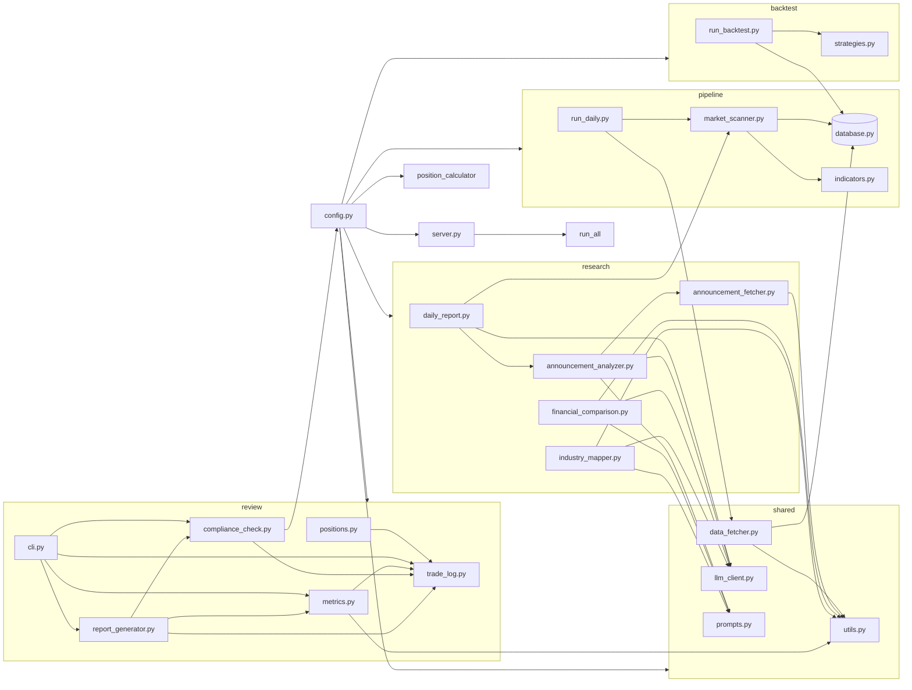
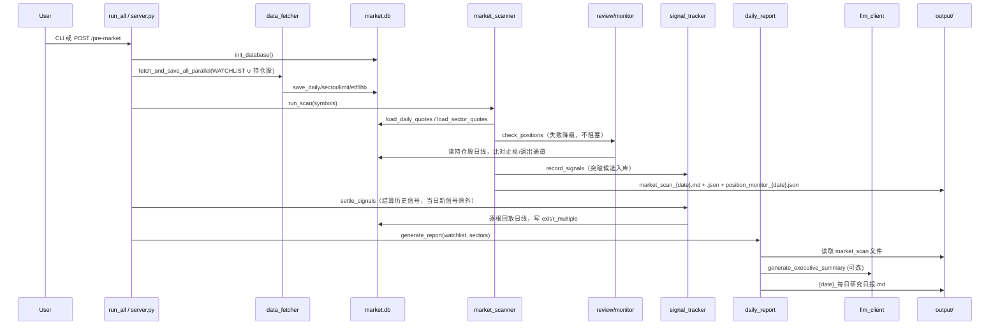
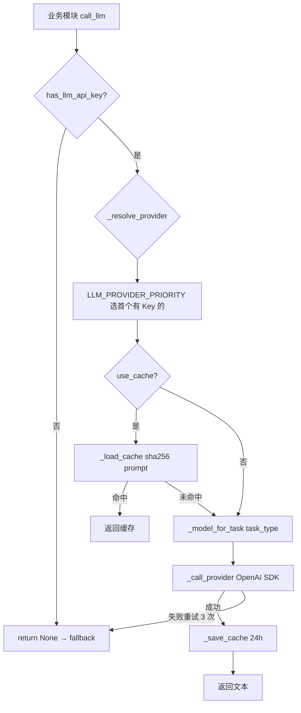
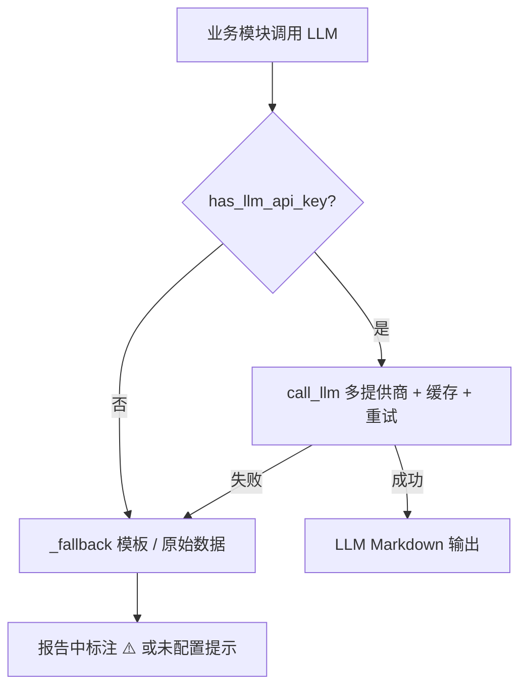
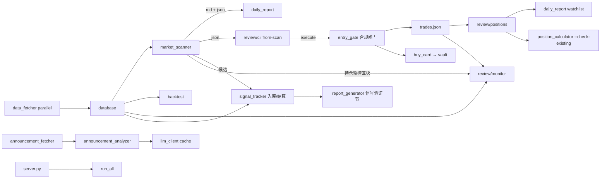

# Invest 项目架构与设计文档

> 版本：基于 2026-07-30 代码库（实战化改造后：持仓监控闭环、入场合规闸门、信号验证、回测同口径）  
> 受众：后续迭代开发者  
> 项目路径：`e:\Billion\Invest`

---

## 1. 项目概览

### 1.1 定位

Invest 是一个面向 **Obsidian 投资知识库** 的本地 Python 工具集，由原 `AI/`（LLM 研究助手）与 `Quant/`（量化执行工具）合并而来。它不替代人工决策，而是承担三类自动化职责：

| 角色 | 职责 |
|------|------|
| **信息整理** | 行情抓取、公告/财报/产业链研究、每日日报 |
| **计算执行** | 技术指标、市场扫描、仓位计算、回测验证 |
| **纪律审计** | 交易日志、合规检查、周/月复盘报告 |

### 1.2 愿景

> **人负责战略与决策，AI/量化负责信息整理与计算，纪律负责执行。**

### 1.3 核心理念

- **配置集中化**：所有路径、API、规则参数统一在 `config.py`，禁止硬编码 vault 路径
- **模块独立可运行**：每个子目录均有 CLI 入口，可单独调试
- **优雅降级**：无 LLM Key、网络失败、数据源不可用时，仍输出原始数据或模板
- **Obsidian 原生输出**：Markdown + YAML frontmatter，支持 wikilink 与标签检索
- **投资体系对齐**：合规规则、仓位计算、策略命名均映射「投资体系 V5.0」

### 1.4 模块概览

| 模块 | 路径 | 职责 |
|------|------|------|
| 统一入口 | `run_all.py` | 盘前 pipeline + research 编排（取数→扫描→持仓监控→信号结算→日报） |
| **FastAPI 服务** | `server.py` | HTTP 触发盘前流程、状态查询、定时调度 |
| 配置 | `config.py` | 路径、API、股票池、合规规则、策略参数（`STRATEGY_PARAMS` 单一来源） |
| 仓位计算 | `position_calculator.py` | `calc_position` 风险预算股数（口径同 config.RISK_LIMITS） |
| 共享层 | `shared/` | 数据抓取、LLM 路由、工具函数 |
| 数据管道 | `pipeline/` | SQLite 缓存、指标、市场扫描（MD + JSON） |
| **信号追踪** | `pipeline/signal_tracker.py` | 突破信号入库、逐根回放结算、胜率/平均R 统计 |
| 研究助手 | `research/` | 日报、公告（fallback 链 + 防编造护栏 + PDF 提取）、财报、产业链 |
| 交易复盘 | `review/` | 交易日志、合规、周报月报 |
| **持仓监控** | `review/monitor.py` | 止损/退出通道警报、回撤状态自动推导 |
| **入场合规闸门** | `review/entry_gate.py` | 建仓前合规检查，高级违规拒绝，`--force` 留痕 |
| **买入卡** | `review/buy_card.py` | 建仓后自动生成买入卡（写 vault 交易日志/） |
| 持仓视图 | `review/positions.py` | 开放持仓、风险敞口、未实现盈亏（market.db 收盘价） |
| 回测 | `backtest/` | Backtrader 策略验证、权益曲线图（参数与实盘共用 config） |
| 测试 | `tests/` | 指标、合规、持仓、监控、闸门、信号、参数、回测（142 用例） |

---

## 2. 架构总览

### 2.1 分层架构

```mermaid
flowchart TB
    subgraph Presentation["展示层（CLI + HTTP + Markdown 输出）"]
        RA[run_all.py]
        SV[server.py FastAPI]
        PR[pipeline/run_daily.py]
        RR[research/run_daily_report.py]
        RC[review/cli.py]
        RB[backtest/run_backtest.py]
        PC[position_calculator.py]
    end

    subgraph Business["业务逻辑层"]
        MS[market_scanner]
        DR[daily_report]
        AA[announcement_analyzer]
        AF[announcement_fetcher]
        FC[financial_comparison]
        IM[industry_mapper]
        IND[indicators]
        STR[strategies]
        MET[metrics]
        CC[compliance_check]
        RG[report_generator]
        POS[review/positions]
        MON[review/monitor]
        EG[review/entry_gate]
        BC[review/buy_card]
        ST[signal_tracker]
    end

    subgraph Shared["共享服务层"]
        DF[data_fetcher]
        LLM[llm_client]
        PM[prompts]
        UT[utils]
    end

    subgraph Data["数据层"]
        DB[(SQLite market.db)]
        TJ[(trades.json)]
        AC[data/announcements/]
        LC[data/llm_cache/]
        OUT[output/*.md + *.json]
        VAULT[Obsidian vault 复盘目录]
    end

    subgraph External["外部依赖"]
        AK[AkShare]
        CN[巨潮 cninfo.com.cn]
        KIMI[Kimi/Moonshot API]
        DS[DeepSeek API]
        BT[Backtrader]
    end

    RA --> MS & DR
    SV --> RA
    PR --> MS
    RR --> DR
    RC --> MET & CC & RG & MS & EG
    RB --> STR
    PC --> POS & CC

    MS --> IND & DB & MON & ST
    MON --> IND & DB & TJ
    ST --> DB
    EG --> CC & BC
    BC --> VAULT
    DR --> AA & MS & LLM & POS
    AA --> AF & LLM
    AF --> CN & AC
    FC & IM --> LLM & PM
    MET --> TJ
    CC --> TJ
    RG --> TJ & VAULT & ST
    POS --> TJ & DB

    DF --> AK & DB
    LLM --> KIMI & DS & LC
    STR --> BT
    UT --> AK
```



### 2.2 模块依赖关系



### 2.3 盘前数据流



---

## 3. 技术栈

### 3.1 依赖清单

| 包 | 版本要求 | 用途 |
|----|----------|------|
| `openai` | >=1.30.0 | Kimi / DeepSeek / 自定义 OpenAI 兼容 API |
| `akshare` | >=1.14.0 | A 股行情、公告、财务、板块数据 |
| `pandas` | >=2.0.0 | 数据处理、SQL 读写 |
| `numpy` | >=1.24.0 | 指标计算 |
| `python-dotenv` | >=1.0.0 | 预留环境变量加载 |
| `requests` | >=2.31.0 | AkShare / 巨潮 HTTP |
| `tabulate` | >=0.9.0 | 预留表格输出 |
| `backtrader` | >=1.9.78 | 策略回测引擎 |
| `matplotlib` | >=3.7.0 | 回测资金曲线 + 回撤图 |
| `pytest` | >=7.0.0 | 单元测试 |
| `fastapi` | >=0.110.0 | HTTP 服务 |
| `uvicorn` | >=0.27.0 | ASGI 服务器 |
| `apscheduler` | >=3.10.0 | 定时盘前调度（可选） |
| `beautifulsoup4` | >=4.12.0 | 巨潮 HTML 公告解析 |
| `pypdf` | >=4.0.0 | 巨潮 PDF 公告正文提取（最多前 30 页） |

**已移除**：`anthropic`、`jinja2`（原预留依赖，当前代码未使用）。

### 3.2 选型理由

| 决策 | 理由 |
|------|------|
| **AkShare** | 免费、覆盖 A 股多数据源，适合个人研究；内置新浪/东财/同花顺 fallback |
| **SQLite** | 零运维、单文件、适合本地日线/板块缓存 |
| **OpenAI SDK + 多 base_url** | Kimi / DeepSeek / 自定义端点统一协议，切换成本低 |
| **Backtrader** | 成熟的事件驱动回测，自定义 Indicator 灵活 |
| **JSON 交易日志** | 人类可读、易手工编辑、与 Obsidian 工作流契合 |
| **FastAPI + APScheduler** | 轻量 HTTP 触发 + 可选定时任务，Obsidian/脚本均可集成 |
| **ThreadPoolExecutor 并行 fetch** | 在不引入 asyncio 的前提下加速日线抓取 |

---

## 4. 模块详解

### 4.1 根目录模块

#### `config.py` — 统一配置

**职责**：路径常量、LLM/AkShare 参数、股票池、合规规则、Obsidian 输出路径、服务与调度配置。

无函数，全部为模块级常量（见第 7 章配置速查）。`import os` 位于文件顶部。

**股票池设计**：
- `WATCHLIST`：管道扫描 + 数据抓取默认列表（10 只蓝筹）
- `RESEARCH_WATCHLIST`：`WATCHLIST` 子集，侧重产业研究标的
- 已废弃 `DEFAULT_WATCHLIST`，统一使用上述两个常量

#### `run_all.py` — 统一入口

**职责**：盘前一键编排 pipeline + research（取数→扫描→持仓监控→信号结算→日报）。

| 函数 | 签名 | 返回值 | 职责 |
|------|------|--------|------|
| `watchlist_with_positions` | `() -> list[str]` | 股票池 | `WATCHLIST` ∪ trades.json 未平仓代码（TradeLog 失败降级为 WATCHLIST） |
| `run_pipeline` | `(skip_fetch: bool = False, symbols: list[str] \| None = None) -> Path` | 扫描报告路径 | 初始化 DB → 可选并行 fetch（默认 `watchlist_with_positions()`）→ run_scan（含持仓监控、信号入库）→ settle_signals |
| `run_research` | `(watchlist: list[str] \| None = None, sectors: list[str] \| None = None) -> Path` | 日报路径 | 调用 generate_report |
| `main` | `() -> None` | — | argparse CLI |

**依赖**：`config`, `pipeline.database`, `pipeline.market_scanner`, `pipeline.signal_tracker`, `research.daily_report`, `review.positions`, `shared.data_fetcher.fetch_and_save_all_parallel`

#### `server.py` — FastAPI 服务

**职责**：HTTP 触发盘前流程、查询运行状态与最新输出、可选 APScheduler 定时调度。

**模块常量**：

| 常量 | 值 | 说明 |
|------|-----|------|
| `TASK_TIMEOUT` | 600 | 单任务超时（秒） |
| `_run_state` | dict | 全局运行状态（running、last_* 记录） |

**内部函数**：

| 函数 | 签名 | 返回值 |
|------|------|--------|
| `_now_iso` | `() -> str` | ISO 时间戳 |
| `_latest_file` | `(directory: Path, pattern: str = "*.md") -> Optional[Path]` | 目录内最新文件 |
| `_list_output_files` | `(directory: Path, limit: int = 10) -> list[dict]` | 输出文件列表（name/path/modified） |
| `_read_file_safe` | `(path: Optional[Path]) -> dict` | 安全读取文件内容 |
| `_run_with_timeout` | `(func, timeout: int = TASK_TIMEOUT) -> Any` | 线程池 + 超时执行 |
| `_do_pipeline` | `(skip_fetch: bool = False, symbols: list[str] \| None = None) -> dict` | 调用 run_pipeline |
| `_do_research` | `(watchlist: list[str] \| None = None, sectors: list[str] \| None = None) -> dict` | 调用 run_research |
| `_do_pre_market` | `(skip_fetch: bool = False, symbols: list[str] \| None = None) -> dict` | pipeline + research |
| `_execute_task` | `(task_name: str, func, state_key: str) -> dict` | 串行任务执行与状态更新 |
| `_parse_schedule_time` | `(time_str: str) -> tuple[int, int]` | 解析 HH:MM |
| `_scheduled_pre_market` | `() -> None` | 定时任务回调 |
| `_start_scheduler` | `() -> None` | 启动 BackgroundScheduler |
| `on_startup` | `() -> None` | 服务启动钩子 |
| `on_shutdown` | `() -> None` | 关闭调度器与线程池 |
| `main` | `() -> None` | uvicorn 启动 |

**HTTP 端点**：

| 方法 | 路径 | 参数 | 说明 |
|------|------|------|------|
| GET | `/` | — | 服务信息与端点列表 |
| POST | `/pre-market` | `skip_fetch: bool = False` | 完整盘前流程 |
| POST | `/pipeline` | `skip_fetch: bool = False` | 仅数据管道 |
| POST | `/research` | — | 仅研究日报 |
| GET | `/status` | — | 运行状态 + 最近输出文件 |
| GET | `/latest-scan` | — | 最新 market_scan Markdown 内容 |
| GET | `/latest-report` | — | 最新日报 Markdown 内容 |

**调度配置**（见 `config.py`）：
- `SCHEDULER_ENABLED`：环境变量 `ENABLE_SCHEDULER=true` 时启用
- `SCHEDULER_TIME`：默认 `08:30`，CronTrigger 每日触发 `_scheduled_pre_market`
- 任务串行：已有任务运行时返回 HTTP 409

**启动方式**：

```powershell
cd e:\Billion\Invest
python server.py
# 或
uvicorn server:app --host 127.0.0.1 --port 8900
```

#### `position_calculator.py` — 仓位计算器

**职责**：风险预算法股数计算、单票上限、风险簇检查；风险率/仓位上限统一读 `config.RISK_LIMITS` / `POSITION_LIMITS`（经 `compliance_check.get_risk_limit` / `get_position_limit`），账户类型为中文枚举（核心/产业/事件/实验，`config.ACCOUNT_TYPES`）。

**枚举类**：`GapRisk`（跳空风险折扣）

| 函数 | 签名 | 返回值 |
|------|------|--------|
| `lookup_cluster` | `(symbol: str) -> str \| None` | 风险簇归属（查 `config.INDUSTRY_MAP`，未收录返回 None） |
| `calc_position` | `(equity, entry, stop, account_type, drawdown_state, gap_risk=GapRisk.NONE, gap_buffer=0.0, atr=None) -> dict` | 纯函数：风险率/风险预算/每股风险/股数/仓位金额/加仓价（可被 `review/cli.py` import） |
| `format_calc_text` | `(calc: dict, symbol: str = "") -> str` | 终端格式化文本 |
| `main` | `() -> None` | CLI：`-t/--account-type` 接受中文（choices=`ACCOUNT_TYPES`），`--drawdown-state`，`--check-existing` 复用 `compliance_check` 组合级簇检查 |

---

### 4.2 `shared/` — 共享工具

#### `utils.py`

| 函数 | 签名 | 返回值 | 职责 |
|------|------|--------|------|
| `patch_bypass_proxy` | `() -> None` | — | 绕过 Windows 系统代理 |
| `bypass_proxy` | 上下文管理器 | — | 确保代理已绕过 |
| `normalize_symbol` | `(symbol: str) -> str` | 6 位代码 | 规范化股票代码 |
| `retry_fetch` | `(func: Callable, *args, **kwargs)` | func 返回值 | 带指数退避的重试 |
| `safe_fetch` | `(func, *args, default=None, **kwargs)` | 任意 | 失败返回 default |
| `df_to_markdown_table` | `(df: pd.DataFrame, float_fmt=".2f") -> str` | Markdown 表格 | Obsidian 兼容 |
| `write_markdown` | `(content: str, output_path: Path) -> Path` | 写入路径 | 创建目录并写文件 |
| `obsidian_frontmatter` | `(tags: list[str], **extra) -> str` | YAML 块 | frontmatter 生成 |
| `get_stock_name` | `(symbol: str) -> str` | 股票名称 | 缓存 `stock_info_a_code_name` |

#### `data_fetcher.py`

| 函数 | 签名 | 返回值 |
|------|------|--------|
| `fetch_stock_daily` | `(symbol, start_date="20200101", end_date=None, adjust="qfq") -> pd.DataFrame` | 标准列 OHLCV |
| `fetch_index_daily` | `(symbol="000300", start_date, end_date) -> pd.DataFrame` | 指数日线 |
| `fetch_sector_list` | `() -> pd.DataFrame` | 行业板块列表 |
| `fetch_sector_daily` | `(sector_name, start_date, end_date) -> pd.DataFrame` | 板块指数日线 |
| `fetch_limit_stats` | `(trade_date=None) -> pd.DataFrame` | 涨跌停/市场宽度 |
| `fetch_etf_flow` | `(trade_date=None) -> pd.DataFrame` | ETF 资金流 |
| `fetch_dragon_tiger` | `(start_date=None, end_date=None) -> pd.DataFrame` | 龙虎榜 |
| `fetch_and_save_all` | `(symbols, start_date="20230101", sector_limit=SECTOR_FETCH_LIMIT) -> dict` | 串行批量抓取（保留兼容） |
| `_fetch_and_save_single_stock` | `(sym: str, start_date: str) -> tuple[str, int, Optional[str]]` | 并行 worker |
| `fetch_and_save_all_parallel` | `(symbols, start_date="20230101", sector_limit=SECTOR_FETCH_LIMIT, max_workers=FETCH_MAX_WORKERS) -> dict` | **并行**批量抓取 |

**并行策略**：个股日线通过 `ThreadPoolExecutor(max_workers=FETCH_MAX_WORKERS)` 并行；沪深300、板块、涨跌停、ETF、龙虎榜仍串行执行。

#### `llm_client.py` — 多提供商 LLM

| 函数 | 签名 | 返回值 |
|------|------|--------|
| `has_llm_api_key` | `() -> bool` | 是否配置任一提供商密钥 |
| `_resolve_provider` | `(provider: Optional[str] = None) -> Optional[str]` | 按优先级解析提供商 |
| `_model_for_task` | `(provider: str, task_type: str) -> str` | 按 task_type 选模型 |
| `_cache_file` | `(cache_key: str) -> Path` | 缓存文件路径 |
| `_load_cache` | `(cache_key: str) -> Optional[str]` | 读取 24h 内缓存 |
| `_save_cache` | `(cache_key: str, response: str, provider: str, model: str) -> None` | 写入缓存 |
| `_make_cache_key` | `(prompt: str) -> str` | SHA256(prompt) |
| `call_llm` | `(prompt, system_prompt="...", temperature=0.3, max_tokens=4096, provider=None, use_cache=True, task_type="analysis") -> Optional[str]` | 主入口 |
| `_call_provider` | `(provider, prompt, system_prompt, temperature, max_tokens, model) -> str` | OpenAI SDK 调用 |
| `_call_kimi` | `(prompt, system_prompt, temperature, max_tokens) -> str` | 兼容旧接口 |

**task_type 与模型映射**：

| task_type | Kimi | DeepSeek | Custom |
|-----------|------|----------|--------|
| `announcement` | `KIMI_MODEL_LONG` (32k) | `DEEPSEEK_MODEL` | `CUSTOM_LLM_MODEL` |
| `summary` | `KIMI_MODEL` (8k) | `DEEPSEEK_MODEL` | `CUSTOM_LLM_MODEL` |
| `analysis`（默认） | `KIMI_MODEL` | `DEEPSEEK_MODEL` | `CUSTOM_LLM_MODEL` |

**提供商优先级**：`LLM_PROVIDER_PRIORITY = ["kimi", "deepseek", "custom"]`，取第一个已配置 API Key 的提供商。

#### `prompts.py`

纯字符串常量（`ANNOUNCEMENT_*`, `FINANCIAL_*`, `INDUSTRY_*`, `DAILY_REPORT_SUMMARY`）。

---

### 4.3 `pipeline/` — 数据管道

#### `database.py`

（同前版本：SQLite CRUD，`REPLACE INTO` upsert 模式。）

#### `indicators.py`

（同前版本：Donchian 通道、ATR、市场状态 A/B/C/D 判断等。）

#### `market_scanner.py`

| 函数 | 签名 | 返回值 |
|------|------|--------|
| `run_scan` | `(symbols: list[str] \| None = None, output_dir: Path \| None = None) -> Path` | Markdown 报告路径（同时写 JSON） |
| `_load_limit_stats_from_db` | `(db_path=None) -> pd.DataFrame` | 最近 5 日 limit_stats |
| `_run_position_monitor` | `() -> Optional[dict]` | 持仓监控（调 `review.monitor`，失败降级返回 None，不阻塞扫描） |
| `_record_breakout_signals` | `(scan_data: dict) -> None` | 突破候选写入 signals 表（调 `signal_tracker.record_signals`） |
| `_df_to_breakout_list` | `(df: pd.DataFrame) -> list[dict]` | 突破候选 JSON 结构 |
| `_df_to_sector_list` | `(df: pd.DataFrame) -> list[dict]` | 板块排名 JSON 结构 |
| `_build_scan_json` | `(date, state_info, breakout_20, breakout_55, sector_rank) -> dict` | 完整扫描 JSON |
| `_build_sector_ranking` | `(benchmark_df) -> pd.DataFrame` | Top 板块排名 |
| `_format_report` | `(date, state_info, breakout_20, breakout_55, sector_rank, symbols) -> str` | Markdown 正文（顶部含「持仓监控」区块） |

**JSON 输出结构**（`market_scan_{date}.json`）：

```json
{
  "date": "2026-07-30",
  "market_state": "D",
  "breakout_s1a": [{"symbol", "close", "channel_high", "breakout_pct", "atr_20", "period"}],
  "breakout_s2a": [...],
  "sector_ranking": [{"rank", "sector_name", "relative_strength", "period_return"}],
  "position_monitor": {"date", "data_date", "open_count", "alerts", "positions_ok", "drawdown_state"}
}
```

持仓监控结果另写 `position_monitor_{date}.json`（机器消费）。

#### `signal_tracker.py` — 信号追踪（可验证性）

**职责**：扫描突破信号自动入库（SQLite `signals` 表），每日盘前逐根回放结算，产出各系统胜率/平均R/PF——回答"S1-A 信号最近到底灵不灵"。

| 函数 | 签名 | 返回值 |
|------|------|--------|
| `record_signals` | `(scan_data: dict, db_path=None) -> int` | 候选入库；同 (symbol, system) 有 open 信号则跳过（防连续突破日重复） |
| `settle_signals` | `(db_path=None, settle_date=None) -> dict` | 结算 `signal_date < settle_date` 的 open 信号：逐根回放日线，先判止损（R=−1）再判退出通道，满 `SIGNAL_MAX_HOLDING_DAYS`(20) 个交易日到期关闭 |
| `signal_stats` | `(db_path=None, days=90, as_of=None) -> dict` | 近 N 天已关闭信号按系统分组：样本数/胜率/平均R/期望值/PF；<`SIGNAL_STATS_MIN_SAMPLE`(5) 标注「样本不足」 |
| `signal_stats_to_markdown` | `(stats: dict) -> str` | 表格 + 自动解读（周报/月报/CLI 共用） |
| `main` | `() -> None` | CLI：`settle [--date]` / `stats [--days 90]` |

**结算口径**：入场价=信号日收盘价，止损=入场价−`ATR_STOP_MULT`×ATR(20)，退出通道 S1=10 日/S2=20 日低点（shift(1) 无未来函数，与 monitor、回测同口径）。

#### `run_daily.py`

CLI 入口：`--symbols`, `--start-date`, `--skip-fetch`, `--fetch-only`, `--output-dir`；fetch 使用 `fetch_and_save_all_parallel`。

---

### 4.4 `research/` — 研究助手

#### `daily_report.py`

| 函数 | 签名 | 返回值 |
|------|------|--------|
| `fetch_market_overview` | `() -> dict` | indices, up/down/limit counts |
| `fetch_sector_performance` | `(sectors: list[str]) -> pd.DataFrame` | 关注板块表现 |
| `fetch_announcement_summary` | `(symbol: str) -> str` | 单行公告摘要 |
| `load_breakout_candidates` | `() -> str` | 从 market_scan 文件提取或触发 run_scan |
| `generate_executive_summary` | `(materials: str) -> str` | LLM 今日要点 |
| `resolve_watchlist` | `(watchlist: list[str] \| None = None) -> list[str]` | CLI 覆盖 > 持仓 + RESEARCH_WATCHLIST |
| `generate_report` | `(watchlist=None, sectors=None, output_dir=None) -> Path` | 完整日报 |

#### `announcement_fetcher.py` — 巨潮公告全文

| 函数 | 签名 | 返回值 |
|------|------|--------|
| `_get_org_id` | `(symbol: str) -> str` | 巨潮 orgId（AkShare 映射表） |
| `_default_se_date` | `(start: str = "2020-01-01") -> str` | 默认查询日期范围 |
| `_query_cninfo` | `(symbol, searchkey="", se_date="", org_id="") -> list[dict]` | 巨潮 API 查询 |
| `_parse_detail_url` | `(url: str) -> dict` | 解析详情页 URL 参数 |
| `_announcement_to_result` | `(item: dict) -> dict` | API 单条 → 统一结构 |
| `_resolve_url_to_content_source` | `(url, symbol="", title="", date="") -> dict` | 解析实际 PDF/HTML URL |
| `_is_valid_extracted_text` | `(text: str) -> bool` | 过滤 SPA 模板残留 |
| `_cache_path` | `(symbol, date, title) -> Path` | 缓存文件路径 |
| `_load_cache` | `(symbol, date, title) -> Optional[dict]` | 读取本地缓存 |
| `cache_announcement` | `(symbol, date, title, content, **extra) -> Path` | 写入 `data/announcements/` |
| `_cninfo_column` | `(symbol: str) -> str` | 交易所 column 参数 |
| `_normalize_announcement_df` | `(df) -> pd.DataFrame` | 各来源列名统一为 title/date/category/url |
| `_fetch_today_notices` | `(symbol: str) -> pd.DataFrame` | 东财当日公告（AkShare stock_notice_report） |
| `_fetch_cninfo_history` | `(symbol, days=400) -> pd.DataFrame` | 巨潮 HTTP API 直查个股历史公告 |
| `fetch_latest_announcements` | `(symbol, limit=10, days=400) -> pd.DataFrame` | 最新公告列表 fallback 链（东财当日 → 巨潮 API） |
| `has_real_content` | `(content: str) -> bool` | 判断是否真实正文（防编造护栏依据） |
| `fetch_cninfo_announcement` | `(symbol, title) -> dict` | 搜索匹配公告 |
| `extract_html_content` | `(url: str) -> str` | BeautifulSoup 正文提取 |
| `extract_pdf_content` | `(url, max_pages=30) -> str` | pypdf PDF 正文提取（最多前 30 页） |
| `fetch_announcement_full_text` | `(url, symbol="", title="", date="") -> str` | 全文获取（缓存优先） |
| `chunk_text` | `(text, max_chars=2000, overlap=200) -> list[str]` | 长文分块 |
| `summarize_long_announcement` | `(text, symbol="", title="", max_chars=ANNOUNCEMENT_MAX_CHARS) -> str` | 分块 LLM 摘要合并 |

#### `announcement_analyzer.py`

`fetch_announcement_content` 已集成 `announcement_fetcher`：巨潮 HTML 解析、PDF 正文提取（pypdf）、长文 RAG 分块摘要（`task_type="announcement"`）。公告列表经 fetcher fallback 链获取（东财当日 → 巨潮 API；AkShare `stock_zh_a_disclosure_report_cninfo` 已陈旧弃用）。无正文时走降级路径（`has_real_content` 护栏），不调用 LLM；最新公告距今 >30 天标注「公告数据可能陈旧」。

#### `financial_comparison.py` / `industry_mapper.py`

（同前版本。）

---

### 4.5 `backtest/` — 回测

#### `strategies.py`

`S1A_Strategy` / `S2A_Strategy` + `STRATEGY_MAP`。参数默认值全部引用 `config.STRATEGY_PARAMS` / `ATR_*` / `ADD_SPACING_*` / `MAX_UNITS` / `LOT_SIZE`，与实盘扫描/监控同口径。

| 函数 | 签名 | 返回值 |
|------|------|--------|
| `next_add_action` | `(last_add_price, current_price, atr, ...) -> dict` | 纯函数：加仓间距 [0.5N, 1N]；单根跳空 >1N 不追，跳过的单位不补（海龟原义） |
| `calc_trade_r_multiple` | `(unit_positions, exit_price) -> float` | 纯函数：按单位真实风险（入场价−初始止损价）逐单位算 R 再汇总 |

#### `run_backtest.py`

| 函数 | 签名 | 返回值 |
|------|------|--------|
| `fetch_data` | `(symbol, start, end) -> pd.DataFrame` | AkShare 直连 |
| `load_data_from_db` | `(symbol, start, end) -> pd.DataFrame` | 优先本地 DB |
| `run_backtest` | `(strategy_name, symbol, start, end, initial_cash, commission, printlog) -> dict` | 统计 dict |
| `_plot_equity_curve` | `(equity_curve, markers, chart_path, strategy_name, symbol, start, end, initial_cash)` | PNG（**完整权益曲线 + 回撤 + 买卖点**） |
| `_extract_stats` | `(strat, start_value, end_value, initial_cash) -> dict` | Sharpe/DD/胜率等 |

**图表改进**：双面板（权益曲线 + 回撤曲线），标注买卖 scatter，`EquityCurveAnalyzer` / `TradeMarkerAnalyzer` 收集逐日权益与交易标记。

---

### 4.6 `review/` — 交易复盘

#### `monitor.py` — 持仓监控（盘前闭环核心）

**职责**：盘前流程中逐持仓检查止损与退出通道，生成警报；自动推导回撤状态。

| 函数 | 签名 | 返回值 |
|------|------|--------|
| `check_positions` | `(trade_log: TradeLog, db_path=None) -> dict` | `{"date","data_date","open_count","alerts","positions_ok","drawdown_state"}`；警报优先级 止损 > 退出 > 接近止损（<1N） |
| `derive_drawdown_state` | `(trade_log, db_path=None, floating_r=None) -> dict` | 按已平仓累计 R 曲线+浮动 R 推导 Normal/Caution/Defensive/Review（阈值 `config.DRAWDOWN_THRESHOLDS`）；月度轨道输出停事件/停开仓标记；env 显式设置冲突时以推导值为准并提示 |
| `run_monitor` | `(trade_log=None, db_path=None, output_dir=None) -> dict` | 执行监控并写 `position_monitor_{date}.json` |
| `monitor_to_markdown` | `(result: dict) -> list[str]` | 扫描报告嵌入区块 |
| `format_monitor_text` | `(result: dict) -> str` | 终端文本 |
| `main` | `() -> None` | CLI：`python review/monitor.py` |

退出通道按「入场系统」选择：含 S1→10 日低点、含 S2→20 日低点（`config.EXIT_CHANNEL_PERIODS`），其它系统只查止损；通道 shift(1) 不含当根 K 线（无未来函数，与扫描/回测同口径）。行情源为 market.db 本地日线（离线可用），持仓股已由 `run_all.watchlist_with_positions()` 保证在库。

#### `entry_gate.py` — 入场合规闸门

| 函数 | 签名 | 返回值 |
|------|------|--------|
| `derive_state_safe` | `(trade_log=None) -> str` | 回撤状态：优先 monitor 推导，失败降级 `config.DRAWDOWN_STATE` |
| `check_entry` | `(trade_log, new_trade_dict, ...) -> list[Violation]` | 单笔 + 组合级簇检查（复用 `compliance_check`） |
| `split_by_severity` / `format_violations` / `force_note` | — | 高级违规拒绝写入；`--force` 强制时备注留痕「⚠️ 强制建仓，违规：xxx」 |

所有写 trades.json 的建仓路径（`add`、`from-scan --execute`）必须经此闸门。

#### `buy_card.py` — 买入卡生成

| 函数 | 签名 | 返回值 |
|------|------|--------|
| `calc_dict_from_trade` | `(trade: Trade, equity: float) -> dict` | 按实际成交参数构造计算 dict |
| `build_buy_card_content` | `(trade, calc, scan_info=None) -> str` | 按 vault 买入卡模板栏目生成（逻辑/证据链/确认清单留「（待填写）」） |
| `generate_buy_card` | `(trade, calc=None, scan_info=None, output_dir=None) -> Path \| None` | 写 `【10】实盘记录/交易日志/{交易编号}_{名称}_买入卡.md`；失败打印警告不阻塞建仓 |

#### `positions.py` — 持仓与风险视图

| 函数 | 签名 | 返回值 |
|------|------|--------|
| `_normalize_symbol` | `(symbol: str) -> str` | 6 位代码 |
| `export_open_positions` | `(trade_log: TradeLog \| None = None) -> list[dict]` | 未平仓交易字典列表 |
| `get_current_exposure` | `(industry: str, trade_log=None, account_equity=ACCOUNT_EQUITY) -> float` | 指定风险簇敞口 % |
| `get_total_risk` | `(trade_log=None) -> float` | 未平仓总风险率 % |
| `get_position_for_watchlist` | `(trade_log=None) -> list[str]` | 持仓代码列表（去重） |
| `get_latest_price` | `(symbol: str, db_path=None) -> Optional[dict]` | market.db 最新收盘价与日期 |
| `_calc_unrealized_pnl` | `(trade: Trade) -> Optional[dict]` | 未实现盈亏/浮动 R（market.db 最新收盘价为市价源，非盘中实时） |
| `print_portfolio_summary` | `(trade_log=None, account_equity=ACCOUNT_EQUITY) -> None` | 终端持仓摘要（含市价数据日期、回撤状态） |

#### `trade_log.py` / `metrics.py` / `compliance_check.py` / `report_generator.py`

（同前版本。`compliance_check` 的 `get_risk_limit` / `get_position_limit` 已公开化供仓位计算器复用；「非系统内交易」检查对齐 `config.STRATEGY_CODES`。`report_generator` 新增 `signal_verification_section(days=90)`，周报/月报含「信号验证」节。）

#### `cli.py`

子命令：`add`, `update`, `list`, `show`, `stats`, `weekly`, `monthly`, `check`, `positions`, **`from-scan`**

- **`add`**：写入前自动过入场合规闸门（`entry_gate`）；`--system` 校验 `STRATEGY_CODES`；`--equity`/`--force`；成功后自动生成买入卡
- **`positions`**：调 `print_portfolio_summary`（未实现盈亏/风险敞口/回撤状态）
- **`stats`**：终端输出同时写 `STATS_OUTPUT_DIR/{date}_交易统计.md`
- **`from-scan`**：默认只打印建议（收盘价/ATR 止损/示例命令）；`--execute` 一键建仓：信号→止损=close−2×ATR→`calc_position`→合规闸门→写 Trade→买入卡；同股双信号默认 S2-A（`--system` 覆盖），`--account/--equity/--force` 可调

内部辅助：`_load_scan_json(date)`, `_find_breakout_in_scan(scan_data, symbol)`, `_resolve_cluster`, `_apply_entry_gate`, `_execute_from_scan`

---

## 5. 数据架构

### 5.1 SQLite Schema（`data/market.db`）

（同前版本：`daily_quotes`, `sector_quotes`, `etf_flow`, `limit_stats`, `dragon_tiger`, `market_state`。）

**新增 `signals` 表**（信号追踪，`init_database()` 幂等建表）：

```sql
CREATE TABLE IF NOT EXISTS signals (
    signal_date TEXT NOT NULL,      -- 信号日期
    symbol TEXT NOT NULL,           -- 股票代码
    system TEXT NOT NULL,           -- S1-A / S2-A
    entry_price REAL,               -- 入场价（信号日收盘价）
    stop_price REAL,                -- 止损价（入场价 − 2×ATR）
    channel_period INTEGER,         -- 退出通道周期（10 / 20）
    status TEXT NOT NULL DEFAULT 'open',  -- open / closed
    exit_date TEXT, exit_price REAL,
    exit_reason TEXT,               -- 止损 / 通道退出 / 到期
    r_multiple REAL,                -- 结算 R 倍数
    created_at TEXT,
    PRIMARY KEY (signal_date, symbol, system)
);
```

### 5.2 JSON 结构（`data/trades.json`）

（同前版本。）

### 5.3 文件存储布局

```
Invest/
├── data/
│   ├── market.db
│   ├── trades.json
│   ├── announcements/          # 公告全文 JSON 缓存
│   │   └── {code}_{date}_{title}_{hash16}.json
│   └── llm_cache/              # LLM 响应缓存（24h TTL）
│       └── {sha256(prompt)}.json
└── output/
    ├── daily_reports/            # {date}_每日研究日报.md
    ├── announcements/          # {date}_{code}_{name}_公告摘要.md
    ├── financial_reports/
    ├── industry_maps/
    ├── market_scans/           # market_scan_{date}.md + .json
    └── backtest/               # {strategy}_{symbol}_{start}_{end}.png
```

**公告缓存 JSON 字段**：`symbol`, `date`, `title`, `content`, `cached_at`, 可选 `url`, `content_type`

**LLM 缓存 JSON 字段**：`response`, `provider`, `model`, `cached_at`, `cached_at_iso`

**market_scan JSON**：供 `review/cli.py from-scan` 和程序化消费，与 Markdown 报告同日生成。

**Obsidian vault 写入**（`VAULT_ROOT/【10】实盘记录/`）：每周复盘、每月复盘、统计目录。

---

## 6. LLM 集成

### 6.1 多提供商路由



### 6.2 task_type 机制

| task_type | 使用场景 | 模型选择 |
|-----------|----------|----------|
| `announcement` | 公告分析、长文分块摘要 | 长上下文模型（Kimi 32k） |
| `summary` | 日报 executive summary | 默认 8k 模型 |
| `analysis` | 财报对比、产业链等 | 各提供商默认模型 |

可通过 `provider="kimi"` 显式指定提供商；未指定时按 `LLM_PROVIDER_PRIORITY` 自动选择。

### 6.3 缓存

- **目录**：`data/llm_cache/`
- **键**：`sha256(prompt.encode()).hexdigest()`
- **TTL**：`LLM_CACHE_TTL = 86400` 秒（24 小时）
- **禁用**：`call_llm(..., use_cache=False)`

### 6.4 提示词工程

| 场景 | System Prompt | task_type | 输出结构 |
|------|---------------|-----------|----------|
| 公告分析 | `ANNOUNCEMENT_SYSTEM` | `announcement` | 类型/关键数字/逻辑影响/风险/跟踪 |
| 长公告分块 | 内置摘要 prompt | `announcement` | 各段摘要合并 |
| 财报对比 | `FINANCIAL_COMPARISON_SYSTEM` | `analysis` | 概览/亮点/差异/启示 |
| 产业链 | `INDUSTRY_MAPPING_SYSTEM` | `analysis` | 全景/公司/催化/观察/传导 |
| 日报摘要 | 默认分析师 system | `summary` | 200 字 executive summary |

### 6.5 降级策略



- **announcement_analyzer**：`_fallback_analysis()`；无正文时输出「未取得公告正文，不做解读」，不调用 LLM
- **announcement_fetcher**：PDF 用 pypdf 提取，提取/HTML 解析失败时保留链接
- **financial_comparison / industry_mapper / daily_report**：同前版本 fallback

---

## 7. 配置管理

### 7.1 配置项分类

| 类别 | 代表常量 | 来源 |
|------|----------|------|
| 路径 | `PROJECT_ROOT`, `VAULT_ROOT`, `DATA_DIR`, `OUTPUT_*` | 代码推导 |
| LLM Kimi | `KIMI_API_KEY`, `KIMI_BASE_URL`, `KIMI_MODEL`, `KIMI_MODEL_LONG` | 环境变量 |
| LLM DeepSeek | `DEEPSEEK_API_KEY`, `DEEPSEEK_BASE_URL`, `DEEPSEEK_MODEL` | 环境变量 |
| LLM Custom | `CUSTOM_LLM_API_KEY`, `CUSTOM_LLM_BASE_URL`, `CUSTOM_LLM_MODEL` | 环境变量 |
| LLM 路由/缓存 | `LLM_PROVIDER_PRIORITY`, `LLM_CACHE_DIR`, `LLM_CACHE_TTL` | 代码默认 |
| 重试 | `LLM_MAX_RETRIES`, `FETCH_RETRY`, `FETCH_MAX_WORKERS` | 代码默认 |
| 研究 | `RESEARCH_WATCHLIST`, `DEFAULT_SECTORS`, `ANNOUNCEMENT_*` | 代码默认 |
| 管道 | `WATCHLIST`, `CHANNEL_*`, `MARKET_STATE` | 代码默认 |
| 策略参数 | `STRATEGY_PARAMS`, `ATR_PERIOD`, `ATR_STOP_MULT`, `ADD_SPACING_MIN/MAX`, `MAX_UNITS`, `LOT_SIZE`, `BACKTEST_RISK_PCT` | 投资体系 V5.0（单一来源，扫描/监控/信号/回测/仓位共用） |
| 策略枚举 | `STRATEGY_CODES`, `STRATEGY_INFO`, `ACCOUNT_TYPES`, `SYSTEM_DEFAULT_ACCOUNT` | 投资体系 V5.0 |
| 监控/回撤 | `DRAWDOWN_THRESHOLDS`, `MONTHLY_DRAWDOWN_LIMITS`, `EXIT_CHANNEL_PERIODS` | 投资体系 V5.0 §6 |
| 信号追踪 | `SIGNAL_MAX_HOLDING_DAYS`, `SIGNAL_STATS_MIN_SAMPLE` | 代码默认 |
| 服务/调度 | `SERVER_HOST`, `SERVER_PORT`, `SCHEDULER_*` | 环境变量 |
| 复盘 | `ACCOUNT_EQUITY`, `DRAWDOWN_STATE`, `TRADE_LOG_OUTPUT_DIR` | 环境变量/代码推导 |
| 合规 | `RISK_LIMITS_*`, `POSITION_LIMITS`, `RISK_CLUSTER_LIMITS`, `INDUSTRY_MAP` | 投资体系 V5.0 |

### 7.2 环境变量

| 变量 | 默认值 | 说明 |
|------|--------|------|
| `KIMI_API_KEY` | `""` | Moonshot API 密钥 |
| `KIMI_BASE_URL` | `https://api.moonshot.cn/v1` | Kimi API 端点 |
| `KIMI_MODEL` | `moonshot-v1-8k` | 默认模型 |
| `KIMI_MODEL_LONG` | `moonshot-v1-32k` | 长文/公告模型 |
| `DEEPSEEK_API_KEY` | `""` | DeepSeek API 密钥 |
| `DEEPSEEK_BASE_URL` | `https://api.deepseek.com/v1` | DeepSeek 端点 |
| `DEEPSEEK_MODEL` | `deepseek-chat` | DeepSeek 模型 |
| `CUSTOM_LLM_API_KEY` | `""` | 自定义 OpenAI 兼容密钥 |
| `CUSTOM_LLM_BASE_URL` | `""` | 自定义 base_url |
| `CUSTOM_LLM_MODEL` | `""` | 自定义模型名 |
| `ACCOUNT_EQUITY` | `1000000` | 合规检查基准权益 |
| `DRAWDOWN_STATE` | `Normal` | Normal/Caution/Defensive/Review |
| `ENABLE_SCHEDULER` | `""` | 设为 `true` 启用定时盘前 |
| `SCHEDULER_TIME` | `08:30` | 定时触发时间 HH:MM |
| `SERVER_HOST` | `127.0.0.1` | FastAPI 绑定地址 |
| `SERVER_PORT` | `8900` | FastAPI 端口 |

### 7.3 默认值策略

- **路径**：基于 `Path(__file__).resolve().parent` 相对定位
- **股票池**：`WATCHLIST`（管道）+ `RESEARCH_WATCHLIST`（研究子集）；`daily_report.resolve_watchlist()` 合并持仓代码
- **兼容别名**：`OUTPUT_DIR`, `MARKET_SCANNER_OUTPUT`, `PIPELINE_OUTPUT_DIR`

---

## 8. 错误处理

### 8.1 重试策略

| 层级 | 机制 | 参数 |
|------|------|------|
| 数据获取 | `retry_fetch` | 3 次，延迟递增 |
| 并行 fetch | 单股失败记录 error，不阻塞其他 symbol | `FETCH_MAX_WORKERS=4` |
| LLM | `call_llm` 循环 | 3 次，延迟 `LLM_RETRY_DELAY * (attempt+1)` |
| HTTP 服务 | `_run_with_timeout` | 600s 任务超时，409 并发冲突 |
| 数据源 | 主源失败切换备用源 | 新浪→东财 |

### 8.2 降级路径

| 场景 | 行为 |
|------|------|
| fetch 失败但 DB 有数据 | 继续扫描 |
| 单只股票 fetch 失败 | 记录 error，跳过 |
| LLM 不可用 | fallback 模板 |
| 公告 PDF | pypdf 提取正文（前 30 页）；失败时返回链接 +「PDF 需手动查看」 |
| 公告 HTML 解析失败 | 返回链接 + 解析失败提示 |
| 无效公告缓存 | 忽略并重新抓取 |
| JSON 损坏 | TradeLog 初始化为 `[]` |
| 绘图失败 | 回测仍返回 stats |
| APScheduler 未安装 | 服务仍可运行，定时不可用 |

---

## 9. 与 Obsidian 集成

（同前版本：YAML frontmatter、tags 映射、wikilink、GFM 表格。）

`daily_report` 的 watchlist 现可自动包含 `trades.json` 开放持仓代码。

---

## 10. 工作流编排

### 10.1 盘前流程（CLI，推荐）

```powershell
cd e:\Billion\Invest
python run_all.py
```

等价步骤：

1. `init_database()`
2. `fetch_and_save_all_parallel(watchlist_with_positions())` — 股票池 = WATCHLIST ∪ 未平仓持仓股
3. `run_scan()` → 突破候选 + 市场状态 + `check_positions()` 持仓监控 → `market_scan_{date}.md` + `.json` + `position_monitor_{date}.json`；候选写入 signals 表
4. `settle_signals()` — 逐根回放结算历史信号（当日新信号不结算）
5. `generate_report()` → `{date}_每日研究日报.md`（watchlist = 持仓 + RESEARCH_WATCHLIST）

**加速**：`python run_all.py --skip-fetch`

### 10.2 盘前流程（FastAPI 服务）

```powershell
# 启动服务
set ENABLE_SCHEDULER=true
set SCHEDULER_TIME=08:30
python server.py

# 触发（PowerShell）
Invoke-RestMethod -Method POST -Uri "http://127.0.0.1:8900/pre-market"
Invoke-RestMethod -Method POST -Uri "http://127.0.0.1:8900/pre-market?skip_fetch=true"
Invoke-RestMethod -Uri "http://127.0.0.1:8900/status"
Invoke-RestMethod -Uri "http://127.0.0.1:8900/latest-report"
```

**定时调度**：`ENABLE_SCHEDULER=true` 时，服务启动后 BackgroundScheduler 每日 `SCHEDULER_TIME` 自动执行盘前流程；若已有任务运行则跳过。

### 10.3 盘后/周期性流程

| 时机 | 命令 | 输出 |
|------|------|------|
| 交易录入 | `review/cli.py add ...` | trades.json + 买入卡（先过合规闸门） |
| 从扫描查看 | `review/cli.py from-scan 600519` | 终端建议参数（不落库） |
| 从扫描建仓 | `review/cli.py from-scan 600519 --execute` | 仓位计算→闸门→trades.json + 买入卡 |
| 平仓更新 | `review/cli.py update ... --exit-price` | 自动算 R |
| 合规审计 | `review/cli.py check` | 终端报告 |
| 持仓摘要 | `review/cli.py positions` | 未实现盈亏/敞口/回撤状态 |
| 持仓监控 | `review/monitor.py`（盘前流程已自动执行） | 止损/退出警报 JSON |
| 信号统计 | `pipeline/signal_tracker.py stats --days 90` | 各系统胜率/平均R/PF |
| 仓位计算 | `position_calculator.py -t 核心 --check-existing ...` | 含 trades.json 簇检查 |
| 周末 | `review/cli.py weekly` | vault 周报（含信号验证节） |
| 月末 | `review/cli.py monthly` | vault 月报（含信号验证节） |
| 交易统计 | `review/cli.py stats` | 终端 + vault 统计/ |
| 策略验证 | `backtest/run_backtest.py` | PNG + stats |
| 单元测试 | `python -m pytest tests/ -v` | 142 passed |

### 10.4 模块联动点



---

## 11. 设计模式与代码规范

（同前版本：集中配置、策略模式、门面模式、降级空对象、Dataclass DTO 等。）

**新增**：
- **单线程任务队列**：`server.py` 的 `_executor(max_workers=1)` 保证盘前任务串行
- **缓存 aside**：公告全文与 LLM 响应本地 JSON 缓存
- **结构化输出双写**：market_scanner 同时输出 MD（人类）与 JSON（机器）

---

## 12. 扩展指南

### 12.1 添加新研究模块

（同前版本骨架。）

### 12.2 添加新回测策略

（同前版本。）

### 12.3 添加新数据源

在 `fetch_and_save_all_parallel` 中集成新 fetch 函数。

### 12.4 添加新 LLM 提供商

1. 在 `config.py` 添加 `{NAME}_API_KEY`, `{NAME}_BASE_URL`, `{NAME}_MODEL`
2. 在 `llm_client._PROVIDER_KEYS` 注册
3. 在 `LLM_PROVIDER_PRIORITY` 加入名称
4. 在 `_call_provider` 和 `_model_for_task` 添加分支

```python
# config.py
NEWPROVIDER_API_KEY = os.getenv("NEWPROVIDER_API_KEY", "")
LLM_PROVIDER_PRIORITY = ["kimi", "deepseek", "newprovider", "custom"]

# llm_client.py
_PROVIDER_KEYS["newprovider"] = NEWPROVIDER_API_KEY
```

业务层仍调用 `call_llm(...)`，无需修改。

### 12.5 添加新合规规则

（同前版本。）

### 12.6 添加 HTTP 端点

在 `server.py` 添加路由，通过 `_execute_task` 包装长任务以保证串行与超时控制。

---

## 13. 已知限制与改进方向

### 13.1 原瓶颈（已完成 ✅）

| # | 原限制 | 状态 | 实现方式 |
|---|--------|------|----------|
| 1 | 同步串行 fetch 耗时长 | ✅ | `fetch_and_save_all_parallel()` + `ThreadPoolExecutor`，`FETCH_MAX_WORKERS=4` |
| 2 | 公告无正文抓取 | ✅ | `research/announcement_fetcher.py` 巨潮 API + HTML 解析 + `data/announcements/` 缓存 |
| 3 | 双股票池不一致 | ✅ | 统一 `WATCHLIST` + `RESEARCH_WATCHLIST`；`resolve_watchlist()` 合并持仓 |
| 4 | 无定时调度 | ✅ | `server.py` + APScheduler，`ENABLE_SCHEDULER=true` |
| 5 | LLM 单提供商 | ✅ | `llm_client.py` 多提供商路由 Kimi/DeepSeek/Custom |
| 6 | 回测图表简化 | ✅ | 完整 equity curve + drawdown 双面板 + 买卖点标注 |
| 7 | position_calculator 独立 | ✅ | `--check-existing` + `review/positions.py` |
| 8 | anthropic/jinja2 未使用 | ✅ | 已从 `requirements.txt` 移除 |

### 13.2 原改进方向（已完成 ✅）

| # | 方向 | 状态 | 实现方式 |
|---|------|------|----------|
| 1 | 异步并行数据管道 | ✅ | `fetch_and_save_all_parallel`（线程池，非 asyncio） |
| 2 | 公告全文 RAG 管道 | ✅ | `chunk_text` + `summarize_long_announcement`，`task_type=announcement` |
| 3 | 统一持仓与风险视图 | ✅ | `review/positions.py`，`export_open_positions` / `get_position_for_watchlist` |
| 4 | Obsidian Webhook 触发 | ✅ | `server.py` FastAPI 端点 `/pre-market` 等 |
| 5 | 策略-扫描-复盘闭环 | ✅ | `market_scan_{date}.json` + `review/cli.py from-scan` |
| 6 | 多 LLM 路由与缓存 | ✅ | `LLM_PROVIDER_PRIORITY` + `data/llm_cache/` 24h TTL |
| 7 | 测试与 CI 基础设施 | ✅ | `tests/` 142 用例（indicators/compliance/positions/monitor/entry_gate/signal_tracker/strategy_params/backtest） |

### 13.3 未来方向

| 方向                | 说明                                         |
| ----------------- | ------------------------------------------ |
| **CI/CD**         | GitHub Actions 每日 smoke test（mock AkShare） |
| **盘中实时监控**        | 持仓监控/未实现盈亏目前以 market.db 日线收盘价为准，盘前足够；盘中实时行情源待接入 |
| **向量检索**          | 公告分块 embedding + 本地 FTS/ChromaDB           |
| **Web UI**        | 扫描结果与持仓仪表盘                                 |
| **python-dotenv** | 自动加载 `.env` 中的 API 密钥                      |

### 13.4 本轮已完成（2026-07-30 实战化改造 ✅）

| # | 方向 | 实现方式 |
|---|------|----------|
| 1 | 市场宽度日期 bug | `indicators.calc_market_breadth` 排序后取最新一天（原用最旧一天） |
| 2 | 公告源失效（停 2023）+ LLM 编造数字 | fetcher fallback 链（东财当日→巨潮 API）+ `has_real_content` 防编造护栏（无正文不调 LLM）+ >30 天陈旧标注 |
| 3 | PDF 正文提取 | `extract_pdf_content`（pypdf，前 30 页） |
| 4 | 持仓期无监控 | `review/monitor.py`：止损/退出通道/接近止损警报 + 回撤状态自动推导，接入盘前流程与扫描报告 |
| 5 | 入场无合规闸门 | `review/entry_gate.py`：add / from-scan --execute 写入前强制检查，高级违规拒绝，`--force` 留痕 |
| 6 | 仓位计算双口径 | calculator 重写：风险率/上限统一读 config，账户类型中文枚举，`calc_position` 纯函数 |
| 7 | from-scan 不落库 | `--execute`：信号→仓位→闸门→写库→买入卡（`review/buy_card.py`） |
| 8 | 未实现盈亏无市价源 | `positions._calc_unrealized_pnl` 以 market.db 最新收盘价计价 |
| 9 | 信号不可验证 | `pipeline/signal_tracker.py`：signals 表 + 逐根回放结算 + 胜率/平均R 统计，周报/月报「信号验证」节 |
| 10 | 回测与实盘两套参数 | `config.STRATEGY_PARAMS` 单一来源；加仓间距上限与按单位真实风险算 R |
| 11 | 策略/簇命名不统一 | `STRATEGY_CODES` 5 策略枚举（删除 `VALID_ENTRY_SYSTEMS`）；`INDUSTRY_MAP` 对齐 `RISK_CLUSTER_LIMITS` 六簇键 |

### 13.5 数据源韧性加固（2026-07-31 ✅）

**背景**：2026-07-30 起，东财行情推送接口 `push2.eastmoney.com`（及 `push2his` 历史接口）对本机连接大规模重置（`RemoteDisconnected`：TCP/TLS 建立后零字节关闭，requests/urllib3/裸 socket/curl 均复现，换 UA 无效，其他站点正常）——属对端 WAF/IP 风控，可能自行恢复。`push2ex`（涨跌停池）、`datacenter-web`（龙虎榜/公告）、www/quote 主站及新浪/同花顺/腾讯行情均正常，故日线管道与涨跌停统计实际未受影响。

| # | 受影响点（原仅东财单源） | 加固方式（首选东财，失败自动降级，恢复后自动回切） |
|---|--------------------------|---------------------------------------------------|
| 1 | 日报「市场宏观」指数行情 | 降级 `stock_zh_index_spot_sina`（新浪） |
| 2 | 日报「关注板块表现」 | 降级 `stock_board_industry_summary_ths`（同花顺，成交额单位为亿元） |
| 3 | `review/metrics.fetch_price_range`（MFE/MAE） | 改用 `fetch_stock_daily`（新浪优先、东财备用双源） |
| 4 | `backtest/run_backtest.fetch_data` | 改用 `fetch_stock_daily`（同口径 qfq 日线） |
| 5 | `industry_mapper.fetch_market_context` | 降级 `stock_board_industry_summary_ths` |

本已双源、无需改动：`fetch_stock_daily` / `fetch_index_daily` / `fetch_sector_list` / `fetch_sector_daily` / `fetch_limit_stats`（涨跌停池走 `push2ex`，未受影响）。

---

## 14. 附录

### 14.1 完整函数索引

<details>
<summary>config.py — 无函数，见 14.2</summary>
</details>

<details>
<summary>server.py</summary>

- `_now_iso() -> str`
- `_latest_file(directory, pattern) -> Optional[Path]`
- `_list_output_files(directory, limit) -> list[dict]`
- `_read_file_safe(path) -> dict`
- `_run_with_timeout(func, timeout) -> Any`
- `_do_pipeline(skip_fetch, symbols) -> dict`
- `_do_research(watchlist, sectors) -> dict`
- `_do_pre_market(skip_fetch, symbols) -> dict`
- `_execute_task(task_name, func, state_key) -> dict`
- `_parse_schedule_time(time_str) -> tuple[int, int]`
- `_scheduled_pre_market()`, `_start_scheduler()`
- `on_startup()`, `on_shutdown()`, `main()`
- 端点: `GET /`, `POST /pre-market`, `POST /pipeline`, `POST /research`, `GET /status`, `GET /latest-scan`, `GET /latest-report`

</details>

<details>
<summary>run_all.py</summary>

- `run_pipeline(skip_fetch, symbols) -> Path`
- `run_research(watchlist, sectors) -> Path`
- `main()`

</details>

<details>
<summary>position_calculator.py</summary>

- `lookup_cluster(symbol) -> str | None`
- `calc_position(equity, entry, stop, account_type, drawdown_state, gap_risk, gap_buffer, atr) -> dict`
- `format_calc_text(calc, symbol) -> str`
- `main()` — `--account-type 中文` / `--drawdown-state` / `--check-existing`

</details>

<details>
<summary>review/monitor.py</summary>

- `check_positions(trade_log, db_path) -> dict`
- `derive_drawdown_state(trade_log, db_path, floating_r) -> dict`
- `run_monitor(trade_log, db_path, output_dir) -> dict`
- `monitor_to_markdown(result) -> list[str]`
- `format_monitor_text(result) -> str`
- `main()`

</details>

<details>
<summary>review/entry_gate.py</summary>

- `derive_state_safe(trade_log) -> str`
- `check_entry(trade_log, new_trade_dict, ...) -> list[Violation]`
- `split_by_severity(violations)`, `format_violations(violations)`, `force_note(violations)`

</details>

<details>
<summary>review/buy_card.py</summary>

- `calc_dict_from_trade(trade, equity) -> dict`
- `build_buy_card_content(trade, calc, scan_info) -> str`
- `generate_buy_card(trade, calc, scan_info, output_dir) -> Path | None`

</details>

<details>
<summary>pipeline/signal_tracker.py</summary>

- `record_signals(scan_data, db_path) -> int`
- `settle_signals(db_path, settle_date) -> dict`
- `signal_stats(db_path, days, as_of) -> dict`
- `signal_stats_to_markdown(stats) -> str`
- `main()` — `settle` / `stats [--days 90]`

</details>

<details>
<summary>shared/data_fetcher.py</summary>

- `fetch_stock_daily`, `fetch_index_daily`, `fetch_sector_list`, `fetch_sector_daily`
- `fetch_limit_stats`, `fetch_etf_flow`, `fetch_dragon_tiger`
- `fetch_and_save_all(...) -> dict`
- `fetch_and_save_all_parallel(...) -> dict`
- `_fetch_and_save_single_stock(sym, start_date) -> tuple`

</details>

<details>
<summary>shared/llm_client.py</summary>

- `has_llm_api_key() -> bool`
- `call_llm(prompt, ..., provider, use_cache, task_type) -> Optional[str]`
- `_resolve_provider`, `_model_for_task`, `_load_cache`, `_save_cache`, `_call_provider`
- `_call_kimi(...)` — 兼容

</details>

<details>
<summary>research/announcement_fetcher.py</summary>

- `cache_announcement(symbol, date, title, content, **extra) -> Path`
- `fetch_cninfo_announcement(symbol, title) -> dict`
- `extract_html_content(url) -> str`
- `fetch_announcement_full_text(url, symbol, title, date) -> str`
- `chunk_text(text, max_chars, overlap) -> list[str]`
- `summarize_long_announcement(text, symbol, title, max_chars) -> str`

</details>

<details>
<summary>review/positions.py</summary>

- `export_open_positions(trade_log) -> list[dict]`
- `get_current_exposure(industry, trade_log, account_equity) -> float`
- `get_total_risk(trade_log) -> float`
- `get_position_for_watchlist(trade_log) -> list[str]`
- `print_portfolio_summary(trade_log, account_equity) -> None`

</details>

<details>
<summary>review/cli.py</summary>

- `cmd_add`（合规闸门 + 买入卡）, `cmd_update`, `cmd_list`, `cmd_stats`（写 vault 统计）, `cmd_weekly`, `cmd_monthly`, `cmd_check`, `cmd_show`
- `cmd_positions` — 持仓摘要（未实现盈亏/敞口/回撤状态）
- `cmd_from_scan(args)` — 默认只打印；`--execute` 一键建仓（仓位→闸门→写库→买入卡）
- `_load_scan_json(date)`, `_find_breakout_in_scan(scan_data, symbol)`
- `_resolve_cluster`, `_apply_entry_gate`, `_execute_from_scan`
- `main()`

</details>

<details>
<summary>pipeline/market_scanner.py</summary>

- `run_scan(symbols, output_dir) -> Path`
- `_build_scan_json(...) -> dict`
- `_df_to_breakout_list`, `_df_to_sector_list`
- `_load_limit_stats_from_db`, `_build_sector_ranking`, `_format_report`

</details>

<details>
<summary>tests/（142 用例，全部离线）</summary>

- `test_indicators.py` — 13 用例（含市场宽度取最新日回归）
- `test_compliance.py` — 12 用例
- `test_positions.py` — 8 用例
- `test_monitor.py` — 23 用例（止损/退出通道/回撤推导）
- `test_compliance_gate.py` — 41 用例（口径统一/闸门/force 留痕/from-scan --execute/买入卡）
- `test_signal_tracker.py` — 14 用例（入库去重/回放结算/统计）
- `test_strategy_params.py` — 19 用例（config 单一来源/枚举/簇映射）
- `test_backtest.py` — 12 用例（加仓间距/单位 R/合成行情全流程）

</details>

（其余模块函数索引同前版本，见源码。）

### 14.2 配置参数速查表

#### 路径

| 常量 | 值 |
|------|-----|
| `PROJECT_ROOT` | `Invest/` 目录 |
| `VAULT_ROOT` | `Invest/` 的父目录 |
| `DATA_DIR` | `Invest/data/` |
| `DB_PATH` | `data/market.db` |
| `TRADES_FILE` | `data/trades.json` |
| `ANNOUNCEMENT_CACHE_DIR` | `data/announcements/` |
| `LLM_CACHE_DIR` | `data/llm_cache/` |
| `OUTPUT_ROOT` | `Invest/output/` |
| `MARKET_SCAN_OUTPUT_DIR` | `output/market_scans/` |
| `BACKTEST_OUTPUT_DIR` | `output/backtest/` |

#### LLM / 重试 / 并行

| 常量 | 默认值 |
|------|--------|
| `KIMI_API_KEY` | env, 默认 `""` |
| `KIMI_MODEL` | `moonshot-v1-8k` |
| `KIMI_MODEL_LONG` | `moonshot-v1-32k` |
| `DEEPSEEK_API_KEY` | env, 默认 `""` |
| `DEEPSEEK_MODEL` | `deepseek-chat` |
| `CUSTOM_LLM_*` | env, 默认 `""` |
| `LLM_PROVIDER_PRIORITY` | `["kimi", "deepseek", "custom"]` |
| `LLM_CACHE_TTL` | 86400 秒 |
| `LLM_MAX_RETRIES` | 3 |
| `FETCH_MAX_WORKERS` | 4 |
| `FETCH_RETRY` | 3 |

#### 研究 / 管道

| 常量 | 值 |
|------|-----|
| `WATCHLIST` | 10 只蓝筹（管道扫描 + fetch） |
| `RESEARCH_WATCHLIST` | 4 只产业研究标的（WATCHLIST 子集） |
| `DEFAULT_SECTORS` | 创新药, AI算力, 半导体, 新能源 |
| `ANNOUNCEMENT_LIMIT` | 10 |
| `ANNOUNCEMENT_MAX_CHARS` | 3000 |
| `CHANNEL_SHORT/LONG` | 20 / 55（`STRATEGY_PARAMS` 派生别名） |
| `SECTOR_FETCH_LIMIT` | 30 |

#### 服务 / 调度

| 常量 | 默认值 |
|------|--------|
| `SERVER_HOST` | `127.0.0.1` |
| `SERVER_PORT` | 8900 |
| `SCHEDULER_ENABLED` | `ENABLE_SCHEDULER=true` |
| `SCHEDULER_TIME` | `08:30` |

#### 复盘 / 合规

（同前版本：`ACCOUNT_EQUITY`, `DRAWDOWN_STATE`, `RISK_LIMITS_*`, `POSITION_LIMITS`, `RISK_CLUSTER_LIMITS`, `FORBIDDEN_IN_DRAWDOWN`。`VALID_ENTRY_SYSTEMS` 已删除，策略枚举统一为 `STRATEGY_CODES` + `STRATEGY_INFO`（5 策略）；新增 `ACCOUNT_TYPES`, `SYSTEM_DEFAULT_ACCOUNT`, `INDUSTRY_MAP`（值对齐簇键）, `TRADE_LOG_OUTPUT_DIR`。）

#### 策略参数（单一来源）

| 常量 | 值 | 说明 |
|------|-----|------|
| `STRATEGY_PARAMS["S1-A"]` | entry 20 / exit 10 | 快速系统通道 |
| `STRATEGY_PARAMS["S2-A"]` | entry 55 / exit 20 | 慢速系统通道 |
| `ATR_PERIOD` | 20 | N = ATR(20) |
| `ATR_STOP_MULT` | 2.0 | 初始止损 = 入场价 − 2N |
| `ADD_SPACING_MIN/MAX` | 0.5 / 1.0 | 加仓间距 0.5N~1N，跳空 >1N 不追 |
| `MAX_UNITS` / `LOT_SIZE` | 4 / 100 | 最大单位数 / 整手 |
| `EXIT_CHANNEL_PERIODS` | S1:10, S2:20 | 派生别名（监控/信号/买入卡共用） |

#### 监控 / 回撤 / 信号

| 常量 | 值 | 说明 |
|------|-----|------|
| `DRAWDOWN_THRESHOLDS` | Caution 6% / Defensive 8% / Review 12% | 峰值回撤状态机（V5.0 §6） |
| `MONTHLY_DRAWDOWN_LIMITS` | −4% 停事件 / −6% 停开仓 | 月度轨道 |
| `SIGNAL_MAX_HOLDING_DAYS` | 20 | 信号到期强制结算（交易日） |
| `SIGNAL_STATS_MIN_SAMPLE` | 5 | 统计最小样本量 |

---

*文档由源码全量阅读与集成验证生成（2026-07-29）。如有代码变更请同步更新本文档。*
