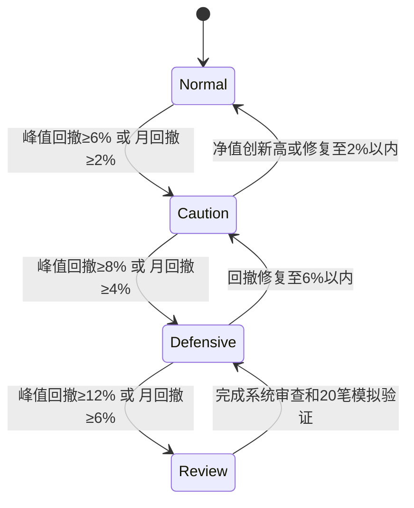

# 投资体系 V5.0：生存—杠铃—八层决策—风险预算统一版

> **版本**：V5.0  
> **整合来源**：反脆弱版 V4.0、3M 系统、海龟系统 V2.0、金融怪杰版 V1.0、系统型投资体系 V2.0、资产配置体系、漫步华尔街体系、思考快与慢版 V3.0  
> **账户基础**：100 万元本金（示例模型，实际按净资产比例执行）  
> **长期目标**：以 5 年为阶段，建立可持续参与市场、避免致命损失、稳定提高决策质量的职业投资系统  
> **核心约束**：不使用借贷资金；不以单次暴利证明能力；不让一次错误退出市场

---

# 一、投资者定位与哲学

## 1.1 投资者定位

我不是纯价值投资者、纯题材交易者或纯量化交易者，而是：

```text
AI 增强型 + 产业驱动型 + 趋势确认型 + 风险预算型 + 认知控制型 + 复盘迭代型职业投资者
```

**核心优势**：软件架构思维（模块化、状态机、版本迭代）；产业与政策研究能力；小资金容量优势；无排名与赎回压力，可以等待。

**主要短板**：易被热点刺激；交易纪律样本不足；创新药与事件定价能力仍在建设；连续亏损后的心理承受力未量化。

## 1.2 目标函数

```text
长期结果 ≈ 生存时间 × 正期望机会数量 × 执行一致性 × 复利
```

**第一目标**：控制毁灭风险，保证五年学习期不断档。  
**第二目标**：把主观洞察转化为可重复规则，逐步提高正期望。

不设"每月必须赚多少"的刚性目标。年度考核四项：规则执行率、最大回撤、策略期望值、年度收益率。

## 1.3 体系总纲

原有框架：

> 产业逻辑定方向，基本面定质量，事件催化定时点，板块共振定强弱，价格行为定确认，风险预算定仓位，退出规则定盈亏。

V5.0 完整总纲：

> **生存定边界，脆弱性定回避，凸性定赔率，基准概率定起点，三重滤网定确认，ATR 风险定仓位，概率更新定持有，证伪定退出，复盘定进化。**

完整决策链：

```text
生存闸门（系统0）
→ 宏观与流动性
→ 产业与周期
→ 企业质量与脆弱性审计
→ 催化与因果链 / 概率树
→ 四情景估值
→ 凸性与赔率评分
→ 杠铃账户分配
→ 三重滤网 + 突破确认
→ 风险预算建仓
→ 新证据更新 / 盈利加仓
→ 组合压力测试
→ 复盘与规则迭代
```

## 1.4 八条底层信念

1. 市场不可被稳定预测，但可以被条件化响应；
2. 研究的作用是提高候选质量，不是取消止损；
3. 胜率不是唯一目标，期望值和资金曲线更重要；
4. 小亏损是经营成本，大亏损是系统故障；
5. 只给市场已经验证的方向增加资本；
6. 一次大赚不能证明系统有效，连续样本才能；
7. 直觉可以发现机会，但不能独自决定大额仓位；
8. 资本安全、决策质量和长期复利优先于短期排名。

## 1.5 不可违反的生存规则

1. 不使用消费贷、经营贷或其他刚性负债资金投资；
2. 不使用可能触发强制平仓的融资杠杆；
3. 不满仓押注单一公司、单一行业或单一地缘事件；
4. 不持有大到无法在合理流动性下退出的仓位；
5. 不让一次临床、订单、政策或财报决定账户命运；
6. 不把短期事件仓转化为无期限死扛仓；
7. 不因连续盈利提高到可能致命的仓位；
8. 证券账户外至少保留 12—24 个月家庭必要支出，不计入投资组合。

---

# 二、账户结构（统一版）

## 2.1 杠铃四账户

以 V4.0 杠铃结构为权威框架，与漫步华尔街四账户比例对齐，100 万元示例如下：

| 账户层 | 默认比例 | 允许区间 | 作用 | 允许资产/策略 |
|---|---:|---:|---|---|
| **生存与机会池** | 50% | 40%—60% | 流动性、回撤缓冲、等待恐慌机会 | 现金、货币工具、中短久期国债、高流动性低波动资产 |
| **核心复利账户** | 30% | 25%—40% | 高质量、现金流和估值有安全边际的企业 | 宽基/行业 ETF、产业地位清晰、财务稳健的公司 |
| **产业期权账户** | 15% | 10%—20% | 创新药、技术突破、产业重估等高上行机会 | 下行可控、里程碑清晰的高不确定资产 |
| **实验与事件账户** | 5% | 0%—10% | 验证新策略、事件驱动和短周期机会 | 小仓、短验证、严格退出 |

> **统一说明**：原三账户体系（核心 50—60% / 产业 25—35% / 事件 10—15%）映射为本结构——"核心复利"对应核心账户，"产业趋势"对应产业期权账户，"事件交易"对应实验与事件账户；现金不再单独成户，而是归入生存与机会池（50%），体现反脆弱杠铃思想。

## 2.2 账户隔离原则

- 事件账户亏损不得侵蚀核心账户逻辑；
- 不因短线行情好而挪用核心账户资金追热点；
- 事件账户达到年度亏损上限后暂停；
- 核心账户不因单日波动频繁交易；
- 事件仓若要转长线仓：先按原规则退出 → 冷静期 → 重新完成价值研究 → 重新定义仓位 → 重新建仓；
- 现金不是踏空，而是等待更高赔率的选择权。

## 2.3 动态调整

- 市场估值极低、风险溢价高时，可从生存池分批转入核心和产业账户；
- 市场普遍高估、情绪拥挤时，提高生存池；
- 任何转移必须由估值和风险收益改变触发，不由"怕踏空"触发；
- 生存池最低不得因短期兴奋被清空；
- 战术偏离战略权重不超过 ±5 个百分点。

## 2.4 系统建立初期建议

| 部分 | 金额示例 | 作用 |
|---|---:|---|
| 核心与低风险底仓 | 45 万 | 保持长期配置和账户稳定 |
| 产业趋势可用资金 | 25 万 | 分批验证中期趋势系统 |
| 事件交易可用资金 | 10 万 | 高波动交易训练 |
| 现金与机会储备 | 20 万 | 回撤缓冲、未来信号、生活安全垫 |

只有当交易日志证明系统具有稳定正期望后，才逐步提高主动交易资金比例。

## 2.5 基准体系

- **组合总基准**：沪深 300 或中证 A500（至少三年不随意更换）；
- **分账户基准**：核心指数账户对宽基全收益；创新药对医药指数；AI/半导体对科技指数；油气对能源指数；
- **能力验证**：主动超额 = 主动账户收益 − 对应基准收益；若主动仓赚 20% 但行业指数涨 30%，不算成功选股。

---

# 三、八层决策系统

## 第 0 层：生存闸门（系统 0）

任一问题回答"是"，原则上放弃或将仓位降至实验级：

- 是否存在强制平仓或刚性偿债风险；
- 是否可能因停牌、跌停、流动性而无法退出；
- 是否依赖一次融资或一次订单续命；
- 是否存在重大造假、治理、质押或关联交易风险；
- 是否会因单一失败造成账户超过可承受损失；
- 新仓超过总资产 2% 且未启动系统 2 书面流程；
- 计划最大仓位超过 5% 且未隔夜复核；
- 处于强烈兴奋、恐惧、回本冲动或报复性交易状态。

## 第 1 层：宏观与流动性

观察：国内信用和流动性；无风险利率和风险偏好；人民币、商品、海外利率；政策与监管方向；市场成交和风险溢价；上涨/下跌家数；风格切换。

**市场环境分级**（决定总仓位，不替代个股判断）：

| 等级 | 状态 | 总仓位建议 |
|---|---|---:|
| A | 指数、成交、主线共振 | 70%—90% |
| B | 结构性行情 | 40%—70% |
| C | 震荡轮动 | 20%—50% |
| D | 系统性下跌 | 0%—30% |

目的不是准确预测指数，而是识别组合共同因子和尾部风险。

## 第 2 层：产业与周期

回答：需求是结构性还是周期性；行业处于导入、成长、成熟、过剩还是出清；供给是否容易扩张；价值链利润向哪里迁移；政策是否改变支付、准入或资本开支；行业冲击会淘汰弱者还是损害所有参与者。

使用 [[行业选择标准]] 中的产业评分（30 分制），低于 18 分不主动重仓。

## 第 3 层：公司质量与脆弱性审计

### 质量（六道门，前一道不通过不进入下一步）

1. **理解门**：商业模式能否清楚解释；
2. **生存门**：现金、债务、融资和尾部风险；
3. **质量门**：竞争力、治理、资本配置；
4. **现金门**：利润是否转化为现金；
5. **价值门**：当前价格是否有安全边际；
6. **催化门**：价值如何在可接受时间内兑现。

### 脆弱性审计清单

- 净负债和短债；
- 经营现金流与利润背离；
- 客户、供应商、产品和地域集中；
- 应收、库存、商誉和担保；
- 再融资依赖；
- 固定成本和产能利用率；
- 重大诉讼、合规和治理问题。

使用 [[行业选择标准]] 中的公司评分（25 分制）。

## 第 4 层：催化与因果链

每个催化必须拆成：

```text
事件
→ 需要满足的条件
→ 对收入/利润/现金流的影响
→ 影响时点
→ 市场已计价程度
→ 证伪指标
```

信息优先级：监管/公司公告 > 经营数据 > 产业链交叉验证 > 管理层表述 > 券商研报 > 市场传闻。

低层级信息不能推翻高层级事实。重大事实至少双来源核验。

## 第 5 层：四情景估值

必须建立：压力情景、保守情景、基准情景、乐观情景。

```text
概率加权价值 = Σ（情景价值 × 概率）
```

| 企业类型 | 主模型 |
|---|---|
| 稳定现金流 | DCF、DDM、正常化 PE |
| 周期资源 | 中枢利润、NAV、PB |
| 创新药 | 净现金 + 已上市产品 rNPV + 管线 rNPV − 现金消耗 − 稀释 |
| 事件交易 | 事件树、价格空间、时间窗口 |

周期股采用正常化利润和中周期价格，不使用景气顶点利润直接估值。

估值前隐藏当前股价，不看券商目标价和买入成本。

## 第 6 层：凸性与赔率评分

使用 [[行业选择标准]] 中的凸性评分（80 分制）：

- **80 分以上**：可进入正式候选；
- **65—79 分**：小仓观察；
- **50—64 分**：只做研究，不交易；
- **50 分以下**：放弃。

## 第 7 层：执行与退出

- 盘前完成计划，盘中只执行；
- 分批建仓，不在情绪高潮完成全部仓位；
- 事件仓与基本面仓分开记录；
- 大额决策离开分时图重新检查；
- 不在流动性最差时扩大仓位。

**退出优先级**：生存风险 → 逻辑证伪 → 催化失败/延迟 → 估值透支 → 组合相关性超限 → 更高赔率替代 → 时间成本超限。

---

# 四、信号与交易系统（三重滤网 + 突破系统）

## 4.1 四级确认原则

```text
一级：产业方向成立
二级：公司质量通过
三级：催化与板块共振
四级：价格触发
```

只有四级条件同时满足，才允许标准仓位入场。若只有价格突破而前三层不足，只能观察或极小仓测试。

## 4.2 三重滤网

### 第一滤网：周线/市场方向

允许主动做多的条件至少满足三项：

- 指数位于 20 周均线之上或周线趋势改善；
- 目标板块相对强度进入前 20%；
- 周线 MACD 柱改善；
- 板块成交额持续放大；
- 核心催化不是一次性小作文。

### 第二滤网：日线机会

优先选择三类结构：

1. **上升趋势回调**：回到 10/20 日均线附近，缩量，未破前低；
2. **平台突破**：放量突破，次日不高开低走；
3. **事件后的二次确认**：第一波情绪释放后形成平台，再突破。

禁止：连续加速后远离均线追入；板块退潮中的个股独涨；重大利好高开低走后盲目抄底。

### 第三滤网：执行

盘中只看：触发价是否达到；板块是否同步；均价线和开盘区间是否有承接；是否出现超出计划的跳空；实际风险收益比是否仍 ≥ 2:1。

未经盘前计划的股票，盘中不得直接重仓买入。

## 4.3 海龟突破系统（S1-A / S2-A）

### 基础定义

```text
N = ATR(20)
初始止损距离 = max(2N, 最近有效结构低点距离)
```

### 快速系统 S1-A（产业期权账户、实验与事件账户）

入场条件（全部满足）：

1. 有效突破过去 20 日最高价；
2. 当日成交额 ≥ 过去 20 日成交额中位数，或有明确换手承接；
3. 板块相对强度改善，非单股孤立脉冲；
4. 催化有一手资料或高可信来源；
5. 指数环境未处于全面流动性崩溃；
6. 入场后 2ATR 止损对应的账户损失在预算内。

**系统 1 过滤**（A 股改造，非机械照搬）：

- 上次突破盈利且离 55 日新高较远：降低首仓 50%；
- 上次突破失败：新突破仍可执行；
- 连续三次同标的假突破：移出可交易池 20 个交易日；
- 重大新公告出现时，重新初始化信号判断。

### 慢速系统 S2-A（核心复利账户）

入场条件：

1. 突破过去 55 日最高价；
2. 20 日均线高于或正在上穿 60 日均线；
3. 基本面与产业趋势至少在未来一个季度内不恶化；
4. 相对行业指数处于强势；
5. 估值未完全透支乐观情景；
6. 流动性充足。

### 预埋仓规则

- 仅限 A 级研究标的；
- 仓位不超过计划标准仓的 25%；
- 风险不超过账户 0.15%；
- 价格未突破前不得连续补仓；
- 突破后才升级为标准首仓；
- 逻辑证伪立即退出。

## 4.4 股票池三级结构

| 级别 | 定义 | 动作 |
|---|---|---|
| A 级 | 可交易池：逻辑清晰、无重大风险、流动性足够、催化明确、止损可定义 | 标准仓位 |
| B 级 | 研究池：逻辑可能成立但催化/估值/趋势/板块待验证 | 观察或预埋 |
| C 级 | 观察池：只有概念或传闻，缺乏可核验事实 | 禁止交易 |

## 4.5 下单决策树

```text
是否在能力圈？
├─ 否 → 放弃
└─ 是
   是否通过生存闸门与一票否决？
   ├─ 否 → 放弃
   └─ 是
      产业/公司/交易结构评分是否达标？
      ├─ 否 → 观察
      └─ 是
         三重滤网 + 突破是否确认？
         ├─ 否 → 等待或预埋
         └─ 是
            风险收益比是否 ≥ 2:1？
            ├─ 否 → 放弃或等更好价格
            └─ 是
               组合风险是否未超限？
               ├─ 否 → 减仓或放弃
               └─ 是 → 按公式下单并记录
```

---

# 五、仓位与风险管理（统一公式）

## 5.1 统一仓位上限

> **统一决策**：以 V4.0 生存优先原则为基准，采纳 3M/海龟的风险预算法计算股数，单票上限取保守值。

| 类型 | 初始仓位 | 验证后上限 | 典型条件 |
|---|---:|---:|---|
| 核心复利 | 3%—5% | **10%** | 现金流、竞争优势、估值和治理均通过 |
| 产业趋势 | 2%—3% | **8%** | 产业验证、订单/收入和价格结构持续增强 |
| 创新药期权 | 1%—2% | **6%** | 现金跑道、临床里程碑、商业化和估值匹配 |
| 事件驱动 | 0.5%—1.5% | **4%** | 事件未完全计价、板块共振、退出条件明确 |
| 实验策略 | 0.25%—0.5% | **1%** | 用于购买信息，不追求单笔利润最大化 |

> 因上涨导致超过上限时，在再平衡窗口减持，不得主动买到上限。核心仓极限不因"高度确信"突破 10%；创新药不因连续涨停追到 6% 以上。

## 5.2 风险预算公式（统一）

```text
风险预算 R = 账户权益 × 风险比例
每股风险 = 入场价 − 初始止损价 + 跳空/滑点缓冲
股数 = floor(R ÷ 每股风险 ÷ 100) × 100
```

## 5.3 单笔风险率表

| 交易类型 | 正常单笔风险 | 回撤期风险 | 说明 |
|---|---:|---:|---|
| 核心趋势 | 0.4%—0.6% | 0.2%—0.3% | 流动性强、基本面较稳 |
| 产业趋势 | 0.3%—0.5% | 0.15%—0.25% | 中期景气和板块趋势 |
| 事件交易 | 0.2%—0.35% | 0.1%—0.18% | 跳空、涨跌停和情绪风险高 |
| 预埋验证 | 0.1%—0.15% | 暂停 | 未获价格确认 |

**绝对上限**：任何单笔计划亏损不超过账户 1%。

### 跳空风险折扣

```text
实际风险率 = 标准风险率 × 跳空折扣
```

| 场景 | 折扣 |
|---|---:|
| 一般公告窗口 | 0.7 |
| 临床关键数据前 | 0.4—0.6 |
| 极端地缘事件股 | 0.5—0.7 |
| 财务或监管不确定性高 | 不交易 |

## 5.4 三段式建仓

| 阶段 | 比例 | 触发条件 |
|---|---:|---|
| 首仓 | 30% | 价值或事件进入可参与区，仍有重要未知 |
| 确认仓 | 30% | 关键事实验证 |
| 趋势仓 | 40% | 基本面和价格共振，且赔率仍在 |

禁止在亏损扩大时机械完成后两段建仓。

## 5.5 盈利加仓系统（海龟三档）

| 档位 | 触发 | 目标风险 |
|---|---|---:|
| 首仓 | 20 日或 55 日突破 | 40% 的计划总风险 |
| 第 2 仓 | 比首仓价上涨 0.5N—0.75N | 增加 30% |
| 第 3 仓 | 再上涨 0.75N—1N，且板块继续确认 | 增加 30% |

**加仓许可**（必须满足至少一类新证据）：

- 基本面：收入、利润、现金流、订单或竞争位置改善；
- 里程碑：临床、审批、签约、交割、产能和客户验证完成；
- 估值：价格下跌但价值未恶化，安全边际扩大；
- 市场结构：板块扩散、成交承接、突破确认；
- 风险下降：融资完成、负债下降、现金跑道延长。

**禁止加仓**：板块由强转弱；放量滞涨；指数系统性风险；账户处于回撤降档；价格已偏离 20 日均线过大。

## 5.6 组合限制

| 风险项 | 上限 |
|---|---:|
| 全部开放风险合计（账户热度） | 正常 ≤ 3%；高风险市场 ≤ 1.5%；强趋势最高 ≤ 4% |
| 单一行业总仓位 | 25% |
| 单一事件因子总仓位 | 15% |
| 高波动创新药总仓位 | 20% |
| 单股事件股 | 4% |
| 单股核心股 | 10% |

### 风险簇上限

| 风险簇 | 最大市值暴露 | 最大止损风险 |
|---|---:|---:|
| 创新药 | 25% | 1.2% |
| AI 算力 | 25% | 1.2% |
| 半导体 | 20% | 1.0% |
| 能源资源 | 20% | 1.0% |
| 商业航天等高波动主题 | 15% | 0.8% |
| 单一事件链 | 15% | 0.7% |

市值暴露与止损风险必须同时满足，取更严格者。

## 5.7 压力损失法

```text
单股压力损失 = 仓位 × 压力情景跌幅
```

- 单股对组合的压力损失原则上不超过 2%；
- 高相关行业合计压力损失不超过 6%；
- 无法估计下行时，仓位自动降到试错级别。

---

# 六、回撤状态机（统一阈值）

> **统一决策**：合并 V4.0 峰值回撤（5/8/12%）、3M 月度回撤（2/4/6/8/12%）和海龟状态机（6/10/12%），采用**双轨监控 + 四状态机**。

## 6.1 双轨监控

### 轨道 A：峰值回撤（从账户净值历史高点）

| 阈值 | 状态 | 动作 |
|---:|---|---|
| **5%** | 预警 | 停止增加事件风险；检查持仓相关性 |
| **6%** | 警戒（Caution） | 单笔风险减半；暂停预埋和低质量交易；只做 A 级信号 |
| **8%** | 防御（Defensive） | 降低高波动和低流动性仓位；总仓位降至 50% 以下；重新执行压力测试 |
| **10%** | 深度防御 | 暂停新增事件仓；账户热度降至 1%；只保留核心仓和极小验证仓 |
| **12%** | 审查（Review） | 停止主动实盘；全面审计策略和执行；至少 20 笔模拟验证后恢复 |

### 轨道 B：月度回撤（从月初净值）

| 阈值 | 动作 |
|---:|---|
| **−2%** | 新开仓风险减半 |
| **−4%** | 停止事件交易 |
| **−6%** | 停止主动开仓，完成审计 |
| **−8%** | 总仓位降至 30% 以下 |

**取更严格者执行**：峰值与月度任一触发更高档位，即按更高档位行动。

## 6.2 状态机



### 状态定义

| 状态 | 允许操作 |
|---|---|
| **Normal** | 按标准风险执行；三账户正常运行 |
| **Caution** | 风险减半；只做 A 级；暂停预埋 |
| **Defensive** | 暂停事件仓；降总暴露；只做核心和极小验证 |
| **Review** | 停止主动实盘；系统失效审查；模拟验证后逐级恢复 |

**重要原则**：任何回撤阈值都不自动触发无差别清仓，而触发风险降级流程。恢复必须逐级恢复，不能因一笔盈利立即回到满风险状态。

## 6.3 连续亏损规则

- 连续 2 笔 −1R：下一笔风险减半；
- 连续 3 笔亏损：暂停两天，复盘市场状态与执行；
- 连续 5 笔亏损：暂停该策略，至少复核 30 笔历史样本。

---

# 七、退出与止损系统

## 7.1 四类止损（买入前同时定义）

```text
价格止损：2ATR 或结构失效位
逻辑止损：核心假设被事实证伪
组合止损：账户或板块风险超限
时间止损：催化窗口结束且价格无反应
```

任一强制条件满足，应减仓或退出。

## 7.2 趋势退出

| 系统 | 退出规则 |
|---|---|
| 快速系统 S1-A | 跌破过去 10 日最低价 |
| 慢速系统 S2-A | 跌破过去 20 日最低价 |

## 7.3 分层退出

| 条件 | 动作 |
|---|---|
| 跌破 5 日短线结构且板块转弱 | 减少 1/3 加仓部分 |
| 跌破 10 日低点 | 快速系统退出剩余交易仓 |
| 跌破 20 日低点 | 慢速系统退出 |
| 硬逻辑证伪 | 不等通道，直接执行风险退出 |
| 涨停高潮后巨量长阴 | 先降事件仓，再等待正式信号 |

## 7.4 分批止盈

- 达到 +2R，可兑现 1/3 并把保护位上移；
- 达到估值目标区，分批减仓；
- 重大利好后连续加速，不再加仓；
- 高开低走、放量滞涨、板块退潮时降低交易仓。

## 7.5 移动止损（选定后不临时切换）

- 前一波段低点；
- 10 日/20 日均线；
- ATR 或波动率止损；
- 事件后平台下沿；
- 时间止损。

## 7.6 卖出后重新入场

满足以下条件可重新买入：新的 20 日或 55 日突破；板块重新共振；失败原因已消失；新的止损和风险预算可计算；不因"刚卖掉"产生心理抵触。

## 7.7 退出优先级

1. 生存风险出现；
2. 核心逻辑证伪；
3. 催化失败或显著延迟；
4. 估值透支乐观情景；
5. 组合相关性和风险预算超限；
6. 出现赔率更高的替代机会；
7. 时间成本超过预设期限。

---

# 八、心理操作规程

## 8.1 三层认知架构

| 层级 | 角色 | 权限 |
|---|---|---|
| **系统 1** | 机会雷达：快速发现政策、公告、板块、价格异常 | 只能输出候选，不能直接批准大额资本 |
| **系统 2** | 资本配置委员会：核验事实、概率树、估值、仓位 | 所有正式交易决策 |
| **系统 0** | 决策闸门：强制启动系统 2 | 高风险环境撤销系统 1 的最终决策权 |

## 8.2 禁止交易状态

出现任一项，当天不主动开新仓：

- 睡眠不足；
- 与工作/家庭冲突后情绪激动；
- 上一笔大亏，强烈想回本；
- 上一笔大赚，想扩大仓位；
- 害怕错过评分 ≥ 4/5；
- 没有完成盘前计划；
- 连续两笔交易违反规则；
- 无法在一分钟内说清交易逻辑；
- 没有写止损和退出条件。

## 8.3 冷却规则

- **30 分钟规则**：临时发现的热点，写下信息来源、催化、失效条件、止损、仓位，等待至少 30 分钟；
- **72 小时规则**：重大公告后计划建立超过 5% 仓位；三日内累计大涨；新闻高度情绪化；出现"必须马上买"的感觉——可以小仓试错，不能一次完成大仓位；
- **24 小时规则**：重大亏损或重大盈利后，24 小时内不增加高风险仓位。

## 8.4 认知偏差防护

- 估值前隐藏当前股价，不看目标价和成本；
- 持仓后每周重置参考点："从今天开始，以当前事实和当前价格重新决定是否持有"；
- 禁止锚：历史高点、买入成本、前期涨幅、市场流传目标价、"总交易金额"上限；
- 交易软件优先显示仓位和风险，而非盈亏百分比；
- 每周固定阅读反方材料。

## 8.5 自动降仓规则

出现以下任一情况，未来三笔交易风险减半：

- 连续三笔违规交易；
- 单月最大回撤超过预警值；
- 一周内两次计划外追涨；
- 亏损后立即加大仓位；
- 无备忘录交易造成明显损失；
- 因持仓影响正常睡眠或工作。

---

# 九、组合风险控制

## 9.1 组合相关性

每周检查持仓是否共同依赖：同一政策、同一商品价格、同一流动性环境、同一风险偏好、同一海外市场、同一估值扩张、同一事件叙事。

## 9.2 压力测试

至少模拟六种情景：

1. 沪深主要指数一周下跌 10%；
2. 小盘成长风格快速切换至大盘价值；
3. 人民币显著波动；
4. 油价一周反转 20%；
5. 创新药核心临床失败；
6. 海外项目延迟一年且回款变慢。

输出：组合损失、流动性、相关性上升和是否需要被动卖出。

## 9.3 再平衡制度

- 每月末记录权重；每季度执行正式再平衡；
- 触发条件：绝对偏离超过 5 个百分点，或相对目标偏离超过 25%；
- 执行顺序：新增现金补低配 → 分红/利息补低配 → 停止向高配追加 → 必要时卖出高配 → 基本面恶化直接按证伪规则处理。

## 9.4 能力圈

**重点方向**：创新药与医药产业升级；AI 算力、半导体和自主可控；商业航天等国家战略产业；石油、煤炭、黄金等事件与周期资源。

**排除条件**：见 [[行业选择标准]] 一票否决清单。

---

# 十、创新药/事件交易专用规则

## 10.1 创新药（迪哲医药式产业期权）

**适用**：创新药、技术突破、授权和产业价值重估。账户：产业期权账户。

**入池前必须完成**：靶点和适应症；临床阶段和主要终点；竞争格局；审批路径；已上市产品销售趋势；现金储备与季度消耗；未来融资稀释；BD 条款；市值隐含乐观程度；关键失败事件。

**规则**：

- 用 SOTP，不用单一市销率讲完整故事；
- 现金跑道必须覆盖下一关键里程碑并留缓冲；
- 初始 1%—2%，验证后最高 6%；
- 最高里程碑按风险概率折现，不按名义总额；
- 大涨后重新计算隐含成功率；
- 单一管线失败不能伤害整个账户；
- 二元结果公布前不满仓押注；
- 临床关键数据前风险率 × 0.4—0.6 折扣。

**跟踪变量**（5—8 个）：产品销售；医保和全球商业化；许可交易交割；临床里程碑；研发现金消耗；竞争产品；稀释；当前市值隐含概率。

## 10.2 事件交易（通源石油式）

**适用**：战争、油价、政策、突发订单和板块轮动。账户：实验与事件账户。

**硬催化优先级**：

1. 交易所公告、监管批文、正式合同；
2. 公司法定披露、临床正式数据、业绩报告；
3. 部委正式政策文件；
4. 权威媒体确认的信息；
5. 行业渠道信息；
6. 社交媒体传闻和小作文。

第 5—6 级不能单独触发标准仓位。

**事件模型**：

```text
事件真实性 × 业绩影响 × 市场预期差 × 板块扩散强度 × 价格确认 ÷ 跳空和兑现风险
```

**规则**：

- 只在事件账户中操作；
- 初始 0.5%—1.5%，最高 4%；
- 不抢无法验证的第一秒；
- 同时验证商品价格、板块扩散、成交承接和公司相关性；
- 事件逻辑与公司盈利传导分开；
- 停火、油价反转、板块退潮或高开低走是收缩信号；
- 不把中标或新闻标题直接当作当期利润；
- 不把短线盈利强化为长期重仓信念；
- 第一次止损后，新突破出现仍允许重入。

**跟踪变量**：原油价格持续性；钻机/压裂活动；客户资本开支；合同签署和执行；工作量和服务价格；毛利和经营现金流；回款；板块事件状态。

---

# 十一、AI 与量化工具定位

## 11.1 AI 负责

- 政策与公告摘要；
- 财报差异分析；
- 创新药管线与竞争格局；
- 产业链映射；
- 交易复盘归因；
- 生成风险清单和候选清单；
- 检查交易计划是否缺项。

**AI 不替我承担决策责任。**

## 11.2 量化负责

- 板块强度排名；
- 成交量、涨停数和市场宽度；
- ATR、20/55 日通道和突破候选；
- 风险预算和仓位计算；
- 账户热度监控；
- 回测与资金曲线统计；
- 触发风险预警。

**量化负责筛选和统计，告警而非自动重仓。**

## 11.3 人必须负责

- 确定能力圈；
- 判断产业逻辑和商业价值；
- 识别不可量化的治理风险；
- 决定系统是否适合当前市场；
- 处理无法量化的重大变化；
- 对最终结果负责。

**不与量化竞争**：毫秒级速度、高频订单流、盘口微小价差、大规模因子计算、日内反应速度。

---

# 十二、每日/每周/每月工作流

## 12.1 每日

### 盘前

1. 查看指数、外围市场、商品、汇率与重要公告；
2. 判断市场 A/B/C/D 状态；
3. 更新板块强度和 20/55 日突破候选；
4. 计算 ATR、止损和加仓价；
5. 只保留 3—5 只重点候选；
6. 写入场、止损、目标、股数和不交易条件；
7. 检查已有仓位的保护位和账户热度。

### 盘中

1. 只执行计划内交易；
2. 观察板块与个股是否共振；
3. 不因拉升临时提高买入价；
4. 不因亏损临时扩大止损；
5. 硬公告出现时先核验原文；
6. 新热点先进入观察，不直接重仓。

### 盘后

1. 保存日线、分时和板块截图；
2. 记录计划与实际差异，计算盈亏 R；
3. 标记是否违规；
4. 更新止损和退出线；
5. 更新产业与公告数据库；
6. 给明日持仓制定明确方案；
7. 不在情绪高峰立即修改系统。

## 12.2 每周

- 市场主线及阶段；
- 各策略盈亏 R 和系统外交易检查；
- 最大错误和最佳执行；
- FOMO、扛亏、过早止盈检查；
- 重评全部持仓，隐藏成本后重新排序；
- 检查相关性和风险簇；
- 更新概率和估值；
- 选择一个最强反方观点；
- 下周总仓位和风险预算；
- 选一笔交易做完整复盘。

## 12.3 每月

**核心指标**：

```text
总收益率 / 最大回撤 / 胜率 / 平均盈利R / 平均亏损R
期望值 / 利润因子 / 规则执行率 / 违规损失占比 / 各策略贡献
```

**收益分解**：

```text
总收益 = 市场贝塔 + 行业选择 + 个股选择 + 事件收益 + 仓位贡献 + 择时贡献 − 交易成本 − 违规损失
```

- 当盈利但规则执行率低于 80% 时，仍视为不合格月份；
- 对比各账户与基准；
- 判断是否触发再平衡；
- 输出《月度系统健康报告》。

## 12.4 每季度

- 正式再平衡；
- 审查主动仓和能力验证；
- 压力测试（权益 −30%、高波动个股 −50% 等）；
- 删除无效指标，更新错误模式库；
- 概率预测校准（20%/50%/80% 事件实际发生率）；
- 只允许一次正式版本升级。

---

# 十三、禁止事项

```text
1.  不借钱炒股，不用消费贷、经营贷或信用贷增加股票风险。
2.  不因一次大赚提高单笔风险上限。
3.  不满仓单一事件股。
4.  不给亏损仓无条件补仓。
5.  不在没有止损计划时买入。
6.  不把小作文作为唯一依据。
7.  不在连续亏损后报复性交易。
8.  不把同板块多票误认为分散。
9.  不为了回本拒绝卖出。
10. 不频繁优化参数迎合近期行情。
11. 不和高频量化竞争毫秒级优势。
12. 不移动止损来避免认错。
13. 不用"国家支持、行业空间大"替代公司分析。
14. 不在临床、政策、战争等二元事件前满仓赌博。
15. 不在板块退潮时用长期逻辑对抗流动性。
16. 不把事件仓亏损后自动转核心仓。
17. 不未写证伪条件就买入。
18. 不因连续上涨临时提高总权益上限。
19. 不把小作文、意向、中标和潜在总额直接当作利润。
20. 不因工作厌倦把职业投资当作逃避现实的捷径。
```

---

# 十四、版本迭代规则

## 14.1 升级原则

```text
记录错误 → 分类原因 → 判断偶发还是结构性 → 设计最小规则修改 → 小规模测试 → 验证后正式纳入
```

- 每季度只允许一次正式版本升级；
- 参数调整必须有至少 50 笔样本或明确制度变化支持；
- 所有修改保留旧版本和修改原因；
- 不允许因单笔盈亏临时改系统；
- 避免因一笔亏损大改系统，也避免因一笔暴赚放宽风险。

## 14.2 复盘评分（过程质量）

| 维度 | 分值 |
|---|---:|
| 生存规则合规 | 20 |
| 脆弱性识别 | 15 |
| 事实与因果链 | 15 |
| 估值与赔率 | 15 |
| 仓位和组合风险 | 15 |
| 执行纪律 | 10 |
| 更新与退出 | 5 |
| 复盘完整性 | 5 |

单笔盈亏不直接决定过程评分。

## 14.3 系统达标标准（50 笔样本前为工程指标）

- 系统内交易占比 ≥ 90%；
- 平均亏损不差于 −1.1R；
- Profit Factor > 1.3；
- 最大回撤处于预设区间；
- 不依赖单一股票贡献全部利润；
- 去掉最赚钱的 3 笔后，系统仍可解释并可生存。

## 14.4 V5.0 变更摘要

| 冲突项 | 各版本 | V5.0 统一决策 |
|---|---|---|
| 账户结构 | V4.0 四账户 50/30/15/5；海龟三账户 50-60/25-35/10-15 | **杠铃四账户 50/30/15/5**，现金归入生存池 |
| 核心仓上限 | V4.0 8-10%；3M 15%；海龟 15-20% | **核心 10%、产业 8%、创新药 6%、事件 4%**，生存优先 |
| 回撤阈值 | V4.0 5/8/12%；3M 2/4/6/8/12%；海龟 6/10/12% | **双轨监控 + 四状态机**：峰值 5/6/8/10/12%，月度 2/4/6/8% |
| 建仓方法 | V4.0 试仓；海龟 ATR 三档；3M 风险公式 | **风险预算公式 + 三段建仓 + 海龟盈利三档** |
| 信号系统 | 3M 三重滤网；海龟 20/55 突破 | **三重滤网 + S1-A/S2-A 突破系统** |
| 评分体系 | 3M 四层评分；V4.0 凸性 80 分；金融怪杰 100 分 | 统一见 [[行业选择标准]] |

---

# 十五、体系压缩句

> **以生存为底线，以产业和基本面寻找方向，以脆弱性审计排除致命风险，以四情景估值和凸性评分判断价格，以杠铃四账户配置资本，以三重滤网和突破确认择时，以风险预算表达仓位，以小仓试错购买信息，以新证据和盈利方向扩大，以证伪规则截断错误，以回撤状态机保护本金，以复盘让系统比过去更强，最终让波动成为筛选和复利的燃料。**

---

# 十六、投资宣言

1. 我不需要预测所有未来，只需要避免被错误预测淘汰；
2. 我接受小亏，把它视为信息成本；
3. 我拒绝可能导致永久损失的杠杆和集中；
4. 我保留现金、时间和注意力冗余；
5. 我只在下行可控、上行开放时承担高不确定性；
6. 我用试仓而不是重仓表达初始观点；
7. 我只因新证据加仓；
8. 我不把好公司与好价格混为一谈；
9. 我不把新闻、意向、中标和潜在总额直接当作利润；
10. 直觉可以发现机会，但不能独自决定大额仓位；
11. 我以长期几何复利和持续生存评价自己。

---

> **风险提示**：本体系是个人学习与风险管理框架，不构成对任何股票的买卖建议，也不保证收益。评分与阈值均为流程工具，执行一致性优先于参数精确性。
