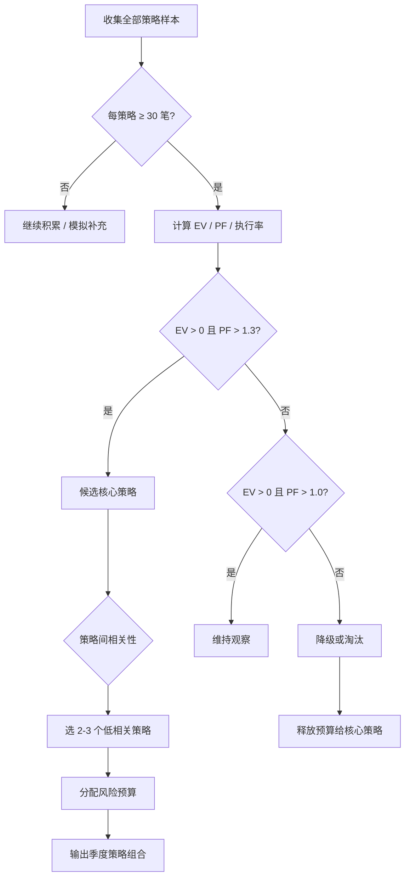

# 策略评估筛选框架

> **目的**：基于实盘数据客观评估各策略，淘汰低期望策略，最终保留 2—3 个最适合自己的核心策略。  
> **原则**：数据驱动、样本优先、季度审查、不因短期波动淘汰有效策略。  
> **关联文档**：[[投资体系_V5.0]] · [[90天实盘训练计划]] · [[季度系统健康报告模板]] · [[复盘卡模板]]

---

## 一、评估对象

### 1.1 策略清单

| 代码 | 策略名称 | 账户 | 核心信号 | 典型持有期 |
|---|---|---|---|---|
| **S1-A** | 20 日突破（快速系统） | 产业/事件 | 20 日新高 + 板块共振 | 2—8 周 |
| **S2-A** | 55 日突破（慢速系统） | 核心/产业 | 55 日新高 + 基本面支撑 | 3—18 月 |
| **STR-A** | 创新药价值重估 | 产业 | 基本面 + 催化 + 趋势确认 | 3—12 月 |
| **STR-B** | 事件驱动第二波 | 事件 | 事件后板块联动 + 二次确认 | 1—4 周 |
| **STR-C** | 核心复利 | 核心 | 高质量 + 估值合理 + 长期持有 | 1—5 年 |

### 1.2 评估前提

- 至少 **30 笔同口径样本** 后才做正式评估（50 笔后结论更可靠）
- 样本必须来自 [[复盘卡模板]] 中"系统内 = 是"的交易
- 系统外交易单独统计，**不计入策略期望值**

---

## 二、策略评估标准

### 2.1 核心指标

| 指标 | 公式 / 定义 | 意义 |
|---|---|---|
| **期望值（EV）** | 胜率 × 平均盈利 R + 败率 × 平均亏损 R | 每笔交易的平均收益 |
| **Profit Factor（PF）** | 总盈利 R ÷ 总亏损 R（绝对值） | 盈亏比综合指标 |
| **胜率** | 盈利笔数 ÷ 总笔数 | 辅助参考，非唯一目标 |
| **平均盈利 R** | 盈利交易 R 均值 | 是否让利润奔跑 |
| **平均亏损 R** | 亏损交易 R 均值 | 止损质量（应 ≤ −1.1R） |
| **最大回撤** | 策略内资金曲线峰值至谷底 | 生存风险 |
| **规则执行率** | 无违规笔数 ÷ 总笔数 | 纪律质量 |
| **系统内占比** | 系统内笔数 ÷ 总笔数 | 整体纪律 |

### 2.2 辅助指标

| 指标 | 定义 | 警示阈值 |
|---|---|---|
| **MFE/MAE 比** | 平均 MFE ÷ 平均 MAE | < 1.0 说明入场时机差 |
| **过早退出率** | 盈利 < 0.5R 就退出的比例 | > 40% 需审查退出规则 |
| **漏信号率** | 应做未做的信号占比 | 记录即可，反映恐惧 |
| **系统外盈利** | 非系统内交易的盈利 R | 最危险的运气收益 |
| **滑点率** | 实际 vs 计划价格偏差 | > 0.5% 需调整执行方式 |
| **风险簇集中度** | 同簇暴露占比 | 检查伪分散 |
| **单一标的贡献** | 最大单笔盈利占总盈利比 | > 50% 说明依赖运气 |

### 2.3 统计方法

```text
1. 从交易日志提取每笔：策略代码、最终 R、MFE、MAE、是否违规
2. 按策略分组计算上述指标
3. 去掉最赚钱 3 笔后重新计算（压力测试）
4. 分市场状态（A/B/C/D）子样本分析
5. 输出策略评估表
```

---

## 三、达标阈值

### 3.1 策略保留阈值（正式评估，≥ 30 笔样本）

| 指标 | 达标 | 警戒 | 淘汰 |
|---|---|---|---|
| **期望值 EV** | > +0.2R/笔 | 0 ~ +0.2R | ≤ 0 |
| **Profit Factor** | > 1.3 | 1.0—1.3 | < 1.0 |
| **平均亏损 R** | ≥ −1.0R | −1.0 ~ −1.1R | < −1.1R |
| **规则执行率** | ≥ 90% | 80%—90% | < 80% |
| **最大回撤** | < 预设区间 | 在区间边缘 | 超出区间 |
| **系统内占比** | ≥ 90% | 85%—90% | < 85% |

### 3.2 整体系统阈值（≥ 50 笔样本）

| 指标 | 阈值 |
|---|---|
| 系统内交易占比 | ≥ 90% |
| 综合 Profit Factor | > 1.3 |
| 峰值回撤 | < 6%（训练期）/ < 12%（常态） |
| 去掉 Top 3 盈利后 PF | > 1.0 |
| 单一标的利润贡献 | < 50% |
| 综合规则执行率 | ≥ 90% |

### 3.3 样本不足时的处理

| 样本量 | 可做什么 | 不可做什么 |
|---|---|---|
| < 10 笔 | 记录、分类、检查执行率 | 评估期望值、修改规则 |
| 10—29 笔 | 初步观察、标记问题 | 正式淘汰策略 |
| 30—49 笔 | 正式评估、降级/暂停 | 精确优化参数 |
| ≥ 50 笔 | 全面评估、提升/淘汰决策 | 频繁修改（季度一次） |

---

## 四、策略提升 / 降级 / 淘汰规则

### 4.1 提升（Upgrade）

**条件**（全部满足）：

- 样本 ≥ 30 笔
- EV > +0.2R 且 PF > 1.3
- 执行率 ≥ 90%
- 最大回撤在预设区间内
- 去掉 Top 3 盈利后 EV 仍 > 0

**动作**：

- 风险预算从 0.3%—0.5% 提升至 **0.5%—0.7%**
- 纳入核心策略组合
- 下一季度重点执行

### 4.2 维持（Maintain）

**条件**：

- EV > 0 且 PF > 1.0
- 执行率 ≥ 85%
- 样本 ≥ 20 笔

**动作**：

- 维持当前风险预算（0.3%—0.5%）
- 继续积累样本
- 下一季度重新评估

### 4.3 降级（Downgrade）

**条件**（满足任一）：

- EV ≤ 0 但样本 < 50 笔（可能是样本不足）
- PF 1.0—1.3 且执行率 < 85%
- 平均亏损 R < −1.1R（止损执行差）
- 连续 5 笔亏损

**动作**：

- 风险预算降至 **0.25%** 或暂停实盘
- 切换至模拟交易继续积累样本
- 审查入场/退出规则是否有漏洞
- 30 笔模拟样本后重新评估

### 4.4 淘汰（Eliminate）

**条件**（满足任一）：

- 样本 ≥ 30 笔且 EV ≤ 0 且 PF < 1.0
- 无法定义清晰、可重复的入场/退出规则
- 连续两个季度评估为"降级"且无改善
- 去掉 Top 3 盈利后 EV < −0.3R
- 系统外交易占比 > 30%（说明规则不可执行）

**动作**：

- 停止实盘，移出策略清单
- 保留历史记录供复盘
- 释放的风险预算分配给其他策略

### 4.5 决策矩阵

| EV | PF | 执行率 | 决策 |
|---|---|---|---|
| > +0.2R | > 1.3 | ≥ 90% | **提升** |
| > 0 | 1.0—1.3 | ≥ 85% | **维持** |
| 0 ~ +0.2R | 1.0—1.3 | 80%—90% | **维持**（观察） |
| ≤ 0 | 1.0—1.3 | ≥ 85% | **降级**（样本不足则维持） |
| ≤ 0 | < 1.0 | 任意 | **淘汰**（样本 ≥ 30） |
| 任意 | 任意 | < 80% | **降级**（先修执行） |

---

## 五、保留 2—3 个核心策略的决策流程

### 5.1 流程图



### 5.2 决策步骤

**Step 1 · 数据收集**

从 `【10】实盘记录/交易日志/` 导出全部 [[复盘卡模板]] 数据，按策略代码分组。

**Step 2 · 逐策略评分**

| 策略 | EV | PF | 执行率 | 最大回撤 | 样本 | 评级 |
|---|---:|---:|---:|---:|---:|---|
| S1-A | | | | | | |
| S2-A | | | | | | |
| STR-A | | | | | | |
| STR-B | | | | | | |
| STR-C | | | | | | |

**Step 3 · 筛选候选**

- 保留 EV > 0 且 PF > 1.0 的全部策略
- 从中选 PF > 1.3 且执行率 ≥ 90% 的作为核心候选

**Step 4 · 相关性检查**

| 检查项 | 方法 |
|---|---|
| 策略间盈亏相关性 | 同期盈亏是否同涨同跌 |
| 风险簇重叠 | 是否集中在同一产业 |
| 市场状态依赖 | 是否只在 A/B 级市场有效 |
| 持有期重叠 | 短中长期是否互补 |

**目标**：选出的 2—3 个策略应在市场状态、产业暴露、持有周期上**低相关**。

**Step 5 · 风险预算分配**

| 策略 | 评级 | 风险预算 | 账户占比上限 |
|---|---|---:|---:|
| 核心策略 1 | 提升 | 0.5%—0.7% | 按 [[投资体系_V5.0]] |
| 核心策略 2 | 提升 | 0.5%—0.7% | |
| 核心策略 3（可选） | 维持/提升 | 0.3%—0.5% | |
| 观察策略 | 维持 | 0.25%—0.3% | |
| 淘汰策略 | 淘汰 | 0% | |

**Step 6 · 输出决策**

写入 [[季度系统健康报告模板]] 的"策略决策摘要"区。

### 5.3 理想组合示例

```text
组合 A（趋势型投资者）：
  核心 1：S2-A 55日突破（产业趋势）
  核心 2：STR-A 创新药重估（能力圈深度）
  观察：STR-B 事件第二波（低预算训练）

组合 B（均衡型）：
  核心 1：STR-C 核心复利（稳定底仓）
  核心 2：S1-A 20日突破（中短期趋势）
  核心 3：STR-A 创新药重估（能力圈 Alpha）
```

> 具体组合取决于 90 天训练数据和个人的执行能力、心理特征。

---

## 六、评估节奏

| 时间 | 动作 | 输出 |
|---|---|---|
| 每月 | 更新各策略累计指标 | [[月报模板]] 策略贡献区 |
| 每季度 | 正式策略评估 | [[季度系统健康报告模板]] |
| 90 天训练结束 | 第一次集中评估 | V5.1 策略组合 |
| 100 笔样本 | 系统整体验收集 | 是否进入规模化阶段 |

---

## 七、评估报告模板

```markdown
# 策略评估报告 · YYYY-QN

## 评估样本
- 评估区间：YYYY-MM-DD ~ YYYY-MM-DD
- 总样本：__ 笔（系统内 __ 笔）
- 评估策略数：__

## 逐策略评估
（填入第二节表格）

## 决策
| 策略 | 决策 | 下季度风险预算 | 理由 |
|---|---|---:|---|

## 下季度核心策略组合
1. __（__%，风险 __%）
2. __（__%，风险 __%）
3. __（__%，风险 __%）

## 淘汰/暂停策略及释放预算
- 

## 待观察问题
1. 
2. 
```

---

## 八、常见误区

| 误区 | 正确做法 |
|---|---|
| 因 3 笔亏损就淘汰策略 | 至少 30 笔样本 |
| 因 1 笔大盈利就提升策略 | 去掉 Top 3 后 EV 仍 > 0 |
| 忽略执行率只看收益 | 执行率 < 80% 先修纪律 |
| 保留无法定义规则的策略 | 无法定义 = 直接淘汰 |
| 每季度大幅调整策略组合 | 每季度最多调整 1 个策略等级 |
| 系统外盈利计入策略 EV | 系统外单独统计，不计入 |

---

**最后更新**：2026-07-27  
**关联**：[[投资体系_V5.0]] · [[90天实盘训练计划]] · [[基金经理日常工作流]] · [[季度系统健康报告模板]]
