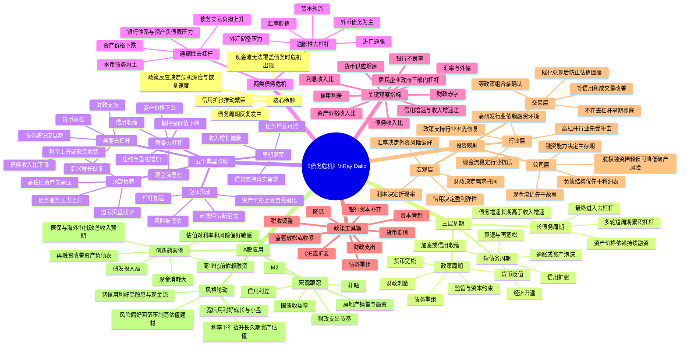

# 《债务危机》思维导图

> 读法定位：本书不是单纯的宏观经济读物，而是一套“债务—信用—资产价格—政策反应—投资应对”的周期识别框架。用于A股时，重点不是预测危机，而是识别信用周期、流动性拐点、风险偏好变化和企业资产负债表压力。



## 一页版逻辑链

债务危机的本质不是“债务多”本身，而是：

**债务增速长期快于收入增速 → 债务服务压力上升 → 资产价格依赖新增融资 → 融资收缩导致资产价格下跌 → 抵押品下降与现金流恶化 → 被迫去杠杆 → 政策介入 → 若政策组合得当，进入美丽去杠杆。**

## 用于A股的简化判断式

```text
市场风险偏好 = 流动性方向 × 信用扩张强度 × 盈利预期变化 × 政策可信度 × 估值位置
```

```text
个股安全边际 = 现金流可持续性 + 融资能力 + 资产负债表弹性 + 估值折价 + 催化确定性
```

## 个人投资者的核心抓手

1. 不预测危机的精确日期，只识别债务周期所处阶段。
2. 不和量化资金拼速度，而是拼周期位置、产业理解、催化兑现概率和风控纪律。
3. 高估值成长股的最大敌人不是短期利润波动，而是折现率上升、融资收缩和风险偏好坍塌。
4. 当政策从“救流动性”进入“救资产负债表”，市场通常才会从反弹走向反转。
5. 对A股创新药，应把“管线价值”与“融资生存期”放在同一张表里看。
