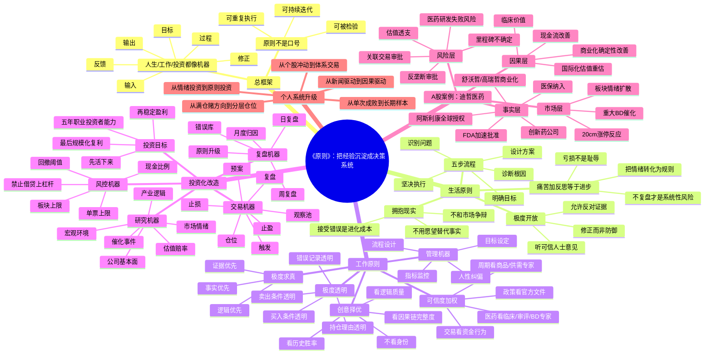

# 《原则》思维导图：从生活原则到个人投资系统

> 适用对象：希望把瑞·达利欧《原则：生活和工作》的方法论转化为 A 股个人投资系统的投资者。  
> 说明：本图是结构化研读与投资化改造，不是原文摘抄。

## 一页版结论

《原则》对投资者最重要的启发不是“相信某个大师”，而是：

1. 把投资看成一台可诊断、可调参、可复盘的机器。
2. 所有买入必须写清楚：事实、因果、赔率、风险、退出条件。
3. 不要用情绪解释市场，要用证据解释市场。
4. 亏损后首先检查系统，而不是责怪市场。
5. 真正的职业投资者不是每天预测，而是每天升级自己的决策质量。

## 使用方法

- 每次研究个股前，先看“事实层—因果层—市场层—风险层”。
- 每次交易前，先问：这笔交易属于价值发现、趋势跟随、事件套利，还是情绪博弈？
- 每次亏损后，不问“为什么市场不涨”，先问“我的原则在哪里失效”。
