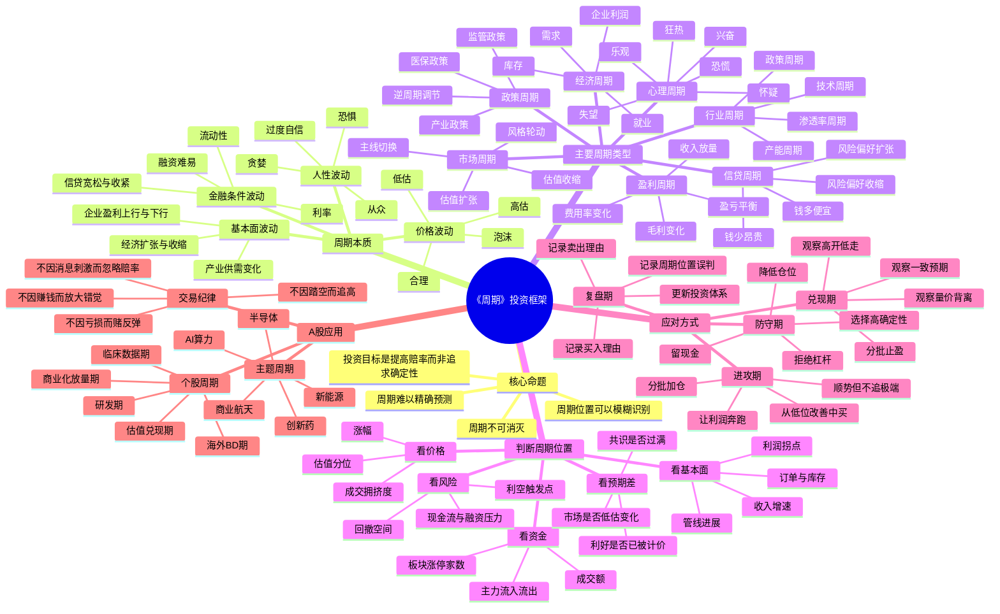

# 《周期》思维导图.md

> 主题：用霍华德·马克斯的周期框架，建立A股个人投资者的“周期位置—赔率—仓位”系统。

## 一句话总图

《周期》的核心不是“预测顶部和底部”，而是判断自己处在周期的哪一段，并据此调整进攻、防守、仓位、现金和容错空间。

## 资料来源与核验口径

- Howard Marks, *Mastering the Market Cycle: Getting the Odds on Your Side*，中文常译为《周期》。本文件为读书消化、投资框架化笔记，不替代原书。
- 豆瓣《周期》条目：书中章节覆盖经济周期、政府调节、企业盈利、投资人心理、风险态度、信贷、不良债权、房地产、市场周期等。
  https://book.douban.com/subject/30443502/
- Google Books / 图书介绍：本书核心是通过理解周期、情绪与行为模式，提高投资结果的概率优势。
  https://books.google.com/books/about/Mastering_The_Market_Cycle.html?id=8hhDDwAAQBAJ
- 迪哲医药2025年年度报告：2025年销售收入8.01亿元，同比增长122.60%；舒沃哲、高瑞哲进入国家医保；公司仍未盈利并存在累计未弥补亏损。
  https://stockmc.xueqiu.com/202603/688192_20260331_HJPD.pdf
- FDA关于sunvozertinib / Zegfrovy的加速批准：2025年7月2日批准用于EGFR exon20 insertion突变的局部晚期或转移性NSCLC成人患者二线相关适应症。
  https://www.fda.gov/drugs/resources-information-approved-drugs/fda-grants-accelerated-approval-sunvozertinib-metastatic-non-small-cell-lung-cancer-egfr-exon-20
- AstraZeneca官方新闻稿：2026年7月14日与迪哲医药签署Zegfrovy全球独家许可协议；6亿美元首付款，最高9亿美元里程碑款，另有销售分成。
  https://www.astrazeneca.com/media-centre/press-releases/2026/astrazeneca-licenses-novel-egfr-inhibitor.html
- 同花顺新闻：2026年7月14日迪哲医药受授权消息刺激，盘中快速20cm涨停，市值约262亿元；该资料仅用于市场反应观察，不构成投资建议。
  https://stock.10jqka.com.cn/20260714/c678163027.shtml
