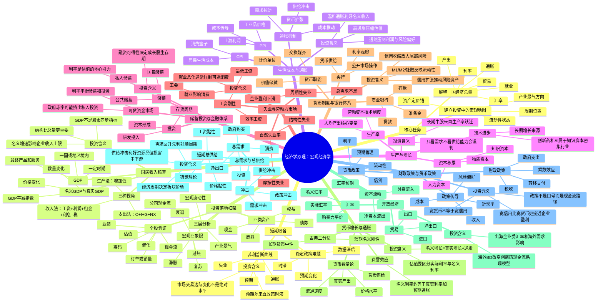

# 《经济学原理：宏观经济学》思维导图

> 使用方式：支持 Mermaid 的 Markdown 阅读器可直接渲染。若无法渲染，可按缩进层级阅读。



## 一页式结构图

```text
宏观经济学
├─ 衡量经济：GDP、CPI、PPI、失业率、利率、汇率
├─ 长期增长：资本、人力资本、技术、制度、生产率
├─ 金融体系：储蓄→金融市场/银行→投资→资本形成
├─ 货币体系：央行→银行信用→货币供给→通胀/资产价格
├─ 开放经济：贸易、资本流动、汇率、国际收支
├─ 短期波动：总需求、总供给、冲击、预期、政策时滞
└─ 投资应用：周期位置、流动性、产业景气、估值锚、风险控制
```
