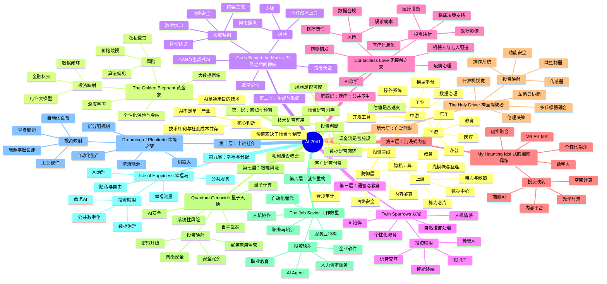

# 《AI 2041》思维导图

> 说明：不同中文版本的章节译名可能存在差异。下文同时保留英文标题与便于理解的中文工作译名。

## Mermaid思维导图



## 结构化导图

### 1. 技术演化主线

1. **识别与预测**：AI先从“看懂历史数据”开始，提升分类、识别、预测效率。
2. **生成与交互**：AI从判断工具变为内容生产者和交互主体。
3. **决策与执行**：AI进一步控制工作流、车辆、机器人和企业流程。
4. **制度与分配**：当AI显著提升生产率后，社会需要重新处理隐私、就业、责任和财富分配。

### 2. 商业价值迁移主线

```text
模型能力
  ↓
产品功能
  ↓
用户使用频率
  ↓
工作流嵌入
  ↓
切换成本
  ↓
订阅、授权、设备销售或效果分成
  ↓
收入、利润、现金流
```

### 3. 投资者最需要警惕的错觉

- 把模型参数规模等同于商业壁垒；
- 把发布会能力等同于交付能力；
- 把用户访问量等同于付费意愿；
- 把一次性项目收入等同于可重复收入；
- 把政策支持等同于股东回报；
- 把长期产业趋势等同于任何价格都可以买入。

### 4. 全书对应的A股研究方向

| 主题 | 关键产业环节 | 代表性观察对象 |
|---|---|---|
| 行业大模型 | 语音、教育、医疗、政企应用 | 科大讯飞 |
| AI办公 | 文档入口、企业知识库、Agent | 金山办公 |
| 智能驾驶 | 域控、软件、传感器、功能安全 | 德赛西威、中科创达 |
| 智能物联 | 多模态感知、边缘AI、AIoT | 海康威视 |
| AI医疗 | 医疗影像、设备、临床工作流 | 联影医疗 |
| 机器人与端侧AI | AIOS、模组、机器人软件 | 中科创达 |
| AI安全 | 内容鉴真、网络安全、权限审计 | 需按订单和收入单独验证 |
