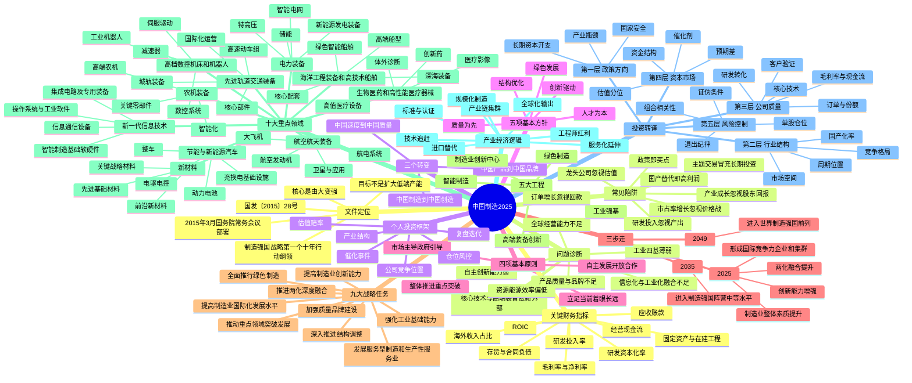

# 《中国制造2025》投资思维导图

> 定位：把国家制造强国战略转译为“产业研究—公司筛选—估值交易—风险控制”的投资地图。  
> 使用方法：支持 Mermaid 的 Markdown 编辑器可直接渲染；不支持 Mermaid 时，可阅读后面的层级提纲。

---

## 层级提纲版

### 1. 一句话理解

《中国制造2025》不是“补贴若干行业”的清单，而是试图重构中国制造业能力栈：

**基础材料与零部件 → 核心装备 → 数字化工厂 → 品牌与标准 → 全球服务网络。**

### 2. 政策的核心矛盾

- 中国拥有完整制造业门类和规模优势，但价值链位置、核心技术、质量品牌与基础工业能力仍不匹配。
- 低成本、重投入、扩产能的旧模式边际效益下降。
- 新一轮科技革命使软件、数据、控制系统、材料和高端装备成为制造竞争力的核心。
- 国家安全、供应链安全与全球竞争共同提高了关键环节自主可控的权重。

### 3. 投资者真正需要跟踪的六条主线

1. **产业瓶颈**：被卡住的材料、设备、零部件、软件和工艺。
2. **客户验证**：产品是否进入头部客户量产线，而非仅有样机或公告。
3. **规模制造**：能否稳定交付、控制良率、降低成本。
4. **盈利质量**：增长是否转化为毛利、现金流和资本回报。
5. **国际竞争力**：是否从国内替代升级为全球销售、标准和服务。
6. **估值赔率**：产业方向正确不等于任何价格都值得买。

### 4. 股票研究的最终公式

> **长期收益 ≈ 产业成长 × 公司竞争优势 × 盈利兑现 × 估值变化 × 仓位纪律**

其中任何一项长期接近零，主题逻辑都很难转化为可持续的股东回报。

## 主要资料来源

### 政策与产业资料

1. [国务院关于印发《中国制造2025》的通知（国发〔2015〕28号）](https://www.gov.cn/zhengce/content/2015-05/19/content_9784.htm)
2. [2015年3月25日国务院常务会议：部署加快推进实施“中国制造2025”](https://www.gov.cn/guowuyuan/2015-03/25/content_2838306.htm)
3. [工业和信息化部：《重点领域技术路线图（2015年版）》发布信息](https://shca.miit.gov.cn/xxgk/xyfz/fzgh/art/2020/art_2277406415424fbe88d23c2298990c5c.html)
4. [工业和信息化部：中国制造2025专题](https://wap.miit.gov.cn/ztzl/lszt/zgzz2025/index.html)
5. [工业和信息化部：2025年工业和信息化发展主要目标任务完成情况](https://www.miit.gov.cn/xwfb/bldhd/art/2026/art_4ba01aa6d2f54ced8ba3490ea4fb52c4.html)

### 上市公司资料

6. [北方华创2025年年度报告](https://static.cninfo.com.cn/finalpage/2026-04-18/1225122918.PDF)
7. [宁德时代2025年年度报告](https://static.cninfo.com.cn/finalpage/2026-03-10/1225002214.PDF)
8. [迈瑞医疗2025年年度报告](https://static.cninfo.com.cn/finalpage/2026-03-31/1225059012.PDF)
9. [中国中车2025年年度报告](https://static.cninfo.com.cn/finalpage/2026-03-28/1225047457.PDF)
10. [中国船舶2025年年度报告](https://static.cninfo.com.cn/finalpage/2026-04-30/1225261150.PDF)
11. [埃斯顿2025年年度报告](https://static.cninfo.com.cn/finalpage/2026-03-31/1225059898.PDF)

> 数据口径：除特别说明外，上市公司数据均取自2025年年度报告。本文用于学习与研究，不构成证券投资建议。
