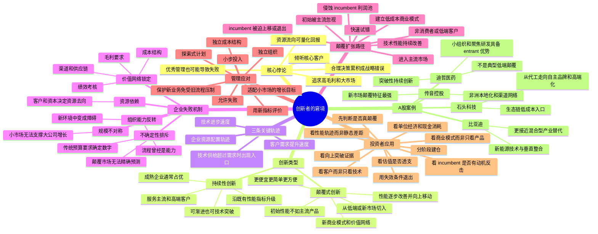
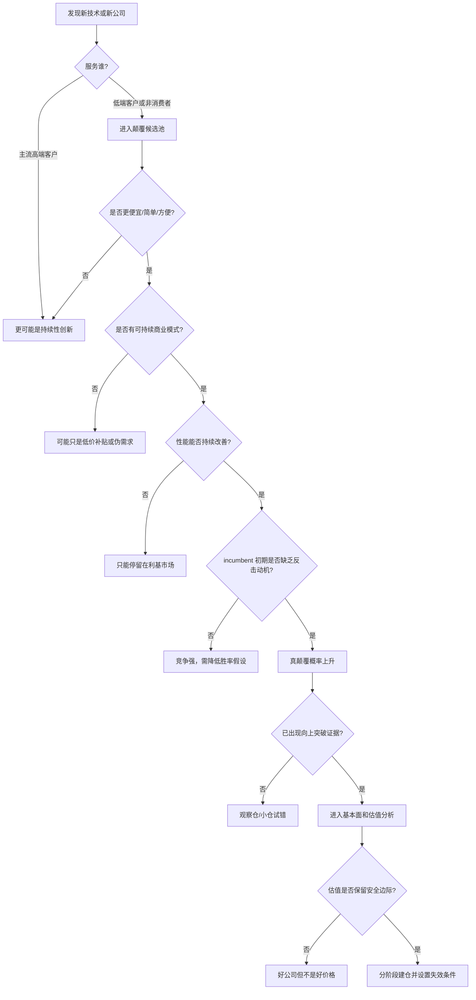

# 《创新者的窘境》思维导图

## Mermaid 思维导图



## 文字版结构

```text
创新者的窘境
├─ 一、为什么优秀企业会失败
│  ├─ 倾听最重要的客户
│  ├─ 把资金投向高回报项目
│  ├─ 追求高毛利和规模增长
│  └─ 放弃小市场、低端客户和不确定机会
├─ 二、两类创新
│  ├─ 持续性创新：让好产品更好
│  └─ 颠覆式创新：让产品更便宜、简单、方便、可获得
├─ 三、颠覆的两个入口
│  ├─ 低端颠覆：服务被过度满足的客户
│  └─ 新市场颠覆：把非消费者变成消费者
├─ 四、颠覆发生的必要条件
│  ├─ 主流产品性能超过部分客户真实需求
│  ├─ entrant 拥有可持续的低成本商业模式
│  ├─ 技术存在持续改进路径
│  ├─ incumbent 初期缺乏反击动机
│  └─ entrant 能从边缘市场向主流上移
├─ 五、组织为什么难以自我颠覆
│  ├─ 资源由现有客户和资本市场支配
│  ├─ 原有流程不适合高不确定业务
│  ├─ 原有价值观排斥低毛利、小订单
│  └─ 大公司需要大市场，小机会无法通过预算评审
├─ 六、企业应对方案
│  ├─ 建立独立组织
│  ├─ 使用独立成本结构和考核指标
│  ├─ 允许探索式计划和快速失败
│  ├─ 让新业务服务新客户
│  └─ 等商业模式验证后再扩大资源
└─ 七、投资应用
   ├─ 不把所有科技创新都叫颠覆
   ├─ 跟踪客户、场景、价格和渠道变化
   ├─ 观察 entrant 是否真正向上突破
   ├─ 判断 incumbent 是没有能力还是没有动机
   ├─ 用概率和仓位管理早期不确定性
   └─ 即使看对产业，也必须控制估值
```

## 一页投资决策图


