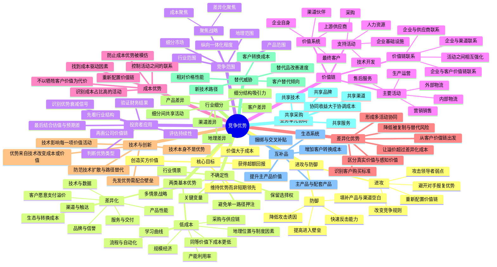

# 《竞争优势》思维导图

> 作者：迈克尔·波特（Michael E. Porter）  
> 核心命题：竞争优势不是抽象的“护城河”，而是企业在一组具体价值活动中，以更低成本或更高差异化创造超额价值，并通过竞争范围、活动联系和持续升级维持这种优势。



## 一页式逻辑链

```text
行业结构决定平均盈利水平
        ↓
竞争范围决定企业在哪里竞争
        ↓
价值链决定企业如何创造价值
        ↓
成本驱动因素 / 差异化驱动因素
        ↓
活动之间的联系与取舍形成难以复制的系统
        ↓
超额毛利、资本回报、现金流和市场份额得到验证
        ↓
技术、替代、扩产、监管和竞争反应决定优势能否持续
        ↓
投资收益 = 企业价值增长 + 预期差修复 - 估值压缩 - 风险损失
```

## 投资者需要记住的六个关键词

1. **活动**：优势必须落到具体经营活动，不能停留在“品牌好、技术强”。
2. **联系**：真正难复制的是多项活动相互强化，而不是单个资源。
3. **取舍**：没有取舍的战略通常意味着资源分散和定位模糊。
4. **范围**：小公司通过聚焦特定客户、适应症或区域，同样可获得高回报。
5. **持续性**：优势会被模仿、替代、扩产和政策变化侵蚀。
6. **价格**：好公司不等于好股票，必须比较优势兑现速度与市场预期。
