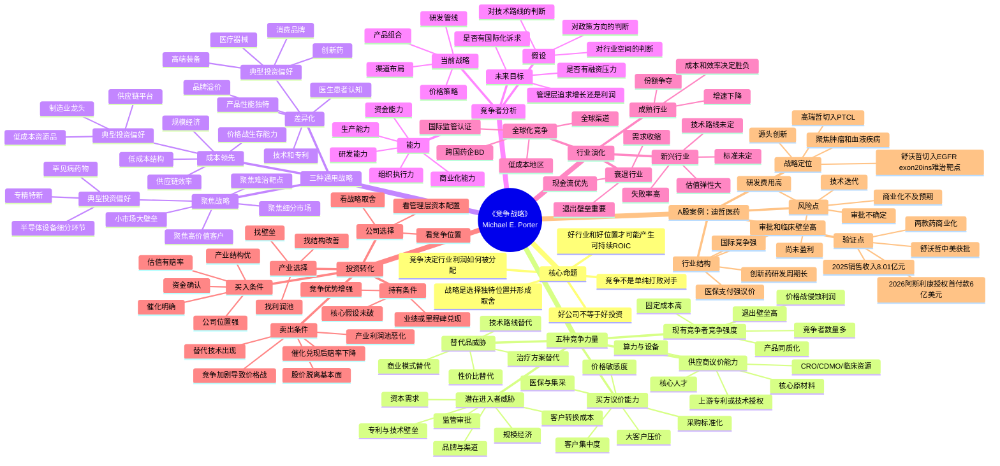

# 《竞争战略》思维导图

> 主题：用产业结构判断利润池，用竞争定位判断企业是否能长期获得超额收益；再把该框架转化为投资筛选、买入、持有、卖出和复盘系统。



## 一页版框架

| 层级 | 关键问题 | 投资动作 |
|---|---|---|
| 行业结构 | 这个行业的钱是否容易被赚走？ | 过滤低利润池行业 |
| 竞争力量 | 谁在压缩利润：客户、供应商、替代品、新进入者、同行？ | 判断利润被谁拿走 |
| 战略定位 | 公司靠成本、差异化还是聚焦取胜？ | 判断优势是否真实 |
| 竞争者行为 | 对手会如何反击？ | 判断优势持续期 |
| 行业演化 | 新兴、成熟、衰退还是全球化？ | 匹配估值方法和持有周期 |
| 资本市场 | 预期差、催化、资金偏好是否共振？ | 决定买点和仓位 |

## 用于每日看盘的极简模型

```text
产业利润池 -> 竞争格局 -> 公司位置 -> 催化事件 -> 估值赔率 -> 资金确认 -> 仓位与风控
```

## 用于个股研究的五力清单

1. 买方是谁？是否有强议价能力？
2. 供应商是谁？核心资源是否稀缺？
3. 替代品是否正在出现？
4. 新进入者进入需要多少资金、时间、资质、技术和渠道？
5. 行业内是否正在价格战？
6. 公司选择的是成本领先、差异化还是聚焦？
7. 公司的护城河来自专利、渠道、品牌、规模、数据、工艺还是网络效应？
8. 公司护城河是增强、维持还是衰退？
9. 当前估值反映的是过去、现在还是未来催化？
10. 资金是否已经开始重新定价？

## 资料来源

- Harvard Business School Institute for Strategy & Competitiveness: The Five Forces, https://www.isc.hbs.edu/strategy/business-strategy/Pages/the-five-forces.aspx
- Harvard Business Review: The Five Competitive Forces That Shape Strategy, https://hbr.org/2008/01/the-five-competitive-forces-that-shape-strategy
- 迪哲医药 2025 年年度报告，https://stockmc.xueqiu.com/202603/688192_20260331_HJPD.pdf
- 迪哲医药关于与阿斯利康签署授权许可协议暨关联交易的公告，https://stockmc.xueqiu.com/202607/688192_20260714_LOKU.pdf
