# 《芯片战争》思维导图

> 作者：[美] 克里斯·米勒（Chris Miller）  
> 文件定位：原书知识结构 + 半导体投资映射  
> 整理日期：2026-07-27  
> 说明：未检索到用户上传的原书文件。本导图依据原书公开介绍、目录信息及半导体产业资料进行主题化重构，不冒充逐字逐章摘录。

---

## 一、Mermaid 思维导图

```mermaid
flowchart TD
    A[芯片战争<br/>世界最关键技术的争夺战]

    A --> B[一、芯片为什么重要]
    B --> B1[数字经济的基础设施]
    B --> B2[军事与国家安全能力]
    B --> B3[工业、汽车、通信、AI的通用投入品]
    B --> B4[技术权力可转化为经济与地缘政治权力]

    A --> C[二、产业发展史]
    C --> C1[晶体管与集成电路诞生]
    C --> C2[冷战与美国军方需求]
    C --> C3[仙童、德州仪器、英特尔]
    C --> C4[摩尔定律与规模经济]
    C --> C5[日本存储器崛起与美国反击]
    C --> C6[韩国存储器产业崛起]
    C --> C7[无晶圆厂模式与专业分工]
    C --> C8[台积电与晶圆代工革命]
    C --> C9[ASML、EUV与先进制程]

    A --> D[三、全球产业链分工]
    D --> D1[美国：芯片设计、EDA/IP、设备]
    D --> D2[中国台湾：先进晶圆制造]
    D --> D3[荷兰：先进光刻设备]
    D --> D4[日本：材料、设备与精密零部件]
    D --> D5[韩国：存储器与制造]
    D --> D6[中国大陆：最大市场、成熟制程、国产替代]
    D --> D7[东南亚：封测与组装环节]

    A --> E[四、产业竞争的底层规律]
    E --> E1[技术路径依赖]
    E --> E2[资本密集与高研发投入]
    E --> E3[学习曲线与良率积累]
    E --> E4[客户认证与生态黏性]
    E --> E5[规模越大，单位成本越低]
    E --> E6[少数企业形成关键卡点]
    E --> E7[全球协作提高效率，也制造脆弱性]

    A --> F[五、关键卡点 Chokepoints]
    F --> F1[EDA软件与核心IP]
    F --> F2[光刻、刻蚀、薄膜沉积、量检测]
    F --> F3[先进制程晶圆制造]
    F --> F4[高端CPU/GPU/AI加速芯片]
    F --> F5[先进封装、HBM与高速互连]
    F --> F6[高纯材料与核心零部件]

    A --> G[六、大国博弈]
    G --> G1[美国：保持技术领导与联盟控制]
    G --> G2[中国：降低外部依赖、建立自主体系]
    G --> G3[中国台湾：硅盾、集中度与安全风险]
    G --> G4[日本和欧洲：产业复兴与供应链安全]
    G --> G5[出口管制、补贴、投资限制]
    G --> G6[效率优先转向安全与韧性优先]

    A --> H[七、后摩尔时代]
    H --> H1[先进制程继续演进]
    H --> H2[Chiplet与异构集成]
    H --> H3[2.5D/3D先进封装]
    H --> H4[专用计算与AI芯片]
    H --> H5[软硬件协同与生态竞争]
    H --> H6[算力、能效、带宽共同决定竞争力]

    A --> I[八、对投资者的启示]
    I --> I1[优先研究不可替代的卡点]
    I --> I2[卖铲人通常比终端品牌更稳定]
    I --> I3[技术稀缺不等于短期盈利]
    I --> I4[国产替代必须验证客户导入与量产]
    I --> I5[半导体兼具成长性、周期性和政策性]
    I --> I6[订单、库存、资本开支、良率是关键指标]
    I --> I7[长期逻辑必须服从估值与仓位纪律]

    A --> J[九、A股映射]
    J --> J1[晶圆制造：中芯国际]
    J --> J2[设备平台：北方华创]
    J --> J3[刻蚀与薄膜：中微公司]
    J --> J4[EDA：华大九天]
    J --> J5[CPU/DCU：海光信息]
    J --> J6[先进封装：长电科技]

    A --> K[十、我的半导体投资体系]
    K --> K1[国家战略判断]
    K --> K2[产业卡点定位]
    K --> K3[技术与客户验证]
    K --> K4[景气周期判断]
    K --> K5[财务与估值验证]
    K --> K6[趋势、仓位和退出规则]
    K --> K7[持续复盘与能力圈迭代]
```



---

## 二、纯文本层级导图

```text
《芯片战争》
├─ 1. 芯片的本质
│  ├─ 数字时代的基础生产资料
│  ├─ 军事、经济和地缘政治力量的共同底座
│  └─ 不只是消费电子零件，而是国家能力放大器
├─ 2. 历史主线
│  ├─ 晶体管、集成电路、硅谷
│  ├─ 冷战军工需求推动早期产业化
│  ├─ 日本存储器挑战美国
│  ├─ 韩国承接存储器产业
│  ├─ 无晶圆厂模式兴起
│  ├─ 张忠谋与台积电晶圆代工革命
│  └─ ASML与EUV成为先进制程关键卡点
├─ 3. 全球分工
│  ├─ 美国：设计、EDA、IP、设备
│  ├─ 中国台湾：先进制造
│  ├─ 荷兰：光刻
│  ├─ 日本：材料、设备、零部件
│  ├─ 韩国：存储
│  └─ 中国大陆：需求、制造扩张、国产替代
├─ 4. 竞争壁垒
│  ├─ 资本密集
│  ├─ 研发密集
│  ├─ 良率与工艺经验
│  ├─ 客户认证
│  ├─ 生态黏性
│  ├─ 规模经济
│  └─ 路径依赖
├─ 5. 地缘政治
│  ├─ 出口管制
│  ├─ 产业补贴
│  ├─ 供应链重构
│  ├─ 台湾风险
│  └─ 从效率优先转向安全优先
├─ 6. 后摩尔时代
│  ├─ Chiplet
│  ├─ 2.5D/3D封装
│  ├─ HBM与高速互连
│  ├─ 专用计算
│  └─ 软硬件生态
└─ 7. 投资转化
   ├─ 找卡点，不只找大市场
   ├─ 看客户验证，不只看技术宣传
   ├─ 看订单、库存、资本开支和现金流
   ├─ 区分战略价值与当期盈利
   ├─ 区分长期产业逻辑与短期交易时机
   └─ 用仓位和估值约束宏大叙事
```

---

## 三、一句话总纲

> 《芯片战争》不是一本单纯讲芯片技术的书，而是在说明：**当一种技术同时具备通用性、军事价值、资本密集、供应链集中和难以替代等属性时，它就会从普通商品升级为国家权力与资本市场定价的核心变量。**
