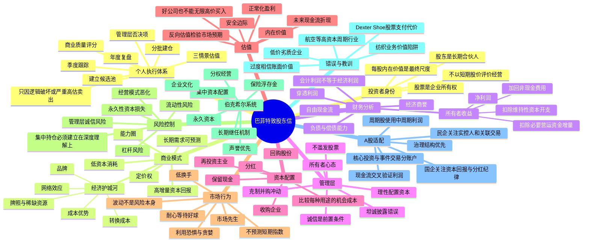

# 《巴菲特致股东信》投资思维导图

> 阅读范围：以伯克希尔·哈撒韦历年股东信的核心思想为主，覆盖企业质量、管理层、资本配置、估值、风险与投资者行为。不同中文版选本的年份范围可能不同，本导图按完整思想体系整理。

## Mermaid 思维导图

## 层级文本版

- **一、底层身份：把自己当企业所有者**
  - 买股票等于购买企业的一部分，而不是购买一串价格代码。
  - 判断标准是每股内在价值是否增长，而不是下周股价是否上涨。
  - 管理层应把股东视为合伙人，投资者也应以合伙人的期限研究企业。
- **二、选择什么企业**
  - 业务在能力圈内，收入来源、成本结构、竞争格局可以解释。
  - 产品具备长期需求，竞争优势能维持十年以上。
  - 企业不需要持续投入巨额资本才能勉强保持竞争地位。
  - 留存利润能够以较高回报继续投入。
- **三、如何评价盈利**
  - 不迷信净利润、每股收益和账面价值。
  - 重点估算所有者收益、自由现金流、增量资本回报。
  - 区分维持性资本开支与扩张性资本开支。
  - 用多年数据观察利润与现金流的一致性。
- **四、如何评价管理层**
  - 诚信先于能力，发现重大失信立即否决。
  - 管理层最重要的工作不是讲故事，而是分配资本。
  - 是否愿意承认错误，是治理质量的重要信号。
- **五、如何决定价格**
  - 估值的本质是未来可分配现金流的现值。
  - 使用保守假设，做悲观、基准、乐观三种情景。
  - 买入价格必须留出安全边际。
- **六、如何持有**
  - 企业价值持续增长时，时间是朋友。
  - 不因宏观预测、短期波动或市场情绪频繁交易。
  - 定期验证护城河、管理层、资本回报和估值假设。
- **七、何时卖出**
  - 原投资逻辑被事实推翻。
  - 管理层诚信或资本配置明显恶化。
  - 负债、现金流或竞争优势出现结构性问题。
  - 价格严重透支长期增长，且存在明显更优机会。
- **八、A股实践**
  - 贵州茅台：品牌、定价权、经济商誉与低资本消耗。
  - 美的集团：运营效率、全球化和资本配置。
  - 中国神华：资源、运输一体化、现金回报与周期约束。
  - 万华化学：技术与成本优势、再投资能力及化工周期。
  - 招商银行：低成本负债与零售银行壁垒，但需理解信用风险。
  - 海天味业：优秀企业遇到过高估值仍可能产生低回报。
  - 康美药业：诚信问题直接触发永久否决。
  - 通源石油：适合周期或事件框架，不应套用消费复利股的持有逻辑。
