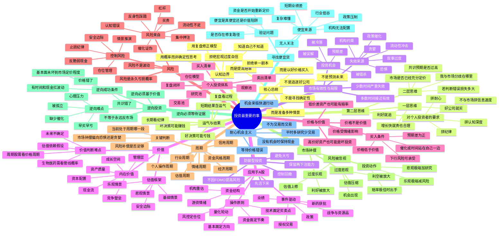
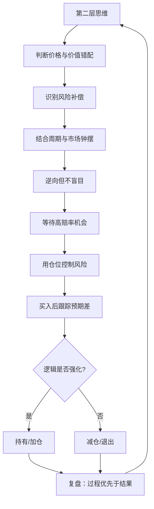
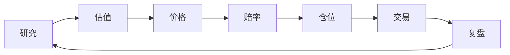

# 《投资最重要的事》思维导图

> 作者：霍华德·马克斯  
> 主题：以价格—价值关系为核心，以风险控制为第一约束，通过第二层思维、周期意识和逆向纪律获取长期超额收益。

## Mermaid 思维导图

## 一页结构图

## 适合个人投资者的压缩版

## 本书最核心的一句话

优秀投资不是预测最准确，而是在市场定价错误、风险补偿足够、自己有认知优势时下注，并且始终避免一次错误毁掉长期复利。
