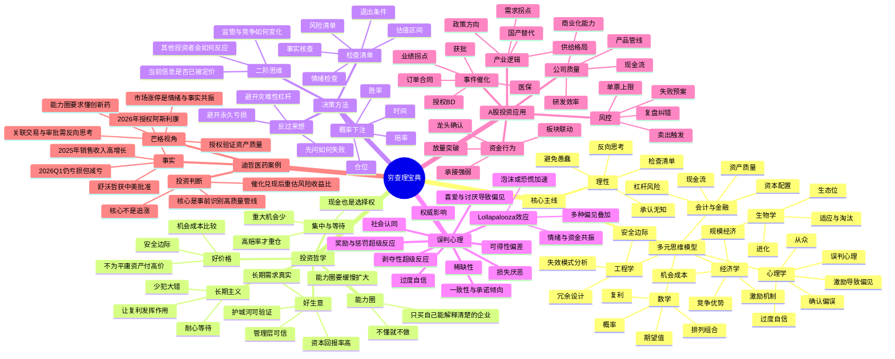

# 《穷查理宝典》思维导图

> 主题：用查理·芒格的多元思维模型，升级个人投资、决策、学习与风险控制系统。

## 一页版结构

- **底层价值观**：诚实、理性、长期、少犯大错。
- **认知工具**：多元思维模型 + 反向思考 + 检查清单。
- **投资方法**：能力圈内寻找少数优秀企业，以合理价格买入，靠耐心和复利赚钱。
- **风险控制**：先避免不可逆损失，再追求收益最大化。
- **A股转化**：产业逻辑、公司质量、事件催化、资金确认、纪律化风控五位一体。

