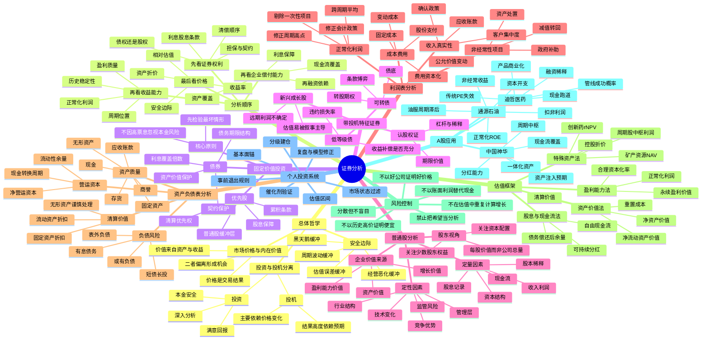

# 《证券分析》思维导图

> 作者：本杰明·格雷厄姆、戴维·多德  
> 定位：把证券从“市场报价”还原为“对资产、收益和现金流的法律索取权”。  
> 核心问题：证券值多少钱、价值是否可靠、价格是否留下足够安全边际。

## 一页压缩版

《证券分析》的方法不是寻找一个“精确目标价”，而是建立一个有层级的判断链：

**证券权利 → 企业偿付能力 → 资产质量 → 正常化收益 → 内在价值区间 → 安全边际 → 仓位与退出。**

任何一环无法验证，都应降低估值、降低仓位，或直接放弃。
