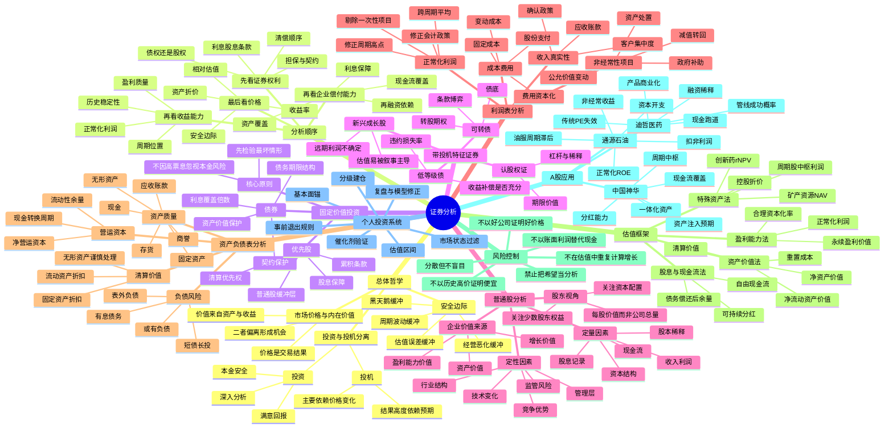

# 《证券分析》完整学习包

> 本文件将思维导图、读书笔记、20条投资原则、A股案例和个人投资体系合并，便于一次性阅读与归档。

---

---

# 《证券分析》思维导图

> 作者：本杰明·格雷厄姆、戴维·多德  
> 定位：把证券从“市场报价”还原为“对资产、收益和现金流的法律索取权”。  
> 核心问题：证券值多少钱、价值是否可靠、价格是否留下足够安全边际。

## 一页压缩版

《证券分析》的方法不是寻找一个“精确目标价”，而是建立一个有层级的判断链：

**证券权利 → 企业偿付能力 → 资产质量 → 正常化收益 → 内在价值区间 → 安全边际 → 仓位与退出。**

任何一环无法验证，都应降低估值、降低仓位，或直接放弃。

---

# 《证券分析》读书笔记

> 作者：本杰明·格雷厄姆、戴维·多德  
> 本笔记基于经典1940年版本所确立的思想框架，并参考第六版的七部分结构。  
> 阅读目标：不是记住若干估值公式，而是建立一套防止永久性亏损的证券研究程序。

---

# 一、这本书到底解决什么问题

《证券分析》试图解决的不是“明天股价涨不涨”，而是三个更基础的问题：

1. 一项证券代表什么法律和经济权利；
2. 这些权利背后的资产、利润和现金流值多少钱；
3. 市场报价是否低到足以容纳判断错误。

全书最重要的转变，是把股票从一张价格不断波动的筹码，重新看成企业资产和未来收益的一部分所有权。分析者不应从K线出发寻找理由，而应先研究企业，再把结论与价格比较。

一句话总结：

> **证券分析的任务，是在不确定世界中，使用保守事实估算价值区间，并只在价格提供安全边际时行动。**

---

# 二、核心概念一：投资与投机必须分账

格雷厄姆与多德对投资的经典要求可以概括为：

- 经过充分分析；
- 本金具有合理安全性；
- 预期获得满意回报。

不满足这些条件的行为不一定错误，但应明确归类为投机。

## 我的理解

A股投资者最常见的问题不是投机，而是“投机后拒绝承认自己在投机”。典型过程是：

1. 因消息、题材或战争预期买入；
2. 股价上涨时说自己抓住主线；
3. 股价下跌后开始研究基本面；
4. 用长期价值逻辑为短期交易解套。

这会导致退出纪律失效。

因此我需要把账户分为：

| 账户 | 核心依据 | 典型持有期 | 主要退出依据 |
|---|---|---|---|
| 价值账户 | 内在价值与安全边际 | 6个月以上 | 价值兑现或逻辑证伪 |
| 催化账户 | 业绩、政策、产品、行业拐点 | 数周到数月 | 催化兑现或延迟 |
| 事件账户 | 地缘、公告、资金博弈 | 数日到数周 | 事件降温、量价破坏、时间止损 |

同一只股票可以同时具有价值和事件属性，但买入前必须确定主导逻辑。主导逻辑决定仓位、期限和退出。

---

# 三、核心概念二：内在价值不是精确数字，而是区间

企业价值受未来销量、利润率、资本开支、竞争、利率和管理层决策影响，不可能被精确计算。分析的正确目标不是得到一个小数点后两位的目标价，而是建立：

- 保守价值；
- 基准价值；
- 乐观价值；
- 极端损失情形。

## 估值区间的意义

假设某股票当前价格为30元：

| 情形 | 估计价值 | 含义 |
|---|---:|---|
| 压力情形 | 18元 | 发生经营恶化后的价值 |
| 保守情形 | 28元 | 不计增长或低增长 |
| 基准情形 | 40元 | 合理经营假设 |
| 乐观情形 | 58元 | 多项积极因素兑现 |

若当前价格30元，虽然低于基准价值，但并未低于保守价值，安全边际有限。若当前价格22元，则保守情形也提供一定保护。

这意味着：

> **估值不是预测价格会到哪里，而是判断当前价格对应了多大风险和多高预期。**

---

# 四、核心概念三：安全边际是所有估值的终点

安全边际可理解为：

`安全边际率 = (保守内在价值 - 当前价格) ÷ 保守内在价值`

但这个公式只是一种表达。真正的安全边际还包括：

- 低负债；
- 现金流稳定；
- 资产可变现；
- 业务分散；
- 管理层克制；
- 估值假设保守；
- 仓位不过度集中。

## 不同公司，安全边际来源不同

| 公司类型 | 主要安全边际 |
|---|---|
| 银行、保险 | 资产质量、资本充足、拨备、估值 |
| 煤炭、水电 | 资源成本、资产寿命、现金流、分红 |
| 制造业 | 订单、产能利用率、现金转换、重置成本 |
| 周期股 | 低周期假设、低负债、低资本开支压力 |
| 创新药 | 现金跑道、已上市产品、管线概率折价、仓位 |
| 事件股 | 小仓位、时间止损、明确催化剂，而非传统价值 |

安全边际不是“股价已经跌很多”，也不是“公司名气很大”。

---

# 五、第一部分：分析方法与基本原则

第六版将全书分为七大部分：总体方法、固定价值投资、带投机特征证券、普通股、利润表、资产负债表和其他专题。

这套结构说明，证券分析不是直接从普通股估值开始，而是先理解权利顺序和本金保护。

## 5.1 正确分析顺序

我将其压缩为七步：

1. 证券权利；
2. 商业模式；
3. 资产负债表；
4. 利润质量；
5. 正常化现金流；
6. 估值区间；
7. 安全边际与仓位。

很多投资者顺序完全相反：先看到上涨，再找题材，再看研报目标价，最后才翻财报。

## 5.2 定量与定性必须相互验证

定量数据不能替代商业判断，定性故事也不能绕过财务约束。

例如：

- 研发能力强，需要研发效率和产品成功率验证；
- 行业空间大，需要公司市场份额和资本回报验证；
- 订单增长，需要应收账款和现金流验证；
- 管理层优秀，需要资本配置记录验证。

---

# 六、第二部分：固定价值投资

债券和优先股分析的核心，不是比较收益率，而是检验本金和利息能否得到保护。

## 6.1 利息保障倍数

`利息保障倍数 = 息税前利润 ÷ 利息费用`

单一年份不够，应观察多个年份和压力情景。如果企业在正常年份保障倍数很高，但在周期低谷迅速跌破1，也不能视为安全。

## 6.2 资产覆盖

债权人的保护来自普通股权益缓冲和可变现资产。需要区分：

- 账面价值；
- 持续经营价值；
- 清算价值；
- 抵押后的剩余价值。

## 6.3 对股票投资者的启示

研究债券能训练股票投资者先看下行风险。普通股虽然没有固定到期日，但股东仍应问：

- 公司是否依赖滚动融资；
- 短期债务能否由现金覆盖；
- 利息是否吞噬利润；
- 经营恶化时是否被迫低价增发；
- 债权人是否先拿走大部分企业价值。

---

# 七、第三部分：带投机特征的证券

可转债、认股权证、低等级债券和高成长证券兼具投资和投机特征。它们常被包装成“下有保底，上不封顶”，但实际需要拆分价值。

## 7.1 可转债

可转债价值可拆为：

`可转债价值 = 债券底价 + 转股期权价值 - 条款风险`

条款风险包括强赎、回售、下修、稀释和信用恶化。

## 7.2 高成长股票

高成长股的问题不是增长没有价值，而是增长很容易被重复计价。市场可能同时给出：

- 高收入增速；
- 高未来利润率；
- 高估值倍数；
- 高终值；
- 低折现率。

多个乐观假设叠加后，估值看似精确，实则脆弱。

我的规则是：成长股至少做一次“零增长估值”和一次“增长失败估值”。若失败情形对应的损失不可承受，就降低仓位。

---

# 八、第四部分：普通股分析

普通股价值可拆成三个部分：

1. 资产价值；
2. 现有盈利能力价值；
3. 增长价值。

## 8.1 资产价值

资产价值回答：假如不考虑增长，公司现有资产值多少。

常用方法：

- 账面净资产；
- 调整后净资产；
- 重置成本；
- 净流动资产价值；
- 分部资产价值。

## 8.2 盈利能力价值

`盈利能力价值 ≈ 正常化税后经营利润 ÷ 资本成本`

如果企业没有竞争优势，长期利润通常会被竞争压回资本成本附近。只有具有护城河的企业，增长才可能创造价值。

## 8.3 增长价值

增长不是收入增加本身，而是企业以高于资本成本的回报率继续投入资本。

`增长创造价值的条件：增量ROIC > 增量资本成本`

若公司每增加1元收入需要投入2元资本，且回报率低于融资成本，增长会摧毁价值。

## 8.4 每股价值

研究公司时必须始终转换为每股口径：

`每股价值 = 股权价值 ÷ 完全稀释后总股本`

需要纳入：

- 定增；
- 股权激励；
- 可转债；
- 期权；
- 员工持股；
- 潜在并购对价。

---

# 九、第五部分：利润表分析

利润表分析的重点不是抄下增长率，而是判断利润是否真实、可持续、可转化为现金。

## 9.1 收入质量

需要检查：

- 收入确认时间；
- 渠道压货；
- 退货和折扣；
- 应收账款增速；
- 客户集中度；
- 关联交易；
- 合同负债变化。

### 一个实用指标

`应收增速 - 收入增速`

如果应收账款长期明显快于收入，可能意味着回款恶化、收入确认激进或客户质量下降。

## 9.2 费用质量

重点识别：

- 研发资本化；
- 利息资本化；
- 一次性费用；
- 股份支付；
- 渠道推广费用；
- 资产减值；
- 费用跨期。

股份支付虽不直接流出现金，但会稀释股东权益，不能视为“无成本”。

## 9.3 非经常损益

资产处置、政府补助、公允价值变化、债务重组和减值转回通常不能按永久收益资本化。

通源石油2025年归母净利润约3662万元，扣非归母净利润约1246万元，说明约三分之二归母利润来自非经常因素。若以表面利润计算PE，会显著高估主营盈利能力。

## 9.4 正常化利润

我的正常化利润公式：

`正常化净利润 = 报告净利润 - 非经常收益 + 非经常损失修正 ± 周期修正 ± 会计政策修正`

周期股应使用跨周期平均；成长股应使用成熟期利润率，但必须对兑现时间和概率折现。

---

# 十、第六部分：资产负债表分析

资产负债表回答的是：企业拥有什么、欠什么、能否活到价值兑现。

## 10.1 资产质量分层

### 第一层：高确定性资产

- 现金；
- 受监管银行存款；
- 高流动性、低风险金融资产。

### 第二层：经营性流动资产

- 应收账款；
- 存货；
- 合同资产；
- 预付款。

需要按回收率折价。

### 第三层：固定资产

价值取决于：

- 是否通用；
- 利用率；
- 技术淘汰；
- 维护资本开支；
- 处置市场。

### 第四层：无形资产和商誉

只能在未来盈利能够验证时承认价值。若并购标的利润下降，商誉可能迅速减值。

## 10.2 净流动资产价值

经典净流动资产价值：

`NCAV = 流动资产 - 总负债`

更保守的清算调整可使用：

- 现金：100%；
- 应收账款：70%—90%；
- 存货：30%—70%；
- 固定资产：0%—50%；
- 商誉：0%。

这类方法适合资产型、清算型和极度低估公司，不适合直接给高成长公司定价。

## 10.3 现金跑道

对尚未盈利企业：

`现金跑道 = 可用净现金 ÷ 年度净现金消耗`

迪哲医药2025年末货币资金与交易性金融资产合计约19.36亿元，减短期借款后约17.18亿元；以2025年经营现金净流出约5.88亿元粗略计算，简化现金跑道约2.9年。需要进一步扣除资本开支和其他投资支出。

现金跑道不是估值本身，但它决定公司是否会在关键节点前被迫融资。

---

# 十一、第七部分：其他专题

## 11.1 控股结构和少数股东

上市公司总资产并不等于普通股股东可支配资产。需要扣除：

- 有息负债；
- 少数股东权益；
- 优先权；
- 或有负债；
- 受限资金。

## 11.2 管理层与资本配置

管理层的价值不能仅通过学历和履历判断，应看过去如何使用股东资本：

- 高价并购还是低价回购；
- 低价增发还是合理融资；
- 维持高成本低回报项目还是退出；
- 分红是否与自由现金流匹配；
- 股权激励是否真正创造每股价值。

## 11.3 市场因素

价格可能长期偏离价值，分析正确也不保证短期赚钱。价值投资仍需要：

- 催化剂；
- 持有耐心；
- 分散；
- 流动性管理；
- 对机会成本的比较。

---

# 十二、如何把《证券分析》用于A股

A股具有几个额外特征：

- 主题和政策驱动显著；
- 散户与量化资金交易活跃；
- 小市值股票波动大；
- 再融资、减持和股权激励影响较大；
- 周期行业和国有企业占比高；
- 部分行业利润受政策定价影响。

因此不能把1930年代美国市场的筛选阈值机械复制，而应保留分析原则，更新工具。

## 12.1 A股四类估值对象

| 类型 | 主要方法 | 代表问题 |
|---|---|---|
| 稳定现金流企业 | DCF、DDM、EV/EBIT | 现金流是否可持续 |
| 周期股 | 中枢利润、NAV、PB | 当前利润是否在顶部 |
| 资产重估股 | SOTP、重置价值 | 资产能否变现 |
| 创新成长股 | rNPV、情景估值 | 成功概率与稀释 |

## 12.2 加入资金和催化剂层

《证券分析》主要回答“值不值”，A股实战还要回答“何时可能被市场重新定价”。

我的增强框架：

`预期收益 = 价值低估幅度 × 兑现概率 ÷ 预计时间 - 风险成本`

其中风险成本包括：

- 逻辑失败概率；
- 资金机会成本；
- 流动性风险；
- 估值压缩；
- 黑天鹅。

---

# 十三、我从本书得到的最大修正

## 修正一：不再从题材出发，再补基本面

先判断价值来源，再研究催化剂。

## 修正二：不再用单一目标价制造确定性

所有估值输出区间和概率。

## 修正三：不再把利润等同于现金

利润必须经过经营现金流、资本开支和债务变化校验。

## 修正四：不再用“公司好”代替“价格好”

好公司在过高价格下也可能是差投资。

## 修正五：不再让短线交易自动变成长线持仓

买入前写明账户属性和退出规则。

## 修正六：用仓位表达不确定性

高确定性不等于高收益，高赔率不等于高仓位。仓位由下行损失、验证程度和相关性共同决定。

---

# 十四、可直接执行的证券分析模板

## A. 企业与证券

- 股票代码：
- 证券类型：
- 实际控制人：
- 股本及潜在稀释：
- 主要业务：
- 价值来源：资产 / 收益 / 成长 / 事件

## B. 资产负债表

- 现金与交易性金融资产：
- 有息负债：
- 净现金/净负债：
- 应收账款质量：
- 存货质量：
- 商誉与无形资产：
- 或有负债：
- 两年内融资需求：

## C. 利润与现金流

- 最近5年收入：
- 最近5年净利润：
- 扣非利润：
- 经营现金流：
- 维持性资本开支：
- 自由现金流：
- 正常化利润：
- ROIC与ROE：

## D. 竞争与管理层

- 行业结构：
- 成本优势：
- 客户议价权：
- 技术替代：
- 管理层资本配置记录：
- 少数股东友好度：

## E. 估值

- 资产价值：
- 盈利能力价值：
- 增长价值：
- 压力价值：
- 保守价值：
- 基准价值：
- 乐观价值：
- 当前价格隐含假设：

## F. 催化剂与证伪

- 未来12个月催化剂：
- 必须跟踪的3—5个指标：
- 逻辑证伪条件：
- 时间止损：

## G. 交易计划

- 账户类型：价值 / 催化 / 事件
- 初始仓位：
- 加仓条件：
- 最大仓位：
- 减仓条件：
- 清仓条件：

---

# 十五、全书最终结论

《证券分析》没有承诺投资者能够预测市场。它提供的是更现实的能力：

- 知道自己买了什么；
- 知道价值依赖哪些事实；
- 知道哪些利润不能相信；
- 知道企业能否活下去；
- 知道当前价格包含多少乐观预期；
- 知道自己可能错在哪里；
- 即使犯错，也不让一次错误摧毁账户。

这本书真正训练的不是估值技巧，而是**证据纪律、怀疑精神和风险优先级**。

## 资料来源

- McGraw Hill：《Security Analysis》第六版出版信息与目录。
- 美国国会图书馆：《Security Analysis》目录记录。
- 迪哲医药《2025年年度报告》。
- 通源石油《2025年年度报告》。
- 中国神华《2025年年度报告摘要》及利润分配公开披露。

---

# 《证券分析》提炼的20条投资原则

> 这些原则不是格言，而是可用于买入前审查、持仓跟踪和卖出决策的操作约束。

## 1. 先定义自己是在投资还是投机

投资必须同时满足：经过分析、本金有合理保护、预期回报令人满意。若主要理由是“有人会以更高价格接盘”，应归入投机账户并限制仓位。

## 2. 价格不是价值，历史高价也不是价值证据

股票从100元跌到50元不代表便宜。必须重新计算资产、正常化收益和现金流对应的价值区间。

## 3. 安全边际是估值体系的核心输出

估值的目的不是证明公司优秀，而是判断价格相对保守价值是否足够低。安全边际应覆盖预测误差、经营波动、资本开支和突发风险。

## 4. 先排除永久性损失，再讨论收益率

本金风险来自债务违约、现金耗尽、持续稀释、治理失控、技术淘汰和估值泡沫，而不只是股价波动。

## 5. 证券的法律权利优先于故事

债券、优先股、普通股、可转债拥有不同的索取顺序和契约保护。分析前先明确自己买到的究竟是什么权利。

## 6. 看偿债能力，不只看票面收益率

高利率通常是风险信号。债券分析应检查利息保障倍数、现金流覆盖、资产抵押、债务期限和再融资条件。

## 7. 普通股价值应建立在“正常化利润”上

周期高点利润、一次性收益、补贴、资产处置和减值转回不能直接资本化。至少使用3—5年周期数据，并对异常年份修正。

## 8. 现金流是利润质量的最终校验

长期净利润增长而经营现金流不增长，通常意味着应收、存货、资本化或收入确认存在问题。

## 9. 每股价值比公司规模更重要

融资、股权激励和可转债转股会稀释每股权益。收入和利润总额增长，不等于原股东每股价值增长。

## 10. 资产必须按可变现能力分层

现金接近面值；优质应收需折价；存货需考虑滞销；固定资产需考虑专用性；商誉和尚未验证的无形资产应保守处理。

## 11. 账面净资产不是天然底部

只有资产真实、可变现且不被负债侵蚀时，净资产才有保护作用。高负债、持续亏损或重资产低回报企业可能长期跌破净资产。

## 12. 负债表决定企业能否等到好日子

周期股和研发型企业最重要的问题之一不是“未来有多好”，而是“现金能否支撑到未来兑现”。

## 13. 不把增长重复计价

高利润率、高增长率和高估值倍数往往来自同一组乐观假设。估值时必须防止同时高估销量、价格、利润率、成功概率和终值倍数。

## 14. 对成长股使用概率加权，而不是单一路径预测

创新药、科技平台和新产品应按失败、基准、乐观场景计算概率加权价值，并单独扣除研发投入、融资需求和时间折现。

## 15. 周期股应在低利润时研究，在高利润时保持怀疑

周期顶部的低市盈率可能是假便宜。应使用中枢价格、正常产能利用率和跨周期利润估值。

## 16. 高股息必须由自由现金流支持

股息率只有在经营现金流覆盖资本开支、债务偿还和必要再投资后才可持续。借债分红不能视为安全收益。

## 17. 管理层评价要看资本配置结果

重点检查增发价格、并购回报、股权激励、分红、回购、关联交易和对少数股东的态度，而不是只看演讲和愿景。

## 18. 催化剂不能替代价值，但能决定兑现速度

价值低估可能长期存在。业绩拐点、分红、资产出售、产品获批、债务下降和治理改善可缩短价值兑现时间。

## 19. 仓位必须与可验证程度匹配

现金流稳定、估值透明、负债低的公司可以更高仓位；临床试验、地缘事件、政策博弈和单一产品公司必须显著降低仓位。

## 20. 卖出必须基于价值与事实，而非盈亏颜色

卖出条件包括：投资假设被证伪、财务风险上升、价格超过乐观价值、出现更高赔率机会、仓位超限。浮盈或浮亏本身不是卖出理由。

---

## 买入前20问快速清单

1. 我买的是资产、收益、成长还是事件？  
2. 这是投资仓还是投机仓？  
3. 核心价值驱动变量有几个？  
4. 最坏情形会损失多少？  
5. 企业能否在不融资情况下生存两年？  
6. 经营现金流与净利润是否匹配？  
7. 利润中有多少来自非经常项目？  
8. 资产中有多少难以变现？  
9. 有息负债何时到期？  
10. 是否存在股权稀释？  
11. 正常化利润是多少？  
12. 周期处于什么位置？  
13. 保守、基准、乐观价值分别是多少？  
14. 当前价格对应什么隐含假设？  
15. 安全边际是否达到要求？  
16. 催化剂是什么，时间窗口多长？  
17. 哪些数据会证伪逻辑？  
18. 初始仓位为何是这个比例？  
19. 加仓必须满足什么条件？  
20. 卖出规则是否在买入前写清？

---

# 《证券分析》A股真实案例验证

> 数据口径：主要依据相关公司2025年年度报告及公开披露。本文用于验证分析方法，不构成个股买卖建议。  
> 三个案例分别代表：高不确定成长资产、周期性服务企业、稳定现金流资源企业。

---

# 案例一：迪哲医药——传统格雷厄姆框架如何处理尚未盈利的创新药公司

## 1. 关键事实

2025年迪哲医药实现营业收入约8.01亿元，同比增长122.60%；研发投入约8.56亿元；销售费用约5.71亿元；归母净亏损约7.64亿元；经营活动现金流净额约-5.88亿元。年末货币资金约2.91亿元、交易性金融资产约16.45亿元，合计高流动性金融资产约19.36亿元；短期借款约2.17亿元。公司已有两款商业化产品，舒沃哲已在中国和美国获批，高瑞哲已在中国获批。

## 2. 为什么传统PE方法失效

公司尚未盈利，PE没有解释力。若直接使用远期收入乘PS，容易把以下变量同时乐观化：

- 患者人数；
- 渗透率；
- 医保降价后单价；
- 海外商业化速度；
- 适应症扩展成功率；
- 研发管线成功率；
- 销售费用率下降速度；
- 后续融资与股本稀释。

这正是《证券分析》警惕的“把希望资本化”。

## 3. 改造后的证券分析框架

创新药不能机械套用净流动资产法，但仍可贯彻三条核心原则：

### 3.1 先验证生存能力

简化现金跑道：

- 高流动性金融资产：约19.36亿元；
- 减短期借款后净流动资金：约17.18亿元；
- 2025年经营现金流净流出：约5.88亿元。

在不考虑基地建设、其他投资支出、营运资本变化和新增融资的极简假设下，现金跑道约为2.9年。这个数字不是安全保证，只是说明公司短期内拥有继续研发和商业化的资金缓冲。真正分析还要加入资本开支、临床里程碑、应收账款回收和销售费用增长。

### 3.2 把产品拆成独立资产

使用风险调整净现值（rNPV）：

`产品价值 = Σ[未来自由现金流 × 阶段成功概率 ÷ (1+折现率)^年份]`

已上市产品的成功概率较高，但仍需考虑市场竞争、医保价格、适应症覆盖和专利期限；临床阶段管线必须按临床阶段设置成功概率，不能把峰值销售全部按100%兑现。

### 3.3 把融资稀释视为成本

2025年公司完成定向增发，股本由约4.18亿股增加到约4.61亿股。企业价值增长若低于股本扩张速度，每股价值仍可能下降。因此估值必须输出“完全稀释后每股价值”。

## 4. 示范性估值树

以下仅演示方法，不代表目标价：

| 价值模块 | 保守情形 | 基准情形 | 乐观情形 |
|---|---:|---:|---:|
| 已上市产品价值 | 低渗透、医保降价、费用率高 | 稳定放量、费用率下降 | 海内外快速放量 |
| 在研管线价值 | 只计早期小概率价值 | 按阶段概率加权 | 多项适应症成功 |
| 净现金价值 | 扣除3年研发与销售净消耗 | 扣除2年净消耗 | 商业现金流快速改善 |
| 融资稀释 | 高 | 中 | 低 |
| 终值 | 极低或不计 | 保守倍数 | 较高倍数 |

买入条件不应是“产品很好”，而应是：

1. 保守情形仍有可接受的价值支撑；
2. 现金跑道覆盖关键临床与商业化节点；
3. 当前价格没有提前计入全部乐观结果；
4. 单一产品失败不会造成账户永久性重创。

## 5. 结论

迪哲医药不是经典低市盈率价值股，而是“现金资产 + 已上市药物现金流 + 概率加权研发期权”的组合。安全边际不是低PE，而是：

- 现金跑道足够；
- 产品已经部分去风险；
- 估值未透支全部管线；
- 仓位能承受临床、监管和竞争失败。

**验证结果：**《证券分析》的核心原则仍适用，但估值工具必须从静态资产法升级为概率加权资产法。

---

# 案例二：通源石油——周期股为什么不能只看当期利润和油价新闻

## 1. 关键事实

2025年通源石油营业收入约11.46亿元，同比下降4.16%；归母净利润约3662万元，同比下降34.19%；扣非归母净利润约1246万元，同比下降72.68%；经营活动现金流净额约1.38亿元，同比增长11.63%；净资产约14.03亿元，加权ROE约2.63%。非经常性损益约2416万元，占归母净利润约66%。

公司核心业务为油气田射孔及相关油服，油服景气通常滞后于油价，因为石油公司需要先提高资本开支，再形成钻井、压裂和射孔订单。

## 2. 当期净利润为何可能误导

表面上公司实现盈利，但扣非利润仅约1246万元；大量利润来自非经常项目。若直接对3662万元使用市盈率，会高估可持续盈利能力。

按《证券分析》的方法，应先计算正常化利润：

`正常化利润 = 主营利润 - 一次性收益 - 周期高点超额利润 + 可持续降本收益`

对通源石油，至少要修正：

- 非经常性损益；
- 北美钻机和压裂活动周期；
- 国际油价变化向油服订单传导的滞后；
- 新业务早期投入；
- 汇率、海外人工和设备成本；
- 资本开支与设备折旧。

## 3. 现金流校验

2025年经营现金流约1.38亿元，购建长期资产现金流出约1.21亿元，简化自由现金流仅约0.16亿元。经营现金流明显高于净利润是积极信号，但绝大部分现金仍需用于维持或扩张资本性资产。

因此不能只看“经营现金流很好”，还要问：

- 资本开支是维持性还是扩张性？
- 设备利用率能否提高？
- 新增项目何时贡献现金？
- 应付项目变化是否暂时抬高现金流？

## 4. 周期股估值方法

建议使用三个中枢：

1. **油价中枢**：不采用战争冲击日的高油价；
2. **油服活动中枢**：使用钻机数、压裂车组和客户资本开支；
3. **利润率中枢**：使用3—5年平均毛利率和费用率。

估值公式可简化为：

`企业价值 = 正常化NOPAT ÷ WACC + 非经营性资产 - 净负债`

或者采用跨周期平均自由现金流乘以保守倍数。

## 5. 对事件交易的启示

地缘冲突导致油价上涨，只是第一层变量；通源石油真正受益需要经过：

**油价持续上升 → 油企现金流改善 → 上调勘探开发资本开支 → 钻井压裂活动增加 → 射孔订单和价格改善 → 利润兑现。**

若股价在第一阶段已快速上涨，而订单和利润尚未验证，交易更接近事件投机而不是价值投资。此时应使用小仓位、时间止损和催化剂退出，而不能用长期价值逻辑掩盖短线交易失败。

## 6. 结论

通源石油的证券分析重点不是预测明天油价，而是估算跨周期可持续盈利、自由现金流和资产回报率。

**验证结果：**当期PE、新闻催化和单季度利润都可能失真；扣非利润、正常化ROE和资本开支后的现金流更接近真实价值。

---

# 案例三：中国神华——稳定现金流企业如何体现“类债券”属性

## 1. 关键事实

2025年中国神华实现营业收入约2949.16亿元、归母净利润约528.49亿元、经营活动现金流净额约750.59亿元。全年拟派发现金股息合计约418.11亿元，约占中国会计准则归母净利润的79.1%。公司拥有煤炭、铁路、港口、航运、发电和煤化工一体化资产。

## 2. 为什么比单一煤矿更容易分析

一体化产业链不能消除煤价周期，但能降低部分经营波动：

- 煤炭低成本资源提供利润基础；
- 铁路和港口形成运输壁垒；
- 发电业务对煤价波动具有部分对冲；
- 大额经营现金流支持分红和资本开支。

这类公司更接近格雷厄姆所偏好的“可由历史记录验证的收益资产”。

## 3. 估值不能只用当前股息率

股息折现价值应基于可持续自由现金流，而不是某一年度承诺：

`股权价值 = Σ[可持续股息 ÷ (1+股权回报率)^年份] + 终值`

需要检查：

- 煤价处于周期什么位置；
- 维持性资本开支；
- 新项目投资回报；
- 安全生产与政策约束；
- 分红比例是否长期可持续；
- 资产注入是否增厚每股价值。

## 4. 安全边际的来源

对中国神华，安全边际可能来自：

- 低成本资源和运输资产；
- 强经营现金流；
- 较高分红覆盖；
- 一体化业务降低波动；
- 估值未过度资本化煤价高点。

但若市场把高股息当成永久无风险债券，给予过高估值，安全边际同样会消失。

## 5. 结论

中国神华体现了《证券分析》中“用可验证收益与资产保护本金”的思路。它比创新药更容易估值，但仍必须对周期中枢、资本开支和政策风险进行折价。

**验证结果：**优秀资产不等于任何价格都值得买；高股息只有在自由现金流覆盖后才有价值。

---

# 三类公司对照表

| 项目 | 迪哲医药 | 通源石油 | 中国神华 |
|---|---|---|---|
| 核心价值 | 药物与研发期权 | 周期正常化利润 | 稳定现金流与资源资产 |
| 主要估值法 | rNPV+净现金 | 中枢利润/FCF | DDM/FCF/NAV |
| 最大风险 | 临床失败、商业化、稀释 | 油服周期、资本开支、非经常收益 | 煤价、政策、资本配置 |
| 安全边际 | 现金跑道+概率折价 | 低周期假设+低负债 | 现金流覆盖+保守煤价 |
| 仓位上限 | 低 | 中低 | 中高 |
| 关键跟踪 | 销售、临床、现金消耗 | 订单、钻机、扣非、FCF | 产量、售价、现金流、分红 |

# 最终验证

《证券分析》不是“只买低PE股票”。它真正提供的是一套适配不同资产的纪律：

1. 先确认价值来源；
2. 选择与价值来源匹配的估值模型；
3. 对不确定性折价；
4. 用资产负债表验证生存能力；
5. 用现金流验证利润；
6. 用安全边际决定价格；
7. 用仓位管理剩余的不确定性。

## 资料来源

- Benjamin Graham、David Dodd：《Security Analysis》第六版及其目录结构。
- 迪哲医药《2025年年度报告》。
- 通源石油《2025年年度报告》。
- 中国神华《2025年年度报告摘要》及2025年度利润分配公开披露。

---

# 基于《证券分析》的个人投资体系

> 体系名称：**价值锚—催化剂—赔率—仓位系统**  
> 适用市场：A股  
> 适用风格：中期价值投资为主，保留小比例事件与主题交易。  
> 目标：提高长期复合收益率，同时避免一次重大错误破坏本金。

---

# 一、体系定位

我不采用纯粹的“买入后长期不动”，也不采用完全依赖资金情绪的短线追逐。我的体系由两台发动机组成：

1. **价值发动机**：确认企业价值、资产负债表和安全边际；
2. **催化发动机**：确认价值在可接受时间内被市场重新定价的路径。

二者缺一不可：

- 只有价值，没有催化，可能长期占用资金；
- 只有催化，没有价值，事件失效后容易出现永久性损失。

---

# 二、账户结构

以总资产100%为基准，采用三层资金结构：

| 账户 | 目标比例 | 允许范围 | 用途 |
|---|---:|---:|---|
| 核心价值账户 | 50% | 35%—65% | 高质量、现金流稳定、估值有安全边际 |
| 催化与周期账户 | 25% | 15%—35% | 业绩拐点、周期反转、产品放量、资产重估 |
| 事件与试错账户 | 10% | 0%—15% | 地缘、主题、公告、短期资金博弈 |
| 现金与低风险资产 | 15% | 10%—35% | 防守、等待和应对波动 |

## 原则

- 不使用借款炒股；
- 不以期权卖方策略替代风险控制；
- 事件账户亏损不能从核心账户补仓；
- 市场极端高估时提高现金；
- 市场恐慌但价值明确时逐步使用现金。

---

# 三、选股框架：六道门

股票必须依次通过六道门。前一道门不通过，不进入下一步。

## 第一门：我是否真正理解

要求能用300字说明：

- 公司如何赚钱；
- 客户为什么购买；
- 成本由什么决定；
- 盈利最敏感的三个变量；
- 最大失败路径。

无法说明则放入观察池，不买入。

## 第二门：企业能否活下去

检查：

- 净现金或净负债；
- 两年内债务到期；
- 利息保障；
- 现金跑道；
- 再融资依赖；
- 或有负债。

任何企业只要存在明显的生存风险，估值再低也不重仓。

## 第三门：利润是否真实

必须完成：

- 净利润与经营现金流对比；
- 扣非利润分析；
- 应收与收入增速对比；
- 存货与收入增速对比；
- 资本化项目检查；
- 股本稀释检查。

## 第四门：正常化价值是多少

按企业类型选择模型：

| 企业类型 | 主模型 | 辅助模型 |
|---|---|---|
| 稳定消费、公用事业 | DCF/DDM | PE、EV/EBIT |
| 周期资源 | 中枢利润、NAV | PB、EV/EBITDA |
| 制造业 | 正常化FCF | 重置成本、ROIC |
| 创新药 | rNPV+净现金 | PS、同类交易 |
| 资产重估 | SOTP | 清算价值 |

所有模型至少给出压力、保守、基准和乐观四种结果。

## 第五门：催化剂是否存在

催化剂必须满足：

- 具体；
- 可观察；
- 有时间窗口；
- 能改变利润、现金流或市场预期。

合格催化剂例子：

- 新产品销量和医保放量；
- 订单转化为收入；
- 资本开支下降；
- 亏损收窄并接近盈亏平衡；
- 分红或回购；
- 资产出售；
- 供需缺口导致价格中枢上移。

“可能有政策”“市场会炒作”不是合格催化剂。

## 第六门：赔率是否值得下注

采用简化期望值：

`期望收益率 = 上涨概率×上涨幅度 - 下跌概率×下跌幅度`

还需要考虑时间：

`年化赔率 ≈ 期望收益率 ÷ 预计兑现年数`

只有当预期回报显著高于现金、指数和替代机会，才进入组合。

---

# 四、评分系统

每只股票满分100分：

| 维度 | 权重 | 评分重点 |
|---|---:|---|
| 商业质量 | 20 | 护城河、需求、竞争、ROIC |
| 财务安全 | 20 | 现金、债务、现金流、资产质量 |
| 估值与安全边际 | 25 | 保守价值、隐含预期、下行空间 |
| 催化剂 | 15 | 强度、确定性、时间 |
| 市场与资金状态 | 10 | 行业相对强弱、量价、风险偏好 |
| 治理与资本配置 | 10 | 稀释、分红、并购、关联交易 |

## 决策阈值

- 80分以上：核心候选；
- 70—79分：催化候选或小仓试错；
- 60—69分：观察；
- 60分以下：放弃。

任何股票只要财务安全低于10/20，不能进入核心账户。

---

# 五、仓位系统

仓位不是表达信心，而是控制错误成本。

## 5.1 单股上限

| 类型 | 初始仓位 | 最大仓位 |
|---|---:|---:|
| 稳定现金流、低负债、估值明确 | 5%—8% | 12%—15% |
| 周期拐点、盈利可验证 | 3%—5% | 8%—10% |
| 创新药、单一产品、高研发风险 | 2%—3% | 5%—8% |
| 地缘事件、纯题材 | 1%—2% | 3%—5% |

## 5.2 三段建仓

- 第一笔30%：估值进入买入区，但催化尚未完全验证；
- 第二笔30%：关键经营数据验证；
- 第三笔40%：趋势与基本面共振，且仍有安全边际。

禁止因为价格下跌自动补仓。加仓必须是事实变好或赔率变高，而不是“摊低成本”。

## 5.3 组合风险预算

将每只股票的压力情形损失乘以仓位：

`组合风险贡献 = 仓位 × 压力情形跌幅`

单一股票对组合的压力损失不超过2%；高相关行业合计压力损失不超过6%。

---

# 六、买入规则

只有同时满足以下条件才可买入：

1. 已完成一页投资备忘录；
2. 已确定账户类型；
3. 已计算四情景价值；
4. 当前价格低于保守或基准价值，并具有合理赔率；
5. 已列出三个证伪指标；
6. 已设置初始仓位和最大仓位；
7. 已写明时间窗口；
8. 买入不是因为错过焦虑或当日大涨。

## 禁止买入情形

- 连续大涨后临时找逻辑；
- 看不懂财报却准备重仓；
- 依赖单一传闻；
- 需要融资才能维持经营但融资不确定；
- 大股东持续低价减持；
- 价格已隐含全部乐观情形；
- 自己情绪亢奋、想快速翻本。

---

# 七、持仓跟踪规则

每只持仓只跟踪5—8个关键变量，避免被信息淹没。

## 迪哲医药类型

- 核心产品季度销售；
- 销售费用率；
- 研发现金消耗；
- 应收账款；
- 临床节点；
- 海外商业化；
- 股本稀释；
- 现金跑道。

## 通源石油类型

- 北美钻机和压裂活动；
- 订单与客户资本开支；
- 扣非利润；
- 经营现金流；
- 资本开支；
- 海外项目回款；
- 汇率；
- 油价持续性而非单日波动。

## 中国神华类型

- 商品煤产销量；
- 综合售价与单位成本；
- 发电量；
- 经营现金流；
- 资本开支；
- 分红比例；
- 安全生产；
- 资产注入对每股价值的影响。

---

# 八、卖出体系

## 8.1 逻辑卖出

出现以下任何一项，原则上清仓：

- 核心假设被证伪；
- 财务造假或治理严重恶化；
- 现金跑道不足且融资困难；
- 债务风险显著上升；
- 竞争格局永久恶化；
- 管理层持续损害少数股东。

## 8.2 估值卖出

- 价格超过基准价值：开始减仓；
- 价格接近乐观价值：大幅减仓；
- 价格超过乐观价值且无新增事实：退出。

## 8.3 催化卖出

- 催化兑现但价格已充分反映；
- 催化延迟超过预定窗口；
- 事件影响弱于预期；
- 板块内部扩散失败、龙头转弱。

## 8.4 风险卖出

- 单股仓位超限；
- 同一主题相关性过高；
- 市场流动性急剧收缩；
- 账户回撤触发风险预算。

## 8.5 不使用机械止损替代分析

价值账户不以固定百分比止损，但必须有逻辑止损。事件账户必须同时设置价格止损和时间止损。

---

# 九、市场状态过滤器

基本面决定长期价值，市场状态决定建仓速度。

## 9.1 风险偏好指标

观察：

- 全市场上涨家数；
- 成交额；
- 小盘与大盘相对强弱；
- 高位股亏钱效应；
- 行业扩散；
- 北向与机构行为（仅作辅助）；
- 波动率与信用环境。

## 9.2 四种市场状态

| 状态 | 特征 | 操作 |
|---|---|---|
| 价值修复 | 基本面改善、风险偏好上升 | 提高核心与催化仓 |
| 主题轮动 | 量化主导、板块快速切换 | 降低追涨，事件仓小型化 |
| 系统下跌 | 流动性下降、普跌 | 提高现金，等待错杀 |
| 恐慌反转 | 极端估值、政策或流动性改善 | 分批买入高质量资产 |

市场过滤器不能推翻价值判断，只决定交易节奏。

---

# 十、研究工作流

## 周末深度研究

每周完成：

- 1家公司完整财报；
- 1个行业供需表；
- 1次持仓假设更新；
- 1个失败案例复盘。

## 每日复盘

记录：

1. 市场状态；
2. 主线与扩散；
3. 持仓关键变量是否变化；
4. 今日交易是否符合计划；
5. 是否出现情绪化行为；
6. 明日唯一最重要动作。

## 季度复盘

分解收益：

- 基本面收益；
- 估值变化收益；
- 事件收益；
- 仓位贡献；
- 错误损失；
- 机会成本。

---

# 十一、投资备忘录模板

## 1. 一句话逻辑

这家公司因为______被市场低估，未来______可能使价值兑现。

## 2. 价值来源

- 资产：
- 当前盈利：
- 增长：
- 特殊期权：

## 3. 三个关键变量

1. 
2. 
3. 

## 4. 四情景估值

| 情形 | 核心假设 | 每股价值 | 概率 |
|---|---|---:|---:|
| 压力 |  |  |  |
| 保守 |  |  |  |
| 基准 |  |  |  |
| 乐观 |  |  |  |

## 5. 催化剂

- 催化一：
- 催化二：
- 时间窗口：

## 6. 证伪条件

- 
- 
- 

## 7. 仓位计划

- 初始：
- 加仓：
- 最大：
- 退出：

---

# 十二、年度目标与纪律

## 收益目标

不设置必须每月盈利的硬目标。以三年滚动复合收益率、最大回撤和决策质量评价体系。

## 风险目标

- 年度最大回撤目标：控制在可承受范围；
- 单次错误不影响长期生存；
- 不因借贷、期权裸卖或重仓单一事件造成尾部损失；
- 高波动资产总仓位受限。

## 行为目标

- 所有交易有备忘录；
- 所有加仓有新事实；
- 所有卖出有分类原因；
- 每月复盘最严重的一个认知错误；
- 不以短期收益证明方法正确。

---

# 十三、这套体系的核心公式

`投资回报 = 企业价值增长 + 估值修复 + 现金分配 - 判断错误 - 交易成本 - 稀释`

`长期生存 = 安全边际 × 仓位纪律 × 现金管理 × 认错速度`

最终目标不是每次判断正确，而是：

- 正确时赚得足够；
- 错误时损失有限；
- 极端情况下仍能留在市场；
- 研究成果能够累积，而不是每天从零开始。
