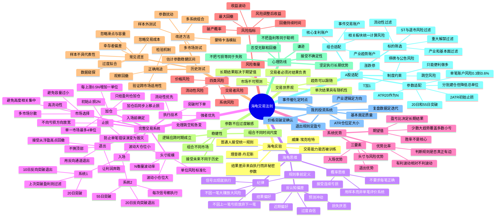

# 《海龟交易法则》思维导图

> 作者：柯蒂斯·费思（Curtis Faith）  
> 阅读目标：把趋势跟踪、概率优势和风险管理转化为适用于 A 股的可执行系统。  
> 核心结论：**海龟真正交易的不是“突破”，而是一个完整的正期望系统。**



## 一条主线理解全书

```text
不预测市场
→ 寻找可重复的价格行为
→ 用突破确认趋势可能开始
→ 用波动率统一每笔风险
→ 只对盈利头寸加仓
→ 用小亏损换取留在市场的资格
→ 用机械退出捕捉少数大趋势
→ 用分散化和回撤控制保证长期生存
→ 用纪律把统计优势转化为真实收益
```

## 原版海龟系统速查表

| 模块 | 系统 1 | 系统 2 |
|---|---|---|
| 入场 | 突破过去 20 日最高价做多；突破过去 20 日最低价做空 | 突破过去 55 日最高价做多；突破过去 55 日最低价做空 |
| 信号过滤 | 如果该市场上一次 20 日突破是盈利信号，则跳过本次；若跳过后出现 55 日突破，则仍按系统 2 入场 | 不过滤，所有信号执行 |
| 加仓 | 每向有利方向运行 0.5N，加 1 单位 | 同左 |
| 单市场上限 | 通常最多 4 单位 | 通常最多 4 单位 |
| 初始止损 | 距入场价 2N | 距入场价 2N |
| 盈利退出 | 多头跌破 10 日最低价；空头突破 10 日最高价 | 多头跌破 20 日最低价；空头突破 20 日最高价 |
| 性格 | 信号更多、假突破更多、退出更快 | 信号更少、趋势尺度更大、持有更久 |

## 对我最重要的五个认知升级

1. **从预测升级为响应**：我不需要预测战争、政策或临床结果最终如何，只需要定义什么价格行为说明市场正在确认我的判断。
2. **从仓位感觉升级为风险预算**：买多少不由“我多看好”决定，而由止损距离和账户可承受损失决定。
3. **从亏损补仓升级为盈利加仓**：错误的方向不增加资本，只有被市场验证的方向才获得更多资本。
4. **从单笔成败升级为系统样本**：一次通源石油盈利不能证明体系成功，一次止损也不能证明体系失效。
5. **从卖在最高点升级为持有完整趋势**：为了获得大趋势，必须接受利润从最高点回撤后才退出。

## A股版海龟的关键改造

原版海龟主要面向高流动性期货，A股个人投资者不能机械照搬。我的改造原则是：

```text
保留：概率思维、突破确认、波动率仓位、盈利加仓、机械止损、趋势退出、组合风控
删除：不加过滤的全市场机械交易、原版高风险单位、做空对称性假设
增加：产业研究、基本面过滤、公告核验、板块联动、涨跌停与T+1风险折扣
```

---

## 参考资料

1. Curtis Faith，《海龟交易法则》（Way of the Turtle）。
2. Original Turtle Trading Rules：https://www.tradingwithrayner.com/wp-content/uploads/2014/11/OriginalTurtleRules.pdf
3. 原版海龟交易法则中文资料：https://qihuoqiquan.com/wp-content/uploads/2025/01/原版海龟交易法则.pdf

> 说明：本思维导图是结构化重述与投资应用，不是原书逐字摘录。
