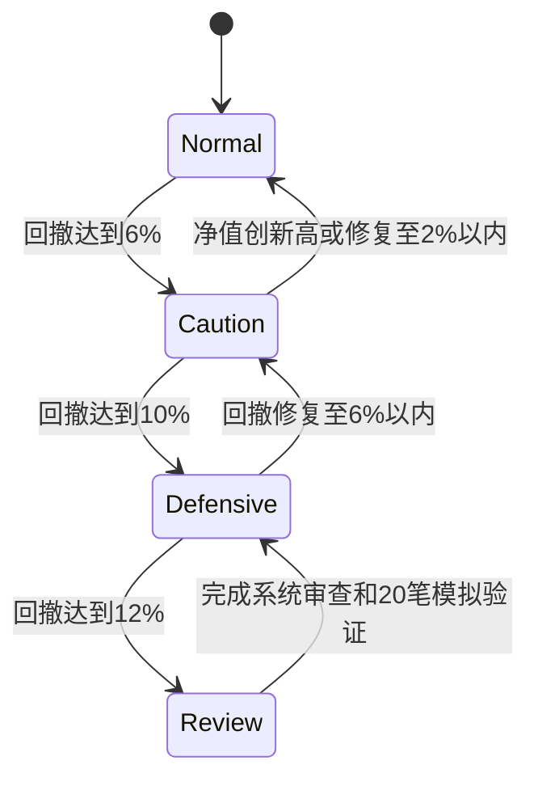
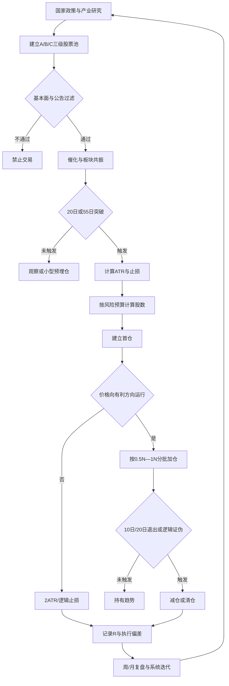

# 基于《海龟交易法则》的个人投资体系 V2.0

> 系统名称：**产业研究增强型海龟系统**  
> 账户基础：100 万元本金  
> 长期目标：用五年建立可复制、可审计、可迭代的职业投资系统，而不是依赖单次行情实现财务自由。  
> 适用市场：A 股为主，重点覆盖创新药、AI 算力、半导体与自主可控、商业航天、周期资源等能力圈。  
> 核心约束：不使用借贷资金重仓股票；不以短期收益替代系统验证；不以一次成功放大风险。

---

# 一、我的投资者定位

我的目标不是成为纯价值投资者、纯题材交易者或纯量化交易者，而是成为：

```text
AI增强型 + 产业驱动型 + 趋势确认型 + 风险预算型 + 复盘迭代型职业投资者
```

我的核心优势：

1. 软件架构背景，擅长把复杂问题拆成模块、接口和状态机；
2. 愿意研究产业、政策、技术路线和公司基本面；
3. 有 100 万元真实本金，可以用受控风险积累样本；
4. 能使用 AI 辅助公告整理、财报比较、产业链映射和交易复盘。

我的主要短板：

1. 容易被热点和短期大涨刺激；
2. 交易纪律尚未经过足够长时间验证；
3. 对创新药、周期品和事件交易的定价能力仍在建设；
4. 对连续亏损和利润回撤的心理承受力尚未量化；
5. 过去部分买卖条件偏主观，例如“洗盘”“主力意图”。

因此，我的体系首先服务于两个目标：

```text
第一目标：控制毁灭风险，保证五年学习期不断档。
第二目标：把主观洞察转化为可重复规则，逐步提高正期望。
```

---

# 二、我的投资哲学

## 2.1 一句话总纲

> **产业逻辑定方向，基本面定质量，事件催化定时点，板块共振定强弱，价格突破定确认，ATR 风险定仓位，退出规则定盈亏，复盘数据定进化。**

## 2.2 八条底层信念

1. 市场不可被稳定预测，但可以被条件化响应；
2. 研究的作用是提高候选质量，不是取消止损；
3. 价格上涨不自动等于价值提高，但持续突破代表供需结构变化；
4. 胜率不是唯一目标，期望值和资金曲线更重要；
5. 小亏损是经营成本，大亏损是系统故障；
6. 只给市场已经验证的方向增加资本；
7. 一次大赚不能证明系统有效，连续样本才能；
8. 资本安全、决策质量和长期复利优先于短期排名。

---

# 三、系统总体架构

我的系统分为五层：

```text
L1 资产与账户层
L2 产业与股票池层
L3 信号与交易层
L4 风险与组合层
L5 数据与复盘层
```

## 3.1 L1：资产与账户层

以 100 万元为例，采用三账户结构：

| 账户 | 目标比例 | 主要任务 | 典型标的 | 主要信号 |
|---|---:|---|---|---|
| 核心复利账户 | 50%—60% | 降低波动、积累长期复利 | 宽基/行业 ETF、高质量龙头、现金流较稳企业 | 55 日突破、基本面趋势、估值与景气 |
| 产业趋势账户 | 25%—35% | 捕捉 3—18 个月产业趋势 | 创新药、AI 算力、半导体、商业航天、周期资源 | 20/55 日突破、板块相对强度、产业催化 |
| 事件交易账户 | 10%—15% | 训练交易能力，捕捉硬催化 | BD 授权、订单、业绩拐点、涨价、地缘主题龙头 | 20 日突破、放量、板块共振、事件窗口 |

### 账户隔离原则

- 事件账户亏损不得侵蚀核心账户；
- 不因短线行情好而挪用核心账户资金追热点；
- 事件账户达到年度亏损上限后暂停；
- 核心账户不因单日波动频繁交易；
- 现金是风险资产的缓冲和未来机会的期权，不视为“踏空”。

## 3.2 初始资金建议

系统建立初期，不立即把所有资金投入市场：

| 部分 | 金额示例 | 作用 |
|---|---:|---|
| 核心与低风险底仓 | 45 万 | 保持长期配置和账户稳定 |
| 产业趋势可用资金 | 25 万 | 分批验证中期趋势系统 |
| 事件交易可用资金 | 10 万 | 高波动交易训练 |
| 现金与机会储备 | 20 万 | 回撤缓冲、未来信号、生活安全垫补充 |

这不是永久比例。只有当交易日志证明系统具有稳定正期望后，才逐步提高主动交易资金比例。

---

# 四、L2：产业与股票池系统

## 4.1 产业优先级

我重点建设以下能力圈：

1. 创新药：临床数据、审批、医保、商业化、BD 授权、现金消耗；
2. AI 算力：芯片、服务器、光模块、液冷、IDC、电力与应用传导；
3. 半导体与自主可控：设备、材料、设计、制造、封测与周期；
4. 商业航天：卫星制造、火箭、地面设备、运营与订单兑现；
5. 周期资源：油气、黄金、铜、煤炭、化工品的供需与价格周期；
6. 国家五年规划及政策支持的产业方向。

## 4.2 股票池三级结构

### A 级：可交易池

必须满足：

- 商业模式和产业位置可解释；
- 无明显财务、监管或退市风险；
- 日均成交额和盘口流动性足够；
- 有明确催化或景气趋势；
- 能定义止损与失败条件；
- 价格信号接近触发。

### B 级：研究池

逻辑可能成立，但存在以下问题之一：

- 催化时间不清；
- 估值透支；
- 价格仍在下降趋势；
- 板块未共振；
- 关键数据待验证。

### C 级：观察池

只有概念、传闻或远期想象，缺乏可核验事实。C 级不得交易。

## 4.3 一票否决项

以下任一情况存在，原则上不得进入趋势交易池：

- 重大财务造假或审计疑点；
- 退市、ST、持续经营重大不确定性；
- 流动性无法支持计划仓位；
- 即将发生无法评估的大额解禁；
- 核心产品临床或审批二元风险，且仓位无法覆盖跳空；
- 主要逻辑仅来自未核实的小作文；
- 管理层诚信存在严重问题；
- 无法写出三条明确失败信号。

---

# 五、L3：信号与交易系统

## 5.1 信号分工

我的交易不是“看到突破就买”，而是四级确认：

```text
一级：产业方向成立
二级：公司质量通过
三级：催化与板块共振
四级：价格触发
```

只有四级条件同时满足，才允许标准仓位入场。若只有价格突破而前三层不足，只能观察或极小仓测试。

## 5.2 快速系统 S1-A

适用于产业趋势账户和事件交易账户。

### 入场条件

必须满足：

1. 收盘或盘中有效突破过去 20 日最高价；
2. 当日成交额不低于过去 20 日成交额中位数，或出现明确换手承接；
3. 所属板块相对强度改善，不能是单股孤立脉冲；
4. 催化有一手资料或高可信来源；
5. 指数环境未处于全面流动性崩溃；
6. 入场后 2ATR 止损对应的账户损失在预算内。

### 系统 1 过滤

原版规则会在上次突破盈利后跳过下一次 20 日信号。A 股个股结构与期货不同，我不机械照搬。我的改造是：

- 上次突破盈利且当前离 55 日新高较远：降低首仓 50%；
- 上次突破失败：新突破仍可执行；
- 连续三次同标的假突破：移出可交易池 20 个交易日；
- 重大新公告出现时，重新初始化信号判断。

## 5.3 慢速系统 S2-A

适用于核心复利账户和中期产业趋势。

### 入场条件

1. 突破过去 55 日最高价；
2. 20 日均线高于或正在上穿 60 日均线；
3. 基本面与产业趋势至少在未来一个季度内不恶化；
4. 相对行业指数处于强势；
5. 估值未完全透支乐观情景；
6. 流动性充足。

### 特点

- 入场更晚；
- 假信号相对少；
- 持有周期更长；
- 适合大市值龙头和 ETF；
- 不追求最低成本。

## 5.4 预埋仓规则

我可以基于深入研究建立小型预埋仓，但必须严格限制：

- 仅限 A 级研究标的；
- 仓位不超过计划标准仓的 25%；
- 风险不超过账户 0.15%；
- 价格未突破前不得连续补仓；
- 突破后才升级为标准首仓；
- 逻辑证伪立即退出。

这使我的产业研究优势可以提前参与，但不会因主观判断承担过大风险。

---

# 六、N、ATR 与仓位公式

## 6.1 基础定义

```text
N = ATR(20)
初始止损距离 = 2N，或最近有效结构低点距离
```

实际使用两者中更合理的一个，但止损不能落在普通日内噪声内，也不能远到使风险失控。

## 6.2 直接风险法

```text
单笔允许损失 = 账户净值 × 风险率
股数 = 单笔允许损失 ÷（入场价 - 止损价）
```

A 股股数向下取整到 100 股整数倍。

## 6.3 风险率表

| 交易类型 | 正常单笔风险 | 回撤期风险 | 说明 |
|---|---:|---:|---|
| 核心趋势 | 0.4%—0.6% | 0.2%—0.3% | 流动性强、基本面较稳 |
| 产业趋势 | 0.3%—0.5% | 0.15%—0.25% | 中期景气和板块趋势 |
| 事件交易 | 0.2%—0.35% | 0.1%—0.18% | 跳空、涨跌停和情绪风险高 |
| 预埋验证 | 0.1%—0.15% | 暂停 | 未获价格确认 |

## 6.4 100 万账户示例

假设：

- 账户净值 100 万元；
- 产业趋势股入场价 50 元；
- ATR20 = 2 元；
- 止损距离 = 2ATR = 4 元；
- 单笔风险率 = 0.4%。

则：

```text
允许损失 = 1,000,000 × 0.4% = 4,000 元
股数 = 4,000 ÷ 4 = 1,000 股
首仓金额 = 50 × 1,000 = 50,000 元
```

虽然首仓只占账户 5%，但已经使用了完整的 0.4% 风险预算。仓位比例低不代表风险低，关键是止损距离和跳空可能性。

## 6.5 跳空风险折扣

对于创新药临床、重大授权、地缘冲突等二元事件：

```text
实际风险率 = 标准风险率 × 跳空折扣
```

建议跳空折扣：

- 一般公告窗口：0.7；
- 临床关键数据前：0.4—0.6；
- 极端地缘事件股：0.5—0.7；
- 财务或监管不确定性高：不交易。

---

# 七、盈利加仓系统

## 7.1 基本原则

- 只给盈利仓加仓；
- 不因跌得便宜补仓；
- 不因新闻更利好临时翻倍；
- 加仓后总风险仍必须可控。

## 7.2 A 股三档结构

| 档位 | 触发 | 目标风险 |
|---|---|---:|
| 首仓 | 20 日或 55 日突破 | 40% 的计划总风险 |
| 第 2 仓 | 比首仓价上涨 0.5N—0.75N | 增加 30% |
| 第 3 仓 | 再上涨 0.75N—1N，且板块继续确认 | 增加 30% |

不使用原版最多 4 单位的高强度配置，原因是 A 股存在 T+1、涨跌停和跳空风险。

## 7.3 加仓后的止损

每次加仓后：

1. 计算所有单位的加权成本；
2. 将早期仓位止损逐步上移；
3. 估算最坏成交滑点；
4. 确保整体理论损失不超过计划风险；
5. 若涨停跳过多个加仓级别，不一次性补齐。

## 7.4 禁止加仓条件

- 所属板块由强转弱；
- 个股放量滞涨或长上影；
- 指数出现系统性风险；
- 重大公告待核验；
- 账户处于回撤降档；
- 加仓会导致风险簇超限；
- 价格已偏离 20 日均线过大，赔率恶化。

---

# 八、止损与退出系统

## 8.1 初始止损

买入前同时下定义：

```text
价格止损：2ATR 或结构失效位
逻辑止损：核心假设被事实证伪
组合止损：账户或板块风险超限
时间止损：催化窗口结束且价格无反应
```

任一强制条件满足，应减仓或退出。

## 8.2 趋势退出

### 快速系统

- 多头跌破过去 10 日最低价退出；
- 或出现更早的硬逻辑失效。

### 慢速系统

- 多头跌破过去 20 日最低价退出；
- 或基本面趋势发生重大恶化。

## 8.3 分层退出

A 股波动大，我采用分层方式：

| 条件 | 动作 |
|---|---|
| 跌破 5 日短线结构且板块转弱 | 减少 1/3 加仓部分 |
| 跌破 10 日低点 | 快速系统退出剩余交易仓 |
| 跌破 20 日低点 | 慢速系统退出 |
| 硬逻辑证伪 | 不等通道，直接执行风险退出 |
| 涨停高潮后巨量长阴 | 先降事件仓，再等待正式信号 |

分层退出不能变成随意卖出。每一层必须在交易计划中事前写明。

## 8.4 卖出后重新入场

止损不是永久看空。满足以下条件可重新买入：

- 新的 20 日或 55 日突破；
- 板块重新共振；
- 失败原因已经消失；
- 新的止损和风险预算可计算；
- 不因“刚卖掉”产生心理抵触。

通源石油 7 月 9 日假突破、7 月 14 日再突破，是重新入场规则的典型样本。

---

# 九、L4：组合风险系统

## 9.1 单票上限

仓位上限不是首要指标，但仍设置硬约束：

| 标的类型 | 单票市值上限 |
|---|---:|
| 核心高质量龙头/ETF | 15%—20% |
| 产业趋势股 | 10%—15% |
| 高波动事件股 | 5%—10% |
| 未盈利 Biotech | 原则上不超过 8%—10% |

只有在长期实盘证明系统有效后，才考虑提高上限。

## 9.2 风险簇上限

| 风险簇 | 最大市值暴露 | 最大止损风险 |
|---|---:|---:|
| 创新药 | 25% | 1.2% |
| AI 算力 | 25% | 1.2% |
| 半导体 | 20% | 1.0% |
| 能源资源 | 20% | 1.0% |
| 商业航天等高波动主题 | 15% | 0.8% |
| 单一事件链 | 15% | 0.7% |

市值暴露与止损风险必须同时满足，取更严格者。

## 9.3 全账户热度

“账户热度”定义为所有持仓同时触发初始止损时的理论损失总和。

```text
正常账户热度 ≤ 3%
高风险市场 ≤ 1.5%
强趋势且盈利垫充足时最高不超过 4%
```

不把浮盈全部视为可随意承担的新风险。

## 9.4 回撤状态机



### Normal：正常状态

- 按标准风险执行；
- 允许三个账户正常运行。

### Caution：警戒状态

- 单笔风险减半；
- 暂停低质量和预埋交易；
- 只做 A 级信号。

### Defensive：防御状态

- 暂停新增事件仓；
- 总账户热度降至 1%；
- 只保留核心仓和极小验证仓。

### Review：审查状态

- 停止主动实盘交易；
- 检查系统失效、执行偏差和市场结构变化；
- 至少完成 20 笔模拟或历史复核后再恢复。

---

# 十、事件交易专用规则

## 10.1 硬催化优先级

从高到低：

1. 交易所公告、监管批文、正式合同；
2. 公司法定披露、临床正式数据、业绩报告；
3. 部委正式政策文件；
4. 权威媒体确认的信息；
5. 行业渠道信息；
6. 社交媒体传闻和小作文。

第 5—6 级不能单独触发标准仓位。

## 10.2 事件模型

```text
事件真实性
× 业绩或资产价值影响
× 市场预期差
× 板块扩散强度
× 价格确认
÷ 跳空和兑现风险
```

## 10.3 事件退出

满足任一条件减仓或清仓：

- 事件被证伪；
- 事件进入兑现日且价格高开低走；
- 板块涨停数量明显减少；
- 龙头放量长阴；
- 国际商品或关键外部变量反转；
- 个股跌破 10 日退出线；
- 预期收益已明显小于剩余风险。

---

# 十一、创新药专用规则

创新药不能只使用 K 线。进入交易池前必须完成：

1. 靶点和适应症；
2. 临床阶段和主要终点；
3. 同类竞争和差异化；
4. NMPA/FDA 审批路径；
5. 已上市产品销售趋势；
6. 现金储备与季度消耗；
7. 未来融资稀释；
8. BD 首付款、里程碑和权益让渡；
9. 市值隐含的乐观程度；
10. 关键失败事件。

## 11.1 迪哲医药应用

- 产业：创新药国际化；
- 硬催化：舒沃哲全球授权；
- 价格确认：7 月 3 日 20 日突破，7 月 15 日 55 日突破；
- 风险：公告跳空、估值、审批、后续兑现；
- 账户：产业趋势账户，不把连续涨停后的追高归入核心复利账户；
- 单笔风险：0.3%—0.5%，公告窗口进一步折扣。

---

# 十二、周期与地缘事件专用规则

必须同时跟踪：

- 国际商品价格；
- 供给中断概率；
- 库存和产能；
- A 股板块联动；
- 目标公司的实际业绩敏感性；
- 事件缓和信号；
- 高换手和情绪周期。

## 12.1 通源石油应用

- 产业：油服与能源安全；
- 催化：中东冲突和油价预期；
- 快速系统：20 日突破；
- 风险：高换手、事件反转、假突破；
- 账户：事件交易账户；
- 单笔风险：0.2%—0.35%；
- 纪律：第一次止损后，新突破出现仍允许重入。

---

# 十三、L5：交易日志与数据系统

## 13.1 每笔交易必须记录

```text
交易编号
日期与时间
股票代码
账户类型
产业与风险簇
入场系统S1-A/S2-A/预埋
核心逻辑
一手资料链接
20日/55日突破价
ATR20
入场价
止损价
风险率
股数与仓位
加仓计划
退出规则
实际成交与滑点
最终盈亏
R倍数
最大有利波动MFE
最大不利波动MAE
是否系统内
执行偏差
复盘结论
```

## 13.2 关键绩效指标

我不只看月收益率，还看：

| 指标 | 作用 |
|---|---|
| 系统内交易占比 | 衡量纪律 |
| 平均 R | 衡量单笔期望 |
| 盈利交易平均 R | 衡量是否让利润奔跑 |
| 亏损交易平均 R | 衡量止损质量 |
| 最大回撤 | 衡量生存风险 |
| 回撤持续时间 | 衡量心理和资金压力 |
| Profit Factor | 总盈利/总亏损 |
| 漏信号率 | 是否因恐惧跳过机会 |
| 过早退出率 | 是否无法持有趋势 |
| 系统外盈利 | 最危险的运气收益 |
| 滑点率 | 回测与实盘差异 |
| 风险簇集中度 | 组合是否伪分散 |

## 13.3 系统是否达标

在至少 50 笔同口径交易前，不轻易下结论。初步达标标准：

- 系统内交易占比 ≥ 90%；
- 平均亏损不差于 -1.1R；
- 盈利交易平均值明显高于亏损绝对值；
- Profit Factor > 1.3；
- 最大回撤处于预设区间；
- 不依赖单一股票贡献全部利润；
- 去掉最赚钱的 3 笔后，系统仍可解释并可生存。

这些是阶段性工程指标，不是收益承诺。

---

# 十四、日、周、月运行流程

## 14.1 每日盘前

1. 检查持仓公告和重大新闻；
2. 更新国际商品、政策和行业变量；
3. 计算 20 日、55 日突破候选；
4. 更新 ATR、止损和加仓价；
5. 检查账户热度和风险簇；
6. 写出当天只允许执行的动作。

## 14.2 盘中

- 只执行预设信号；
- 不因分时波动临时增加风险；
- 记录跳空、涨停、成交滑点；
- 硬公告出现时先核验原文；
- 不用“主力一定洗盘”解释所有下跌。

## 14.3 盘后

1. 更新净值；
2. 更新止损和退出线；
3. 记录交易与未执行信号；
4. 比较板块强弱；
5. 记录持仓假设是否新增或削弱；
6. 不在情绪高峰立即修改系统。

## 14.4 每周复盘

- 本周所有交易按 A/B/C/D 四类分类；
- 检查是否出现亏损补仓；
- 检查是否提前卖出盈利仓；
- 检查系统外交易；
- 检查同板块集中；
- 更新重点产业证据链；
- 选一笔交易做完整复盘。

## 14.5 每月复盘

- 计算收益、回撤、R 分布和 Profit Factor；
- 对比核心、产业、事件三个账户；
- 判断收益来自能力、行情还是单一运气；
- 只调整流程或风险，不因一个月结果优化参数；
- 输出《月度系统健康报告》。

---

# 十五、AI 与量化工具的定位

AI 不替我承担决策责任，但可以提高信息处理效率。

## 15.1 AI 适合做

- 公告和财报结构化摘要；
- 多家公司指标对比；
- 产业链与催化地图；
- 临床试验和政策文件整理；
- 交易日志归因；
- 检查交易计划是否缺项；
- 生成候选清单，但不直接下单。

## 15.2 量化适合做

- 计算 ATR、20/55 日通道；
- 生成突破候选；
- 风险仓位计算；
- 回测和参数扰动；
- 账户热度监控；
- 交易日志统计；
- 告警而非自动重仓。

## 15.3 人必须负责

- 判断资料真实性；
- 理解产业和商业模式；
- 识别不可量化的治理风险；
- 决定系统是否适合当前市场；
- 承担最终买卖与仓位责任。

---

# 十六、我的禁止事项

```text
1. 不借钱炒股，不用消费贷、经营贷或信用贷增加股票风险。
2. 不因一次大赚提高单笔风险上限。
3. 不满仓单一事件股。
4. 不给亏损仓无条件补仓。
5. 不在没有止损计划时买入。
6. 不把小作文作为唯一依据。
7. 不在连续亏损后报复性交易。
8. 不把同板块多票误认为分散。
9. 不为了回本拒绝卖出。
10. 不频繁优化参数迎合近期行情。
11. 不和高频量化竞争毫秒级优势。
12. 不因工作厌倦而把职业投资当作逃避现实的捷径。
```

---

# 十七、五年成长路线

## 第 1 年：系统建立期

目标：不追求高收益，建立数据和纪律。

- 完成 50—100 笔低风险样本；
- 系统内交易占比达到 90%；
- 最大回撤控制在预算内；
- 建立创新药、AI 算力、周期资源三个研究模板；
- 自动化 ATR、突破、仓位和日志统计。

## 第 2 年：稳定验证期

目标：证明系统在不同市场状态下可生存。

- 经历至少一次明显回撤和修复；
- 分析牛市、震荡、下跌三种状态；
- 比较三个账户的真实贡献；
- 淘汰低期望策略；
- 保留 2—3 个最适合自己的模型。

## 第 3 年：规模化期

目标：在不显著提高回撤的情况下扩大有效策略资金。

- 提高核心和产业趋势账户效率；
- 事件账户仍保持严格上限；
- 建立跨行业风险簇模型；
- 形成稳定月度和年度报告。

## 第 4 年：职业压力测试期

目标：验证收益是否可以覆盖生活成本，同时不破坏本金。

- 不提前辞职，仅模拟职业投资现金流压力；
- 预留至少 18—24 个月生活费用；
- 检验低行情年份的生存能力；
- 避免因收入焦虑提高风险。

## 第 5 年：职业决策期

只有同时满足以下条件，才评估全职投资：

1. 至少三年可审计实盘记录；
2. 收益不依赖单一年份或单只股票；
3. 最大回撤可承受；
4. 投资收益在保守情景下可覆盖生活支出；
5. 有独立生活备用金；
6. 系统内交易占比稳定；
7. 家庭财务和心理压力可控；
8. 即使未来两年收益下降，也不会被迫退出市场。

---

# 十八、交易决策模板

## 18.1 买入卡

```text
股票：
代码：
账户：核心 / 产业 / 事件
风险簇：
一句话逻辑：
未来3—12个月催化：
一手资料：
三个支持证据：
三个反对证据：
20日最高价：
55日最高价：
ATR20：
入场触发：
实际入场：
初始止损：
单笔风险率：
首仓股数：
加仓价1：
加仓价2：
10日退出：
20日退出：
逻辑失效：
最坏跳空情景：
```

## 18.2 持仓卡

```text
当前浮盈亏R：
最新止损：
最新退出线：
板块状态：启动 / 加速 / 高潮 / 退潮
逻辑状态：增强 / 不变 / 削弱 / 证伪
是否允许加仓：
账户热度：
下一动作：持有 / 加仓 / 减仓 / 退出
```

## 18.3 复盘卡

```text
是否系统内：
最终R：
最大有利波动MFE：
最大不利波动MAE：
入场是否过早/过晚：
仓位是否正确：
止损是否执行：
是否盈利加仓：
是否过早卖出：
是否受到上一笔结果影响：
能力因素：
运气因素：
唯一最重要改进：
```

---

# 十九、系统总流程图



---

# 二十、我的最终投资宣言

我不要求自己准确预测每一次行情，也不把职业投资建立在一只股票或一次战争事件上。

我的任务是：

```text
在能力圈内研究少数重要产业；
等待市场给出可验证信号；
用小而明确的风险建立头寸；
只给盈利方向增加资本；
在错误时快速退出；
在正确时忍受波动并持有；
用数据区分能力与运气；
用五年时间把系统打磨成可依赖的资本运营能力。
```

真正的海龟精神不是机械崇拜 20 日参数，而是：

> **面对不确定性，仍然使用一致、可验证、可生存的方式行动。**

---

## 版本迭代规则

- V2.0 在《海龟交易法则》基础上增加突破、ATR、R 倍数、盈利加仓和回撤状态机；
- 每季度只允许一次正式版本升级；
- 参数调整必须有至少 50 笔样本或明确制度变化支持；
- 所有修改保留旧版本和修改原因；
- 不允许因单笔盈亏临时改系统。

> 风险提示：本体系是个人学习与风险管理框架，不构成对任何股票的买卖建议，也不保证收益。
