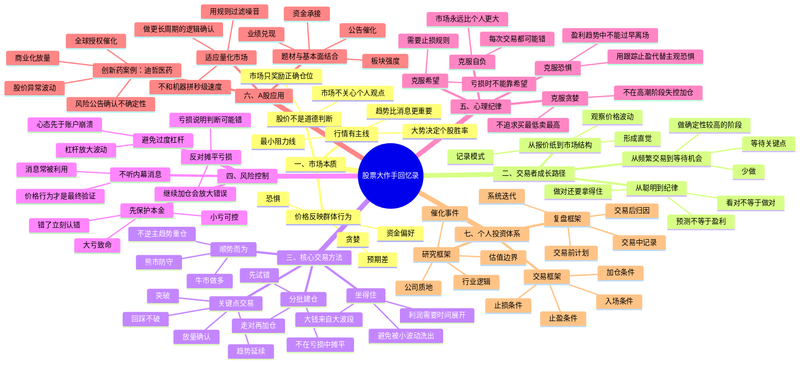

# 《股票大作手回忆录》思维导图

> 说明：本思维导图基于《股票大作手回忆录》的核心思想进行投资化重构，重点服务于 A 股个人投资者的交易体系建设。避免长篇摘录，采用原则化、方法论化表达。

## 一页版记忆

《股票大作手回忆录》的核心不是“预测行情”，而是：

1. **只在最小阻力方向下注。**
2. **用价格确认观点，而不是用观点强迫价格。**
3. **亏损时尽快退出，盈利时尽量坐住。**
4. **不摊平亏损，只在盈利方向加仓。**
5. **大钱来自大趋势，不来自频繁交易。**
6. **交易体系的敌人不是市场，而是希望、恐惧、贪婪和自负。**

