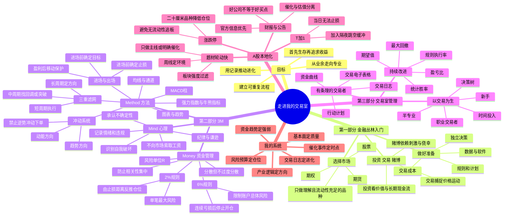

# 《走进我的交易室》思维导图

## 一、Mermaid 思维导图



## 二、文本版层级导图

```text
《走进我的交易室》
├─ 1. 身份选择
│  ├─ 投资：赚企业价值增长的钱
│  ├─ 交易：赚价格趋势与预期差的钱
│  └─ 赌博：用不可控风险换刺激
├─ 2. 成功交易的3M
│  ├─ Mind：心理、自律、客观、谦逊
│  ├─ Method：趋势、动能、系统、进出场
│  └─ Money：风险预算、仓位、账户保护
├─ 3. 方法工具
│  ├─ 三重滤网：长周期方向—中周期机会—短周期执行
│  ├─ 冲动系统：趋势与动能同时确认
│  ├─ 通道/均线：识别价值区和趋势状态
│  └─ 止损/止盈：进场前完成退出设计
├─ 4. 账户生存
│  ├─ 2%规则：单笔错误不能重伤
│  ├─ 6%规则：连续错误时停止开仓
│  ├─ R倍数：统一衡量不同交易
│  └─ 相关性控制：多只同板块股票仍是同一风险
├─ 5. 专业化管理
│  ├─ 每笔有计划
│  ├─ 每笔有记录
│  ├─ 每周有复盘
│  ├─ 每月有审计
│  └─ 只根据样本修改规则
└─ 6. 我的A股应用
   ├─ 产业与政策研究负责“选方向”
   ├─ 基本面负责“选公司”
   ├─ 周线和板块负责“决定是否出手”
   ├─ 日线和分时负责“执行”
   └─ 风险单位负责“活下来”
```

## 三、最重要的因果链

```text
情绪冲动
  → 没有计划地进场
  → 止损位置不清晰
  → 仓位无法计算
  → 亏损后不愿认错
  → 小亏变大亏
  → 为回本而加大风险
  → 账户与心理同时失控
```

反向建立专业流程：

```text
明确交易类型
  → 长周期确认方向
  → 写出催化、入场、失效条件
  → 先定止损和滑点
  → 由风险预算反推仓位
  → 执行后记录
  → 用统计结果迭代系统
```

## 四、我应记住的六个关键词

**自律、系统、概率、风险、记录、谦逊。**
