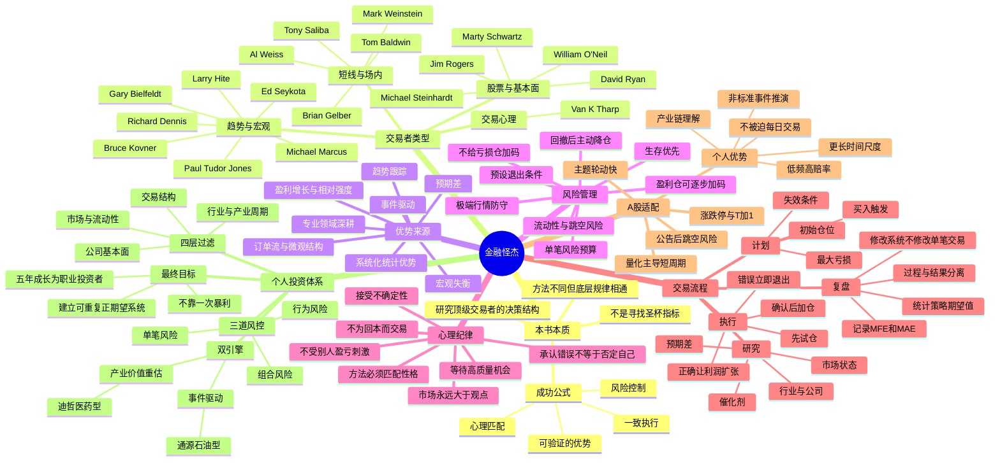

# 《金融怪杰》思维导图

## Mermaid 版本

## 树状提纲版本

- **《金融怪杰》**
  - **本书回答的问题**
    - 为什么完全不同的方法都可能成功？
    - 为什么大多数人知道止损却做不到？
    - 顶级交易者如何处理错误、回撤和不确定性？
    - 哪些能力可以学习，哪些必须根据性格定制？
  - **共同底层结构**
    - 明确优势：知道自己赚的是哪类钱。
    - 风险优先：先定义最多亏多少，再讨论能赚多少。
    - 不对称：小亏、少量中亏、少数大赚。
    - 纪律：交易前制定规则，交易中执行规则。
    - 适配：方法必须与资金规模、时间精力和心理特征相容。
  - **主要方法流派**
    - 趋势跟踪：不猜顶底，跟随大级别趋势。
    - 宏观交易：从货币、利率、商品和政策失衡中寻找机会。
    - 成长股交易：盈利增长、行业领导力、相对强度与突破共振。
    - 价值与预期差：寻找市场共识与真实价值之间的偏差。
    - 场内短线：依赖执行速度、订单流和微观结构。
    - 系统交易：把规则固化，通过大量样本获取统计优势。
  - **风险管理**
    - 单笔风险受限。
    - 亏损仓不摊平。
    - 回撤后降低仓位和频率。
    - 相关性上升时，多个持仓可能是同一笔风险。
    - 遇到无法量化的事件风险，仓位必须更小。
  - **交易心理**
    - 接受亏损是经营成本。
    - 观点只是暂时假设。
    - 不以证明自己正确为目标。
    - 不以回本为交易理由。
    - 无机会时空仓也是决策。
  - **对A股个人投资者的启示**
    - 不与量化拼毫秒级速度。
    - 聚焦周、月、季度级别的产业和事件机会。
    - 用公告、财报、临床数据、产业链变化建立信息优势。
    - 用仓位和退出规则对抗涨跌停、跳空和流动性风险。
    - 把“热点判断”升级为“催化链 + 预期差 + 价格确认”。
