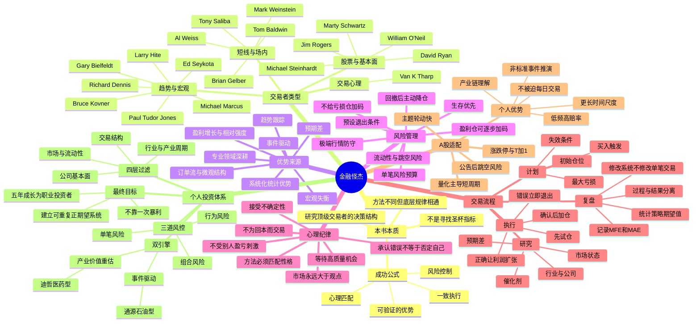

# 《金融怪杰》完整投资学习包

> 合并版；分文件版本更适合长期维护。

---

<!-- 来源文件：00_学习包说明.md -->

# 《金融怪杰》投资学习包

> 对应英文原著：Jack D. Schwager，*Market Wizards: Interviews with Top Traders*。
>
> 版本说明：不同中文版本的译名、章节顺序和删节可能不同。本学习包依据原版/更新版公开书目信息与该书公认的核心访谈框架进行重构，不复制大段原文。
>
> 资料截止：2026-07-24。

## 一、交付内容

1. `01_金融怪杰_思维导图.md`：Mermaid 思维导图，以及不支持 Mermaid 时可阅读的树状提纲。
2. `02_金融怪杰_读书笔记.md`：全书核心思想、代表性交易者、方法差异、共同规律、A股适配与误区。
3. `03_金融怪杰_20条投资原则.md`：每条原则包含含义、执行规则和常见违规行为。
4. `04_金融怪杰_A股案例验证.md`：重点分析迪哲医药，并复盘通源石油事件驱动案例。
5. `05_我的投资体系_金融怪杰版V1.0.md`：结合“事件驱动 + 五年产业逻辑 + 价值重估 + 资金轮动”构建个人投资操作系统。
6. `06_金融怪杰_30天训练计划.md`：把阅读结论转化为可执行训练。

## 二、核心结论

《金融怪杰》不是一本提供统一买卖指标的书。它真正证明的是：

- 顶级交易者的方法可以完全不同，但都必须拥有可解释的优势、严格的风险控制和匹配自身性格的执行方式。
- 交易成功不是“预测准确率最大化”，而是“正期望值 × 风险约束 × 长期一致执行”。
- 最大的敌人通常不是市场，也不是量化机构，而是没有边界的仓位、临场改变规则、亏损后的报复性交易，以及把观点当成事实。
- 个人投资者不需要在速度上击败量化，只需要选择量化不擅长或不愿承担的时间尺度：产业理解、事件链推演、非标准信息整合和耐心等待。

## 三、建议阅读顺序

先读思维导图建立框架，再读完整笔记；随后把20条原则打印或复制到交易记录模板中；案例验证用于理解“同一原则如何落地”；最后执行个人投资体系和30天训练计划。

## 四、使用边界

本学习包用于投资研究与交易训练，不构成任何证券买卖建议。案例中的价格反应属于历史事实，交易计划属于方法演示，不代表对未来收益的承诺。

## 五、主要资料来源

- Wiley：《Market Wizards: Interviews with Top Traders, Updated》
- Google Books：《Market Wizards: Interviews with Top Traders》书目信息与目录
- 迪哲医药2025年年度报告
- 迪哲医药关于舒沃哲一线III期临床试验阳性顶线结果的公告
- 迪哲医药关于与阿斯利康签署授权许可协议暨关联交易的公告
- 迪哲医药股票交易异常波动公告

详细链接列于案例文档末尾。

---

<!-- 来源文件：01_金融怪杰_思维导图.md -->

# 《金融怪杰》思维导图

## Mermaid 版本

## 树状提纲版本

- **《金融怪杰》**
  - **本书回答的问题**
    - 为什么完全不同的方法都可能成功？
    - 为什么大多数人知道止损却做不到？
    - 顶级交易者如何处理错误、回撤和不确定性？
    - 哪些能力可以学习，哪些必须根据性格定制？
  - **共同底层结构**
    - 明确优势：知道自己赚的是哪类钱。
    - 风险优先：先定义最多亏多少，再讨论能赚多少。
    - 不对称：小亏、少量中亏、少数大赚。
    - 纪律：交易前制定规则，交易中执行规则。
    - 适配：方法必须与资金规模、时间精力和心理特征相容。
  - **主要方法流派**
    - 趋势跟踪：不猜顶底，跟随大级别趋势。
    - 宏观交易：从货币、利率、商品和政策失衡中寻找机会。
    - 成长股交易：盈利增长、行业领导力、相对强度与突破共振。
    - 价值与预期差：寻找市场共识与真实价值之间的偏差。
    - 场内短线：依赖执行速度、订单流和微观结构。
    - 系统交易：把规则固化，通过大量样本获取统计优势。
  - **风险管理**
    - 单笔风险受限。
    - 亏损仓不摊平。
    - 回撤后降低仓位和频率。
    - 相关性上升时，多个持仓可能是同一笔风险。
    - 遇到无法量化的事件风险，仓位必须更小。
  - **交易心理**
    - 接受亏损是经营成本。
    - 观点只是暂时假设。
    - 不以证明自己正确为目标。
    - 不以回本为交易理由。
    - 无机会时空仓也是决策。
  - **对A股个人投资者的启示**
    - 不与量化拼毫秒级速度。
    - 聚焦周、月、季度级别的产业和事件机会。
    - 用公告、财报、临床数据、产业链变化建立信息优势。
    - 用仓位和退出规则对抗涨跌停、跳空和流动性风险。
    - 把“热点判断”升级为“催化链 + 预期差 + 价格确认”。

---

<!-- 来源文件：02_金融怪杰_读书笔记.md -->

# 《金融怪杰》读书笔记

## 0. 我的阅读定位

我不是为了复制某位交易大师的指标，而是为了建立一个适合自己的职业投资框架。我的目标不是在每一次交易中都正确，而是在五年内形成稳定、可验证、可扩展的投资能力。

我当前最适合发展的两类能力是：

1. **事件驱动交易**：从政策、战争、供需冲击、临床数据、授权合作等事件中寻找短中期重估机会。
2. **产业价值重估**：围绕未来五年产业逻辑，研究公司基本面、竞争优势和价值兑现路径。

《金融怪杰》对我的最大作用，是在这两类机会之上增加三层约束：**风险预算、价格确认和行为纪律**。

---

## 1. 本书真正讲了什么

表面上，这是一本顶级交易者访谈录；实质上，它是一组“成功交易系统的对照实验”。

这些交易者之间存在大量矛盾：

- 有人只看价格，有人深挖基本面；
- 有人持仓数月，有人几分钟完成交易；
- 有人依赖计算机系统，有人强调直觉；
- 有人分散持仓，有人在极少数机会中集中下注；
- 有人追随趋势，有人寻找反转和预期差。

如果只阅读招式，会得出“什么方法都行”的错误结论。真正应该观察的是：尽管方法不同，他们都完成了以下闭环：

> **优势定义 → 机会筛选 → 风险预算 → 价格触发 → 仓位调整 → 退出 → 复盘。**

顶级交易者的共同点，不是高胜率，也不是神奇预测，而是：

- 知道自己在哪些环境中有优势；
- 在没有优势时减少行动；
- 错误时损失有限；
- 正确时允许利润充分扩张；
- 不让一次失控亏损毁掉长期复利。

---

## 2. 核心公式：方法、风险和心理缺一不可

公开书目信息把全书共同结论概括为“扎实的方法 + 正确的心理态度 = 交易成功”。对实战而言，还应补上风险管理：

> **长期交易结果 = 可验证优势 × 风险控制 × 执行一致性 × 样本数量。**

这不是数学恒等式，而是一个因果结构。

- 没有优势，越努力交易，越快向交易成本和随机波动输送资金。
- 有优势但没有风控，一次尾部事件可以归零。
- 有优势和风控但不能执行，系统只存在于纸面。
- 样本太少，无法区分能力和运气。

因此，判断一个交易者是否成熟，不应只看收益率，还要看：

- 最大回撤；
- 盈亏比；
- 收益是否依赖一两次偶然事件；
- 是否能解释自己的优势；
- 是否能在亏损期继续按规则执行；
- 是否存在可能造成不可逆损失的仓位结构。

---

## 3. 代表性交易者与我的提炼

> 下列内容是对访谈思想的归纳，不是逐字摘录。

### 3.1 Michael Marcus：先活下来，才有资格等大行情

Marcus早期多次遭受重大损失，后来才建立真正的风险意识。他的意义不在于“从小资金做到巨大规模”的传奇，而在于说明：天赋、勤奋和信息都不能替代仓位控制。

我的提炼：

- 初期亏损不必证明不适合交易，但反复以同样方式爆仓，说明没有学习。
- 大行情无法预先确定，唯一能做的是控制前几次试错成本。
- 交易不是一锤子买卖，资金是未来机会的入场券。

### 3.2 Bruce Kovner：宏观逻辑必须接受价格证伪

Kovner代表“基本面研究 + 技术确认 + 严格止损”的宏观交易思路。他并不把宏观分析当成不可推翻的结论，而是把它当成待市场验证的假设。

我的提炼：

- 基本面提供方向和潜在空间，价格行为提供时点和证伪。
- 当市场走势与逻辑不一致时，先减仓，而不是写更多理由。
- 重大事件交易中，止损应在建仓前定义，因为跳空后可能无法从容退出。

### 3.3 Richard Dennis：交易规则可以学习，执行能力难以复制

Dennis相信交易可以被系统化和教授。海龟实验也证明，普通人能够学习规则，但长期结果仍会因执行差异而分化。

我的提炼：

- 系统必须写成可执行条件，而不是“感觉强”“可能启动”。
- 规则越清楚，越能减少临场情绪干扰。
- 知道规则和执行规则是两种能力，后者必须通过小仓位训练。

### 3.4 Paul Tudor Jones：先考虑会亏多少

Jones的交易风格积极，但底层极度重视防守。他不是通过拒绝风险获利，而是通过限定风险获得持续进攻资格。

我的提炼：

- 每一笔交易先写最坏情况。
- 出现连续亏损时，优先缩小仓位，而不是提高赌注。
- 不能因为曾经在某只股票上赚钱，就认为自己持续拥有优势。

### 3.5 Gary Bielfeldt：耐心等待属于自己的重仓机会

Bielfeldt专注于熟悉的市场，在少数高确信机会中承担较大仓位。重点不是“重仓”，而是长期专业化和等待。

我的提炼：

- 集中投资必须建立在专业深度、赔率和风险上限之上。
- 没有长期研究积累的重仓，只是情绪放大。
- 对个人投资者而言，研究十个行业通常不如真正理解两个行业。

### 3.6 Ed Seykota：系统会失效，情绪会篡改系统

Seykota是系统化趋势交易代表。他提醒投资者：人们表面上想赚钱，实际上常通过交易满足刺激、证明、控制感或自我惩罚等心理需求。

我的提炼：

- 交易系统不仅要适应市场，也要适应自己。
- 如果一个系统让自己无法入睡，仓位或周期就不匹配。
- 临场取消止损、频繁看盘、追涨杀跌，往往不是技术问题，而是情绪需求。

### 3.7 Larry Hite：所有策略都必须先通过“会不会死”测试

Hite的思想以风险约束为核心。再好的机会，只要存在一次性致命风险，就不值得用过大仓位参与。

我的提炼：

- 不预测最坏事件是否发生，只评估发生后能否生存。
- 单笔仓位应由止损距离决定，而不是由信心决定。
- 高胜率策略也可能隐藏巨大尾部风险，例如无保护卖出期权、连续摊平和高杠杆套利。

### 3.8 Michael Steinhardt：超额收益来自“差异化认知”

Steinhardt强调与共识不同、且最终被事实证明更接近真实的观点。仅仅逆向并不构成优势，关键是拥有更好的证据链。

我的提炼：

- 预期差不是“别人看多我看空”，而是市场定价隐含假设与事实之间存在偏差。
- 独立思考必须能够写出：市场共识是什么、我为什么不同、什么事实会证明我错。
- 在迪哲医药这类创新药公司中，预期差可能来自临床成功概率、适应症空间、BD条款质量和商业化效率，而不是简单的市盈率高低。

### 3.9 William O'Neil：基本面增长与价格强度应相互验证

O'Neil将盈利增长、行业地位、机构需求和价格突破结合起来。他的价值在于打破“基本面和技术面只能二选一”的错误对立。

我的提炼：

- 好公司不等于任何价格都可以买。
- 真正的强势股通常同时具备业绩或产业催化、相对强度和成交量确认。
- 弱势市场中，个股突破失败率上升，应降低仓位或等待市场环境改善。

### 3.10 David Ryan：研究要像寻宝，但买入不能只靠故事

Ryan强调深度研究和寻找领先公司，同时重视价格行为和退出纪律。

我的提炼：

- 产业研究解决“买什么”，交易结构解决“何时买”。
- 公司故事越复杂，越要建立里程碑清单。
- 研究优势只有在市场尚未充分定价时才有价值。

### 3.11 Marty Schwartz：从分析师转向交易者，需要接受市场反馈

Schwartz曾经擅长分析，却在实际交易中遭受挫折，后来通过技术规则、仓位和纪律取得成功。

我的提炼：

- “分析正确”与“交易赚钱”之间存在巨大距离。
- 交易结果由方向、时点、仓位、路径共同决定。
- 投资者不能用长期逻辑为错误的短线买点辩护，也不能用短线波动否定未被破坏的长期逻辑。

### 3.12 Jim Rogers：真正的大机会来自重大失衡

Rogers倾向于从全球宏观、供需和政策失衡中寻找大趋势。他强调等待少数真正看懂的机会。

我的提炼：

- 战争、能源、货币和政策事件必须分析传导链，而不是只看新闻标题。
- 通源石油式机会的完整链条应是：地缘冲突 → 原油风险溢价 → 上游资本开支/油服预期 → 板块资金 → 个股弹性。
- 任何一环断裂，都可能导致逻辑失效。

### 3.13 Mark Weinstein：高胜率背后是极端选择性

Weinstein以高胜率著称，但高胜率并不意味着频繁交易。相反，它来自严格等待、只参与最有把握的环境。

我的提炼：

- 想提高胜率，首先减少低质量交易。
- 盘中每个波动都参与，不可能保持高胜率。
- 交易频率应该由机会密度决定，而不是由空闲时间决定。

### 3.14 Brian Gelber、Tom Baldwin、Tony Saliba：短线优势高度依赖微观结构

场内交易者的优势来自订单流、速度、经验和对特定市场的极端熟悉。这类能力在现代电子化和量化市场中更难由普通个人复制。

我的提炼：

- 不应照搬场内高手的高频操作方式。
- 个人投资者的劣势是速度、手续费和信息延迟；优势是不受考核、可以空仓、可以持有更长周期。
- 与量化对抗的正确方式，不是在一分钟级别更快，而是在周、月、季度级别拥有更完整的产业和事件认知。

### 3.15 Al Weiss：市场存在可研究的重复结构，但不能迷信图形

市场会重复出现由人性、周期和资金行为形成的结构。然而图形只有与样本统计和风险规则结合，才具有交易意义。

我的提炼：

- 不能因为形态“像过去”就重仓。
- 需要统计该形态在特定市场环境、板块和成交量条件下的成功率。
- 任何技术形态都必须有明确失效点。

### 3.16 Van K. Tharp：仓位管理决定系统能否被长期执行

心理学部分提醒我们，投资者常把仓位问题误判为选股问题。仓位过大时，正常波动也会被体验为灾难。

我的提炼：

- 交易前焦虑过强，通常说明仓位超出心理承受范围。
- 止损设置必须与波动率和持有周期匹配。
- 职业化不是完全没有情绪，而是建立不依赖情绪的决策程序。

---

## 4. 顶级交易者的十个共同结构

### 4.1 他们都有明确的“能力圈”

能力圈不是只懂某个行业，而是知道在什么市场、什么周期、什么信号组合下，自己的判断具有统计优势。

### 4.2 他们把亏损看作经营成本

亏损本身不是失败。未经计划的亏损、扩大中的亏损和无法解释的亏损才是失败。

### 4.3 他们不平均对待所有机会

低质量机会可以放弃；中等机会小仓试错；高质量机会在价格确认后增加仓位。仓位是观点质量的函数，但必须受组合风险上限约束。

### 4.4 他们不把预测当作承诺

所有观点都是可撤销假设。价格、基本面或事件进展与假设冲突时，需要修正，而不是维护自尊。

### 4.5 他们有耐心，也有果断

耐心用于等待；果断用于执行。很多普通投资者恰好相反：无机会时频繁操作，真正需要止损时却犹豫。

### 4.6 他们让大盈利承担全年收益

长期收益常由少数大行情贡献。过早止盈会破坏正期望结构；但“让利润奔跑”必须以移动止损或逻辑跟踪为基础，不能变成永不卖出。

### 4.7 他们主动管理回撤

回撤不仅减少资金，还会改变心理状态。连续亏损后降低仓位，可以同时保护资本和决策质量。

### 4.8 他们记录并研究自己的错误

真正有价值的复盘不是解释昨天为什么涨跌，而是统计：哪些信号有效、哪些环境失败、自己最常违反哪条规则。

### 4.9 他们接受方法会阶段性失效

市场结构变化后，系统可能进入不利期。正确做法是按预设阈值降仓、检验样本和调整参数，而不是在一笔交易中临时发明新规则。

### 4.10 他们最终形成个人化方法

可以学习别人的原则，但不能完整复制别人的系统。时间精力、资金规模、风险承受、信息来源和心理特征不同，最终系统必然不同。

---

## 5. A股市场中的特殊适配

### 5.1 涨跌停和T+1改变止损方式

A股可能出现隔夜消息、跳空和无法即时卖出的情况，因此不能只依赖盘中止损。必须通过更小的初始仓位、分批建仓和事件前降仓控制跳空风险。

### 5.2 题材轮动快，必须区分“逻辑”和“资金”

逻辑成立但没有资金，短线可能不涨；资金推动但逻辑不足，行情可能快速结束。短线交易必须同时跟踪板块强度、涨停扩散、成交量和个股承接。

### 5.3 量化主导短周期，不意味着个人投资者没有优势

量化在毫秒至日内层面占优，但个人投资者可以选择：

- 公告和产业数据的深度解释；
- 一周至一季度的事件链；
- 五年产业趋势中的阶段性重估；
- 低频、高赔率、可空仓的策略。

### 5.4 公告不是买入理由，预期差才是

公告发布后，需要判断：

- 事件是否超出市场原有预期；
- 价值增量能否量化；
- 是否存在审批、兑现或会计确认风险；
- 股价是否已经一次性反映全部乐观预期；
- 后续是否还有连续催化。

---

## 6. 我最需要修正的五个问题

1. **把宏大逻辑当作买点。** 应增加价格触发和失效条件。
2. **赚钱后容易放大自信。** 单笔成功不能证明系统有效，至少需要同类策略30笔以上样本。
3. **容易被热点吸引。** 只交易自己能写出完整传导链的热点。
4. **对持有周期定义不清。** 事件驱动仓和产业重估仓必须分开管理。
5. **容易关注收益而忽略风险。** 每笔交易必须先计算最大亏损金额。

---

## 7. 一句话总结

《金融怪杰》给我的最终答案不是“如何预测下一只牛股”，而是：

> **建立一种即使经常犯错，也不会被市场淘汰，并能在真正看对时获得足够收益的系统。**

---

<!-- 来源文件：03_金融怪杰_20条投资原则.md -->

# 《金融怪杰》提炼的20条投资原则

## 原则1：生存优先于收益

**含义**：任何策略先通过“最坏情况下是否还能继续交易”的测试。

**执行规则**：禁止使用可能导致永久性本金损失的杠杆结构；单笔交易预期亏损不得破坏组合生存。

**常见违规**：满仓单股、融资追高、连续摊平、把止损取消。

---

## 原则2：先定义风险，再计算收益

**含义**：买入前必须知道错在哪里、最多亏多少。

**执行规则**：每笔交易写明入场价、失效条件、止损距离、允许亏损金额和仓位。

**常见违规**：先买后研究；跌了再决定怎么办。

---

## 原则3：仓位由风险距离决定，不由信心决定

**含义**：信心无法精确量化，止损距离和最大风险可以量化。

**执行规则**：仓位金额 = 单笔允许亏损金额 ÷ 止损幅度。

**常见违规**：越看好越满仓，却没有更严格的证据要求。

---

## 原则4：绝不向失控的亏损仓位加码

**含义**：价格逆向且逻辑受损时，加仓会同时放大判断错误和风险暴露。

**执行规则**：只有基本面未破坏、价格重新确认、且总风险仍受限时才允许二次建仓；禁止机械摊低成本。

**常见违规**：把“长期投资”作为不止损的借口。

---

## 原则5：允许盈利仓位扩张

**含义**：长期收益常由少数大盈利贡献。

**执行规则**：趋势和逻辑继续强化时，通过移动保护线、分批止盈或确认后加仓管理，而非一次性全部卖出。

**常见违规**：赚5%立即卖出，亏20%长期持有。

---

## 原则6：市场反馈高于个人观点

**含义**：观点只是待验证假设，市场没有义务证明我正确。

**执行规则**：当价格、成交量、板块或基本面持续与预期冲突时，先降仓再研究。

**常见违规**：通过不断寻找支持材料维护原观点。

---

## 原则7：没有统一圣杯，只有匹配自己的方法

**含义**：趋势、价值、事件和短线都可能有效，前提是与性格、时间和资源匹配。

**执行规则**：选择最多两类主策略，明确不做的交易。

**常见违规**：今天学打板，明天做价值，后天追宏观商品。

---

## 原则8：交易优势必须能被一句话解释

**含义**：不知道赚谁的钱，就无法判断优势何时消失。

**执行规则**：每个策略写出“市场为何会错误定价、我凭什么更早识别、价格何时确认”。

**常见违规**：把“感觉会涨”当作策略。

---

## 原则9：独立思考不等于机械逆向

**含义**：与共识不同本身没有价值，只有更好的证据链才构成预期差。

**执行规则**：写出市场共识、我的差异观点、证据、证伪条件和潜在催化。

**常见违规**：因为跌得多就认为低估，因为别人看空就盲目抄底。

---

## 原则10：基本面决定空间，价格行为决定时点

**含义**：公司研究和交易结构不是对立关系。

**执行规则**：产业与公司逻辑通过后，仍需等待趋势、突破、承接或回踩确认。

**常见违规**：仅因公司优秀就在下跌趋势中不断买入。

---

## 原则11：只在高质量机会中承担显著风险

**含义**：提高胜率的主要方式是减少交易，而不是增加指标。

**执行规则**：综合评分低于75分不建正式仓；60—74分只观察或极小试仓。

**常见违规**：为了每天有操作而降低标准。

---

## 原则12：交易频率由机会密度决定

**含义**：空仓不是没有工作，而是在保存风险预算。

**执行规则**：无明确催化、无价格确认、赔率不足时保持现金。

**常见违规**：因无聊、焦虑或害怕踏空而交易。

---

## 原则13：回撤后先降仓，不急于回本

**含义**：连续亏损会降低决策质量，报复性交易会扩大回撤。

**执行规则**：组合从高点回撤5%降低单笔风险；回撤8%暂停新增高波动仓；回撤12%进入系统审计。

**常见违规**：亏损后提高仓位，试图一笔赚回。

---

## 原则14：相关持仓要合并计算风险

**含义**：持有五只创新药并不等于分散，它们可能受同一政策和风格因子驱动。

**执行规则**：按行业、主题、宏观因子和流动性因子计算组合暴露。

**常见违规**：只看股票数量，不看风险来源。

---

## 原则15：事件交易必须写完整传导链

**含义**：新闻标题与上市公司利润之间通常隔着多个环节。

**执行规则**：事件 → 变量变化 → 行业影响 → 公司受益 → 财务兑现 → 市场预期差 → 价格确认。

**常见违规**：看到战争买军工、看到油涨买任何油气股。

---

## 原则16：区分逻辑失效和正常波动

**含义**：长期仓不能被短线噪声轻易洗出，短线仓也不能借长期逻辑拖延止损。

**执行规则**：为不同策略定义不同退出条件；不得中途改变持仓性质。

**常见违规**：短线被套后改称长期投资。

---

## 原则17：重大事件前降低不可控风险

**含义**：临床数据、监管审批、战争升级和财报可能造成跳空。

**执行规则**：事件前仓位必须满足“即使出现极端不利跳空，损失仍在组合承受范围内”。

**常见违规**：用满仓赌二元结果。

---

## 原则18：复盘评价过程，不只评价结果

**含义**：好交易可能亏钱，坏交易也可能赚钱。

**执行规则**：分别记录逻辑质量、计划完整性、执行偏差和最终结果。

**常见违规**：赚钱就认为正确，亏钱就全盘否定。

---

## 原则19：系统修改必须基于样本，不基于单笔情绪

**含义**：任何策略都有连亏期，不能因一笔损失随意更换规则。

**执行规则**：至少累计30笔同类交易，分析胜率、盈亏比、期望值、最大连续亏损和市场环境。

**常见违规**：今天止损后，明天取消止损规则。

---

## 原则20：职业化的标准是可重复，而不是偶然暴利

**含义**：一次翻倍可能来自运气，稳定执行正期望系统才是职业能力。

**执行规则**：年度目标优先考核最大回撤、规则执行率和策略期望值，再考核收益率。

**常见违规**：以月度暴利作为能力证明，忽略尾部风险。

---

# 20条原则压缩版

1. 生存第一。  
2. 先算亏损。  
3. 风险决定仓位。  
4. 不摊平失控亏损。  
5. 让盈利扩张。  
6. 市场高于观点。  
7. 方法必须匹配自己。  
8. 优势必须可解释。  
9. 独立而非盲目逆向。  
10. 基本面定空间，价格定时点。  
11. 只做高质量机会。  
12. 无机会就空仓。  
13. 回撤后降仓。  
14. 合并计算相关风险。  
15. 事件必须有传导链。  
16. 区分噪声与失效。  
17. 控制事件跳空风险。  
18. 评价过程而非只看盈亏。  
19. 用样本修改系统。  
20. 追求可重复复利。

---

<!-- 来源文件：04_金融怪杰_A股案例验证.md -->

# 《金融怪杰》A股真实案例验证

> 重点案例：迪哲医药（688192.SH，用户曾写作“迪泽医药”，本文件统一使用正式名称“迪哲医药”）。
>
> 资料截止：2026-07-24。以下为方法论验证，不构成买卖建议。

---

# 案例一：迪哲医药——从研发故事到全球价值验证

## 1. 事实时间线

### 1.1 2025年：商业化开始放量，但仍处于高投入亏损期

迪哲医药2025年实现销售收入8.01亿元，同比增长122.60%；研发投入8.56亿元，占营业收入106.80%；归属于上市公司股东的净亏损7.64亿元，较上年减亏0.82亿元。公司已有舒沃哲和高瑞哲两款产品商业化，但仍未实现盈利。

这组数据说明公司处于典型的创新药价值跃迁阶段：

- 收入增长证明产品开始获得市场验证；
- 研发投入仍高于收入，说明短期利润表不适合用传统成熟药企PE解释；
- 商业化效率、后续适应症、海外授权和管线成功概率，才是估值核心。

### 1.2 2025年再融资：降低生存风险

公司完成向特定对象发行后，总股本由417,648,086股增加至461,187,894股；资产负债率由期初88.36%下降至期末56.85%。

对《金融怪杰》而言，这一变化首先不是“利好题材”，而是**风险结构改善**：创新药公司最重要的风险之一是现金不足导致研发节奏被迫中断。融资会稀释股份，但也提高公司穿越临床和商业化周期的生存概率。

### 1.3 2026年3月：悟空28 III期临床达到主要终点

公司公告称，舒沃哲单药一线治疗EGFR exon20ins晚期非小细胞肺癌的国际多中心III期研究“悟空28”达到主要研究终点，取得阳性顶线结果。

这一事件使价值判断从“可能成功”推进到“关键临床证据得到验证”。对创新药估值而言，临床成功概率和潜在适应症空间发生实质变化。

### 1.4 2026年7月：与阿斯利康签署全球独家许可协议

迪哲医药授予阿斯利康全球独家开发和商业化舒沃哲的权利。公告披露的经济条款包括：

- 一次性、不可返还首付款6亿美元；
- 最高4亿美元临床开发里程碑；
- 最高5亿美元销售里程碑；
- 按全球销售额获得最高至低双位数的阶梯式特许权使用费。

这不是简单的市场情绪催化，而是外部大型药企用真金白银对产品全球价值进行验证。但里程碑和特许权使用费仍取决于后续研发、审批和销售条件，不能把合同上限直接当作确定利润。

### 1.5 股价反应：信息增量快速定价

2026年7月14日，相关公告发布后，迪哲医药盘中触及20%涨停，涨停价56.33元。公司随后披露，7月13日至15日连续三个交易日收盘价格涨幅偏离值累计达到30%，构成异常波动。

这说明A股在重大、可量化、超预期事件出现后，价格可能在极短时间内完成第一阶段重估。个人投资者无法依靠反应速度稳定击败量化和专业资金，必须通过事前研究或等待事后结构重新稳定来参与。

---

## 2. 用《金融怪杰》原则验证

### 原则A：差异化认知必须建立在证据链上

**验证结果：成立。**

在2026年3月III期阳性结果之前，投资逻辑主要依赖临床成功预期；阳性结果后，关键风险下降；7月授权协议进一步完成外部商业验证。

真正的差异化认知不是“创新药会涨”，而是提前回答：

1. 舒沃哲的临床差异化是否足够强？
2. 一线适应症成功后，潜在市场空间增加多少？
3. 大药企是否愿意支付高额首付款？
4. 公司保留了多少后续经济权益？
5. 市场当前估值隐含了多高成功概率？

只有在这些问题上比市场更准确，才构成Steinhardt式“预期差”。

### 原则B：基本面决定空间，价格决定时点

**验证结果：成立。**

III期阳性和授权协议改变了基本面价值区间，但公告后瞬间涨停意味着短线买入成本和风险结构同步变化。

正确做法不是机械追涨，也不是因为涨幅大就否定基本面，而是分开处理：

- **价值判断**：公司是否从亏损Biotech转向“产品销售 + 全球授权 + 管线期权”平台？
- **交易判断**：当前价格是否已反映大部分乐观预期？是否形成可定义风险的买点？

### 原则C：事件交易必须控制跳空风险

**验证结果：成立。**

重大临床和BD事件具有二元性。事件前满仓押注，结果正确可能获得暴利，结果错误可能遭遇无法及时退出的跳空损失。

按照《金融怪杰》原则，事件前仓位应由失败情景决定。例如，若假设极端不利跳空20%，而单笔允许损失为总资金0.5%，则事件前仓位上限约为总资金2.5%。这只是风险示例，实际还要考虑连续跌停和流动性。

### 原则D：不能把合同上限当作确定价值

**验证结果：成立。**

6亿美元首付款确定性较高，但里程碑款项和销售分成取决于条件达成。成熟交易者会拆分价值：

- 确定性较高的首付款；
- 按成功概率折现的临床和销售里程碑；
- 按销售峰值、利润率、专利期和分成比例估算的特许权使用费；
- 其他管线的期权价值；
- 研发失败、竞争、审批和商业化风险。

### 原则E：涨停不是风险消失，而是风险转移

**验证结果：成立。**

公告后涨停证明事件超预期，但也意味着低位持有者获得更好安全垫，新追入者承担更高预期和更大的波动风险。价格越高，未来需要兑现的基本面越多。

---

## 3. 迪哲医药的正确估值框架

传统PE不适合尚未盈利、研发费用高、拥有多条管线的创新药公司。更合理的是SOTP：

> **企业价值 = 现金及确定性首付款 + 已上市产品风险调整价值 + 舒沃哲全球授权价值 + 其他管线rNPV - 经营与研发资金消耗 - 失败风险折价。**

### 3.1 已上市产品

关注：

- 医保后销售放量速度；
- 患者渗透率；
- 适应症扩展；
- 销售费用率变化；
- 竞争产品和指南地位。

### 3.2 舒沃哲全球授权

关注：

- 首付款到账与会计确认；
- 一线适应症中美审批；
- 阿斯利康全球开发与销售投入；
- 里程碑触发条件；
- 销售分成区间；
- 全球峰值销售预期。

### 3.3 后续管线

关注DZD6008、birelentinib等管线的临床进展。不能因一项BD成功，就默认所有管线拥有相同成功率。

---

## 4. 迪哲医药的交易分层示例

### 4.1 产业价值重估仓

适用于看好3—24个月价值兑现的投资者。

- 建仓依据：临床、授权、销售和管线价值共同提升。
- 主要退出：关键临床失败、审批受阻、销售显著低于预期、现金消耗恶化、估值透支。
- 交易方式：分批建仓，避免公告后单点重仓。

### 4.2 事件交易仓

适用于公告后数日到数周的价格重估。

- 建仓依据：事件超预期 + 板块强度 + 成交量承接 + 价格结构。
- 主要退出：跌破事件日关键承接区、板块退潮、放量冲高回落、预期快速兑现。
- 交易方式：仓位小于长期仓，止损更严格，不得被套后改成长期投资。

### 4.3 明确不做的情形

- 仅因连续涨停而追入；
- 不理解BD条款，只看合同总额；
- 用短期股价波动推断临床价值；
- 把所有创新药公司当作同质化板块；
- 因看好产业而忽略公司估值和现金消耗。

---

# 案例二：通源石油——事件驱动的正确与不足

> 本部分依据用户此前对本人交易的复盘记录：在地缘冲突升级、原油上涨、油气板块资金启动、通源石油低位放量和分时承接等条件下买入，随后获得较大浮盈。

## 1. 正确之处

### 1.1 不是孤立看个股，而是构建传导链

地缘冲突 → 原油风险溢价 → 油气板块资金寻找弹性 → 油服公司受益预期 → 通源石油低位放量。

这符合Jim Rogers式宏观失衡分析，也符合《金融怪杰》强调的“先找到大变量，再选择表达工具”。

### 1.2 同时观察基本事件和价格确认

不仅关注战争新闻，也观察布油走势、同板块个股启动、通源石油成交量和分时承接。这避免了只凭新闻标题交易。

### 1.3 选择具有弹性的交易标的

事件驱动策略追求的是预期变化的价格弹性，不一定是行业基本面最稳健的公司。通源石油作为油服弹性标的，与短线策略相匹配。

## 2. 不足之处

### 2.1 退出条件不够量化

“战争有停手迹象”“板块资金大量流出”方向正确，但需要进一步量化：

- 原油期货跌破何种结构；
- 板块涨停家数下降到什么程度；
- 个股跌破哪一条价格或成交量条件；
- 盈利回撤多少必须减仓。

### 2.2 宏观事件存在突然反转风险

停火、外交谈判、航道恢复、油价干预都可能造成隔夜跳空。持仓越接近关键事件节点，仓位越应下降。

### 2.3 盈利容易强化自信

一次20%盈利不能证明策略成熟。需要积累至少30笔同类事件交易，统计：

- 事件判断准确率；
- 买入后最大不利波动；
- 平均盈利和平均亏损；
- 催化持续时间；
- 最有效的退出信号。

## 3. 用《金融怪杰》升级后的事件交易模板

1. **事件**：发生了什么，是否可持续？
2. **关键变量**：油价、运价、利率、药品成功概率等哪个变量发生变化？
3. **传导链**：如何影响行业利润或估值？
4. **预期差**：市场已经反映多少？
5. **板块验证**：是否有扩散和资金共振？
6. **个股选择**：弹性、流动性、位置、基本面风险如何？
7. **入场触发**：突破、回踩、承接还是公告后换手？
8. **失效条件**：事件、板块和个股分别怎样算失效？
9. **仓位**：由最坏跳空和止损距离决定。
10. **退出**：分批止盈、移动保护和时间止损。

---

# 两个案例的统一结论

| 维度 | 迪哲医药 | 通源石油 |
|---|---|---|
| 策略类型 | 产业价值重估 + 事件催化 | 地缘事件驱动 |
| 核心变量 | 临床成功、BD条款、销售兑现 | 战争进程、油价、板块资金 |
| 适合周期 | 数周至数年，分层持仓 | 数日到数周 |
| 最大风险 | 临床/审批/商业化、估值透支 | 事件反转、油价回落、题材退潮 |
| 建仓方式 | 研究先行、分批确认 | 事件链确认、快速试仓 |
| 退出标准 | 基本面里程碑与估值 | 事件、板块和价格结构 |
| 最忌讳 | 用短线波动否定长期逻辑 | 被套后改成长线 |

《金融怪杰》的核心不是要求两类交易使用同一套止损，而是要求：**每一类策略都有独立、完整、可执行的规则。**

---

# 主要公开资料

1. Wiley，*Market Wizards: Interviews with Top Traders, Updated*：https://www.wiley.com/en-us/shop/general-finance-investments/market-wizards-interviews-with-top-traders-updated-p-9781118273050
2. Google Books，*Market Wizards: Interviews with Top Traders*：https://books.google.com/books/about/Market_Wizards.html?id=YFffQ6JgMZ0C
3. 迪哲医药2025年年度报告：https://stockmc.xueqiu.com/202603/688192_20260331_HJPD.pdf
4. 舒沃哲一线III期临床阳性顶线结果公告：https://www.dizalpharma.com/static/pdf/688192_%E8%BF%AA%E5%93%B2%E5%8C%BB%E8%8D%AF_2026-03-23_%E8%BF%AA%E5%93%B2%E5%8C%BB%E8%8D%AF%EF%BC%9A%E8%87%AA%E6%84%BF%E6%8A%AB%E9%9C%B2%E5%85%B3%E4%BA%8E%E8%88%92%E6%B2%83%E5%93%B2%E5%8D%95%E8%8D%AF%E4%B8%80%E7%BA%BF%E6%B2%BB%E7%96%97EGFRexon20ins%E9%9D%9E%E5%B0%8F%E7%BB%86%E8%83%9E%E8%82%BA%E7%99%8C%E5%9B%BD%E9%99%85%E5%A4%9A%E4%B8%AD%E5%BF%83III%E6%9C%9F%E4%B8%B4%E5%BA%8A%E8%AF%95%E9%AA%8C%E8%8E%B7%E9%98%B3%E6%80%A7%E9%A1%B6%E7%BA%BF.pdf
5. 与阿斯利康签署授权许可协议公告：https://www.dizalpharma.com/static/pdf/688192_20260714_LOKU.pdf
6. 股票交易异常波动公告：https://www.dizalpharma.com/static/pdf/688192_20260716_QX6I.pdf

---

<!-- 来源文件：05_我的投资体系_金融怪杰版V1.0.md -->

# 我的投资体系——《金融怪杰》版 V1.0

## 1. 投资目标

### 1.1 长期目标

在五年内由有经验的个人投资者成长为具备职业化研究、风险控制和复盘能力的投资者。

### 1.2 第一目标不是高收益，而是稳定生存

优先级如下：

1. 不发生不可逆本金损失；
2. 建立可重复的正期望策略；
3. 控制年度最大回撤；
4. 在优势机会中获得超额收益；
5. 扩大资金规模和策略容量。

### 1.3 目标收益的正确表达

不设“每月必须赚多少”的刚性目标，因为这会诱发过度交易。年度考核采用四项指标：

- 规则执行率；
- 最大回撤；
- 策略期望值；
- 年度收益率。

---

## 2. 我的能力定位

### 2.1 主策略A：事件驱动

典型案例：通源石油。

**优势来源**：

- 对宏观事件、政策和产业链的快速理解；
- 能把新闻转化为变量和受益链；
- 能结合板块强度、价格和成交量确认；
- 持有周期为数日到数周，不与量化拼日内速度。

**主要事件类型**：

- 地缘战争和能源供给冲击；
- 国家政策和产业规划；
- 公司重大合同、资产重组和业绩拐点；
- 创新药临床、审批和BD授权；
- 商品价格和运价变化。

### 2.2 主策略B：五年产业逻辑下的价值重估

典型案例：迪哲医药。

**优势来源**：

- 研究产业趋势、竞争壁垒和公司价值兑现路径；
- 用财报、临床数据、产品周期和商业模式构建估值；
- 接受数月到数年的持有周期；
- 在市场低估或关键里程碑后分批建立仓位。

**重点方向**：

- 创新药；
- AI算力与大模型；
- 半导体；
- 商业航天；
- 脑机接口；
- 国家五年规划中的战略产业。

### 2.3 明确不做

- 纯情绪打板；
- 无法解释利润传导的题材；
- 高频日内交易；
- 无保护的卖出期权；
- 高杠杆融资追涨；
- 亏损后无条件摊平；
- 同时研究和交易过多互不相关的行业。

---

## 3. 四层研究框架

## 第一层：市场与流动性

回答：当前市场是否适合承担风险？

观察：

- 指数趋势和成交额；
- 上涨/下跌家数；
- 风格：大盘、小盘、成长、价值；
- 融资和ETF资金；
- 市场波动率；
- 量化主导下的轮动速度；
- 全球利率、美元和商品环境。

结论分为：

- **进攻**：趋势向上、成交扩张、主线清晰；
- **平衡**：指数震荡、结构性机会；
- **防守**：下跌趋势、缩量、主线快速退潮。

## 第二层：行业与产业周期

回答：这个行业未来利润和估值的方向是什么？

观察：

- 需求增速；
- 供给约束；
- 政策支持；
- 技术替代；
- 竞争格局；
- 资本开支；
- 估值和机构配置；
- 当前所处周期位置。

## 第三层：公司基本面

回答：公司是否真正受益，能否把产业趋势转化为股东价值？

观察：

- 产品和竞争优势；
- 收入、利润和现金流；
- 管理层与治理；
- 资产负债表；
- 研发和资本开支效率；
- 股权稀释；
- 估值和隐含预期；
- 关键风险。

创新药公司额外观察：

- 靶点和适应症；
- 临床阶段和数据质量；
- 患者空间；
- 竞争格局；
- 专利期；
- 监管路径；
- BD条款；
- 现金储备和研发消耗；
- rNPV和管线期权价值。

## 第四层：交易结构

回答：现在是否是可承担风险的入场点？

观察：

- 趋势；
- 相对强度；
- 成交量；
- 突破或回踩；
- 板块联动；
- 关键均价和成本区；
- 上方套牢盘；
- 止损距离；
- 预期收益/风险比。

---

## 4. 十大维度100分评分法

| 维度 | 权重 | 核心问题 |
|---|---:|---|
| 市场与流动性 | 10 | 大盘环境是否支持？ |
| 产业趋势 | 15 | 是否处于未来3—5年上升方向？ |
| 公司竞争力 | 15 | 是否真正受益并具备壁垒？ |
| 财务与现金流 | 10 | 生存能力和兑现能力如何？ |
| 催化剂 | 15 | 是否存在明确、可跟踪的价值触发？ |
| 预期差与估值 | 10 | 市场是否尚未充分定价？ |
| 趋势与相对强度 | 10 | 价格是否确认？ |
| 量价与资金承接 | 5 | 是否有真实增量资金？ |
| 风险收益比 | 5 | 潜在收益是否至少为风险的2倍？ |
| 退出清晰度 | 5 | 逻辑和价格失效点是否明确？ |

### 评分对应动作

- **85—100分**：A级机会。可进入正式建仓流程，但仍受组合上限约束。
- **75—84分**：B级机会。小仓试错，确认后加仓。
- **60—74分**：观察，不建立正式仓位。
- **60分以下**：放弃。

### 一票否决

即使总分较高，出现以下任一情况也不交易：

- 财务造假或治理重大疑点；
- 流动性不足；
- 无法定义失效条件；
- 极端事件前仓位风险不可控；
- 交易理由主要来自小作文；
- 预期收益/风险比不足1.5；
- 自己处于报复性交易或严重焦虑状态。

---

## 5. 双策略仓位结构

以下以100万元总资金为示例，具体金额随资产变化调整。

### 5.1 基础配置

| 模块 | 常态范围 | 作用 |
|---|---:|---|
| 产业价值重估仓 | 30%—50% | 中长期复利核心 |
| 事件驱动仓 | 10%—25% | 捕捉阶段性高赔率机会 |
| 观察/试错仓 | 0%—10% | 验证新逻辑和新策略 |
| 现金及低风险资产 | 25%—50% | 防守、等待和机会储备 |

市场防守期，现金可提高至60%以上。市场进攻期也不要求满仓。

### 5.2 单笔风险预算

- 常规交易：总资金0.5%，即约5000元。
- A级机会：最高1%，即约10000元。
- 二元事件前：通常不超过0.25%—0.5%。
- 任何单笔不得使组合最大潜在损失超过既定上限。

### 5.3 仓位计算

> 仓位金额 = 单笔允许亏损金额 ÷ 计划止损幅度。

示例：允许亏损5000元，止损幅度8%，则仓位上限约62500元。

这意味着仓位不是“我有多看好”，而是“我错了最多允许损失多少”。

### 5.4 行业风险上限

- 单一行业常态不超过总资金30%；
- 高波动主题不超过20%；
- 多只同题材股票按同一风险源合并计算；
- 创新药多股组合仍需视为高相关风险。

---

## 6. 建仓规则

### 6.1 三段式建仓

1. **试仓25%**：逻辑成立但价格刚确认。
2. **确认加仓35%**：价格、成交量和板块继续验证。
3. **趋势加仓40%**：盈利仓中加码，且整体风险未超限。

禁止在亏损扩大时机械完成后两段建仓。

### 6.2 事件驱动买入条件

至少满足以下六项中的四项：

- 事件真实、来源可靠；
- 传导链明确；
- 板块涨幅和涨停扩散；
- 目标股放量突破或换手承接强；
- 次日未出现高开低走破坏结构；
- 大盘风险偏好改善；
- 有后续催化，不是一次性小作文；
- 预期收益/风险比达到2以上。

### 6.3 产业价值重估买入条件

- 五年产业逻辑成立；
- 公司竞争优势可验证；
- 关键里程碑明确；
- 资产负债表可支撑价值兑现；
- 估值未完全反映乐观情景；
- 价格出现中期趋势或底部确认；
- 具备至少两种独立证据：基本面和价格、临床和BD、业绩和订单等。

---

## 7. 卖出规则

### 7.1 逻辑止损

出现以下情况立即重新评估，必要时清仓：

- 核心事件被证伪；
- 产业传导链断裂；
- 公司竞争优势明显恶化；
- 财务或治理出现重大问题；
- 创新药关键临床失败、审批受阻或商业化严重不及预期；
- 原先预期差已被市场完全定价。

### 7.2 价格止损

- 短线事件仓严格执行价格失效点；
- 中长期仓允许更大波动，但不得用长期逻辑覆盖明确的趋势破坏；
- 跳空导致超过计划亏损时，优先处理风险，不等待“反弹回本”。

### 7.3 时间止损

催化未在预期时间发生，资金效率和逻辑有效性下降时减仓或退出。

### 7.4 分批止盈

- 达到第一目标位，卖出20%—30%，降低本金风险；
- 趋势延续，保留核心仓；
- 出现放量冲高回落、板块退潮或预期兑现，继续减仓；
- 不以固定百分比代替逻辑判断，但必须保护已获得的大额利润。

---

## 8. 回撤控制

| 组合回撤 | 行动 |
|---:|---|
| 3% | 检查是否出现策略集中和执行偏差 |
| 5% | 单笔风险减半，停止C级机会 |
| 8% | 暂停新增高波动仓，复盘最近20笔交易 |
| 12% | 停止主动交易，进行系统审计 |
| 15% | 进入资本保护模式，只保留高确定性或低风险仓位 |

回撤恢复必须逐级恢复仓位，不能因为一笔盈利立即回到满风险状态。

---

## 9. 行为风控

以下状态禁止开新仓：

- 连续两笔交易违反规则；
- 为回本而明显提高仓位；
- 睡眠不足、愤怒或过度兴奋；
- 因别人盈利而产生追涨冲动；
- 无法在一分钟内说清交易逻辑；
- 没有写止损和退出条件；
- 同一天改变交易计划超过两次。

建立“24小时冷静规则”：重大亏损或重大盈利后，24小时内不增加高风险仓位。

---

## 10. 交易记录模板

### 交易前

- 股票/代码：
- 策略类型：事件驱动 / 产业价值重估 / 其他
- 市场状态：进攻 / 平衡 / 防守
- 市场共识：
- 我的差异观点：
- 证据链：
- 催化剂：
- 买入触发：
- 逻辑失效：
- 价格失效：
- 单笔允许亏损：
- 初始仓位：
- 最大仓位：
- 预期收益/风险比：

### 持仓中

- 新信息：
- 逻辑是否增强或减弱：
- 板块和价格是否确认：
- 是否需要加仓、减仓或保持：
- 是否发生计划外行为：

### 交易后

- 盈亏结果：
- 最大有利波动MFE：
- 最大不利波动MAE：
- 计划执行率：
- 逻辑评分：
- 执行评分：
- 最大错误：
- 可复用经验：

---

## 11. 与量化交易共存

### 11.1 不与量化竞争的领域

- 毫秒级速度；
- 高频订单流；
- 盘口微小价差；
- 大规模因子计算；
- 日内反应速度。

### 11.2 个人投资者的优势

- 可以空仓；
- 不受排名和赎回压力；
- 可以持有小容量机会；
- 可以结合产业、政策、产品和管理层等非标准信息；
- 可以等待数周、数月的价值兑现；
- 可以在量化造成短期过度波动时获得更好价格。

### 11.3 使用量化而不是排斥量化

建立简单的数据辅助系统：

- 板块强度排名；
- 涨停扩散和连板结构；
- 成交量异常；
- 相对强度；
- 资金流与ETF流入；
- 财务和估值筛选；
- 交易记录统计；
- 预警而非自动下单。

量化工具负责筛选和统计，人负责产业理解、事件解释和风险决策。

---

## 12. 系统的最终原则

1. 我不需要预测所有行情，只需要等待属于我的机会。
2. 我不通过满仓证明信心，通过严格风险预算表达判断。
3. 我把短线事件仓和长期价值仓分开，绝不互相篡改。
4. 我允许自己经常小错，但不允许一次大错。
5. 我用价格验证基本面，用基本面解释价格空间。
6. 我不以回本为目标，只执行当前最优决策。
7. 我以30笔以上同类样本评价策略，不以一笔盈亏评价自己。
8. 我的职业化标准是可重复、可审计、可进化。

---

<!-- 来源文件：06_金融怪杰_30天训练计划.md -->

# 《金融怪杰》30天训练计划

## 总目标

30天后形成三个可交付成果：

1. 一套可以每天使用的交易前清单；
2. 两套独立策略手册：事件驱动、产业价值重估；
3. 一份基于历史交易数据的个人错误排行榜。

---

## 第1周：建立风险语言

### 第1天：资金和回撤底线

- 写出总资金、可投资资金、紧急备用资金。
- 定义单笔风险0.5%、A级机会1%的金额。
- 定义组合回撤5%、8%、12%的动作。

### 第2天：重做最近5笔交易

逐笔补写：入场理由、失效点、计划亏损、实际亏损、是否改变策略性质。

### 第3天：仓位公式训练

选择10只不同波动率股票，按3%、5%、8%、12%止损距离计算仓位，理解“止损越宽，仓位越小”。

### 第4天：尾部风险清单

列出A股无法盘中控制的风险：连续跌停、停牌、临床失败、战争停火、监管变化、财务造假等。

### 第5天：相关性检查

把当前自选股按风险源分类：创新药、地缘能源、AI、政策主题、市场小盘风格等。

### 第6天：行为风险识别

回顾过去最常见的三种情绪交易：追涨、扛亏、报复性交易、过早止盈等。

### 第7天：周复盘

输出《我的风险管理一页纸》。

---

## 第2周：建立事件驱动系统

### 第8天：事件分类

建立五类事件库：政策、地缘、商品、公司公告、医药临床/BD。

### 第9天：传导链训练

任选三个新闻，各写一条完整传导链，不允许直接从新闻跳到股票。

### 第10天：复盘通源石油

重建当时的事件、油价、板块、个股、买点、止损和退出条件。

### 第11天：板块确认指标

固定观察：板块涨幅排名、涨停家数、成交额增量、核心股表现、次日承接。

### 第12天：个股弹性选择

比较同一板块中的龙头、趋势股、低位弹性股和基本面纯正股，明确各自适用场景。

### 第13天：事件仓退出规则

写出价格止损、事件止损、板块止损和时间止损。

### 第14天：周复盘

形成《事件驱动策略手册V1.0》，限制在两页内。

---

## 第3周：建立产业价值重估系统

### 第15天：选择一个主产业

优先选择创新药，建立产业地图：患者需求、技术路线、竞争格局、支付、监管和资本市场。

### 第16天：公司价值链

以迪哲医药为例，拆解产品、临床、审批、医保、销售、BD和现金流。

### 第17天：里程碑树

为目标公司列出未来12个月关键里程碑，并标注成功概率、价值增量和失败影响。

### 第18天：估值情景

建立悲观、基准、乐观三种情景，不给单点精确目标价。

### 第19天：预期差

写出市场当前可能相信什么，自己在哪些假设上不同。

### 第20天：价格确认

选择周线和日线级别的趋势、成交量和相对强度规则。

### 第21天：周复盘

形成《产业价值重估策略手册V1.0》。

---

## 第4周：整合与压力测试

### 第22天：十大维度评分

对迪哲医药、通源石油和另外三只自选股统一评分。

### 第23天：历史回测

从过去一年选择10个事件案例，按当前规则判断当时是否应交易。

### 第24天：失败样本

只研究失败案例：利好高开低走、临床不及预期、板块一日游、业绩见光死。

### 第25天：最大错误排行榜

按损失金额和发生频率排序，找出最值得优先修正的三类错误。

### 第26天：模拟组合

用虚拟100万元构建组合，检查单股、行业、事件和风格风险。

### 第27天：极端情景压力测试

假设：大盘单日下跌5%、持仓连续跌停、战争突然停火、创新药临床失败，计算组合损失。

### 第28天：规则删减

删除无法执行、含糊或重复的规则，使交易前清单不超过15项。

### 第29天：完整演练

从信息发现到研究、评分、建仓、跟踪和退出，完成一笔纸面交易。

### 第30天：系统评审

输出：

- 《我的投资体系V1.1》；
- 《事件驱动策略手册》；
- 《产业价值重估策略手册》；
- 《交易前15项清单》；
- 《个人错误排行榜》；
- 下一个30天的唯一改进目标。

---

# 每日交易前15项清单

1. 当前属于哪种策略？
2. 市场处于进攻、平衡还是防守？
3. 我的优势是什么？
4. 市场共识是什么？
5. 预期差是什么？
6. 证据是否来自可靠来源？
7. 催化剂是什么？
8. 价格是否确认？
9. 板块是否确认？
10. 逻辑失效点是什么？
11. 价格失效点是什么？
12. 最坏跳空损失是多少？
13. 单笔风险金额是多少？
14. 预期收益/风险比是否至少为2？
15. 我现在是否因焦虑、兴奋或回本欲望而交易？

只要第10、11、12、13项有一项无法回答，不得下单。
