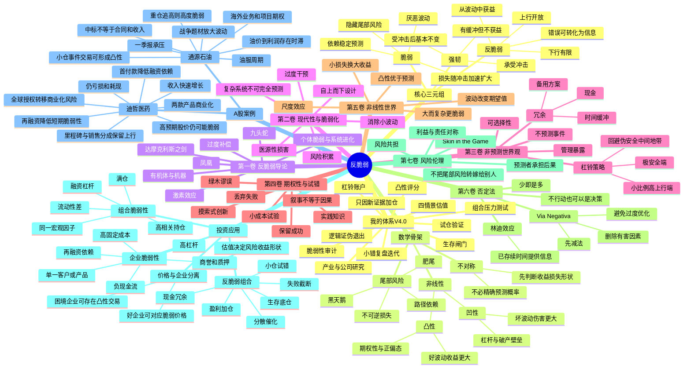

# 《反脆弱》思维导图

## 一、Mermaid版本



## 二、树状提纲版本

### 1. 全书主线

```text
世界不可完全预测
→ 预测误差在复杂系统中不可避免
→ 真正危险的不是不知道，而是暴露结构经不起错误
→ 先识别什么会因波动而受损
→ 删除杠杆、集中、依赖和不可逆损失
→ 保留现金、冗余、选择权和小规模试错
→ 把下行封顶，把上行留给意外
→ 让时间和波动替我筛选信息
```

### 2. 脆弱、强韧、反脆弱

| 类型 | 面对波动 | 收益形状 | 投资示例 |
|---|---|---|---|
| 脆弱 | 波动越大越差 | 下行加速、可能破产 | 高杠杆满仓、依赖续贷的企业 |
| 强韧 | 能承受但不获益 | 波动前后差异有限 | 现金充足、负债低、业务稳定 |
| 反脆弱 | 在一定范围内从波动获益 | 下行有限、上行开放 | 小成本多次试错、保留巨大成功收益 |

### 3. 反脆弱不是高风险

```text
高波动 ≠ 反脆弱
低估值 ≠ 反脆弱
现金多 ≠ 反脆弱
业务增长 ≠ 反脆弱

反脆弱 = 暴露不对称
即：坏结果的损失被限制，好结果的收益可以扩展。
```

### 4. 投资中的五类脆弱性

1. **资本结构脆弱性**：负债、质押、短债、再融资依赖；
2. **经营脆弱性**：单一客户、单一产品、高固定成本、库存和应收；
3. **估值脆弱性**：价格需要多个乐观假设同时成立；
4. **交易结构脆弱性**：满仓、追高、无流动性、无法止损；
5. **认知脆弱性**：把单一路径当作确定事实，不允许反方证据进入。

### 5. 投资版一页图

```text
【机会出现】
产业变化／公告／政策／价格异动
        ↓
【生存闸门】
是否存在杠杆、永久损失、流动性或单一事件致命风险？
有 → 放弃或大幅缩小仓位
        ↓
【脆弱性审计】
现金、负债、现金流、融资依赖、集中度、固定成本、估值假设
        ↓
【凸性检查】
最大可控损失是多少？
潜在收益是否存在多路径？
失败后是否仍可继续？
        ↓
【研究与估值】
产业方向、竞争位置、催化、四情景价值、证伪条件
        ↓
【杠铃配置】
大比例生存资产 + 小比例高赔率资产
        ↓
【试仓】
用小成本购买信息和观察权
        ↓
【更新】
新证据增强 → 扩大
证据变弱 → 缩小或退出
        ↓
【复盘】
让小错误形成规则，让正确路径可以复利
```
