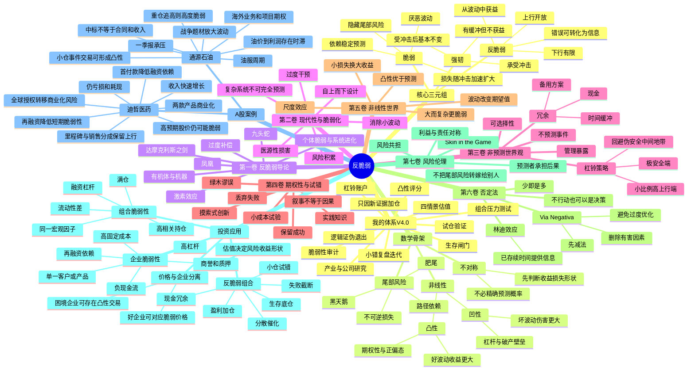

# 《反脆弱》完整投资学习包

> 核心理论重构、A股案例验证与个人投资体系。非原书逐字摘录。


---

<!-- 来源文件：00_阅读成果索引.md -->

# 《反脆弱》投资学习包

> 作者：纳西姆·尼古拉斯·塔勒布（Nassim Nicholas Taleb）  
> 主题：不确定性、非线性、凸性、期权性、生存与风险伦理  
> 应用市场：A股个人投资  
> 资料核验日期：2026-07-24  
> 版本：投资体系 V4.0——生存、杠铃、期权性与迭代

## 一、交付成果

1. [《反脆弱》思维导图](01_反脆弱_思维导图.md)
2. [《反脆弱》读书笔记](02_反脆弱_读书笔记.md)
3. [从本书提炼的20条投资原则](03_反脆弱_20条投资原则.md)
4. [A股真实案例验证：迪哲医药与通源石油](04_反脆弱_A股案例验证.md)
5. [我的投资体系：生存—杠铃—期权性—迭代体系V4.0](05_我的投资体系_反脆弱版V4.0.md)
6. [反脆弱投资检查清单](06_反脆弱投资检查清单.md)

另附：

- `反脆弱_完整学习包_合并版.md`：全部成果的合并版本；
- `反脆弱_投资学习包.zip`：便于一次下载和归档。

## 二、名称修正

用户示例中的“迪泽医药”，按A股上市公司正式名称统一修正为：

- **迪哲医药（688192）**。

## 三、本书对投资最重要的结论

《反脆弱》不是教我更准确地预测下一次战争、牛市、临床结果或政策变化，而是要求我重新设计暴露结构：

```text
不依赖预测才能活下来
→ 把破产风险和不可逆损失放在首位
→ 保留冗余、现金和选择权
→ 用小成本、多次试验获取大上行
→ 让错误尽量小、局部、可恢复
→ 让成功可以扩大、复利和迁移
→ 从波动和意外中获得信息与收益
```

投资版总纲：

> **先消除会致命的脆弱性，再建立下行有限、上行开放的仓位结构；不押注单一路径，用小错换信息，用新证据扩大正确方向。**

## 四、与既有投资体系的衔接

此前体系强调：

> 产业逻辑定方向，基本面定质量，事件催化定时点，板块共振定强弱，价格行为定确认，风险预算定仓位，退出规则定盈亏。

《反脆弱》为其增加四个底层模块：

1. **生存模块**：任何单笔交易、单一公司、单一叙事都不能威胁账户持续存在；
2. **脆弱性审计模块**：先看杠杆、现金流、融资依赖、客户集中、单一产品、流动性和跳空风险；
3. **期权性模块**：偏好损失可控、潜在收益多路径展开的机会；
4. **小错迭代模块**：试仓获取信息，验证后扩大，不在未经验证时用重仓证明观点。

因此，V4.0并不推翻已有的“宏观—行业—公司—交易”框架，而是在其下方增加一个更基础的问题：

> **即使判断错了，我是否还能继续留在市场中？如果出现意外，我的组合是受损、无感，还是受益？**

## 五、建议使用顺序

```text
先看思维导图建立结构
→ 阅读读书笔记理解概念与边界
→ 把20条原则写入交易规则
→ 用迪哲医药、通源石油练习“公司与股票分离”
→ 将V4.0体系改造成自己的账户参数
→ 每次交易前执行反脆弱检查清单
```

## 六、重要边界

- 本学习包是对全书思想的结构化重构和投资化表达，不复制大段原文；
- “反脆弱”不是“永远上涨”，也不是“波动越大越好”；
- 一个企业可能因冲击改善，但其股票在高估值下仍可能非常脆弱；
- 现金多、负债低只代表更稳健，不自动等于反脆弱；
- 高波动小盘股通常不是期权，而可能是“下行无底、上行受限”的伪期权；
- 本材料用于学习和投资系统设计，不构成证券买卖建议。

---

<!-- 来源文件：01_反脆弱_思维导图.md -->

# 《反脆弱》思维导图

## 一、Mermaid版本



## 二、树状提纲版本

### 1. 全书主线

```text
世界不可完全预测
→ 预测误差在复杂系统中不可避免
→ 真正危险的不是不知道，而是暴露结构经不起错误
→ 先识别什么会因波动而受损
→ 删除杠杆、集中、依赖和不可逆损失
→ 保留现金、冗余、选择权和小规模试错
→ 把下行封顶，把上行留给意外
→ 让时间和波动替我筛选信息
```

### 2. 脆弱、强韧、反脆弱

| 类型 | 面对波动 | 收益形状 | 投资示例 |
|---|---|---|---|
| 脆弱 | 波动越大越差 | 下行加速、可能破产 | 高杠杆满仓、依赖续贷的企业 |
| 强韧 | 能承受但不获益 | 波动前后差异有限 | 现金充足、负债低、业务稳定 |
| 反脆弱 | 在一定范围内从波动获益 | 下行有限、上行开放 | 小成本多次试错、保留巨大成功收益 |

### 3. 反脆弱不是高风险

```text
高波动 ≠ 反脆弱
低估值 ≠ 反脆弱
现金多 ≠ 反脆弱
业务增长 ≠ 反脆弱

反脆弱 = 暴露不对称
即：坏结果的损失被限制，好结果的收益可以扩展。
```

### 4. 投资中的五类脆弱性

1. **资本结构脆弱性**：负债、质押、短债、再融资依赖；
2. **经营脆弱性**：单一客户、单一产品、高固定成本、库存和应收；
3. **估值脆弱性**：价格需要多个乐观假设同时成立；
4. **交易结构脆弱性**：满仓、追高、无流动性、无法止损；
5. **认知脆弱性**：把单一路径当作确定事实，不允许反方证据进入。

### 5. 投资版一页图

```text
【机会出现】
产业变化／公告／政策／价格异动
        ↓
【生存闸门】
是否存在杠杆、永久损失、流动性或单一事件致命风险？
有 → 放弃或大幅缩小仓位
        ↓
【脆弱性审计】
现金、负债、现金流、融资依赖、集中度、固定成本、估值假设
        ↓
【凸性检查】
最大可控损失是多少？
潜在收益是否存在多路径？
失败后是否仍可继续？
        ↓
【研究与估值】
产业方向、竞争位置、催化、四情景价值、证伪条件
        ↓
【杠铃配置】
大比例生存资产 + 小比例高赔率资产
        ↓
【试仓】
用小成本购买信息和观察权
        ↓
【更新】
新证据增强 → 扩大
证据变弱 → 缩小或退出
        ↓
【复盘】
让小错误形成规则，让正确路径可以复利
```

---

<!-- 来源文件：02_反脆弱_读书笔记.md -->

# 《反脆弱》读书笔记

> 阅读目的：把“不确定性不可消除”转化为可执行的A股投资结构。  
> 我的核心问题：既然无法持续准确预测战争、政策、产业拐点、临床结果与资金风格，如何仍能稳定积累资本，而不是在一次判断错误中被永久淘汰？

---

# 一、全书总论：关键不是预测世界，而是设计暴露

多数投资方法从“未来会发生什么”开始：

- 经济会复苏还是衰退；
- 原油会涨到多少；
- 创新药是否获批；
- 市场主线是否延续；
- 个股是否出现第二波。

《反脆弱》要求把问题改写为：

> **无论未来发生哪一种情景，我的损失和收益分别怎样变化？**

这是一种从“事件预测”转向“暴露设计”的思维。

假设我判断某地缘冲突可能推升油价。传统思路是不断提高冲突升级概率，并寻找最受益的股票；反脆弱思路则先问：

1. 若冲突缓和，我最多损失多少；
2. 若冲突升级，收益是否显著大于损失；
3. 是否使用杠杆，是否会因隔夜跳空无法退出；
4. 油价上涨能否真正传导到公司的订单和利润；
5. 市场是否已经提前计价；
6. 这一笔失败后，我是否仍有资本参与下一次机会。

本书最重要的改变，是把“我能否判断正确”降级为第二问题，把“即使判断错误是否还能生存”升级为第一问题。

我的投资版定义：

```text
脆弱：需要大多数假设都正确，任何一次大误差都可能造成永久损失。
强韧：即使假设错误，也能保持大体完整。
反脆弱：错误损失被限制，波动和新信息反而增加未来选择与收益。
```

---

# 二、脆弱—强韧—反脆弱三元组

## 2.1 脆弱：伤害随冲击强度加速扩大

玻璃杯不是因为一定会掉落而脆弱，而是因为一旦冲击超过阈值，损害是非线性和不可逆的。

投资中的脆弱性具有同样特征：

- 负债率从30%上升到40%可能没有问题，从80%上升到90%却可能触发信用危机；
- 股票下跌10%只是浮亏，融资账户下跌10%可能触发追加保证金和被动平仓；
- 现金流短缺一个季度可能可控，但若恰逢再融资关闭，可能导致生存危机；
- 单一客户贡献10%收入是集中度问题，贡献80%则可能成为致命依赖；
- 估值需要一个乐观假设成立时风险可测，需要五个假设同时成立时极其脆弱。

因此，脆弱性不是“风险看起来大”，而是：

> **损失函数具有凹性，坏波动越大，边际伤害越大。**

## 2.2 强韧：承受冲击，但不从冲击中改善

强韧系统有缓冲：

- 现金储备；
- 低负债；
- 多元客户；
- 可变成本；
- 较高流动性；
- 备用供应商和融资渠道。

它们在冲击后可能基本不变。投资组合中的现金是强韧资源：市场暴跌时现金本身不会因暴跌产生额外收益，但它保持购买能力。

## 2.3 反脆弱：从一定范围的波动中获得净收益

反脆弱不是“什么冲击都能获益”。它通常只在特定范围、特定变量下成立。

投资中最典型的反脆弱结构是期权性：

- 小额试错的损失有限；
- 一旦出现大成功，收益可显著放大；
- 失败不影响继续试验；
- 新信息帮助更快淘汰错误路径；
- 波动增加发现极端成功的机会。

风险投资、药物管线组合、技术研发和趋势跟踪都可能具有这种结构，但前提是单次失败不会导致整体破产。

---

# 三、非线性、凸性与不对称

## 3.1 为什么波动会改变平均结果

线性世界中，向上10和向下10互相抵消；非线性世界中，同样的波动可能改变最终期望。

脆弱系统的损失通常具有加速性：

```text
小冲击：轻微损失
中冲击：明显损失
大冲击：破产、被迫平仓、永久失去选择权
```

反脆弱系统的收益具有凸性：

```text
多数小试验：小亏或无结果
少数成功：覆盖全部失败
极少数大成功：决定长期收益
```

因此，在概率无法精确估计时，可以先判断收益函数的形状：

- 坏结果是否存在上限；
- 好结果是否被封顶；
- 冲击扩大时，损失是线性还是加速；
- 预测误差对结果是有利还是有害。

## 3.2 投资中的凹性

以下结构通常具有负凸性或凹性：

- 卖出无保护的期权；
- 高杠杆持仓；
- 高负债、低现金的周期企业；
- 依赖一次融资续命的公司；
- 满仓押注单一临床、单一订单、单一政策；
- 高估值但增长容错率极低的股票；
- 为赚小利承担无限尾部损失的策略。

共同特征是：平时经常赚钱或看起来稳定，但极端事件会一次性收回多年收益。

## 3.3 投资中的凸性

以下结构可能具有正凸性：

- 现金充足时，在市场恐慌中分批买入优质资产；
- 用小仓位参与上行空间远大于失败损失的创新资产；
- 多个独立小实验，其中任何单个失败都无关紧要；
- 趋势成立后加仓，趋势失败时快速退出；
- 企业以有限研发投入验证多个管线，成功后扩展适应症或授权；
- 用合作、许可和里程碑协议转移固定成本，同时保留销售分成。

凸性并不意味着胜率高。其重点是：

> **低胜率也可以有正期望，但必须保证损失受限、收益开放。**

---

# 四、第一卷：反脆弱导论

## 4.1 达摩克利斯、凤凰与九头蛇

塔勒布用三个形象区分三元组：

- 达摩克利斯之剑代表脆弱：表面安稳，头顶却悬着致命风险；
- 凤凰代表强韧：被毁后恢复原状；
- 九头蛇代表反脆弱：受损后长出更多头。

投资者最容易误把“长期没出事”当作安全。高杠杆策略可能连续数年稳定盈利，但这只说明尾部事件尚未发生，而不是风险不存在。

### 我的投资应用

研究公司时，不能只看历史波动率和过去是否违约，还要寻找头顶的“剑”：

- 债务到期表；
- 股东质押和平仓线；
- 对单一融资渠道的依赖；
- 对单一客户、产品、许可证的依赖；
- 应收账款与现金流背离；
- 商誉减值和表外担保；
- 对稳定油价、汇率或政策的隐含假设。

## 4.2 过度补偿与适度压力

肌肉通过适度压力变强，免疫系统通过接触和反馈学习，组织通过小故障暴露薄弱点。

投资者也需要可承受的小压力：

- 小仓实盘比纯模拟更能暴露心理弱点；
- 小亏能检验止损纪律；
- 小额事件交易能检验因果链；
- 小规模策略上线能暴露数据和执行问题；
- 定期压力测试能暴露组合相关性。

但压力必须可控。反脆弱不是主动制造可能致命的巨大损失，而是使用小压力避免大崩溃。

## 4.3 有机体与机器

机器偏好稳定，磨损通常不可逆；有机体能够通过反馈、修复和进化适应环境。

投资系统不应被设计成一套永不改变的机械规则，而应具备：

- 记录；
- 反馈；
- 错误分类；
- 参数调整；
- 规则淘汰；
- 经验迁移。

真正的系统不是“永远使用同一指标”，而是“能够识别指标失效并限制损失”。

## 4.4 个体失败与系统进化

进化依赖个体差异和淘汰。对整体而言，小单位可以失败，系统从中学习；若所有风险集中在一个不可失败的巨型单位上，整体反而脆弱。

对应到投资：

- 单个小仓试验可以失败；
- 单只股票不能代表全部资本；
- 单一策略不能控制整个账户；
- 单一模型错误不能引发整体清算；
- 任何一次交易都不应成为“必须赢”的战争。

---

# 五、第二卷：现代性如何制造脆弱

## 5.1 消除小波动，可能积累大风险

人为压制所有小波动，会使系统失去释放压力和暴露问题的机会。

市场中的表现包括：

- 长期低波动诱导加杠杆；
- 持续救助让风险承担者相信损失会被兜底；
- 投资者长期不止损，使小错积累成大错；
- 企业用借新还旧掩盖经营问题；
- 管理层用一次性项目平滑利润，延迟真实风险暴露。

波动不是风险本身。真正危险的是脆弱性在低波动期间悄悄积累。

## 5.2 医源性损害：干预本身可能造成更大风险

塔勒布强调“好心干预”可能产生超过原问题的副作用。投资中的医源性损害包括：

- 频繁换股试图修复短期回撤，反而增加交易成本和错误；
- 下跌后无条件补仓，扩大对错误判断的暴露；
- 为提高收益使用融资，破坏原有生存能力；
- 过度优化回测参数，得到无法外推的策略；
- 用复杂衍生品掩盖简单的方向性风险；
- 因害怕错过而在高位增加仓位。

否定法要求先问：

> 不做这次操作，最坏会怎样？做了之后，是否引入新的尾部风险？

## 5.3 自上而下与复杂系统

复杂系统包含反馈、反身性和非线性，中央规划者无法掌握所有局部信息。市场同样如此：

- 产业政策可能引发过度投资；
- 一致预期会改变价格和企业行为；
- 企业扩产会反过来破坏行业景气；
- 市场上涨会改善融资并延长叙事；
- 下跌会触发质押、赎回和被动卖出。

因此，我不能把一条“宏观—行业—公司—股价”直线因果链当作确定模型。必须给反馈和反向路径留出空间。

---

# 六、第三卷：不依赖预测的世界观

## 6.1 识别脆弱比预测黑天鹅更容易

我不必知道哪一天发生危机，也可以识别：

- 谁使用了高杠杆；
- 谁依赖短期融资；
- 谁没有现金缓冲；
- 谁的估值容错率最低；
- 谁在市场关闭时无法退出；
- 谁把所有赌注押在同一结果上。

这意味着风险管理可以少依赖概率预测，多依赖暴露审计。

## 6.2 杠铃策略

杠铃不是简单的“50%股票+50%债券”，而是一种结构原则：

```text
一端极度安全，确保生存和选择权
另一端使用小比例承担高不确定但高上行的机会
避免看似中等风险、实际隐藏尾部损失的中间区域
```

投资中的“伪中间地带”包括：

- 表面低波动但高杠杆的产品；
- 高收益、低评级、流动性差的信用资产；
- 盈利稳定但资产负债表脆弱的公司；
- 估值不便宜、成长也不确定的普通公司；
- 为追求略高收益而牺牲全部流动性的配置。

## 6.3 冗余不是浪费

传统效率思维把闲置现金、备用产能和重复系统视为浪费；反脆弱思维把它们视为危机中的选择权。

我的投资冗余包括：

- 不满仓；
- 不使用消费贷、经营贷和融资资金炒股；
- 保留未来6—12个月不需要从账户提取的生活缓冲；
- 保留可快速变现的资产；
- 研究多个候选而不是只押一只股票；
- 为重要数据和交易记录保留备份；
- 给催化兑现时间留出延迟区间。

冗余降低平时的账面效率，却提高长期几何复利。

---

# 七、第四卷：期权性、试错与实践知识

## 7.1 期权性：有权利，没有义务

期权性的本质不是某种金融合约，而是：

- 可以参与好结果；
- 可以拒绝坏结果；
- 可以延迟决定；
- 可以在新信息出现后改变方向；
- 上行空间大于承诺成本。

A股投资中的期权性来源：

- 低仓位试仓；
- 低估值提供的下行缓冲；
- 企业多条研发管线；
- 里程碑付款和销售分成；
- 可扩展适应症；
- 海外授权或合作可能性；
- 市场恐慌时的现金购买力。

## 7.2 摸索式创新

很多重大创新并非先有完整理论再执行，而是通过试验、反馈、筛选和放大形成。

投资者也不应要求自己在买入前知道一切。可行的方式是：

```text
提出假设
→ 小仓试验
→ 观察公告、业绩、价格和市场反馈
→ 证据增强则加仓
→ 证据减弱则退出
→ 把结果写入规则库
```

关键在于“小”。若初始仓位过大，试验就变成不可承受的承诺，信息尚未到来，账户已被情绪控制。

## 7.3 绿木谬误：知道故事，不等于知道怎样赚钱

“绿木谬误”说明实践者可能不理解学术叙事，却掌握真实运作变量；旁观者可能能解释概念，却无法承担和执行。

投资中的表现：

- 能讲清产业宏大逻辑，不等于知道公司的收入确认；
- 知道药物机制，不等于能评估临床终点和商业化；
- 知道战争走向，不等于知道油价如何传导到油服利润；
- 知道技术形态名称，不等于能在跳空和流动性中执行；
- 知道估值模型，不等于模型输入可靠。

因此，我必须把“会解释”与“可交易”分开。

---

# 八、第五卷：非线性世界

## 8.1 凸性比精确知识更重要

当概率难以估计时，结构性不对称比小数点后的预测更可靠。

例如创新药单一管线的成功概率很难精确计算，但我可以判断：

- 公司现金能否覆盖下一里程碑；
- 失败是否会导致融资危机；
- 多条管线是否相互独立；
- 成功后市场空间是否足够大；
- 当前价格是否已提前计入成功；
- 我的仓位是否把失败限制在可接受范围。

这比争论成功概率是24%还是31%更有价值。

## 8.2 规模会放大脆弱性

大规模、集中和高度耦合会使错误传播：

- 单只股票仓位越大，主观偏见越强；
- 账户越集中，单一事件越可能永久损伤；
- 企业越依赖巨额项目，延迟和成本超支越致命；
- 策略管理资金越大，流动性和冲击成本越高；
- 组织层级越多，局部信息越难传达。

因此，职业投资者不应只追求“看对时赚得最多”，还应追求“看错时损害不扩散”。

## 8.3 公司反脆弱与股票反脆弱是两回事

一家企业可能通过危机获得市场份额，但若其股票估值已包含完美预期，投资者仍可能亏损。

分析必须分成两层：

| 层面 | 关键问题 |
|---|---|
| 企业层 | 冲击是否改善竞争位置、现金流、选择权或市场份额？ |
| 股票层 | 当前价格是否把改善提前计价？坏情景损失多大？ |

反脆弱公司不等于任何价格都值得买。

---

# 九、第六卷：否定法、林迪效应与少即是多

## 9.1 Via Negativa：先删除脆弱源

投资体系最有效的升级往往不是增加更多指标，而是删除致命行为：

- 删除杠杆；
- 删除满仓；
- 删除无条件补仓；
- 删除只看利好不看证伪；
- 删除把成本价当价值；
- 删除未经核验的“小作文”；
- 删除流动性不足的大仓位；
- 删除频繁交易；
- 删除无法解释现金流的公司；
- 删除必须依赖再融资才能生存的标的。

减少错误往往比增加预测能力更可靠。

## 9.2 林迪效应

对于非易耗事物，已经存续的时间可为未来存续提供信息。投资应用需谨慎：

- 经历多个周期仍保持竞争力的商业模式，可信度通常高于刚出现的叙事；
- 长期被客户验证的产品和流程，比未经验证的概念可靠；
- 多轮周期中的资本纪律，比一两年高增长更重要；
- 但“存在很久”不能替代对技术颠覆、监管变化和估值的研究。

林迪效应是先验信息，不是永续保证。

## 9.3 不行动也是决策

市场每天提供刺激，但不是每天提供正赔率。

不交易可以保留：

- 现金；
- 注意力；
- 未来选择权；
- 心理稳定；
- 等待更高赔率的能力。

对个人投资者而言，低频是对机构速度优势和量化交易的结构性回应。个人不需要在每个盘口上战胜算法，只需要在少数认知和赔率优势显著的机会中下注。

---

# 十、第七卷：风险共担与投资伦理

## 10.1 风险共担

提供建议的人若不承担错误后果，容易隐藏尾部风险。

投资研究中要检查：

- 管理层是否持股，激励是否与长期价值一致；
- 大股东是否高位减持、质押或把风险留给中小股东；
- 券商和媒体是否只获得传播收益而不承担预测损失；
- 基金经理是否把职业风险最小化而把市场风险留给持有人；
- 我自己是否用真实仓位检验体系，还是只在事后讲故事。

## 10.2 不把风险转嫁给未来的自己

个人投资者也会进行风险转嫁：

- 今天满仓，假设未来的自己能承受回撤；
- 今天借钱交易，把利息和流动性压力交给未来；
- 今天不止损，把更难的决定留给更差的价格；
- 今天追涨，把验证任务交给股价；
- 今天不记录，把复盘责任交给模糊记忆。

风险共担意味着当前决策者必须承担当前决策的真实成本。

---

# 十一、投资中的反脆弱误区

## 11.1 误区一：波动越大越反脆弱

错误。高波动可能意味着更高破产概率。只有损失有限、收益开放时，波动才可能有利。

## 11.2 误区二：抄底就是利用波动

错误。没有估值、现金流和生存能力支撑的下跌，可能是价值毁灭而非机会。

## 11.3 误区三：分散越多越安全

错误。持有20只都受同一宏观因子驱动的股票，仍是集中暴露。真正分散的是失败原因和收益来源。

## 11.4 误区四：小盘成长股天然有凸性

错误。小盘股可能同时存在融资、退市、流动性和治理风险，下行并不受限。

## 11.5 误区五：好公司天然反脆弱

错误。企业、证券和买入价格必须分开。好企业在极高价格下可能成为脆弱投资。

## 11.6 误区六：杠铃意味着保守

错误。杠铃允许在安全端之外保留高上行试验。它反对的是用全部资本承担模糊的中等风险。

---

# 十二、对我的十大认知升级

1. **预测不是第一生产力，生存和选择权才是。**
2. **先看损失函数，再看上涨故事。**
3. **现金不是空仓焦虑，而是危机中的购买期权。**
4. **小仓不是不自信，而是在用有限成本购买信息。**
5. **加仓必须来自证据增强，不能来自价格下跌。**
6. **公司受益于波动，不代表股票在当前价格受益。**
7. **中标、临床、政策和战争都只是路径节点，不是利润本身。**
8. **减少致命错误比提高每次预测胜率更重要。**
9. **复盘应让错误局部化、规则化，不能只归因于运气或主力。**
10. **职业投资者的核心资产是持续参与下一次机会的能力。**

---

# 十三、我的最终读后结论

《反脆弱》给投资者的核心不是“拥抱一切不确定性”，而是区分两类不确定性：

```text
可能让我破产、失去流动性和选择权的不确定性
→ 必须回避、隔离、减仓或对冲

损失有限、能提供信息、成功可放大的不确定性
→ 可以通过小仓、多次试验主动拥有
```

我的投资系统必须从“寻找确定机会”升级为：

> **用生存底线承受未知，用杠铃结构隔离尾部风险，用期权性参与大机会，用小错和反馈持续进化。**

---

# 十四、主要参考资料

1. Nassim Nicholas Taleb, *Antifragile: Things That Gain from Disorder*, Random House, 2012.
2. Penguin Random House, Antifragile book page: https://www.penguinrandomhouse.com/books/176227/antifragile-by-nassim-nicholas-taleb/
3. Nassim Nicholas Taleb, Antifragile official page: https://www.fooledbyrandomness.com/Antifragile.htm
4. Nassim N. Taleb & Raphael Douady, “Mathematical Definition, Mapping, and Detection of (Anti)Fragility”: https://arxiv.org/abs/1208.1189
5. Nassim Nicholas Taleb, “Convexity and Science”: https://fooledbyrandomness.com/ConvexityScience.pdf
6. Nassim N. Taleb & Constantine Sandis, “The Skin In The Game Heuristic for Protection Against Tail Events”: https://arxiv.org/abs/1308.0958
7. Nassim Nicholas Taleb, Antifragility Glossary: https://www.fooledbyrandomness.com/af-glossary.pdf

> 说明：以上内容为核心思想重构、批判性理解与投资应用，不是原书逐章逐句复述。

---

<!-- 来源文件：03_反脆弱_20条投资原则.md -->

# 《反脆弱》提炼的20条投资原则

## 原则1：先确保不出局，再追求高收益

- **含义**：长期复利的前提是账户持续存在。
- **执行**：禁止使用可能触发强制平仓的杠杆；任何单一事件不得造成永久性资本损伤。

## 原则2：先审计脆弱性，再研究上涨空间

- **含义**：上涨逻辑容易被叙事放大，脆弱性往往藏在资产负债表和交易结构中。
- **执行**：买入前强制检查负债、现金流、融资依赖、客户集中、质押、流动性和估值容错率。

## 原则3：不预测黑天鹅，管理黑天鹅暴露

- **含义**：无法知道冲击何时到来，但可以知道谁最经不起冲击。
- **执行**：对高杠杆、高集中、高固定成本和再融资依赖标的降低仓位或放弃。

## 原则4：现金是选择权，不是低效率资产

- **含义**：现金在恐慌期提供购买力，在错误时提供修复能力。
- **执行**：常态保留生存与机会资金，不因短期踏空取消现金缓冲。

## 原则5：采用杠铃，不把全部资本放在模糊中间地带

- **含义**：大部分资本承担可理解、可生存的风险；小部分资本参与高不确定、高上行机会。
- **执行**：安全端与高赔率端分账管理，拒绝看似稳健但隐藏尾部风险的产品和股票。

## 原则6：只承担下行可封顶、上行可扩展的风险

- **含义**：反脆弱投资的核心是收益不对称。
- **执行**：为每笔交易写明最大损失、潜在收益、触发条件和退出路径。

## 原则7：初始仓位是信息成本，不是信念宣言

- **含义**：研究不可能消除全部未知，试仓用于获得真实反馈。
- **执行**：高不确定机会先小仓，避免在证据最少时承担最大风险。

## 原则8：只因新证据加仓，不因亏损加仓

- **含义**：价格下跌不会自动提高事实成功率。
- **执行**：加仓必须对应经营、临床、订单、现金流、市场结构或价格确认的改善。

## 原则9：让错误小而频繁，让成功大而持久

- **含义**：多个可承受的小错比一次不可恢复的大错更有学习价值。
- **执行**：快速截断证伪交易，允许正确趋势和高质量基本面持续贡献收益。

## 原则10：把公司、证券和价格分开

- **含义**：企业可能反脆弱，但其股票在高估值下仍脆弱。
- **执行**：分别评价企业暴露、证券条款和价格隐含预期。

## 原则11：偏好冗余，不追求账面满效率

- **含义**：极致资金利用率会消灭缓冲和选择权。
- **执行**：保留现金、时间、候选池、备用数据源和退出流动性。

## 原则12：删除致命行为优先于增加预测指标

- **含义**：否定法通常比复杂模型更可靠。
- **执行**：先删除杠杆、满仓、无条件补仓、听消息追高、无证伪持有和过度交易。

## 原则13：警惕平稳收益背后的负凸性

- **含义**：许多策略平时小赚，极端时巨亏。
- **执行**：检查收益是否以承担跳空、流动性、信用或无限损失为代价。

## 原则14：不要把中标、意向和潜在总额直接当作利润

- **含义**：事件到现金流之间存在多重条件和时间延迟。
- **执行**：把“中标—签约—执行—验收—收入—回款”逐层拆解。

## 原则15：创新药按期权组合估值，不按单一路径估值

- **含义**：研发资产具有多阶段、条件性和高度非线性。
- **执行**：使用“现金底+已上市产品+授权资产+管线风险调整价值”，并设置失败和稀释情景。

## 原则16：事件交易必须比基本面投资更小仓、更短验证

- **含义**：地缘、政策和情绪的反馈快，预测可靠性低。
- **执行**：限定事件账户、持有期限、消息反转条件和板块确认条件。

## 原则17：真正的分散是分散失败原因

- **含义**：股票数量多不代表风险来源独立。
- **执行**：按宏观因子、行业周期、流动性、催化和盈利模式检查相关性。

## 原则18：从压力测试中寻找组合的隐藏耦合

- **含义**：平时相关性低的资产在危机中可能同时下跌。
- **执行**：定期模拟指数暴跌、融资收紧、人民币波动、商品反转、临床失败和交易暂停。

## 原则19：管理层与研究者必须承担后果

- **含义**：没有风险共担的建议容易隐藏尾部风险。
- **执行**：关注管理层持股、减持、质押、激励、关联交易和资本配置记录；观点必须写入事前日志。

## 原则20：用长期几何复利评价系统，不用单笔盈亏评价能力

- **含义**：一次大赚可能来自脆弱赌注，一次小亏可能来自正确纪律。
- **执行**：复盘重点检查生存、赔率、仓位、证伪、执行和组合影响。

---

# 20条原则压缩版

```text
1 生存优先
2 先查脆弱
3 管暴露不猜黑天鹅
4 现金是期权
5 采用杠铃
6 下行封顶上行开放
7 小仓购买信息
8 新证据才加仓
9 小亏大赚
10 公司证券价格分离
11 保留冗余
12 先做减法
13 警惕平稳负凸性
14 事件不等于利润
15 创新药按期权组合
16 事件仓更小更短
17 分散失败原因
18 做组合压力测试
19 要求风险共担
20 看长期几何复利
```

---

<!-- 来源文件：04_反脆弱_A股案例验证.md -->

# 《反脆弱》A股真实案例验证

> 核验日期：2026-07-24  
> 案例：迪哲医药（688192）、通源石油（300164）  
> 目的：验证“企业是否反脆弱”与“股票是否值得持有”必须分开判断。

---

# 一、案例分析方法

对每家公司依次回答六个问题：

1. **脆弱源是什么**：杠杆、现金流、融资依赖、单一产品、周期、客户或政策；
2. **冲击如何传导**：冲击是否线性，是否存在破产壁垒；
3. **是否有冗余**：现金、客户、地域、产品、融资、产能和时间缓冲；
4. **是否有期权性**：下行是否有限，上行是否存在多路径；
5. **当前价格是否脆弱**：市场是否要求多个乐观假设同时成立；
6. **投资者如何构造仓位**：把失败限制在账户可承受范围内。

评级说明：

| 评级 | 含义 |
|---|---|
| 脆弱 | 波动增加显著恶化生存或价值 |
| 强韧 | 能承受冲击，但未必从冲击获益 |
| 局部反脆弱 | 在特定变量和范围内具有正凸性 |
| 伪反脆弱 | 看似受益于波动，实际下行未受限 |

---

# 二、案例一：迪哲医药——从融资脆弱向“现金冗余+授权期权性”迁移

## 2.1 可核验事实

### 经营与商业化

- 迪哲医药采用科创板第五套标准上市，截至2025年末仍未实现盈利；
- 公司已有两款药物获批；
- 2025年实现销售收入约8.01亿元，同比增长122.60%；
- 舒沃哲和高瑞哲首次纳入国家医保目录；
- 2025年7月，舒沃哲获FDA加速批准。

### 资本结构与现金消耗

- 公司2025年完成再融资，总股本由约4.176亿股增加至约4.612亿股；
- 资产负债率由2024年末的88.36%降至2025年末的56.85%；
- 2026年第一季度营业收入约2.525亿元，同比增长58.18%；
- 2026年第一季度归母净利润约-0.956亿元；
- 同期经营活动现金流量净额约-2.005亿元，说明研发和商业化阶段仍在消耗现金。

### 舒沃哲全球授权

2026年7月，公司披露与阿斯利康签署舒沃哲全球独家开发和商业化许可协议：

- 一次性、不可返还首付款6亿美元；
- 最高4亿美元临床开发里程碑；
- 最高5亿美元销售里程碑；
- 另有按全球销售额计算的阶梯式特许权使用费；
- 协议仍需股东会审议、交割条件和境外反垄断批准；
- 里程碑和特许权使用费均依赖临床、监管和销售条件。

2026年7月13日至15日，公司股票连续三个交易日收盘价格涨幅偏离值累计达到30%，说明市场迅速提高了对授权价值的定价。

## 2.2 迪哲医药原有脆弱性

### 脆弱性A：持续研发投入和现金消耗

创新药公司在盈利前需要持续研发、临床、注册和商业化投入。若资本市场关闭、临床失败或销售爬坡慢，融资依赖会成为核心脆弱性。

### 脆弱性B：产品与临床事件高度非线性

一次关键临床失败、监管要求变化或安全性问题，可能显著降低资产价值。损失不是按季度线性发生，而可能在公告日一次性重估。

### 脆弱性C：估值依赖远期假设

估值通常需要假设：

```text
临床成功
→ 获批
→ 医保或支付覆盖
→ 商业化放量
→ 竞争格局可控
→ 专利期内形成现金流
```

任何一环偏离都会影响价值。

## 2.3 哪些变化降低了脆弱性

### 变化A：两款产品获批并形成收入

商业化收入把公司从纯研发期权转向“已上市产品+研发管线”的混合结构。收入增长不能自动带来盈利，但减少了全部价值依赖单一未来事件的程度。

### 变化B：再融资形成现金冗余

资产负债率显著下降，提高了应对临床延迟、销售爬坡和市场波动的时间缓冲。但股权融资也带来稀释，因此它是“降低生存脆弱性、牺牲每股权益”的交换。

### 变化C：全球授权转移重资产商业化风险

授权给阿斯利康后，迪哲不必完全依赖自建全球销售网络承担渠道、合规、人员和地缘成本。首付款可以加速收回前期研发投入，并支持后续管线。

### 变化D：保留里程碑和销售分成

公司不是一次性卖断全部经济利益，而是保留条件性上行。这构成典型期权性：

```text
短期：首付款改善现金和融资能力
中期：临床与监管里程碑提供条件性收益
长期：销售分成保留全球放量弹性
```

## 2.4 为什么不能简单认定“公司已经反脆弱”

1. 许可协议尚需审批和交割，存在生效不确定性；
2. 最高15亿美元不是立即确认的无条件收入；
3. 里程碑高度依赖临床、监管和销售结果；
4. 2026年一季度仍亏损且经营现金流为负；
5. 研发管线仍可能失败；
6. 授出全球权益后，公司也让渡了部分长期经济上行；
7. 阿斯利康与公司股东关系使关联交易程序和定价需要持续核验。

因此，准确结论是：

> **迪哲医药的生存脆弱性因融资、产品商业化和大额首付款预期显著下降；授权模式让公司在舒沃哲全球价值上形成更好的风险转移与收益保留，但整体仍是高研发、高事件风险的局部反脆弱结构，而非无条件反脆弱。**

## 2.5 企业反脆弱，不代表股价反脆弱

授权公告后股价快速上涨。此时投资者要重新计算：

- 6亿美元首付款的税费、确认时点和到账条件；
- 里程碑的风险调整价值；
- 已经让渡的全球权益价值；
- 后续研发支出和商业化投入；
- 当前市值隐含的一线适应症成功率；
- 市场是否把潜在总额当成确定现金流。

若价格已经要求协议顺利交割、临床成功、全球销售放量和后续管线成功同时成立，股票可能从“有凸性”转为“高预期脆弱”。

## 2.6 迪哲医药的反脆弱投资方式

不依赖具体价格，结构上应满足：

1. 使用创新药期权仓，而不是核心重仓；
2. 初始仓位由失败情景决定，而不是由乐观目标价决定；
3. 协议交割、首付款到账、收入增长、现金消耗改善是加仓证据；
4. 不把最高里程碑总额全部计入估值；
5. 使用“现金底+已上市产品+授权资产+后续管线期权”的SOTP；
6. 临床失败、交割失败、现金消耗超预期和竞争恶化为证伪条件；
7. 公告后大涨阶段提高估值折扣，不因新闻确定而提高仓位。

## 2.7 案例结论

| 维度 | 评价 |
|---|---|
| 企业生存性 | 明显改善 |
| 现金冗余 | 再融资和首付款预期增强 |
| 经营稳定性 | 收入高增长，但仍亏损耗现 |
| 期权性 | 较强，来自里程碑、分成和后续管线 |
| 尾部风险 | 临床、监管、交割、竞争和估值 |
| 企业评级 | 强韧性提升、局部反脆弱 |
| 股票评级 | 取决于价格；大涨后可能脆弱化 |

---

# 三、案例二：通源石油——波动受益叙事与真实经营脆弱性的分离

## 3.1 可核验事实

### 业务结构

通源石油为油气开发提供技术和服务，覆盖定向钻井、测井、射孔、压裂增产、天然气回收处理和CCUS，射孔为核心业务。

### 2025年经营表现

- 营业收入约11.46亿元，同比下降4.16%；
- 归母净利润约3662万元，同比下降34.19%；
- 扣非净利润约1246万元，同比下降72.68%；
- 经营活动现金流量净额约1.375亿元，同比增长11.63%；
- 公司年报指出，2025年油价下降、美国钻探和压裂活动放缓，市场竞争加剧。

### 2026年一季度

- 营业收入约2.193亿元，同比下降14.99%；
- 归母净利润约-1290万元；
- 扣非净利润约-1844万元；
- 经营活动现金流量净额约2678万元；
- 公司解释，油田客户生产计划、一季度淡季及美国冬季风暴导致部分客户订单停止作业。

### 阿尔及利亚项目

2026年6月，公司公告中标Sonatrach四年期油气服务项目，金额约10.21亿元，但明确提示：

- 尚未签署正式合同；
- 签署和执行存在政策、筹资、汇率、外汇管制和海外经营风险；
- 对2026年度财务状况和经营业绩不会构成重大影响；
- 2025年10月中标的约8.97亿元项目当时也尚未正式签约。

## 3.2 为什么通源石油容易被误判为“反脆弱”

地缘冲突和油价上涨时，市场常形成以下叙事：

```text
战争升级
→ 原油上涨
→ 油公司利润提高
→ 勘探资本开支增加
→ 油服工作量增加
→ 通源石油利润上升
```

这条链条可能成立，但存在时间和条件：

- 油价上涨是否持续，而不是数日冲击；
- 油价是否高于客户完整开发成本；
- 油公司是否提高资本开支；
- 资本开支流向哪些区域和服务类型；
- 钻机、压裂和射孔工作量何时恢复；
- 合同价格能否覆盖人工、设备和汇率成本；
- 公司是否真正获得订单并形成回款。

因此，通源石油股票可能在战争消息下即时上涨，但企业利润并不会同步反应。

## 3.3 通源石油的真实脆弱性

### 脆弱性A：周期和客户资本开支

油服行业对油公司勘探开发活动敏感。油价走弱时，客户可延迟钻探，工作量和价格同时承压。

### 脆弱性B：高固定成本与作业利用率

设备、人员和海外运营具有固定成本。订单减少时，收入下降可能带来更大的利润波动。

### 脆弱性C：海外经营

海外业务带来市场空间，也引入汇率、劳工、法律、政治、外汇管制和合同执行风险。

### 脆弱性D：中标与现金流之间距离较长

中标通知书提供了未来期权，但尚未签约、执行、验收和回款。把中标金额直接加到当年利润，是典型的线性叙事错误。

### 脆弱性E：股票具有强事件和情绪属性

地缘冲突期间，股价可能迅速反映最乐观油价情景；一旦停火、油价回落或板块退潮，价格反转可能快于基本面变化。

## 3.4 通源石油有哪些局部期权性

1. **地域多元化**：北美、中国和阿尔及利亚等市场降低单一区域依赖；
2. **阿尔及利亚项目**：一旦签约并执行，可提供多年收入来源；
3. **CCUS与天然气处理**：提供传统射孔之外的业务扩展；
4. **现金流表现**：2025年经营现金流为正，为经营调整提供一定缓冲；
5. **地缘和能源安全主题**：在特定冲击下可能获得估值和订单预期上行。

但这些只构成局部上行选择，不消除经营周期、合同不确定性和股票回撤风险。

## 3.5 反脆弱的通源石油事件交易应如何设计

错误结构：

```text
看到战争新闻
→ 认定油价必涨
→ 满仓追高
→ 用公司中标和油价叙事证明长期持有
→ 停火或板块退潮后被动死扛
```

反脆弱结构：

```text
事件出现但尚未完全计价
→ 用事件账户小仓试错
→ 最大损失预先受限
→ 同时观察原油、油服板块、成交和承接
→ 事件继续升级且板块共振才扩大
→ 停火、油价反转、板块失去扩散立即收缩
→ 不把短线事件仓自动改名为长期价值仓
```

这种交易的“反脆弱性”不来自公司必然受益，而来自账户结构：

- 失败损失小；
- 冲突升级可能带来较大上行；
- 不使用杠杆；
- 事件反转时有退出规则；
- 单次失败不影响下一次机会。

## 3.6 案例结论

| 维度 | 评价 |
|---|---|
| 企业生存性 | 尚可，但受周期与海外执行影响 |
| 现金流 | 2025年较好，2026年一季度利润承压 |
| 期权性 | 阿尔及利亚、CCUS、海外扩展 |
| 尾部风险 | 油价反转、合同未签、海外执行、板块退潮 |
| 企业评级 | 周期型、局部期权性，不是天然反脆弱 |
| 股票评级 | 事件期正负凸性取决于买入价格和仓位结构 |

---

# 四、两个案例的对照

| 比较项 | 迪哲医药 | 通源石油 |
|---|---|---|
| 核心不确定性 | 临床、监管、商业化 | 油价、资本开支、订单执行 |
| 原有脆弱源 | 持续耗现、融资依赖 | 周期、利用率、海外执行 |
| 主要冗余 | 再融资、首付款、两款商业产品 | 经营现金流、地域和业务扩展 |
| 主要期权 | 里程碑、销售分成、后续管线 | 阿尔及利亚项目、CCUS、油价上行 |
| 事件兑现路径 | 协议交割→付款→临床/销售 | 中标→签约→执行→收入→回款 |
| 市场常见错误 | 把15亿美元当确定收入 | 把中标额和油价直接当利润 |
| 合适账户 | 产业期权账户 | 事件驱动账户 |
| 关键仓位原则 | 失败情景定仓位 | 消息反转定损失上限 |

---

# 五、案例验证出的八条规则

1. 公司反脆弱与股票反脆弱必须分开；
2. 现金冗余降低脆弱性，但股权融资会稀释；
3. 许可协议的首付款、里程碑和分成必须分层估值；
4. 潜在总金额不能按100%概率计入价值；
5. 中标不等于合同，合同不等于收入，收入不等于回款；
6. 地缘冲击对油价、油企资本开支和油服利润存在时滞；
7. 高不确定资产可以参与，但必须使用小仓和证据加仓；
8. 公告后价格越快上涨，未来收益结构越可能从凸性转向脆弱。

---

# 六、主要公开资料

## 迪哲医药

1. 迪哲医药2025年年度报告：
   https://stockmc.xueqiu.com/202603/688192_20260331_HJPD.pdf
2. 迪哲医药2026年第一季度报告：
   https://stockmc.xueqiu.com/202604/688192_20260430_O8H2.pdf
3. 2026年7月16日股票交易异常波动公告转载：
   https://finance.sina.com.cn/roll/2026-07-16/doc-inihxnus4581336.shtml
4. 2026年7月14日舒沃哲授权交易公开报道：
   https://news.qq.com/rain/a/20260714A07CY900

## 通源石油

1. 通源石油2025年年度报告摘要：
   https://static.cninfo.com.cn/finalpage/2026-04-11/1225094987.PDF
2. 通源石油2026年第一季度报告：
   https://static.cninfo.com.cn/finalpage/2026-04-24/1225158415.PDF
3. 2026年6月阿尔及利亚项目中标公告：
   https://static.cninfo.com.cn/finalpage/2026-06-09/1225360361.PDF
4. 2025年10月阿尔及利亚项目中标公告：
   https://static.cninfo.com.cn/finalpage/2025-10-16/1224715490.PDF

> 说明：案例只依据公开资料分析暴露结构，不对未来价格作确定预测。

---

<!-- 来源文件：05_我的投资体系_反脆弱版V4.0.md -->

# 我的投资体系：生存—杠铃—期权性—迭代体系 V4.0

> 目标：以5年为阶段，建立能够持续参与市场、避免致命损失、稳定提高决策质量的职业投资系统。  
> 核心不是预测每一次涨跌，而是提高长期几何收益率，并确保任何一次错误都不能让我退出市场。

---

# 一、体系总纲

我的原有体系是：

> 产业逻辑定方向，基本面定质量，事件催化定时点，板块共振定强弱，价格行为定确认，风险预算定仓位，退出规则定盈亏。

V4.0增加“反脆弱底座”：

> **生存定边界，脆弱性定回避，凸性定赔率，试仓定信息成本，新证据定加仓，证伪定退出，复盘定进化。**

完整流程：

```text
生存闸门
→ 宏观与产业方向
→ 企业质量与脆弱性审计
→ 催化和概率树
→ 四情景估值
→ 凸性与赔率判断
→ 杠铃账户分配
→ 小仓试错
→ 新证据更新
→ 盈利方向扩大／错误方向截断
→ 组合压力测试
→ 复盘与规则迭代
```

---

# 二、第一原则：账户永续

## 2.1 目标函数

我不以“单月收益最大化”为目标，而以长期几何复利为目标：

```text
长期结果 ≈ 生存时间 × 正期望机会数量 × 执行一致性 × 复利
```

一次50%的亏损需要100%的收益才能恢复。任何可能造成大幅永久损失的行为，都必须获得极高的证据门槛。

## 2.2 不可违反的生存规则

1. 不使用消费贷、经营贷或其他刚性负债资金投资；
2. 不使用可能触发强制平仓的融资杠杆；
3. 不满仓押注单一公司、单一行业或单一地缘事件；
4. 不持有大到无法在合理流动性下退出的仓位；
5. 不让一次临床、订单、政策或财报决定账户命运；
6. 不把短期事件仓转化为无期限死扛仓；
7. 不因连续盈利提高到可能致命的仓位；
8. 当组合回撤触发风险阈值时，先降低暴露，再讨论反弹。

---

# 三、账户杠铃结构

以下为100万元本金的默认研究模型，实际执行应根据收入稳定性、生活支出和风险承受能力调整。

| 账户层 | 默认比例 | 作用 | 允许资产/策略 |
|---|---:|---|---|
| 生存与机会池 | 50% | 保持流动性、承受回撤、等待恐慌机会 | 现金及高流动性低波动资产 |
| 核心复利账户 | 30% | 持有高质量、现金流和估值有安全边际的企业 | 产业地位清晰、财务稳健的公司 |
| 产业期权账户 | 15% | 参与创新药、技术突破、产业重估等高上行机会 | 下行可控、里程碑清晰的高不确定资产 |
| 实验与事件账户 | 5% | 验证新策略、事件驱动和短周期机会 | 小仓、短验证、严格退出 |

## 3.1 为什么不是全仓高确定性股票

所谓高确定性可能在价格、监管、技术和宏观变化下失效。现金和低风险资产提供选择权；产业期权和事件账户提供正偏态上行；核心账户负责稳定复利。

## 3.2 动态调整

- 市场整体估值极低、风险溢价高时，可从生存池分批转入核心和产业账户；
- 市场普遍高估、情绪拥挤时，提高生存池；
- 任何转移都必须由估值和风险收益改变触发，不由“怕踏空”触发；
- 生存池最低不得因短期兴奋被清空。

---

# 四、单股仓位制度

| 类型 | 初始仓位 | 验证后上限 | 典型条件 |
|---|---:|---:|---|
| 核心复利 | 3%—5% | 8%—10% | 现金流、竞争优势、估值和治理均通过 |
| 产业趋势 | 2%—3% | 5%—8% | 产业验证、订单/收入和价格结构持续增强 |
| 创新药期权 | 1%—2% | 4%—6% | 现金跑道、临床里程碑、商业化和估值匹配 |
| 事件驱动 | 0.5%—1.5% | 2%—4% | 事件未完全计价、板块共振、退出条件明确 |
| 实验策略 | 0.25%—0.5% | 1% | 用于购买信息，不追求单笔利润最大化 |

## 4.1 加仓条件

加仓必须满足至少一类“新证据”：

- 基本面：收入、利润、现金流、订单或竞争位置改善；
- 里程碑：临床、审批、签约、交割、产能和客户验证完成；
- 估值：价格下跌但价值和生存能力未恶化，安全边际扩大；
- 市场结构：板块扩散、成交承接、突破确认，不是单股脉冲；
- 风险下降：融资完成、负债下降、现金跑道延长、尾部风险消除。

以下不构成加仓理由：

- 已经亏了很多；
- 不想承认错误；
- 历史高点很远；
- 群聊认为主力洗盘；
- 仅因为股价跌停或连续下跌；
- 仅因为目标价比现价高。

---

# 五、八层决策系统

## 第0层：生存闸门

任一问题回答“是”，原则上放弃或将仓位降至实验级：

- 是否存在强制平仓或刚性偿债风险；
- 是否可能因停牌、跌停、流动性而无法退出；
- 是否依赖一次融资或一次订单续命；
- 是否存在重大造假、治理、质押或关联交易风险；
- 是否会因单一失败造成账户超过可承受损失。

## 第1层：宏观与流动性

观察：

- 国内信用和流动性；
- 无风险利率和风险偏好；
- 人民币、商品、海外利率；
- 政策与监管方向；
- 市场成交和风险溢价。

目的不是准确预测指数，而是识别组合共同因子和尾部风险。

## 第2层：产业与周期

回答：

- 需求是结构性还是周期性；
- 行业处于导入、成长、成熟、过剩还是出清；
- 供给是否容易扩张；
- 价值链利润向哪里迁移；
- 政策是否改变支付、准入或资本开支；
- 行业冲击会淘汰弱者还是损害所有参与者。

## 第3层：公司质量与脆弱性审计

### 质量

- 产品和客户价值；
- 竞争优势和议价权；
- 管理层资本配置；
- 收入、利润和现金流质量；
- 可持续增长与再投资空间。

### 脆弱性

- 净负债和短债；
- 经营现金流与利润背离；
- 客户、供应商、产品和地域集中；
- 应收、库存、商誉和担保；
- 再融资依赖；
- 固定成本和产能利用率；
- 重大诉讼、合规和治理问题。

## 第4层：催化与因果链

每个催化必须拆成：

```text
事件
→ 需要满足的条件
→ 对收入/利润/现金流的影响
→ 影响时点
→ 市场已计价程度
→ 证伪指标
```

创新药示例：

```text
临床数据
→ 统计和临床意义
→ 监管沟通
→ 申报与获批
→ 医保/支付
→ 医生和患者采用
→ 销售与现金流
```

油服中标示例：

```text
中标
→ 正式合同
→ 设备与人员投入
→ 项目执行
→ 验收
→ 收入确认
→ 回款
```

## 第5层：四情景估值

必须建立：

- 压力情景；
- 保守情景；
- 基准情景；
- 乐观情景。

创新药采用：

```text
企业价值 = 现金底
        + 已上市产品风险调整价值
        + 授权首付款/里程碑/分成风险调整价值
        + 后续管线期权
        - 未来研发和商业化支出
        - 稀释与治理折价
```

周期股采用正常化利润和中周期价格，不使用景气顶点利润直接估值。

## 第6层：凸性与赔率评分

为每个机会评分：

| 项目 | 分值 |
|---|---:|
| 最大损失是否明确且可控 | 20 |
| 企业是否有足够现金和时间 | 15 |
| 上行是否存在两条以上独立路径 | 15 |
| 当前价格是否有安全边际 | 15 |
| 催化是否可验证 | 10 |
| 成功后收益是否可扩展 | 10 |
| 失败是否能快速识别和退出 | 10 |
| 与现有组合相关性是否低 | 5 |

判定：

- 80分以上：可进入正式候选；
- 65—79分：小仓观察；
- 50—64分：只做研究，不交易；
- 50分以下：放弃。

## 第7层：执行与退出

### 执行

- 盘前完成计划，盘中只执行；
- 分批建仓，不在情绪高潮完成全部仓位；
- 事件仓与基本面仓分开记录；
- 大额决策离开分时图重新检查；
- 不在流动性最差时扩大仓位。

### 退出优先级

1. 生存风险出现；
2. 核心逻辑证伪；
3. 催化失败或显著延迟；
4. 估值透支乐观情景；
5. 组合相关性和风险预算超限；
6. 出现赔率更高的替代机会；
7. 时间成本超过预设期限。

---

# 六、两类核心机会的差异化规则

## 6.1 迪哲医药式产业期权

适用：创新药、技术突破、授权和产业价值重估。

规则：

- 用SOTP，不用单一市销率讲完整故事；
- 现金跑道必须覆盖下一关键里程碑并留缓冲；
- 初始仓位低，临床、审批、交割、销售逐步验证后加仓；
- 最高里程碑按风险概率折现，不按名义总额；
- 大涨后重新计算隐含成功率；
- 单一管线失败不能伤害整个账户。

## 6.2 通源石油式事件交易

适用：战争、油价、政策、突发订单和板块轮动。

规则：

- 只在事件账户中操作；
- 初始仓位小于产业期权仓；
- 同时验证原油、板块扩散、成交承接和公司相关性；
- 事件逻辑与公司盈利传导分开；
- 停火、油价反转、板块退潮或高开低走是收缩信号；
- 不把中标或新闻标题直接当作当期利润；
- 不把短线盈利强化为长期重仓信念。

---

# 七、组合风险控制

## 7.1 组合相关性

每周检查持仓是否共同依赖：

- 同一政策；
- 同一商品价格；
- 同一流动性环境；
- 同一风险偏好；
- 同一海外市场；
- 同一估值扩张；
- 同一事件叙事。

## 7.2 压力测试

至少模拟六种情景：

1. 沪深主要指数一周下跌10%；
2. 小盘成长风格快速切换至大盘价值；
3. 人民币显著波动；
4. 油价一周反转20%；
5. 创新药核心临床失败；
6. 海外项目延迟一年且回款变慢。

输出：组合损失、流动性、相关性上升和是否需要被动卖出。

## 7.3 回撤处理模型

以下为体系参数示例：

- 组合从高点回撤5%：停止增加事件风险，检查相关性；
- 回撤8%：降低高波动和低流动性仓位，重新执行压力测试；
- 回撤12%：停止新开高风险仓，全面审计策略和执行；
- 任何回撤阈值都不自动触发无差别清仓，而触发风险降级流程。

---

# 八、复盘系统：把小错转化为资产

每笔交易记录：

- 机会类型；
- 事前事实与假设；
- 脆弱源；
- 最大损失；
- 四情景概率；
- 初始仓位和加仓条件；
- 证伪条件；
- 实际执行；
- 新信息如何改变判断；
- 结果来自逻辑、运气还是市场风格。

## 8.1 复盘评分

| 维度 | 分值 |
|---|---:|
| 生存规则合规 | 20 |
| 脆弱性识别 | 15 |
| 事实与因果链 | 15 |
| 估值与赔率 | 15 |
| 仓位和组合风险 | 15 |
| 执行纪律 | 10 |
| 更新与退出 | 5 |
| 复盘完整性 | 5 |

单笔盈亏不直接决定过程评分。

## 8.2 规则升级条件

只有在同类错误重复出现，或累计足够样本后，才修改体系：

```text
记录错误
→ 分类原因
→ 判断偶发还是结构性
→ 设计最小规则修改
→ 小规模测试
→ 验证后正式纳入
```

避免因一笔亏损大改系统，也避免因一笔暴赚放宽风险。

---

# 九、我的V4.0投资宣言

1. 我不需要预测所有未来，只需要避免被错误预测淘汰；
2. 我接受小亏，把它视为信息成本；
3. 我拒绝可能导致永久损失的杠杆和集中；
4. 我保留现金、时间和注意力冗余；
5. 我只在下行可控、上行开放时承担高不确定性；
6. 我用试仓而不是重仓表达初始观点；
7. 我只因新证据加仓；
8. 我不把好公司与好价格混为一谈；
9. 我不把新闻、意向、中标和潜在总额直接当作利润；
10. 我以长期几何复利和持续生存评价自己。

---

# 十、体系压缩句

> **以生存为底线，以产业和基本面寻找方向，以脆弱性审计排除致命风险，以四情景估值判断价格，以杠铃结构配置资本，以小仓试错购买信息，以新证据扩大正确方向，以证伪规则截断错误，最终让波动成为筛选和复利的燃料。**

---

<!-- 来源文件：06_反脆弱投资检查清单.md -->

# 反脆弱投资检查清单

> 用法：交易前逐项回答。高不确定交易若无法书面完成，不执行。

---

# 一、生存闸门

- [ ] 本次资金不是借款、融资或未来一年刚性支出所需资金。
- [ ] 最坏情景不会触发强制平仓或现金流危机。
- [ ] 单笔失败不会造成账户永久性损伤。
- [ ] 标的流动性允许在风险出现时合理退出。
- [ ] 不存在我无法评估的重大治理、质押、诉讼或造假风险。
- [ ] 本次交易不会使组合过度集中于同一行业或事件。

任一关键项不满足：**放弃或降至实验仓。**

---

# 二、企业脆弱性审计

## 资本结构

- [ ] 净负债、短债和利息覆盖可承受压力情景。
- [ ] 公司不依赖一次融资或借新还旧维持经营。
- [ ] 大股东质押、减持和关联交易风险可控。

## 经营结构

- [ ] 客户、供应商、产品和地域集中度可接受。
- [ ] 固定成本和经营杠杆不会在收入下降时造成失控亏损。
- [ ] 收入、利润和经营现金流能够相互解释。
- [ ] 应收账款、存货、商誉和资本化项目无明显异常。

## 生存时间

- [ ] 现金跑道覆盖下一关键里程碑并留有缓冲。
- [ ] 项目延迟6—12个月时公司仍可继续经营。

---

# 三、凸性与期权性

- [ ] 最大损失有明确金额或比例上限。
- [ ] 潜在收益明显大于最大损失。
- [ ] 上行来自至少两条相对独立路径。
- [ ] 失败可以被及时识别，而不是多年后才确认。
- [ ] 失败不会消灭继续参与下一机会的资本。
- [ ] 成功后可以加仓、扩产、扩适应症或形成持续现金流。
- [ ] 当前价格没有把所有乐观结果按100%计价。

少于5项满足：**不是高质量期权。**

---

# 四、事实与因果链

- [ ] 我已区分事实、解释、预测和情绪。
- [ ] 每个因果箭头都有条件、时间、强度和反向因素。
- [ ] 公告来自交易所、公司或监管等原始来源。
- [ ] 我知道市场此前已经预期了什么。
- [ ] 我写出了三条反方证据。
- [ ] 我写出了三项目前未知的重要变量。

---

# 五、估值

- [ ] 已建立压力、保守、基准、乐观四情景。
- [ ] 已隐藏当前股价后独立估值。
- [ ] 未用历史高点、买入成本或券商目标价作为价值锚。
- [ ] 周期股使用正常化利润而非景气顶点利润。
- [ ] 创新药使用风险调整SOTP，不把潜在总额当确定收入。
- [ ] 当前价格在压力情景下的损失仍可承受。

---

# 六、仓位

- [ ] 初始仓位由失败情景决定。
- [ ] 仓位属于正确账户：核心、产业期权、事件或实验。
- [ ] 已写明加仓所需的新证据。
- [ ] 已写明减仓和退出条件。
- [ ] 没有因近期盈利、兴奋或害怕踏空提高仓位。
- [ ] 没有把相关持仓误认为分散。

---

# 七、迪哲医药式创新药检查

- [ ] 现金跑道和季度耗现已计算。
- [ ] 已上市产品、授权资产和后续管线分开估值。
- [ ] 临床终点、样本、对照和监管路径已核验。
- [ ] 首付款是否无条件、何时到账、是否需审批已确认。
- [ ] 里程碑触发条件和概率已折现。
- [ ] 销售分成、竞争产品和支付能力已考虑。
- [ ] 已考虑股权融资和稀释。
- [ ] 公告后股价上涨是否透支乐观情景已检查。

---

# 八、通源石油式事件交易检查

- [ ] 事件是真实新增信息，不是旧闻重复传播。
- [ ] 原油、板块和目标股出现共振，而非单股独涨。
- [ ] 已区分油价上涨与油服利润传导时滞。
- [ ] 中标、签约、执行、收入和回款没有被混为一谈。
- [ ] 仓位在事件账户上限内。
- [ ] 停火、油价反转、板块退潮和高开低走的退出规则明确。
- [ ] 不准备把短线仓改名为长期价值仓。
- [ ] 隔夜跳空损失在可承受范围内。

---

# 九、交易后更新

- [ ] 新信息是否改变事实，而不只是改变叙事措辞。
- [ ] 是否存在“因为持仓而寻找支持证据”的倾向。
- [ ] 当前价格下，我若空仓是否仍愿意买入同样仓位。
- [ ] 逻辑证伪时是否按计划退出。
- [ ] 交易结果是否区分能力、运气和市场风格。
- [ ] 本次错误是否需要加入规则库。

---

# 十、一票否决项

出现以下任一项，不建立正式仓位：

1. 使用借款或融资；
2. 无法定义最大损失；
3. 无法解释现金流；
4. 只因消息或群聊买入；
5. 主要理由是“跌很多了”或“会回到前高”；
6. 公司依赖单一融资续命且融资未确定；
7. 中标、意向或潜在总额被直接当作利润；
8. 需要连续多个乐观假设才能不亏；
9. 无流动性退出路径；
10. 仓位大到影响睡眠、工作和判断。

---

# 十一、交易前最终五问

```text
1. 什么会让我永久亏损？
2. 最坏情景下我能否继续留在市场？
3. 我的上行是否真正开放，下行是否真正受限？
4. 我为什么现在买，而不是等新证据？
5. 判断错误时，我将在什么条件下退出？
```
