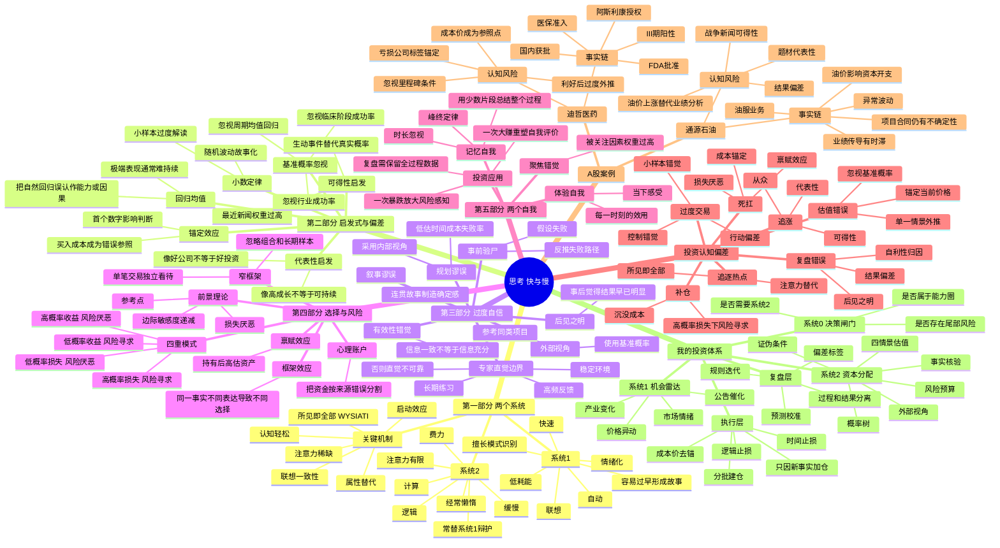

# 《思考，快与慢》思维导图

## Mermaid版本



---

## 树状提纲版本

### 一、全书主线

```text
人脑不是完全理性的计算器
→ 快速直觉负责大多数日常判断
→ 缓慢理性只在少数时候介入
→ 快速判断依赖启发式和联想
→ 启发式在熟悉环境中高效，但在概率、金融和复杂系统中会系统性出错
→ 判断错误通过参考点、损失厌恶和框架效应进入选择
→ 记忆自我又会重新编辑过去
→ 真正的改进依靠决策结构，而不是意志力口号
```

### 二、系统1与系统2

- **系统1**
  - 自动读取情绪、面孔、趋势和熟悉模式；
  - 能迅速形成因果故事；
  - 面对困难问题时，会悄悄替换为容易问题；
  - 在信息不足时仍追求连贯性；
  - 适合执行成熟技能，不适合单独处理低频、高噪声和高不确定决策。

- **系统2**
  - 负责计算、比较、抑制冲动和遵守规则；
  - 注意力和工作记忆容量有限；
  - 在疲劳、兴奋、恐惧和时间压力下更容易退出；
  - 常常不是独立裁判，而是系统1的辩护律师；
  - 必须通过表格、清单和预先规则被强制启动。

### 三、判断偏差链

```text
刺激或新闻
→ 联想被激活
→ 形成容易理解的故事
→ 用故事替代概率
→ 选择支持故事的信息
→ 产生过度自信
→ 用仓位表达信念
→ 价格波动后受到损失厌恶影响
→ 事后用结果重写原始判断
```

### 四、投资中最危险的十种偏差

1. **所见即全部**：只根据眼前信息下结论；
2. **锚定**：被现价、成本价、目标价或历史高点牵引；
3. **可得性**：最近、最生动的新闻被高估；
4. **代表性**：根据“像不像成功公司”而非概率判断；
5. **基准概率忽视**：不看同类公司的总体成功率；
6. **小数定律**：从几天走势或一两笔交易推断稳定规律；
7. **损失厌恶**：为了避免确认亏损而承担更大风险；
8. **禀赋效应**：持有后自动提高主观估值；
9. **结果偏差**：赚钱就认为过程正确，亏钱就认为过程错误；
10. **后见之明**：事后低估当时的不确定性。

### 五、对职业投资者的核心升级

- 从“寻找确定答案”升级为“管理概率分布”；
- 从“相信研究深度”升级为“外部视角 + 内部视角”；
- 从“控制情绪”升级为“改变决策结构”；
- 从“以成本价为中心”升级为“以未来赔率为中心”；
- 从“单笔盈亏”升级为“长期样本与组合风险”；
- 从“复盘结果”升级为“校准预测和识别偏差”。

---

## 投资版一页图

```text
【机会出现】
公告、政策、产业变化、价格异动
        ↓
【系统1生成直觉】
我感觉它会涨／这是大机会
        ↓
【系统0拦截】
是否高不确定？是否高仓位？是否低频事件？
是 → 强制进入系统2
        ↓
【系统2研究】
事实与解释分离
基准概率
因果链
四情景估值
证伪条件
        ↓
【风险预算】
单股上限
组合相关性
最大可承受损失
跳空和流动性折扣
        ↓
【执行】
分批建仓
只因新事实加仓
不因成本补仓
        ↓
【更新】
新信息改变概率，不是改变故事措辞
        ↓
【退出】
逻辑证伪／估值透支／催化失效／风险超限
        ↓
【复盘】
过程质量、概率校准、偏差标签、规则改进
```

---

## 参考资料

1. Daniel Kahneman, *Thinking, Fast and Slow*, Farrar, Straus and Giroux, 2011.
2. Princeton University Library book record: https://catalog.princeton.edu/catalog/9969130463506421
3. Penguin Random House book page: https://www.penguinrandomhouse.com/books/89308/thinking-fast-and-slow-by-daniel-kahneman/
4. Daniel Kahneman Nobel lecture, “Maps of Bounded Rationality”: https://www.nobelprize.org/uploads/2018/06/kahnemann-lecture.pdf
5. Tversky & Kahneman, “Judgment under Uncertainty: Heuristics and Biases”: https://www.science.org/doi/10.1126/science.185.4157.1124

> 说明：本图是对全书结构的重构和投资化表达，不是原书逐句摘录。