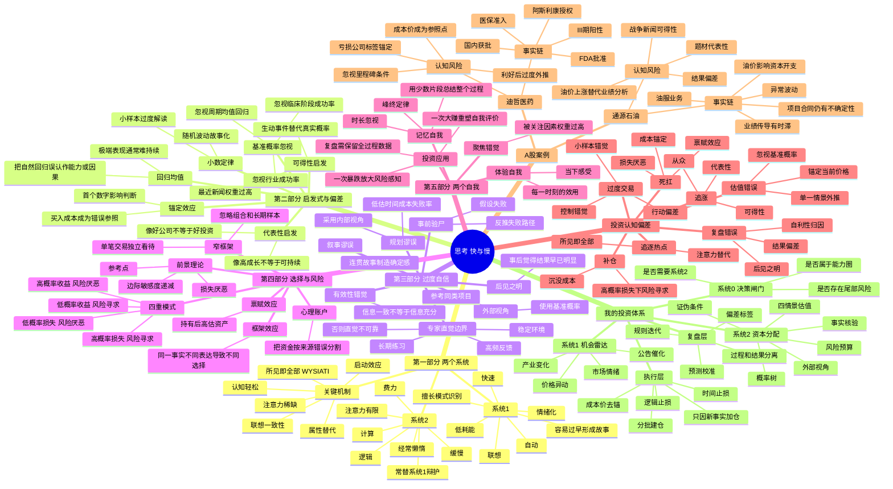

# 《思考，快与慢》完整投资学习包

> 面向A股个人投资者的结构化读书成果。内容为核心理论重构、投资应用与案例验证，不复制大段原文。
>
> 资料核验日期：2026-07-24。


---

<!-- 来源文件：00_阅读成果索引.md -->

# 《思考，快与慢》投资学习包

> 作者：丹尼尔·卡尼曼（Daniel Kahneman）  
> 主题：判断、决策、概率、风险与认知偏差  
> 应用市场：A股  
> 资料核验日期：2026-07-24

## 一、交付成果

1. [《思考，快与慢》思维导图](01_思考快与慢_思维导图.md)
2. [《思考，快与慢》读书笔记](02_思考快与慢_读书笔记.md)
3. [从本书提炼的20条投资原则](03_思考快与慢_20条投资原则.md)
4. [A股真实案例验证：迪哲医药与通源石油](04_思考快与慢_A股案例验证.md)
5. [我的投资体系：双系统—概率更新—风险预算体系V3.0](05_我的投资体系_思考快与慢版V3.0.md)
6. [交易前认知偏差检查清单](06_认知偏差交易检查清单.md)

另附：

- `思考快与慢_完整学习包_合并版.md`：上述文件的合并版本；
- `思考快与慢_投资学习包.zip`：便于一次下载和归档。

---

## 二、本书对投资最重要的结论

《思考，快与慢》并不是一本教人彻底消除情绪和直觉的书。它揭示的是：

1. 人脑会优先调用快速、自动、联想式的“系统1”；
2. 缓慢、费力、逻辑化的“系统2”经常懒惰，并会替系统1事后辩护；
3. 投资错误通常不是因为完全没有知识，而是因为在错误的时刻调用了错误的思维模式；
4. 认知偏差不能只靠“提醒自己理性”解决，必须通过流程、仓位、清单和预承诺进行约束；
5. 职业投资者的优势，不是每次预测正确，而是能够让判断错误保持可修复，让正确判断获得足够收益。

投资版总纲：

```text
系统1发现机会
→ 系统0判断是否值得启动深度研究
→ 系统2完成事实核验、基准概率、情景估值与证伪分析
→ 风险预算决定仓位
→ 新事实触发概率更新
→ 退出规则阻止损失厌恶和成本锚定
→ 复盘区分过程质量与结果运气
```

---

## 三、与我现有投资体系的关系

我原有体系强调：

> 产业逻辑定方向，基本面定质量，事件催化定时点，板块共振定强弱，价格行为定确认，风险预算定仓位，退出规则定盈亏。

《思考，快与慢》增加的是一层“认知控制系统”：

- 在产业逻辑之前增加**基准概率与外部视角**；
- 在事件催化之后增加**可得性偏差和叙事替代检查**；
- 在估值过程中增加**锚定隔离**；
- 在持仓阶段增加**成本价去锚、损失厌恶控制和概率更新**；
- 在复盘阶段增加**结果偏差、后见之明和运气分解**。

因此，新体系不是推翻原体系，而是给原体系增加“防止自己欺骗自己”的控制层。

---

## 四、A股案例说明

用户所写“迪泽医药”，按A股上市公司正式名称修正为：

- **迪哲医药（688192）**：用于分析创新药投资中的锚定、基准概率忽视、叙事偏差、损失厌恶与利好后的过度外推；
- **通源石油（300164）**：用于分析地缘事件交易中的可得性偏差、属性替代、代表性启发、因果链压缩和结果偏差。

案例分析只根据公开公告和定期报告识别可观察事实，不宣称能够直接证明所有投资者的心理状态。其作用是检验：若投资者受到这些偏差影响，会在哪些决策节点犯错，以及流程如何修正。

---

## 五、建议使用顺序

```text
先看思维导图建立全局结构
→ 阅读完整笔记理解偏差机制
→ 把20条原则加入交易日志
→ 用A股案例练习事实与故事分离
→ 将V3.0体系写入自己的实际操作流程
→ 每次交易前执行认知偏差检查清单
```

---

## 六、重要边界

- 本学习包是结构化重构、投资应用和案例分析，不是原书逐字摘录；
- “系统1/系统2”是解释认知过程的功能性模型，不应理解为大脑中两个独立器官；
- 本书部分社会启动效应研究后来面临重复验证争议，相关章节应以审慎态度理解；
- 识别偏差不等于获得稳定超额收益，交易成本、市场定价、信息差和执行约束仍然存在；
- 本材料用于学习和投资系统设计，不构成任何证券买卖建议。


---

<!-- 来源文件：01_思考快与慢_思维导图.md -->

# 《思考，快与慢》思维导图

## Mermaid版本



---

## 树状提纲版本

### 一、全书主线

```text
人脑不是完全理性的计算器
→ 快速直觉负责大多数日常判断
→ 缓慢理性只在少数时候介入
→ 快速判断依赖启发式和联想
→ 启发式在熟悉环境中高效，但在概率、金融和复杂系统中会系统性出错
→ 判断错误通过参考点、损失厌恶和框架效应进入选择
→ 记忆自我又会重新编辑过去
→ 真正的改进依靠决策结构，而不是意志力口号
```

### 二、系统1与系统2

- **系统1**
  - 自动读取情绪、面孔、趋势和熟悉模式；
  - 能迅速形成因果故事；
  - 面对困难问题时，会悄悄替换为容易问题；
  - 在信息不足时仍追求连贯性；
  - 适合执行成熟技能，不适合单独处理低频、高噪声和高不确定决策。

- **系统2**
  - 负责计算、比较、抑制冲动和遵守规则；
  - 注意力和工作记忆容量有限；
  - 在疲劳、兴奋、恐惧和时间压力下更容易退出；
  - 常常不是独立裁判，而是系统1的辩护律师；
  - 必须通过表格、清单和预先规则被强制启动。

### 三、判断偏差链

```text
刺激或新闻
→ 联想被激活
→ 形成容易理解的故事
→ 用故事替代概率
→ 选择支持故事的信息
→ 产生过度自信
→ 用仓位表达信念
→ 价格波动后受到损失厌恶影响
→ 事后用结果重写原始判断
```

### 四、投资中最危险的十种偏差

1. **所见即全部**：只根据眼前信息下结论；
2. **锚定**：被现价、成本价、目标价或历史高点牵引；
3. **可得性**：最近、最生动的新闻被高估；
4. **代表性**：根据“像不像成功公司”而非概率判断；
5. **基准概率忽视**：不看同类公司的总体成功率；
6. **小数定律**：从几天走势或一两笔交易推断稳定规律；
7. **损失厌恶**：为了避免确认亏损而承担更大风险；
8. **禀赋效应**：持有后自动提高主观估值；
9. **结果偏差**：赚钱就认为过程正确，亏钱就认为过程错误；
10. **后见之明**：事后低估当时的不确定性。

### 五、对职业投资者的核心升级

- 从“寻找确定答案”升级为“管理概率分布”；
- 从“相信研究深度”升级为“外部视角 + 内部视角”；
- 从“控制情绪”升级为“改变决策结构”；
- 从“以成本价为中心”升级为“以未来赔率为中心”；
- 从“单笔盈亏”升级为“长期样本与组合风险”；
- 从“复盘结果”升级为“校准预测和识别偏差”。

---

## 投资版一页图

```text
【机会出现】
公告、政策、产业变化、价格异动
        ↓
【系统1生成直觉】
我感觉它会涨／这是大机会
        ↓
【系统0拦截】
是否高不确定？是否高仓位？是否低频事件？
是 → 强制进入系统2
        ↓
【系统2研究】
事实与解释分离
基准概率
因果链
四情景估值
证伪条件
        ↓
【风险预算】
单股上限
组合相关性
最大可承受损失
跳空和流动性折扣
        ↓
【执行】
分批建仓
只因新事实加仓
不因成本补仓
        ↓
【更新】
新信息改变概率，不是改变故事措辞
        ↓
【退出】
逻辑证伪／估值透支／催化失效／风险超限
        ↓
【复盘】
过程质量、概率校准、偏差标签、规则改进
```

---

## 参考资料

1. Daniel Kahneman, *Thinking, Fast and Slow*, Farrar, Straus and Giroux, 2011.
2. Princeton University Library book record: https://catalog.princeton.edu/catalog/9969130463506421
3. Penguin Random House book page: https://www.penguinrandomhouse.com/books/89308/thinking-fast-and-slow-by-daniel-kahneman/
4. Daniel Kahneman Nobel lecture, “Maps of Bounded Rationality”: https://www.nobelprize.org/uploads/2018/06/kahnemann-lecture.pdf
5. Tversky & Kahneman, “Judgment under Uncertainty: Heuristics and Biases”: https://www.science.org/doi/10.1126/science.185.4157.1124

> 说明：本图是对全书结构的重构和投资化表达，不是原书逐句摘录。


---

<!-- 来源文件：02_思考快与慢_读书笔记.md -->

# 《思考，快与慢》读书笔记

> 阅读目的：把行为经济学转化为A股投资中的决策规则。  
> 我的核心问题：为什么明知要理性、止损、控制仓位，实盘中仍会追涨、死扛、补仓和临时改变计划？

---

# 一、全书总论：投资失败往往不是知识不足，而是思维模式错配

卡尼曼把思维活动拟人化为两个系统：

- **系统1**：快、自动、联想、情绪化、几乎不费力；
- **系统2**：慢、费力、逻辑化、能计算和自我控制，但注意力有限且经常懒惰。

这不是说大脑中存在两个物理器官，而是用两个角色解释不同类型的认知过程。

投资中的问题不是系统1一定错误。经验丰富的交易者可以迅速识别熟悉形态、异常成交和公告质量，优秀企业家也能快速感知行业变化。真正的问题在于：

1. 系统1会在证据不足时自动生成故事；
2. 系统2常常没有认真审查，只负责把故事说得更合理；
3. 金融市场具有高噪声、低反馈、非平稳和尾部风险，直觉形成的条件很差；
4. 盈亏会直接刺激情绪，使系统2进一步失去控制；
5. 持仓之后，研究目标容易从“寻找真相”变成“证明我没错”。

因此，投资能力的核心不是让自己永远冷静，而是建立一个流程，使高风险决策无法只依靠直觉完成。

我的投资版结论：

> **系统1负责发现异常，系统2负责配置资本，系统0负责决定什么时候必须停止直觉、启动审查。**

---

# 二、第一部分：系统1与系统2

## 2.1 系统1：强大的模式识别器，也是自动编剧

系统1可以迅速完成：

- 判断声音是否愤怒；
- 识别熟悉的人脸；
- 完成简单语言联想；
- 在熟练驾驶时保持方向；
- 感知股票突然放量、涨停打开、板块扩散等模式。

它的优势是速度和低成本。没有系统1，人无法正常生活，也无法在市场中及时反应。

但系统1还有一个危险倾向：**它厌恶空白，喜欢因果，追求连贯。**

看到创新药大涨，它会自动生成：

```text
政策支持创新药
→ 龙头获得BD授权
→ 行业价值重估
→ 这只股票也会复制上涨
```

看到战争新闻，它会自动生成：

```text
冲突升级
→ 原油上涨
→ 石油股上涨
→ 油服公司利润大增
```

这些故事可能部分正确，但每个箭头都包含时间、概率、传导强度和反向因素。系统1会把复杂概率链压缩成一句“逻辑很顺”。

### 投资应用

当我产生“这次非常确定”的感觉时，不应把它当成结论，而应把它当成警报：系统1已经完成故事，需要系统2逐条检查箭头。

---

## 2.2 系统2：不是理性君主，而是资源有限的审核员

系统2负责：

- 复杂计算；
- 比较多个方案；
- 抑制冲动；
- 按规则执行；
- 检查矛盾；
- 进行概率和估值分析。

但系统2需要注意力。疲劳、时间压力、连续看盘、情绪兴奋和亏损焦虑都会削弱它。

更危险的是，系统2经常做“辩护律师”而不是“法官”：

- 买入后下跌，会搜索利好资料；
- 错过上涨，会提高目标价证明还能追；
- 重仓后，会把风险提示解释为市场误解；
- 盈利后，会把偶然性解释为能力；
- 亏损后，会把错误归因于主力、量化或突发消息。

### 投资应用

系统2不能只依靠临场意志力。必须把它外置为：

- 投资备忘录；
- 概率树；
- 四情景估值；
- 买入清单；
- 证伪条件；
- 仓位上限；
- 交易日志；
- 复盘评分。

写下来不是形式主义，而是把系统2从“脑内辩护”变成“可审计流程”。

---

## 2.3 注意力是稀缺资源

系统2的注意力不能无限并行。投资者同时追踪十几个热点、几十只股票、宏观新闻、分时盘口和社交媒体，表面上信息很多，实际判断质量会下降。

注意力稀缺造成三种错误：

1. **重要但不显眼的变量被忽略**：现金流、债务、稀释、合同条件；
2. **显眼但次要的变量被高估**：涨停、热搜、群聊观点、单日资金流；
3. **复杂问题被替换为简单问题**：从“未来现金流概率分布如何”替换为“今天强不强”。

### 我的规则

- 同时深度研究不超过3家公司；
- 同时重点跟踪不超过8个持仓和候选；
- 盘中不做完整基本面研究；
- 大额决策必须离开分时图，重新阅读原始备忘录。

---

## 2.4 认知轻松：熟悉不等于真实

重复出现、表达清晰、容易理解的信息会产生认知轻松，人更倾向相信它。

投资市场中，以下表达容易制造虚假可信度：

- “国产替代”；
- “全球首创”；
- “万亿赛道”；
- “订单饱满”；
- “主力洗盘”；
- “政策底已现”；
- “长期逻辑没变”。

这些词本身可能有事实基础，但重复和流畅会让人跳过核验。

### 我的规则

任何高频叙事必须翻译成可测量变量：

| 叙事 | 必须转换为 |
|---|---|
| 国产替代 | 市占率、客户认证、价格、毛利、产能 |
| 全球首创 | 临床差异、适应症空间、竞争药、支付能力 |
| 订单饱满 | 已签合同、交付周期、收入确认、回款 |
| 业绩拐点 | 同比、环比、扣非、现金流、持续性 |
| 主力洗盘 | 无法验证，不能作为基本面理由 |

---

## 2.5 联想一致性与“所见即全部”

系统1倾向用当前可见的信息构造一个完整世界。卡尼曼用“所见即全部”概括这一机制。

市场中常见表现：

- 只看到利好公告，不看附带条件；
- 只看到营收增长，不看现金消耗；
- 只看到油价上涨，不看油服订单和资本开支时滞；
- 只看到股价强势，不看估值隐含预期；
- 只看到券商目标价，不看模型假设；
- 只看到成功案例，不看失败样本。

信息一致性越高，人越自信；但一致性可能只是因为信息来源相同、观点同质或反方信息未被呈现。

### 我的规则

每份投资备忘录必须包含：

1. 支持逻辑的三条证据；
2. 反对逻辑的三条证据；
3. 目前不知道的三件事；
4. 最可能被遗漏的利益相关方；
5. 一项能显著改变结论的新事实。

---

# 三、第二部分：启发式与偏差

## 3.1 小数定律：把随机波动误认成规律

人们倾向相信小样本能够代表总体。

投资中的典型错误：

- 一只股票连续三天大涨，就推断主升浪成立；
- 一次战争事件交易赚20%，就认为自己擅长地缘推演；
- 某策略连续五笔盈利，就提高仓位；
- 某基金一年排名靠前，就认为经理能力卓越；
- 某公司一个季度高增长，就外推三年。

小样本波动大，极端结果更常见。样本越小，越需要保留随机解释。

### 我的规则

- 单一交易只记为一个样本；
- 策略至少积累30笔同类交易再初步评价；
- 基本面趋势至少观察两个以上报告期，并区分季节性；
- 单次临床数据必须结合样本量、终点设计、对照组和后续验证；
- 不因为短期连胜提高单笔风险预算。

---

## 3.2 锚定效应：第一个数字会污染后续判断

锚可以来自：

- 买入成本；
- 历史高点；
- 券商目标价；
- 管理层指引；
- 市场传闻中的订单金额；
- 估值比较中随意选取的倍数；
- 当前股价。

最危险的是成本锚定。买入价只是历史成交，不是企业价值。股价从100跌到70，不代表便宜；从20涨到40，也不代表贵。

### 反锚定估值流程

```text
先隐藏当前价格
→ 独立建立经营假设
→ 计算压力、保守、基准、乐观价值
→ 再查看市场价格
→ 比较价格隐含的成功概率
```

### 持仓更新问题

不要问：“什么时候回本？”

应问：“如果今天没有持仓，我是否愿意按当前价格买入？若愿意，合理仓位是多少？”

---

## 3.3 可得性启发：越生动、越近期，主观概率越高

战争、监管、临床失败、涨停、暴雷等事件具有高可得性。它们更容易被回忆，因此被认为更常见或更重要。

例如：

- 连续看到地缘冲突新闻，会高估原油长期短缺概率；
- 看到某创新药授权金额巨大，会高估其他管线复制概率；
- 经历一次闪崩，会长期高估同类股票的即时崩盘风险；
- 连续看到AI订单新闻，会忽略行业资本开支周期。

可得性不等于虚假。新闻可能确实改变基本面。问题是主观权重常由“是否容易想到”决定，而不是由概率和影响决定。

### 我的规则

重大新闻出现后，必须回答：

1. 这是新事实还是旧事实的重复传播？
2. 它改变了哪个现金流变量？
3. 影响是一次性还是持续性？
4. 市场此前隐含了多少预期？
5. 同类事件历史上有多少真正转化为利润？

---

## 3.4 代表性启发：像赢家，不代表会成为赢家

投资者常根据相似性分类：

- 有明星科学家团队，所以像成功Biotech；
- 有大客户，所以像行业龙头；
- 低位放量，所以像主升前夜；
- 题材、代码、名字接近，所以像同一板块；
- 管理层表达自信，所以像高执行力公司。

代表性忽视了基准概率。很多“像成功者”的公司最终失败，因为成功者本来就是少数。

### 创新药应用

不能只问“管线数据像不像成功药物”，还要问：

- 当前临床阶段同类项目的历史成功率；
- 终点是否被监管认可；
- 样本量和随访是否足够；
- 竞争产品何时上市；
- 商业化支付和患者识别能力；
- 公司现金跑道是否覆盖下一里程碑。

---

## 3.5 基准概率忽视：内部故事压倒外部统计

内部视角关注项目自身细节；外部视角关注同类项目的总体结果。

投资者喜欢内部视角，因为细节更有故事性。管理层也天然使用内部视角：产品独特、团队优秀、市场巨大、进展顺利。

但预测应先从外部视角开始：

```text
同类企业历史结果
→ 同阶段成功率
→ 行业周期和竞争格局
→ 再根据该公司独特证据调整
```

### 我的规则

每个投资项目先写一句：

> “如果我不知道公司名字，只知道它属于这一类企业，这类企业通常会发生什么？”

然后才写公司特有优势。

---

## 3.6 回归均值：极端表现通常会自然回落

高增长、高毛利、高价格、高热度、极端悲观都可能回归常态。

投资中常见误判：

- 把周期高点利润当作正常利润；
- 把疫情特殊需求当作永久需求；
- 把一次爆款产品当作稳定平台能力；
- 把连续涨停归因于基本面持续改善；
- 把短期亏损改善归因于管理层新战略，而忽略低基数。

回归均值不意味着所有趋势都会反转，而是要求识别：当前指标有多少来自结构性变化，有多少来自随机和周期极端。

### 我的规则

估值必须使用：

- 正常化利润；
- 中周期价格；
- 可持续毛利；
- 多年现金流；
- 压力情景。

---

# 四、第三部分：过度自信

## 4.1 叙事谬误：连贯故事比真实概率更有吸引力

市场每天都在讲故事：

```text
政策出台 → 产业爆发 → 公司受益 → 业绩增长 → 估值提升
```

故事的问题不是一定错，而是会隐藏：

- 每一步的条件；
- 每一步的时间；
- 竞争者反应；
- 估值已经反映的预期；
- 失败路径；
- 反身性和政策变化。

系统1把“可以讲通”误认为“高概率”。

### 我的规则：因果链拆解

每个箭头必须标注：

| 项目 | 内容 |
|---|---|
| 触发条件 | 什么事实发生后才成立 |
| 时间窗口 | 何时传导 |
| 强度 | 对收入、利润或估值影响多大 |
| 反向因素 | 哪些因素会抵消 |
| 可验证指标 | 用什么数据确认 |

---

## 4.2 有效性错觉：一致性高，不代表预测力高

投资者看到一组相互支持的信息时会产生强烈信心。例如：

- 行业景气；
- 公司龙头；
- 机构调研；
- 技术突破；
- 资金流入。

但这些信息可能同源，或者都由股价上涨驱动。信息之间高度相关，不能当作五份独立证据。

### 我的规则

证据按来源分组：

1. 公司官方披露；
2. 客户或竞争者数据；
3. 行业统计；
4. 价格和成交；
5. 第三方观点。

至少需要两个相互独立的事实来源。观点重复不增加证据权重。

---

## 4.3 后见之明：结果发生后，一切看起来都很明显

上涨后，人会认为利好早已清楚；下跌后，又认为风险早有迹象。

后见之明会破坏学习：

- 成功时夸大自己当时的信心；
- 失败时假装自己本可预见；
- 无法准确评价决策质量；
- 形成错误规则。

### 我的规则

交易前必须记录：

- 各情景概率；
- 关键未知；
- 买入理由；
- 证伪条件；
- 预期时间；
- 最大可承受损失。

复盘时禁止改写原记录，只能新增“事后观察”。

---

## 4.4 结果偏差：赚钱的坏决策仍然是坏决策

一次交易结果由以下因素共同决定：

```text
结果 = 决策质量 + 市场随机性 + 未知事件 + 执行质量
```

正确逻辑可能亏钱，错误逻辑也可能赚钱。

典型错误：

- 追高后继续涨，认为追高正确；
- 未设止损却最终反弹，认为死扛正确；
- 重仓单一事件获利，认为仓位正确；
- 及时止损后股票反弹，认为止损错误。

### 我的复盘评分

- 事实核验：20分；
- 基准概率：15分；
- 估值与赔率：20分；
- 证伪条件：10分；
- 仓位合规：15分；
- 执行纪律：10分；
- 复盘完整：10分。

盈亏不直接进入过程评分，只单独记录。

---

## 4.5 专家直觉何时可信

可靠直觉需要两个条件：

1. 环境存在相对稳定、可学习的规律；
2. 人能获得及时、明确和大量反馈。

象棋、某些临床诊断和熟练技能较符合。长期宏观预测、地缘冲突、单次临床结果、牛熊顶底等环境反馈稀疏且规则变化，直觉可信度低。

### 投资分层

| 场景 | 直觉可信度 | 处理方式 |
|---|---:|---|
| 熟悉公司的公告格式异常 | 中等 | 作为研究触发器 |
| 分时盘口短期意图 | 低到中 | 仅作为执行辅助 |
| 三年利润预测 | 低 | 必须情景化 |
| 战争最终走向 | 很低 | 小仓、快速更新 |
| 会计勾稽和现金流异常 | 中到高 | 可依赖专业经验，但仍核验 |

---

## 4.6 规划谬误与外部视角

企业和投资者普遍低估：

- 新产品上市时间；
- 产能爬坡难度；
- 临床入组时间；
- 海外审批时间；
- 项目合同落地时间；
- 盈亏平衡所需资金。

内部视角聚焦计划；外部视角参考类似项目实际耗时。

### 我的规则

- 管理层时间表默认增加延迟区间；
- 创新药现金跑道至少覆盖关键节点后12个月缓冲；
- 海外项目未签正式合同前，不把中标金额全额计入估值；
- 产能规划按利用率爬坡，而不是满产收入估算。

---

## 4.7 事前验尸：在失败前寻找失败原因

事前验尸方法：假设一年后投资失败，要求团队或自己写出最可能原因。

它能降低群体一致性和过度自信，因为讨论从“你为什么反对我”变成“假设已经失败，原因是什么”。

### 我的事前验尸模板

- 产品失败；
- 审批延迟；
- 竞争者提前；
- 需求低于预期；
- 毛利下降；
- 现金不足；
- 融资稀释；
- 合同未签；
- 地缘事件反转；
- 板块流动性退潮；
- 估值已透支；
- 我的信息源错误。

---

# 五、第四部分：选择与风险

## 5.1 前景理论：人不是根据最终财富，而是相对参考点感受得失

传统理论假设人关注最终资产水平。前景理论指出，人更关心相对参考点的变化。

参考点可以是：

- 买入成本；
- 昨日收盘；
- 账户历史高点；
- 预期收益目标；
- 别人的收益；
- 曾经出现的浮盈。

这解释了为什么：

- 盈利10%后回落到5%，会感到“亏了5%”；
- 股票低于成本时不愿卖，即使逻辑已变；
- 达到回本价后急于卖出；
- 账户从高点回撤时进行报复性交易。

### 我的规则

唯一合法参考点是：

> 当前事实下的未来价值区间与风险预算。

成本价只用于税务、统计和复盘，不参与继续持有判断。

---

## 5.2 损失厌恶：同等损失带来的痛苦通常大于收益的快乐

损失厌恶导致：

- 不愿确认亏损；
- 过早卖出盈利仓；
- 对已有持仓要求更低证据标准；
- 在亏损区承担更大风险；
- 用“长期投资”包装失败交易。

### 处置效应

投资者倾向卖出盈利股票、保留亏损股票。结果是：

- 截断利润；
- 放大损失；
- 组合质量持续恶化；
- 资本被低效资产占用。

### 我的规则

卖出不按盈亏分类，而按原因分类：

1. 逻辑证伪；
2. 估值透支；
3. 催化失效；
4. 风险超限；
5. 更优机会；
6. 交易规则退出。

---

## 5.3 敏感度递减：越远离参考点，边际感受越弱

亏损从0到10%非常痛，继续从50%亏到60%的心理差异反而可能下降。这会让深套投资者麻木并继续赌博。

盈利也类似：初始收益带来强烈满足，后续收益的边际快乐下降，导致过早兑现。

### 我的规则

- 止损和减仓在损失仍小的时候执行；
- 不允许单一事件仓从交易仓自动变成长线仓；
- 盈利仓是否持有由趋势和价值决定，不由“已经赚够”决定；
- 每次加仓重新计算总风险，而不是只看新增资金。

---

## 5.4 四重模式：不同概率区间会改变风险偏好

| 情形 | 常见行为 | 投资表现 |
|---|---|---|
| 高概率收益 | 风险厌恶 | 小赚即卖，放弃长期复利 |
| 高概率损失 | 风险寻求 | 深套后加仓、等待奇迹 |
| 低概率巨额收益 | 风险寻求 | 追逐彩票型概念股 |
| 低概率巨额损失 | 风险厌恶 | 过度支付保险或完全回避机会 |

创新药、困境反转、壳价值和极端事件股容易被当作“低概率巨额收益彩票”。卖出裸期权、信用下沉和高杠杆策略则可能呈现“小概率巨额损失”。

### 我的规则

低概率事件不禁止参与，但必须：

- 明确概率；
- 仓位足够小；
- 不把最大潜在收益当作期望收益；
- 计算组合尾部风险；
- 不通过连续补仓提高赌注。

---

## 5.5 禀赋效应：拥有之后，主观价值上升

持仓会改变研究立场：

- 同一条公告，持仓者看到机会，空仓者看到风险；
- 持仓者更相信管理层解释；
- 持仓者把卖出理解为承认失败；
- 自选股研究越久，越容易产生心理所有权。

### 我的规则

- 每月进行一次“清空组合重建”思想实验；
- 让AI或另一位投资者撰写反方报告；
- 持仓与候选使用同一评分表；
- 持仓不享有更低的继续持有标准。

---

## 5.6 框架效应：表达方式改变选择

同一事实可以被描述为：

- “成功率70%”或“失败率30%”；
- “股价从高点跌50%”或“仍比底部涨100%”；
- “最高15亿美元交易总额”或“确定首付款6亿美元，其余附条件”；
- “中标19亿元”或“尚未签署正式合同”。

不同框架会激活不同情绪。

### 我的规则

所有重大数据至少重写两次：

1. 正面框架；
2. 负面框架。

然后用中性表达决策。

---

## 5.7 心理账户与窄框架

投资者常把资金分成：

- 本金；
- 浮盈；
- 赚来的钱；
- 奖金；
- 回本资金。

“用利润赌一把”是心理账户错觉。账户中的每一元都具有相同经济价值。

窄框架则把每一笔交易独立看待，忽略组合和长期样本。例如为了让某笔交易回本而增加风险，却没有考虑它对总账户的影响。

### 我的规则

- 所有资金统一计入净资产；
- 单笔风险以总账户计算；
- 相关持仓合并计算；
- 评价策略看长期分布，不要求每笔盈利；
- 不设“必须把这只股票赚回来”的目标。

---

# 六、第五部分：两个自我

## 6.1 体验自我与记忆自我

体验自我经历每个时刻；记忆自我用少数片段总结整段经历。

记忆自我容易受：

- 峰值；
- 结尾；
- 极端事件；
- 最近经历；
- 叙事完整性影响。

投资者可能因为一次20%涨停，把整个研究过程记成“判断精准”；也可能因为最后一次止损，把一个长期有效策略记成“已经失效”。

### 我的规则

完整保存：

- 建仓时点；
- 每次更新；
- 最大有利波动MFE；
- 最大不利波动MAE；
- 持有时间；
- 计划内与计划外操作；
- 每个阶段的概率判断。

避免只凭最后结果回忆。

---

## 6.2 峰终定律与时长忽视

人对经历的评价常由最强烈时刻和结尾决定，而忽略持续时间。

投资应用：

- 一次暴涨成为整个持仓记忆；
- 最后回撤导致否定长期收益；
- 长期小亏被一次反弹掩盖；
- 连续数月低效持仓的机会成本被忽略。

### 我的规则

复盘不仅记录收益率，还记录：

- 占用资金天数；
- 年化收益；
- 机会成本；
- 波动和回撤；
- 决策耗时；
- 情绪负担。

---

## 6.3 聚焦错觉：正在关注的东西会显得特别重要

当我集中研究某只股票时，它会在心理上变得比实际更重要。研究越多，越容易认为必须交易，否则研究成本浪费。

这会产生：

- 研究沉没成本；
- 强行寻找买点；
- 忽略替代机会；
- 过高仓位；
- 过度关注单一行业。

### 我的规则

研究结果允许是“不交易”。

每次决策必须比较至少三个选项：

1. 买入该股票；
2. 买入替代资产或指数；
3. 持有现金。

---

# 七、把全书映射到我的真实投资行为

## 7.1 事件交易的认知风险

我的优势之一是从战争、政策、临床、授权和产业变化中寻找预期差。但事件交易天然容易触发系统1：

- 新闻生动；
- 时间紧迫；
- 股价快速波动；
- 群体情绪强；
- 信息不完整；
- 结果呈二元化。

因此事件交易不能只靠“推演正确”，必须增加：

- 事件树；
- 二阶传导；
- 时间窗口；
- 失败路径；
- 小仓试错；
- 价格确认；
- 时间止损。

## 7.2 创新药投资的认知风险

创新药具有复杂、低频、高不确定和非线性价值特征。常见偏差包括：

- 被“全球首创”叙事吸引；
- 忽视临床基准概率；
- 把总交易金额当成确定现金；
- 把临床数据好等同于商业化成功；
- 对熟悉管线产生禀赋效应；
- 利好后不断上调远期峰值销售；
- 亏损时用长期价值拒绝更新。

正确方法是rNPV、概率树、现金跑道、竞争格局和里程碑更新。

## 7.3 赚钱后的最大风险：结果偏差与控制错觉

一次成功交易最容易强化错误规则。赚钱后，我需要问：

- 预测的因果链真的发生了吗？
- 还是市场以另一原因上涨？
- 仓位是否超出原风险预算？
- 若重复100次，这种做法是否仍能生存？
- 这次收益中有多少来自运气、贝塔、板块和个股选择？

## 7.4 亏损后的最大风险：参考点与风险寻求

亏损后，我会自然地希望回本。此时问题已从“这是不是好投资”替换成“怎样避免确认损失”。

必须强制重置：

```text
删除成本价
→ 更新事实
→ 重算价值
→ 重算概率
→ 与替代机会比较
→ 按当前赔率决定持有、减仓或退出
```

---

# 八、本书不能被误用的地方

## 8.1 识别偏差不等于能够轻易战胜市场

即使大量投资者存在偏差，也不代表偏差一定形成可交易机会。原因包括：

- 市场中有套利者；
- 偏差持续时间不确定；
- 价格可能长期偏离；
- 交易成本和流动性限制；
- 投资者自身也受同样偏差影响；
- 正确方向不等于正确时点。

## 8.2 系统1不是敌人

系统1包含经验、技能和模式识别。目标不是消灭直觉，而是区分：

- 熟练、稳定环境中的专业直觉；
- 高噪声、低反馈环境中的故事直觉。

## 8.3 部分研究需要现代科学视角

本书引用的一些社会启动效应研究后来面临重复验证争议。卡尼曼本人曾呼吁研究者通过系统重复实验恢复可信度。更广泛的心理学重复性研究也发现，部分原始效应在重复实验中效应量下降或未能重复。

因此应区分：

- 较稳健的核心框架：锚定、损失厌恶、框架效应、基准概率忽视、过度自信等；
- 需要谨慎对待的具体实验：某些行为启动效应及其效应大小。

投资者应学习本书的科学精神：不因为理论著名就停止验证。

---

# 九、我的十大认知升级

1. **直觉是候选答案，不是最终答案。**
2. **研究越连贯，越要检查是否遗漏反方信息。**
3. **先看基准概率，再看公司独特性。**
4. **当前价格和买入成本都不应成为估值锚。**
5. **重大新闻必须拆成现金流传导链。**
6. **盈利不能证明决策正确，亏损不能证明决策错误。**
7. **持仓会改变认知，因此持仓后的研究标准必须更严格。**
8. **小亏是防止损失厌恶演变成灾难的制度成本。**
9. **复盘必须保留事前概率，防止后见之明。**
10. **真正的理性不是永远冷静，而是让错误行为难以发生。**

---

# 十、我的最终读后结论

《思考，快与慢》对投资者最有价值的不是列出几十种偏差，而是揭示一条共同机制：

> 人脑会用快速、连贯、容易的故事替代困难的概率问题，然后把这种容易理解误认为真实和确定。

因此，我的投资系统必须做到：

```text
用外部视角抵抗故事
用概率树抵抗确定感
用多情景估值抵抗单一路径
用仓位限制抵抗过度自信
用预承诺抵抗损失厌恶
用原始记录抵抗后见之明
用长期样本抵抗结果偏差
```

职业投资者不是没有偏差的人，而是**知道偏差必然存在，并把防错机制写入资本配置流程的人**。

---

# 十一、主要参考资料

1. Daniel Kahneman, *Thinking, Fast and Slow*, Farrar, Straus and Giroux, 2011.
2. Penguin Random House, book description: https://www.penguinrandomhouse.com/books/89308/thinking-fast-and-slow-by-daniel-kahneman/
3. Princeton University Library, book record: https://catalog.princeton.edu/catalog/9969130463506421
4. Nobel Prize, Daniel Kahneman facts: https://www.nobelprize.org/prizes/economic-sciences/2002/kahneman/facts/
5. Daniel Kahneman, “Maps of Bounded Rationality,” Nobel lecture: https://www.nobelprize.org/uploads/2018/06/kahnemann-lecture.pdf
6. Amos Tversky and Daniel Kahneman, “Judgment under Uncertainty: Heuristics and Biases,” *Science* 185(4157):1124-1131: https://www.science.org/doi/10.1126/science.185.4157.1124
7. Kahneman & Frederick, “Associative Processes in Intuitive Judgment”: https://oar.princeton.edu/bitstream/88435/pr1qb5t/1/nihms-225350.pdf
8. Daniel Kahneman open letter regarding social priming replication: https://www.nature.com/news/polopoly_fs/7.6716.1349271308%21/suppinfoFile/Kahneman%20Letter.pdf
9. Open Science Collaboration, “Estimating the reproducibility of psychological science,” *Science*: https://www.science.org/doi/10.1126/science.aac4716

> 风险提示：本笔记用于认知训练与投资流程设计，不构成证券投资建议。


---

<!-- 来源文件：03_思考快与慢_20条投资原则.md -->

# 从《思考，快与慢》提炼的20条投资原则

> 每条原则包含：认知依据、执行规则、常见违规和自检问题。

---

## 原则1：直觉只负责报信，不负责批准资金

**认知依据**：系统1能快速发现异常，但会在证据不足时自动形成故事。

**执行规则**：

- 盘中直觉只允许触发“加入观察池”或小额试错；
- 超过账户2%的新仓必须完成书面备忘录；
- 超过账户5%的仓位必须经过隔夜复核。

**常见违规**：看到涨停、新闻或群聊观点后立即重仓。

**自检问题**：我现在拥有的是一个信号，还是一条经过验证的因果链？

---

## 原则2：先看基准概率，再研究个体差异

**认知依据**：代表性启发和内部视角会让人忽视同类项目的总体成功率。

**执行规则**：

```text
行业历史结果
→ 同类型公司成功率
→ 同阶段项目成功率
→ 再根据公司特有证据调整
```

**常见违规**：因为团队优秀、产品先进或故事独特，直接假定高成功率。

**自检问题**：如果隐去公司名称，这一类项目通常是什么结果？

---

## 原则3：任何单一故事都必须拆成概率树

**认知依据**：系统1擅长把多个不确定环节压缩成流畅故事。

**执行规则**：对每个重大逻辑拆分：

- 事件发生概率；
- 传导成功概率；
- 时间窗口；
- 财务影响；
- 市场已定价程度。

**常见违规**：“战争升级，所以石油股必涨”“临床数据好，所以商业化成功”。

**自检问题**：这条逻辑中最脆弱的箭头是哪一个？

---

## 原则4：隐藏股价后再估值

**认知依据**：锚定效应会让当前价格污染估值。

**执行规则**：

1. 暂不查看当前市值和目标价；
2. 独立建立经营假设；
3. 计算压力、保守、基准、乐观价值；
4. 最后比较价格隐含预期。

**常见违规**：先看到股价，再倒推出“合理”增长和估值倍数。

**自检问题**：我的估值是假设驱动，还是价格驱动？

---

## 原则5：买入成本不是继续持有的理由

**认知依据**：参考点和损失厌恶会把成本价变成心理中心。

**执行规则**：每天都把持仓视为可重新选择的资产：

> 如果今天没有持仓，我是否愿意按当前价格买入？合理仓位是多少？

**常见违规**：等回本再卖、跌到成本附近就舍不得退出。

**自检问题**：如果成本价从软件中消失，我的决策会变化吗？

---

## 原则6：只因新事实加仓，不因价格下跌加仓

**认知依据**：亏损区间会诱发风险寻求，补仓常是为了减轻心理痛苦。

**执行规则**：加仓必须至少满足一项：

- 基本面证据增强；
- 催化概率上升；
- 估值下降且核心假设未恶化；
- 价格确认系统发出预定信号。

**常见违规**：只因为跌了20%、接近历史低点或想摊低成本。

**自检问题**：除价格外，哪一条事实变得更好？

---

## 原则7：新闻越生动，仓位越要保守

**认知依据**：可得性启发会高估近期、醒目和情绪化事件的概率。

**执行规则**：战争、政策、监管、临床、传闻等事件交易：

- 初始仓位原则上1%—2%；
- 事件仓最大不超过5%；
- 必须设置时间止损和逻辑止损；
- 不允许用核心账户补救事件仓。

**常见违规**：因新闻紧迫感跳过研究和仓位规则。

**自检问题**：如果这条新闻没有图片、热搜和涨停，我会给它多大权重？

---

## 原则8：把“利好”翻译成现金流变量

**认知依据**：属性替代会把困难问题“价值改变多少”替换为简单问题“消息好不好”。

**执行规则**：所有利好必须落到：

- 收入；
- 毛利；
- 费用；
- 资本开支；
- 现金回收；
- 资产负债表；
- 成功概率；
- 估值期限。

**常见违规**：只判断消息级别，不计算经济影响和兑现条件。

**自检问题**：这条消息具体改变了哪一年的哪一项现金流？

---

## 原则9：总金额、峰值销售和远期空间不能当作确定价值

**认知依据**：框架效应和乐观叙事会把上限数字当作可实现结果。

**执行规则**：

- 首付款与附条件里程碑分开；
- 已签合同与中标通知分开；
- 市场空间与可获得收入分开；
- 峰值销售按概率、时间和竞争折现。

**常见违规**：用“最高15亿美元”“万亿市场”直接推导市值。

**自检问题**：确定现金、条件现金和想象空间分别是多少？

---

## 原则10：信息一致性不等于信息独立性

**认知依据**：多条同源信息会制造有效性错觉。

**执行规则**：证据至少来自两个独立渠道：

- 公司公告；
- 客户或竞争者；
- 行业统计；
- 监管文件；
- 价格成交。

重复转述同一公告不算新增证据。

**常见违规**：把多家媒体转载视为多重验证。

**自检问题**：这些证据是否都来自同一个原始来源？

---

## 原则11：小样本不允许提升长期信心

**认知依据**：小数定律会把随机连胜或连续上涨误认为稳定规律。

**执行规则**：

- 一次成功交易不提高单笔风险；
- 五笔连胜不修改仓位上限；
- 策略至少积累30笔同类样本；
- 基本面趋势至少跨两个报告期确认。

**常见违规**：一次大赚后扩大本金或借钱加仓。

**自检问题**：这个结论基于多少个真正独立的样本？

---

## 原则12：极端数据先检查回归均值

**认知依据**：极端表现常包含周期、低基数和随机成分。

**执行规则**：

- 周期股使用中枢利润；
- 高增长检查基数和一次性因素；
- 高毛利检查产品结构和价格；
- 极端悲观检查是否存在均值修复。

**常见违规**：用单季高利润外推多年DCF。

**自检问题**：当前数据中有多少是结构性变化，有多少是极端状态？

---

## 原则13：在买入前写下三个证伪条件

**认知依据**：持仓后会产生确认偏差、禀赋效应和认知失调。

**执行规则**：证伪条件必须可观察，例如：

- 临床终点失败；
- 销量连续低于阈值；
- 合同超过期限仍未签署；
- 经营现金流持续恶化；
- 板块催化结束且价格结构破坏。

**常见违规**：买入后不断修改逻辑，使任何结果都无法证伪。

**自检问题**：发生什么事实后，我会承认原假设错误？

---

## 原则14：仓位由错误成本决定，不由信心决定

**认知依据**：过度自信普遍存在，主观信心校准不足。

**执行规则**：

```text
允许损失金额 = 总资产 × 单笔风险预算
仓位 = 允许损失金额 ÷ 压力情景跌幅
```

同时考虑跳空、涨跌停和流动性折扣。

**常见违规**：越看好越重仓，忽略下行路径。

**自检问题**：若我完全判断错误，这个仓位会造成多大损失？

---

## 原则15：盈利仓与亏损仓使用同一评价标准

**认知依据**：处置效应使人过早卖出赢家、长期保留输家。

**执行规则**：每周按同一评分表重评全部持仓，禁止用盈亏状态调整标准。

**常见违规**：盈利就“落袋为安”，亏损就“长期看好”。

**自检问题**：我卖出或持有，是因为未来赔率，还是因为当前盈亏颜色？

---

## 原则16：每个重大决策必须做事前验尸

**认知依据**：事前验尸能降低群体一致性、规划谬误和过度自信。

**执行规则**：假设一年后投资失败，列出至少五条原因，并为每条设置预警指标。

**常见违规**：只写上涨逻辑和催化剂，不写失败路径。

**自检问题**：一年后回看，最可能因为什么失败？

---

## 原则17：过程质量与交易结果分开评分

**认知依据**：结果偏差会把运气误认为能力。

**执行规则**：

- 过程评分100分；
- 盈亏单独记录；
- 好决策亏钱仍保留规则；
- 坏决策赚钱仍标记违规。

**常见违规**：盈利后取消风险控制，止损后因反弹否定纪律。

**自检问题**：若结果相反，我对这次决策的评价会不会完全变化？

---

## 原则18：保留原始预测，禁止事后改写

**认知依据**：后见之明会让过去的不确定性消失。

**执行规则**：交易前记录：

- 情景概率；
- 时间窗口；
- 目标区间；
- 最大风险；
- 关键未知。

复盘只追加，不覆盖。

**常见违规**：上涨后声称早已确定，失败后声称只是试仓。

**自检问题**：我能否看到当时真实的概率判断，而不是现在的记忆？

---

## 原则19：研究可以得出“不交易”结论

**认知依据**：聚焦错觉和沉没成本会让研究对象显得格外重要。

**执行规则**：每次研究同时比较：

1. 买入该股票；
2. 买入替代资产；
3. 持有现金。

研究时间不是必须交易的理由。

**常见违规**：研究越久，仓位越大；为了证明研究有用而买入。

**自检问题**：不交易是否可能是当前最高期望值选择？

---

## 原则20：用制度控制偏差，不靠临场自律

**认知依据**：知道偏差并不能自动消除偏差，系统2在压力下会退出。

**执行规则**：把防错机制写入系统：

- 交易清单；
- 冷静期；
- 仓位上限；
- 预设退出；
- 双来源核验；
- 反方报告；
- 概率更新；
- 月度偏差统计。

**常见违规**：仅靠“下次不要冲动”的口头承诺。

**自检问题**：即使我疲劳、兴奋或亏损，这条规则还能自动限制我吗？

---

# 20条原则的最终压缩版

```text
1. 直觉报信，规则审批。
2. 基准概率优先。
3. 故事拆成概率树。
4. 隐藏股价后估值。
5. 成本价不是理由。
6. 新事实才允许加仓。
7. 新闻越生动，仓位越小。
8. 利好必须落到现金流。
9. 上限数字不能当确定价值。
10. 同源信息不是多重证据。
11. 小样本不提升长期信心。
12. 极端数据先检查均值回归。
13. 买入前写证伪条件。
14. 仓位由错误成本决定。
15. 盈利仓亏损仓同标评价。
16. 重大投资必须事前验尸。
17. 过程和结果分开评分。
18. 原始预测不得改写。
19. 研究允许得出不交易。
20. 制度防偏差，不靠意志力。
```

> 风险提示：这些原则用于提高决策质量，不能消除市场风险，也不保证盈利。


---

<!-- 来源文件：04_思考快与慢_A股案例验证.md -->

# 《思考，快与慢》A股真实案例验证

> 重点案例：迪哲医药（688192）、通源石油（300164）  
> 核验日期：2026-07-24  
> 方法：用公开公告和定期报告区分“可观察事实”“市场故事”“认知偏差风险”和“正确决策流程”。

---

# 一、方法说明：案例只能检验决策结构，不能读心

公开信息能够确认：

- 公司披露了什么；
- 财务和经营数据如何；
- 股价是否出现异常波动；
- 哪些条件仍未满足；
- 哪些风险被公司明确提示。

公开信息不能直接证明所有投资者当时受到某种偏差。因此本文不说“投资者一定因为可得性偏差买入”，而是说：

> 在这种信息结构下，可得性、锚定、代表性、损失厌恶等偏差很容易被激活；若缺少制度控制，投资者会在哪些节点犯错。

---

# 二、案例一：迪哲医药——从“亏损Biotech”到全球授权后的认知重估

## 2.1 公司与事件事实

用户所写“迪泽医药”，正式名称为**迪哲医药（688192）**。

根据公司2025年半年度报告：

- 公司聚焦恶性肿瘤和免疫性疾病创新疗法；
- 2025年上半年销售收入3.55亿元，同比增长74.40%；
- 舒沃哲已在中国、美国获批上市；
- 2025年上半年研发投入4.08亿元；
- 舒沃哲全球多中心III期确证性临床研究已完成入组；
- 高瑞哲已在中国获批上市并纳入医保。

2026年7月14日，公司披露与阿斯利康签署许可协议：

- 授予阿斯利康在全球范围内独家开发、商业化舒沃哲的权利；
- 一次性、不可返还首付款为6亿美元；
- 临床开发里程碑最高4亿美元；
- 销售里程碑最高5亿美元；
- 另有按全球销售额最高到低双位数的阶梯式特许权使用费；
- 交易仍需股东会审议，并需取得境外反垄断等必要批准；
- 里程碑和特许权使用费依赖临床、监管和销售条件，实际收取存在不确定性。

公司随后披露，2026年7月13日至15日连续三个交易日收盘价格涨幅偏离值累计达到30%，构成股票交易异常波动。

这些事实构成了一个典型的“重大基本面改善 + 快速价格重估 + 剩余不确定性”的场景。

---

## 2.2 偏差一：标签锚定——“亏损公司”可能掩盖资产状态变化

创新药企业在商业化前常处于亏损状态。投资者容易把“持续亏损”作为永久标签：

```text
仍然亏损
→ 没有价值
→ 所有上涨都是炒作
```

这是锚定和属性替代：用“是否盈利”替代“风险调整后资产价值是否变化”。

但对创新药公司，价值变化可能先发生在：

- 临床成功概率；
- 审批状态；
- 医保准入；
- 销售放量；
- 全球商业化能力；
- 授权首付款；
- 研发资金来源；
- 后续管线期权。

迪哲医药的事实链表明，不能只用历史亏损锚定未来。2025年上半年销售收入增长、产品在中美获批、研发推进，以及2026年的全球授权，都改变了资产、现金和商业化结构。

### 正确做法

不问“它是否还是亏损公司”，而问：

1. 现有现金与确定首付款能覆盖多久研发？
2. 已上市产品的销售曲线如何？
3. 授权后由谁承担开发和商业化成本？
4. 权利让渡后，公司保留哪些经济利益？
5. 交易完成条件和时间是什么？
6. 当前市值隐含了多高的销售和里程碑成功率？

---

## 2.3 偏差二：正面框架——“最高15亿美元”不等于确定收到15亿美元

许可交易可以被两种方式描述：

### 正面框架

> 交易总额最高15亿美元，并享有双位数销售分成。

### 中性框架

> 确定性较高的部分是交易生效后6亿美元不可返还首付款；其余最高9亿美元依赖临床开发和销售条件，特许权使用费依赖未来实际销售；协议生效还需完成审批条件。

两个表述指向同一公告，但会引发完全不同的风险感受。

### 可能的认知错误

- 把总上限直接加入企业价值；
- 忽略时间价值；
- 忽略临床、监管和销售触发条件；
- 忽略授权后权利结构变化；
- 在股价大涨后继续提高成功概率以匹配现价。

### 正确估值方式

许可交易应拆分：

```text
交易价值
= 首付款现值
+ Σ（各临床里程碑金额 × 达成概率 × 折现）
+ Σ（各销售里程碑金额 × 达成概率 × 折现）
+ 未来销售额 × 特许权费率 × 成功概率 × 折现
- 公司保留成本
- 税费与交易成本
```

不能使用“最高金额/总股本”直接得出每股价值。

---

## 2.4 偏差三：可得性与情绪外推——重大利好后把所有未来都调成乐观情景

公司公告具有极高的生动性：国际药企、全球独家、巨额首付款、双位数分成。系统1很容易把这一事实外推为：

```text
阿斯利康愿意支付巨额首付款
→ 产品一定全球成功
→ 后续里程碑大概率全部收到
→ 公司其他管线也会成功
→ 任何价格都值得买
```

前两个箭头有重要信息含量，但后续推论并不自动成立。

### 系统2必须区分

| 层级 | 已确认事实 | 仍需验证 |
|---|---|---|
| 交易 | 已签署许可协议 | 股东会、反垄断和交割条件 |
| 首付款 | 协议约定6亿美元 | 生效、交割、会计确认和税务影响 |
| 产品 | 已在中美获批相关适应症 | 全球一线适应症、更多地区和长期竞争 |
| 商业化 | 阿斯利康具备全球能力 | 渗透率、价格、患者识别、竞争药 |
| 管线 | 公司具有研发平台 | 其他管线需独立按临床证据估值 |

### 决策原则

重大利好可以提高概率，但不能删除失败情景。

---

## 2.5 偏差四：小数定律与结果偏差——连续大涨不等于方法已被证明

连续异常上涨会诱发两种错误：

1. **持有者**认为自己完全看懂了创新药；
2. **追涨者**认为价格强度已经证明估值合理。

但股价反应只证明市场短期重新定价，并不能单独证明：

- 长期峰值销售；
- 全部里程碑达成；
- 其他管线成功；
- 当前价格仍有正赔率。

一次盈利不能证明仓位和流程正确。若投资者在公告后无估值、无止损、重仓追涨，即使继续盈利，也属于结果好、过程差。

---

## 2.6 偏差五：禀赋效应与成本锚定——长期持有者容易高估剩余价值

重大利好后，早期持有者可能产生“这是我长期研究的成果”的心理所有权，从而：

- 不愿减仓；
- 把所有新信息解释为继续上涨；
- 以历史低成本证明可以无限持有；
- 忽略当前市值已经反映多少利好。

成本低不等于风险低。未来收益只与当前价格和未来现金流有关。

### 我的持仓重估表

| 问题 | 必须回答 |
|---|---|
| 当前市值包含什么 | 首付款、里程碑、销售、其他管线各占多少 |
| 新事实提高了什么 | 现金、成功概率、商业化能力还是估值情绪 |
| 仍可能失败什么 | 交割、临床、竞争、销售、估值 |
| 当前下行情景 | 若交易延迟、销售低于预期，跌幅可能多大 |
| 当前仓位 | 压力情景损失是否超预算 |

---

## 2.7 迪哲医药案例的概率树

以下只是研究框架，不给出主观具体概率：

```text
许可协议
├─ 顺利完成交割
│  ├─ 首付款到账
│  │  ├─ 一线及全球开发成功
│  │  │  ├─ 商业化高于预期
│  │  │  ├─ 商业化符合预期
│  │  │  └─ 商业化低于预期
│  │  └─ 后续开发未完全成功
│  └─ 交割延迟
└─ 未满足生效条件

其他管线
├─ 临床数据持续验证平台能力
└─ 单个项目失败或延迟
```

每个分支必须独立估值，不能用一个强利好把所有分支同时设为成功。

---

## 2.8 案例结论

迪哲医药验证了两种相反偏差都可能存在：

- **过度悲观锚定**：长期停留在“亏损Biotech”标签，忽略资产状态变化；
- **利好后过度乐观**：把交易上限、全球商业化和其他管线全部按乐观情景定价。

正确方法不是永久看多或看空，而是持续进行概率更新。

---

# 三、案例二：通源石油——战争、油价与油服利润之间不能画等号

## 3.1 公司与事件事实

根据通源石油2025年年度报告摘要：

- 公司为石油天然气开发提供技术和服务；
- 业务包括定向钻井、测井、射孔、压裂增产、天然气回收处理和CCUS；
- 射孔是核心业务；
- 公司明确指出，2025年原油价格走低，油公司放缓钻探活动，油服行业竞争加剧；
- 公司业务与钻探和压裂活动存在密切关系。

2026年7月14日异常波动公告显示：

- 公司股票在7月13日、14日连续两个交易日收盘价格涨幅偏离值累计超过30%；
- 公司称近期经营情况及内外部经营环境未发生重大变化；
- 2026年第一季度营业收入2.19亿元，同比下降14.99%；
- 归母净利润为-1,290.1万元，同比下降1,748.35%；
- 两个阿尔及利亚项目已收到中标通知书，但尚未正式签署合同，存在不确定性。

这是一个典型的“市场事件叙事快速升温，但公司经营传导仍需验证”的场景。

---

## 3.2 偏差一：可得性启发——战争新闻让油价上涨概率显得更高、更持久

战争和海峡封锁具有高冲击、高传播、高画面感。系统1会高估：

- 冲突全面升级概率；
- 原油供应长期中断概率；
- 油价维持高位的持续时间；
- 所有石油相关股票受益程度。

新闻可能真实且重要，但可得性会把“最容易想象的情景”变成“最可能发生的情景”。

### 正确问题

- 冲突影响的是实际供给还是风险溢价？
- 影响持续几天、几周还是几年？
- OPEC+、美国页岩油和库存如何反应？
- 油价达到什么水平、维持多久，油企才会提高资本开支？
- 通源石油的客户、区域和业务量何时受益？

---

## 3.3 偏差二：属性替代——把“油价涨”替代成“公司利润马上涨”

真实传导链更长：

```text
地缘冲突
→ 原油风险溢价或实际供应变化
→ 油价水平和持续时间
→ 油气公司现金流与预算
→ 勘探开发资本开支
→ 钻机和压裂活动
→ 油服工作量与服务价格
→ 通源石油收入
→ 毛利、费用、回款和净利润
```

系统1会把这个复杂问题替换为：

> 油价今天上涨，所以通源石油今天基本面变好。

但公司年报明确说明，油服景气与油企钻探、压裂活动相关；这些变量通常具有预算和执行时滞。

### 正确做法

区分三层：

| 层级 | 变量 | 可观察指标 |
|---|---|---|
| 价格层 | 原油价格与期限结构 | 布伦特、WTI、远期曲线 |
| 活动层 | 油企资本开支与作业量 | 钻机数、压裂队、客户预算 |
| 公司层 | 订单和利润 | 工作量、服务价格、毛利、回款 |

只有价格层变化，不足以确认公司层变化。

---

## 3.4 偏差三：代表性启发——“石油概念股”不等于“原油价格纯受益股”

名称、行业标签和题材归类会产生代表性错觉。

通源石油并不是直接持有大量原油库存、按现货价格销售的上游资源企业，而是油服企业。油服的收益取决于：

- 客户资本开支；
- 作业活动；
- 服务价格；
- 区域结构；
- 人员设备利用率；
- 回款和汇率；
- 合同执行。

因此，它对油价的敏感性是间接且可能滞后的。

### 我的行业分类规则

石油板块必须进一步拆分：

1. 上游资源生产；
2. 炼化；
3. 油品销售；
4. 油服；
5. 油气设备；
6. 海运和储运；
7. 化工下游。

同一油价冲击对不同环节的影响方向和时滞不同。

---

## 3.5 偏差四：WYSIATI——只看涨停和新闻，不看财务与合同状态

异常波动期间，最显眼的信息是：

- 股价连续大涨；
- 石油板块走强；
- 地缘冲突；
- 项目中标。

不显眼但关键的信息是：

- 一季度营收下滑；
- 一季度归母净利润亏损；
- 公司称经营环境未发生重大变化；
- 项目尚未签正式合同；
- 合同落地、收入确认和回款仍有时间。

系统1会根据显眼信息形成完整故事。系统2必须把公告中的限制条件重新放回决策中心。

---

## 3.6 偏差五：结果偏差——一次事件交易盈利不证明推演链全部正确

假设投资者因战争逻辑买入并获得20%收益，至少有四种解释：

1. 地缘逻辑被市场接受；
2. 资金在高低位板块之间轮动；
3. 量化和涨停机制放大短期趋势；
4. 个股低位结构、筹码和情绪共同作用。

盈利结果不能证明：

- 战争一定全面升级；
- 原油一定长期上涨；
- 公司利润已经改善；
- 未来可以重复使用同样仓位。

### 正确复盘

把收益分解为：

```text
事件方向贡献
+ 板块贝塔贡献
+ 个股选择贡献
+ 买点贡献
+ 仓位贡献
+ 随机性
```

---

## 3.7 偏差六：损失厌恶——题材失败后把事件仓改成长线仓

事件交易最常见的危险行为：

```text
按战争和油价催化买入
→ 事件未继续升级
→ 股价回落
→ 不愿止损
→ 开始研究公司长期订单、CCUS和海外市场
→ 把短线交易改名为长期投资
```

这不是投资风格升级，而是参考点和损失厌恶在重写原计划。

### 我的规则

交易前必须标注账户类型：

- 事件仓；
- 趋势仓；
- 产业价值仓；
- 核心价值仓。

账户类型不能因为亏损自动变化。若要转换，必须先平掉原交易，在无持仓状态下重新完成研究和估值。

---

## 3.8 通源石油事件交易决策树

```text
第一层：地缘事件
├─ 升级并影响实际供给
├─ 升级但主要影响风险溢价
└─ 缓和或停火

第二层：油价
├─ 高位持续数月
├─ 短期冲高回落
└─ 供应替代后下降

第三层：油企行为
├─ 上调资本开支
├─ 维持预算
└─ 因需求和价格不确定而继续谨慎

第四层：公司经营
├─ 工作量和服务价格提高
├─ 订单增加但利润延迟
├─ 海外合同落地
└─ 竞争、成本或回款抵消收入改善

第五层：股票价格
├─ 预期尚未充分反映
├─ 短期已透支
└─ 板块资金退潮
```

每一层都要更新，不允许用第一层新闻代替第五层决策。

---

## 3.9 事件仓操作模板

| 项目 | 规则 |
|---|---|
| 交易类型 | 地缘事件驱动 |
| 初始仓位 | 1%—2% |
| 最大仓位 | 3%—5% |
| 入场条件 | 事件、板块扩散、价格确认同时满足 |
| 加仓条件 | 事件升级或基本面证据增强，且价格未透支 |
| 逻辑止损 | 停火、供应恢复、板块扩散失败 |
| 价格止损 | 预定结构位或波动率止损 |
| 时间止损 | 催化在预定窗口未兑现 |
| 禁止事项 | 亏损后改成长线、无新事实补仓、借钱加仓 |

---

# 四、两个案例的统一比较

| 维度 | 迪哲医药 | 通源石油 |
|---|---|---|
| 核心类型 | 产业价值重估 + 重大授权 | 地缘事件 + 油服主题 |
| 主要价值链 | 临床、审批、销售、BD、管线 | 油价、资本开支、作业量、订单、利润 |
| 时间尺度 | 月、年 | 日、周，基本面传导可能更长 |
| 最容易出现的偏差 | 锚定、框架效应、过度外推、禀赋效应 | 可得性、属性替代、代表性、结果偏差 |
| 应使用的模型 | rNPV、SOTP、概率里程碑 | 事件树、中枢利润、订单与活动跟踪 |
| 仓位原则 | 单一创新药风险受限，分层持仓 | 小仓试错，严格时间和事件退出 |
| 最大错误 | 把全部远期价值按确定性计入 | 把油价上涨直接等同于当期利润 |
| 持仓后风险 | 因长期研究产生心理所有权 | 被套后把题材仓改成长线仓 |

---

# 五、案例验证后的投资结论

## 5.1 同一条信息可以同时造成低估和高估

认知偏差不是单向看多或看空：

- 历史标签锚定可能让市场低估新事实；
- 重大利好和生动新闻也可能让市场过度外推。

职业投资者不能以“逆向”为目的，而要比较市场隐含概率与自己的证据概率。

## 5.2 重大事件必须拆成“确定部分”和“条件部分”

- 授权首付款与远期里程碑分开；
- 中标通知与正式合同分开；
- 油价冲击与公司利润分开；
- 临床数据与商业化分开；
- 股价上涨与价值创造分开。

## 5.3 最重要的防错工具是仓位

即使概率判断经过系统2，仍可能错误。仓位把认知错误转换为可承受成本。

## 5.4 复盘必须问“我当时知道什么”

不能用最终结果反推当时应该有多高信心。保留原始记录，是防止后见之明的唯一可靠方式。

---

# 六、主要公开资料

## 迪哲医药

1. 2025年半年度报告：
   https://star.sse.com.cn/disclosure/listedinfo/announcement/c/new/2025-08-23/688192_20250823_29LF.pdf
2. 关于与阿斯利康签署授权许可协议暨关联交易的公告：
   https://www.dizalpharma.com/static/pdf/688192_20260714_LOKU.pdf
3. 2026年7月股票交易异常波动公告：
   https://www.dizalpharma.com/static/pdf/688192_20260716_QX6I.pdf
4. 公司投资者关系公告页：
   https://www.dizalpharma.com/ir/

## 通源石油

1. 2025年年度报告摘要：
   https://static.cninfo.com.cn/finalpage/2026-04-11/1225094987.PDF
2. 2026年7月14日股票交易异常波动公告：
   https://static.cninfo.com.cn/finalpage/2026-07-14/1225423657.PDF
3. 巨潮资讯公司公告页：
   https://www.cninfo.com.cn/new/disclosure/stock?orgId=9900016228&stockCode=300164
4. 深交所互动易公司页面：
   https://irm.cninfo.com.cn/ircs/company/companyDetail?orgId=9900016228&stockcode=300164

> 风险提示：案例用于认知偏差和投资流程训练，不构成对迪哲医药、通源石油或任何证券的买卖建议。


---

<!-- 来源文件：05_我的投资体系_思考快与慢版V3.0.md -->

# 我的投资体系——《思考，快与慢》版 V3.0

> 体系名称：**双系统—概率更新—风险预算投资体系**  
> 适用市场：A股  
> 核心风格：产业价值重估为主，事件驱动和趋势交易为辅  
> 目标：五年内形成职业化研究、交易、风控和复盘能力  
> 核心约束：不依赖借款，不以单次暴利证明能力，不让一次认知错误破坏本金

---

# 一、体系升级说明

我原有体系为：

> **价值锚—催化剂—赔率—仓位系统。**

之后通过《海龟交易法则》《金融怪杰》等内容加入：

- 价格确认；
- 波动率仓位；
- 小亏损处理错误；
- 盈利加仓；
- 事件仓与价值仓分离；
- 过程复盘。

《思考，快与慢》带来的升级不是增加另一套选股方法，而是在整个系统外增加一层**认知控制架构**。

升级后的总纲：

> **产业逻辑定方向，基准概率定起点，基本面定质量，情景估值定价值，事件催化定时点，价格行为定确认，风险预算定仓位，概率更新定持有，退出规则定盈亏，认知复盘定进化。**

---

# 二、三层认知架构

## 2.1 系统1：机会雷达

系统1允许快速发现：

- 产业政策变化；
- 公司公告异常；
- 财务数据拐点；
- 板块扩散；
- 价格放量突破；
- 地缘事件；
- 临床和BD催化；
- 市场恐慌和错杀。

系统1输出的只能是：

```text
候选机会
可能风险
需要核验的问题
```

系统1没有权力直接批准大额资本。

## 2.2 系统2：资本配置委员会

系统2负责：

1. 核验原始事实；
2. 使用外部视角和基准概率；
3. 拆解因果链；
4. 建立概率树；
5. 完成四情景估值；
6. 写出证伪条件；
7. 计算风险预算；
8. 决定账户类型和仓位；
9. 更新持仓；
10. 执行退出。

## 2.3 系统0：决策闸门

系统0是我人为设计的“切换器”。它判断什么时候必须强制启动系统2。

以下任何一项满足，禁止只凭直觉交易：

- 新仓超过总资产2%；
- 计划最大仓位超过5%；
- 涉及创新药、战争、监管、并购、重组等二元事件；
- 需要使用远期高增长假设；
- 股价三日内大幅上涨；
- 我处于强烈兴奋、恐惧、回本冲动或报复性交易状态；
- 交易理由含有“这次不一样”“不会再给机会”“主力洗盘”；
- 需要通过补仓避免确认亏损；
- 决策可能导致组合压力损失超过2%。

系统0的核心作用：

> 不试图让系统1消失，而是在高风险环境中撤销它的最终决策权。

---

# 三、账户结构

以总资产100%为基准：

| 账户 | 目标比例 | 允许范围 | 主要目的 |
|---|---:|---:|---|
| 核心价值账户 | 45% | 30%—60% | 高质量、现金流、低毁灭风险、估值有安全边际 |
| 产业重估与催化账户 | 25% | 15%—35% | 产品放量、周期拐点、创新药里程碑、资产重估 |
| 趋势与事件账户 | 10% | 0%—15% | 地缘、政策、公告、板块趋势和短中期预期差 |
| 现金与低风险资产 | 20% | 10%—40% | 等待、防守、降低认知压力、应对错杀 |

## 3.1 账户隔离原则

- 事件仓亏损后不得自动转入核心价值账户；
- 核心价值仓不得用分时波动频繁交易；
- 产业重估仓必须有里程碑和时间窗口；
- 现金不是踏空，而是等待更高赔率的选择权；
- 所有资金统一属于总净资产，不存在“用利润赌一把”。

---

# 四、完整决策流程

## 第一步：定义交易类型

在研究前先分类：

| 类型 | 核心收益来源 | 主要风险 | 典型持有期 |
|---|---|---|---|
| 核心价值 | 企业价值增长、现金分配、估值修复 | 质量误判、估值陷阱 | 1—5年 |
| 产业重估 | 产品、技术、供需、政策的结构变化 | 预期透支、兑现延迟 | 3个月—3年 |
| 周期拐点 | 商品价格和产能周期 | 中枢判断错误 | 数月—2年 |
| 创新药 | 临床、审批、销售、BD和管线期权 | 二元失败、稀释、商业化 | 数月—多年 |
| 事件驱动 | 战争、公告、政策、重组 | 反转、跳空、题材退潮 | 数日—数周 |
| 趋势交易 | 价格持续性和资金行为 | 假突破、震荡 | 数日—数月 |

分类错误比方向错误更危险。因为不同类型应使用不同估值、仓位和退出规则。

---

## 第二步：外部视角——基准概率

在阅读公司故事前，回答：

1. 同行业企业的长期回报分布如何？
2. 同类商业模式的失败原因是什么？
3. 同阶段创新药历史成功率如何？
4. 同类中标项目实际签约和回款周期如何？
5. 同类周期高点利润通常维持多久？
6. 类似事件交易在A股平均持续多久？

外部视角输出：

- 初始成功概率；
- 常见失败路径；
- 正常时间表；
- 合理估值区间；
- 需要特别证明的差异化因素。

### 基准概率卡

```text
类别：
历史样本：
成功定义：
基准成功率：
中位兑现时间：
主要失败原因：
本项目相对基准的正向证据：
本项目相对基准的负向证据：
调整后概率区间：
```

---

## 第三步：内部视角——公司事实

我必须能用300字说明：

- 公司如何赚钱；
- 客户为什么购买；
- 价值链位置；
- 成本与利润敏感变量；
- 竞争优势；
- 三个关键催化；
- 三个毁灭路径。

### 六道门

1. **理解门**：商业模式能否清楚解释；
2. **生存门**：现金、债务、融资和尾部风险；
3. **质量门**：竞争力、治理、资本配置；
4. **现金门**：利润是否转化为现金；
5. **价值门**：当前价格是否有安全边际；
6. **催化门**：价值如何在可接受时间内兑现。

前一道门不通过，不进入下一步。

---

## 第四步：事实、解释和故事分离

每份研究必须包含三栏：

| 层级 | 示例 |
|---|---|
| 事实 | 公司签署许可协议，首付款6亿美元 |
| 解释 | 现金结构和全球商业化能力可能改善 |
| 故事 | 公司将成为全球创新药龙头 |

事实权重最高，解释需要验证，故事只能作为待检验假设。

### 双来源核验

重大事实至少满足：

- 官方公告或监管文件；
- 另一独立来源，如客户、竞争者、行业数据或实际经营指标。

媒体转载和自媒体重复不算独立来源。

---

## 第五步：因果链与概率树

### 因果链模板

```text
催化事件
→ 经营变量
→ 财务变量
→ 估值变量
→ 股价表现
```

每个箭头标注：

- 条件；
- 概率；
- 时间；
- 影响强度；
- 反向因素；
- 可验证指标。

### 概率树示例：创新药

```text
临床结果
├─ 成功
│  ├─ 获批
│  │  ├─ 商业化高于预期
│  │  ├─ 符合预期
│  │  └─ 低于预期
│  └─ 审批延迟
└─ 失败
```

### 概率树示例：地缘油价

```text
冲突
├─ 实际供应中断
├─ 仅风险溢价
└─ 快速缓和
    ↓
油价持续时间
    ↓
资本开支
    ↓
油服工作量
    ↓
公司利润
```

---

## 第六步：四情景估值

所有股票至少建立四种情景：

| 情景 | 定义 | 作用 |
|---|---|---|
| 压力 | 关键假设失败、融资或行业恶化 | 计算生存和下行 |
| 保守 | 低于管理层目标但企业正常运行 | 判断安全边际 |
| 基准 | 最可能经营路径 | 判断主要价值 |
| 乐观 | 多个重要假设实现 | 判断上行上限 |

### 概率加权价值

```text
概率加权价值
= 压力价值×P1
+ 保守价值×P2
+ 基准价值×P3
+ 乐观价值×P4
```

概率不是装饰。新事实必须通过改变概率或情景价值进入模型。

### 企业类型与模型

| 企业类型 | 主模型 |
|---|---|
| 稳定现金流 | DCF、DDM、正常化PE |
| 周期资源 | 中枢利润、NAV、PB |
| 制造业 | 正常化FCF、ROIC、重置成本 |
| 创新药 | 净现金 + 已上市产品rNPV + 管线rNPV - 现金消耗 - 稀释 |
| 资产重估 | SOTP、NAV、清算价值 |
| 事件交易 | 事件树、价格空间、时间窗口，不强行使用长期DCF |

---

## 第七步：锚定隔离

### 估值前

- 隐藏当前股价；
- 不看券商目标价；
- 不看自己的成本；
- 先完成经营假设和价值区间。

### 持仓后

每周重置参考点：

> 从今天开始，以当前事实和当前价格重新决定是否持有。

### 禁止锚

- 历史高点；
- 买入成本；
- 前期涨幅；
- 市场流传目标价；
- 管理层口头空间；
- “总交易金额”上限。

---

## 第八步：认知风险评分

在原100分选股系统外增加“认知风险扣分”。

### 基础评分

| 维度 | 权重 |
|---|---:|
| 商业与竞争质量 | 20 |
| 财务安全与现金流 | 20 |
| 估值与安全边际 | 25 |
| 催化与时间 | 15 |
| 市场与价格确认 | 10 |
| 治理与资本配置 | 10 |

### 认知风险扣分

| 风险 | 扣分 |
|---|---:|
| 单一生动新闻驱动 | -5至-10 |
| 估值依赖一个乐观情景 | -5至-15 |
| 缺乏基准概率 | -5 |
| 信息高度同源 | -5 |
| 我已有重仓并强烈希望上涨 | -5 |
| 买入理由含成本、回本、洗盘 | -10 |
| 合同、审批或里程碑仍有重大条件 | -3至-10 |
| 流动性差、涨跌停或跳空风险高 | -5至-10 |

### 决策阈值

- 调整后80分以上：核心候选；
- 70—79分：小仓或催化候选；
- 60—69分：观察；
- 60分以下：放弃。

认知风险扣分不能被“我非常有信心”抵消。

---

# 五、仓位与风险预算

## 5.1 单股上限

| 类型 | 初始仓位 | 最大仓位 |
|---|---:|---:|
| 稳定现金流核心资产 | 5%—8% | 12%—15% |
| 产业重估、周期拐点 | 3%—5% | 8%—10% |
| 创新药、多里程碑公司 | 2%—3% | 5%—8% |
| 单一产品、二元临床 | 1%—2% | 3%—5% |
| 战争、政策、纯事件 | 1%—2% | 3%—5% |

## 5.2 压力损失法

```text
单股压力损失 = 仓位 × 压力情景跌幅
```

约束：

- 单股对组合的压力损失原则上不超过2%；
- 高相关行业合计压力损失不超过6%；
- 事件和创新药组合的跳空压力损失必须单独计算；
- 无法估计下行时，仓位自动降到试错级别。

## 5.3 三段建仓

- 第一笔30%：价值或事件进入可参与区，但仍有重要未知；
- 第二笔30%：关键事实验证；
- 第三笔40%：基本面和价格共振，且赔率仍在。

### 加仓许可

只允许以下四类理由：

1. 新事实提高成功概率；
2. 经营数据高于原假设；
3. 催化落地但尚未完全定价；
4. 趋势系统发出预定信号。

禁止理由：

- 跌多了；
- 快回本了；
- 不甘心；
- 主力洗盘；
- 别人都看好；
- 已经研究很久。

---

# 六、买入规则

只有同时满足以下条件才可买入：

1. 已分类交易类型；
2. 已完成事实来源核验；
3. 已写基准概率；
4. 已拆因果链；
5. 已完成四情景估值或事件树；
6. 已写三个证伪条件；
7. 已完成事前验尸；
8. 已确定初始和最大仓位；
9. 已计算压力损失；
10. 已写退出规则；
11. 当前操作不是为了回本、追赶别人收益或缓解焦虑；
12. 大于5%的仓位已隔夜复核。

## 6.1 72小时规则

对以下情况使用冷静期：

- 重大公告后计划建立超过5%的仓位；
- 三个交易日内累计大涨；
- 新闻高度情绪化；
- 自己出现“必须马上买”的感觉。

可以小仓试错，但不能一次完成大仓位。

## 6.2 禁止买入情形

- 无法说明公司如何赚钱；
- 需要引用传闻才能成立；
- 价格已隐含所有乐观情景；
- 现金跑道不足且融资不确定；
- 大额合同尚未签署却已按全部收入估值；
- 单一二元事件决定企业生存且仓位计划过大；
- 连续亏损后想快速翻本；
- 因错过上涨产生追涨焦虑。

---

# 七、持仓更新：从观点防守转为概率更新

## 7.1 贝叶斯式更新原则

不要求精确数学贝叶斯，但要求结构化更新：

```text
旧概率
+ 新证据的独立性
+ 新证据的可靠性
+ 新证据对不同情景的区分度
= 新概率
```

### 新证据分类

| 类型 | 例子 | 更新强度 |
|---|---|---:|
| 强事实 | 审批、签约、回款、临床主要终点 | 高 |
| 经营数据 | 销量、毛利、现金流、订单执行 | 中高 |
| 行业数据 | 价格、资本开支、竞争者数据 | 中 |
| 管理层表态 | 指引、交流、愿景 | 低到中 |
| 媒体观点 | 券商、报道、自媒体 | 低 |
| 股价变化 | 涨跌、资金流 | 仅更新市场状态，不直接更新价值 |

## 7.2 更新日志

```text
日期：
新事实：
来源：
它支持哪个情景：
它反对哪个情景：
原概率：
新概率：
价值区间变化：
仓位动作：
若不动作，原因：
```

## 7.3 持仓只跟踪关键变量

每只股票限制5—8个变量，防止注意力过载。

### 迪哲医药型

- 产品销售；
- 医保和全球商业化；
- 许可交易交割；
- 临床里程碑；
- 研发现金消耗；
- 竞争产品；
- 稀释；
- 当前市值隐含概率。

### 通源石油型

- 原油价格持续性；
- 北美钻机和压裂活动；
- 客户资本开支；
- 阿尔及利亚合同签署和执行；
- 工作量和服务价格；
- 毛利和经营现金流；
- 回款；
- 板块事件状态。

---

# 八、卖出体系

卖出原因必须分类，不按盈亏分类。

## 8.1 逻辑卖出

- 核心假设被证伪；
- 财务安全显著恶化；
- 治理问题破坏股东价值；
- 竞争格局永久恶化；
- 关键合同或审批失败；
- 现金跑道不足且融资困难。

## 8.2 估值卖出

- 达到基准价值：开始减仓；
- 接近乐观价值：大幅减仓；
- 超过乐观价值且无新事实：退出；
- 市场价格隐含的成功概率明显高于证据支持。

## 8.3 催化卖出

- 催化兑现且已充分定价；
- 催化延迟超过窗口；
- 催化影响弱于预期；
- 板块扩散失败；
- 事件方向反转。

## 8.4 风险卖出

- 单股或行业仓位超限；
- 账户回撤触发降仓；
- 流动性恶化；
- 跳空风险上升；
- 多个持仓实质上是同一笔风险。

## 8.5 认知卖出

当我发现以下行为，先减仓再重新研究：

- 不断搜索支持观点的信息；
- 回避阅读反方公告；
- 频繁查看成本和回本价；
- 用“长期逻辑”解释任何下跌；
- 无法写出可证伪条件；
- 情绪已影响睡眠和工作；
- 仓位使我无法客观更新。

## 8.6 事件仓禁止变形

事件仓若要转为长线仓：

1. 先按原规则退出；
2. 等待冷静期；
3. 重新完成价值研究；
4. 重新定义仓位；
5. 重新建仓。

不能在亏损状态下通过改名逃避止损。

---

# 九、市场状态过滤器

## 9.1 四种市场状态

| 状态 | 特征 | 操作 |
|---|---|---|
| 价值修复 | 基本面改善、风险偏好上升 | 提高核心和产业重估仓 |
| 主题轮动 | 热点快速切换、量化活跃 | 事件仓小型化，减少追涨 |
| 系统下跌 | 流动性下降、普跌 | 提高现金，等待错杀 |
| 恐慌反转 | 极端估值、政策或流动性改善 | 分批买入高质量资产 |

市场状态只决定建仓速度和执行方式，不替代企业价值判断。

## 9.2 价格确认的作用

价格不是价值，但能提供：

- 市场是否开始接受逻辑；
- 催化是否产生增量资金；
- 板块是否扩散；
- 自己是否可能遗漏负面信息。

基本面提供候选，价格确认提供时点。不能用价格上涨证明价值，也不能用短期下跌自动否定价值。

---

# 十、行为风险管理

## 10.1 我的高风险心理状态

- 连续盈利后的自信膨胀；
- 连续亏损后的回本冲动；
- 看到别人盈利后的比较焦虑；
- 重大新闻后的紧迫感；
- 长时间盯盘后的注意力耗竭；
- 对某家公司研究过深后的禀赋效应；
- 工作厌倦时把股票交易当作情绪出口。

## 10.2 自动降仓规则

出现以下任一情况，未来三笔交易风险减半：

- 连续三笔违规交易；
- 单月最大回撤超过预警值；
- 一周内两次计划外追涨；
- 亏损后立即加大仓位；
- 无备忘录交易造成明显损失；
- 因持仓影响正常睡眠或工作。

## 10.3 决策环境设计

- 盘中关闭无关群聊和短视频；
- 交易软件默认隐藏盈亏百分比，优先显示仓位和风险；
- 下单前弹出检查清单；
- 大额订单拆分并设置等待时间；
- 每周固定阅读反方材料；
- 不在疲劳、饮酒或强烈情绪下进行大额决策。

---

# 十一、复盘体系

## 11.1 每日复盘

1. 今日市场状态；
2. 主线和板块扩散；
3. 持仓关键事实是否变化；
4. 今日是否出现系统1冲动；
5. 是否违反仓位或买入规则；
6. 明日唯一最重要动作。

## 11.2 每周复盘

- 重评全部持仓；
- 隐藏成本后重新排序；
- 检查相关性；
- 更新概率和估值；
- 选择一个最强反方观点；
- 删除没有催化和没有安全边际的低效仓位。

## 11.3 月度复盘

### 收益分解

```text
总收益
= 市场贝塔
+ 行业选择
+ 个股选择
+ 事件收益
+ 仓位贡献
+ 择时贡献
- 交易成本
- 违规损失
```

### 偏差统计

| 偏差 | 次数 | 损失/收益 | 触发场景 | 改进规则 |
|---|---:|---:|---|---|
| 追涨 |  |  |  |  |
| 成本锚定 |  |  |  |  |
| 无新事实补仓 |  |  |  |  |
| 过早止盈 |  |  |  |  |
| 结果偏差 |  |  |  |  |
| 计划外交易 |  |  |  |  |

## 11.4 季度校准

把预测分组：

- 预计概率20%的事件，实际发生率多少；
- 预计概率50%的事件，实际发生率多少；
- 预计概率80%的事件，实际发生率多少。

长期目标不是让每次正确，而是让概率与实际频率逐渐匹配。

---

# 十二、评价指标

不以每月必须盈利为目标。

## 12.1 结果指标

- 三年滚动复合收益；
- 最大回撤；
- 收益波动；
- 盈亏比；
- 组合压力损失；
- 现金使用效率。

## 12.2 过程指标

- 有备忘录交易比例；
- 计划内交易比例；
- 新事实加仓比例；
- 证伪后退出延迟；
- 单笔风险合规率；
- 事件仓变形次数；
- 概率预测校准度；
- 认知偏差违规损失；
- 复盘完成率。

### 年度行为目标

- 95%以上交易有书面计划；
- 100%大于5%的仓位完成隔夜复核；
- 100%加仓写明新事实；
- 事件仓转长线仓次数为0；
- 借款炒股次数为0；
- 裸卖期权和无限损失策略次数为0；
- 每月复盘最严重的一项认知偏差。

---

# 十三、一页投资备忘录模板

## 1. 交易分类

- 类型：
- 计划持有期：
- 收益来源：

## 2. 一句话逻辑

这家公司因______被市场错误定价，未来______可能使价值兑现。

## 3. 外部视角

- 同类基准概率：
- 中位兑现时间：
- 主要失败路径：

## 4. 事实与故事

- 已确认事实：
- 我的解释：
- 市场故事：

## 5. 三个关键变量

1. 
2. 
3. 

## 6. 四情景估值

| 情景 | 假设 | 价值 | 概率 |
|---|---|---:|---:|
| 压力 |  |  |  |
| 保守 |  |  |  |
| 基准 |  |  |  |
| 乐观 |  |  |  |

## 7. 催化剂

- 催化：
- 时间：
- 可验证指标：

## 8. 证伪条件

1. 
2. 
3. 

## 9. 事前验尸

假设一年后失败，最可能原因：

1. 
2. 
3. 
4. 
5. 

## 10. 仓位与风险

- 初始仓位：
- 最大仓位：
- 压力情景跌幅：
- 组合压力损失：
- 加仓条件：
- 退出条件：

## 11. 认知偏差检查

- 我是否被成本锚定：
- 我是否因近期新闻提高概率：
- 我是否忽视基准概率：
- 我是否只搜索支持证据：
- 我是否处于回本或追涨情绪：

---

# 十四、体系核心公式

```text
投资回报
= 企业价值增长
+ 估值修复
+ 现金分配
+ 催化兑现
- 判断错误
- 认知偏差
- 交易成本
- 稀释
```

```text
长期生存
= 正期望优势
× 风险预算
× 现金管理
× 执行一致性
× 认错速度
```

```text
决策质量
= 外部视角
+ 独立事实
+ 概率更新
+ 多情景估值
+ 预先退出
- 锚定
- 可得性
- 过度自信
- 损失厌恶
```

---

# 十五、最终投资宣言

我不追求成为没有情绪、没有偏差的人，因为这不现实。

我要建立的是一个系统：

- 直觉可以发现机会，但不能独自决定仓位；
- 观点必须能够被事实证伪；
- 概率必须随新信息更新；
- 成本价不能绑架未来决策；
- 小亏损是经营成本，不是人格失败；
- 大盈利不能证明我无所不知；
- 研究可以得出不交易；
- 现金是一种选择权；
- 仓位是对认知不确定性的诚实表达；
- 职业投资的第一责任是长期留在市场。

我的目标不是每次判断正确，而是：

> **正确时赚得足够，错误时损失有限，不确定时保持选择权，复盘后让系统比过去更强。**

> 风险提示：本体系是个人投资流程设计，不构成收益承诺或具体证券投资建议。


---

<!-- 来源文件：06_认知偏差交易检查清单.md -->

# 《思考，快与慢》认知偏差交易检查清单

> 用途：在买入、加仓、持有和卖出前，强制启动“系统2”。  
> 规则：任何一项无法回答，不等于一定不能交易；但必须降低仓位，或推迟决策直到证据补齐。

---

# 一、交易前：我到底在买什么

## 1. 一句话投资逻辑

- 公司/资产为什么被低估：
- 市场当前隐含的核心假设：
- 我与市场共识的差异：
- 价值兑现的具体路径：
- 预计兑现时间：

## 2. 事实与故事分离

### 已确认事实

- [ ] 来自正式公告、定期报告或监管文件
- [ ] 能被第三方数据交叉验证
- [ ] 已区分“签约、获批、开工、交付、确认收入、收到现金”

填写：

1. 
2. 
3. 

### 推断与叙事

1. 
2. 
3. 

- [ ] 我没有把推断写成事实
- [ ] 我没有因为故事完整就提高其发生概率

---

# 二、概率：我是否被单一情景绑架

## 3. 基准概率

- 同类公司/项目/临床阶段的历史成功率是多少：
- 同类事件过去通常持续多久：
- 同类股票在类似估值和市场环境下，失败情景是什么：

- [ ] 已先看外部基准，再看个案细节
- [ ] 没有只用“这次不一样”否定基准概率

## 4. 四情景推演

| 情景 | 关键假设 | 概率 | 每股价值/目标区间 | 主要证据 |
|---|---|---:|---:|---|
| 压力 |  |  |  |  |
| 保守 |  |  |  |  |
| 基准 |  |  |  |  |
| 乐观 |  |  |  |  |

- 概率加总是否为100%：
- 概率加权价值：
- 当前价格：
- 安全边际：

## 5. 反向证据

假设我必须证明这笔交易是错的，最有力的三条证据是什么：

1. 
2. 
3. 

- [ ] 主动阅读过至少一份反方材料
- [ ] 没有把反对意见简单归因为“看不懂”或“踏空”

---

# 三、偏差检查：系统1是否在接管账户

## 6. 锚定效应

- 我是否被以下锚点影响：
  - [ ] 自己的买入价
  - [ ] 历史最高价
  - [ ] 券商目标价
  - [ ] 大股东增发价/员工持股价
  - [ ] 某次高估值融资或BD金额
- 若不知道这些价格，我今天仍会在当前价买入吗：

## 7. 可得性与显著性

- 最近一条新闻是否被我赋予过高权重：
- 是否因为连续涨停、热搜、战争、政策口号而高估持续性：
- 是否忽略低频但致命的风险：

## 8. 代表性偏差

- 我是否因为它“像上一只牛股”就推断结果相同：
- 两家公司在商业模式、财务结构、估值和周期位置上有哪些关键差异：

## 9. 确认偏误

- 买入后，我新增关注的是支持观点的信息，还是全部信息：
- 最近一次主动寻找证伪证据的日期：
- 哪一条新事实会迫使我下调概率：

## 10. 损失厌恶与处置效应

- 当前卖出困难，是因为逻辑仍成立，还是因为不愿实现亏损：
- 若当前空仓，我会重新买入多少：
- 我是否过早卖出盈利仓，只为锁定心理满足：

## 11. 过度自信

- 我的结论依赖多少独立证据：
- 哪些变量完全不受我控制：
- 最近盈利是否让我扩大了单笔风险：
- 这笔收益可能有多少来自市场贝塔、主题风口或运气：

## 12. 事后偏差

交易前记录：

- 我真正预测了什么：
- 哪些结果我没有预测：
- 什么结果出现后才算判断正确：

- [ ] 不允许事后把模糊表述解释成“早就知道”

---

# 四、交易结构：即使看对，也不能死在仓位上

## 13. 账户归属

- [ ] 核心价值账户
- [ ] 催化与周期账户
- [ ] 事件与试错账户
- [ ] 现金替代/防御账户

不得在被套后改变账户属性。

## 14. 仓位与损失预算

- 总资产：
- 初始仓位：
- 最大仓位：
- 价格/逻辑止损位置：
- 压力情景跌幅：
- 对组合的最大预计损失：

计算：

`组合风险贡献 = 仓位 × 压力情景跌幅`

- [ ] 单一股票压力损失在预算内
- [ ] 同主题、同行业、同宏观因子的相关风险已合并计算
- [ ] 未使用借款、隐性杠杆或裸卖期权放大尾部风险

## 15. 建仓触发器

必须至少满足：

- [ ] 估值进入预定区间
- [ ] 关键事实已被公告或经营数据确认
- [ ] 板块/市场环境不明显逆风
- [ ] 价格和成交结构未显示重大分歧
- [ ] 买入并非由FOMO、报复性交易或回本冲动驱动

## 16. 加仓规则

本次加仓属于：

- [ ] 基本面概率上调
- [ ] 价值上调且价格未充分反映
- [ ] 催化剂确认
- [ ] 趋势确认后的盈利加仓

禁止理由：

- [ ] 仅因价格更低
- [ ] 仅因浮亏扩大
- [ ] 仅因别人重仓
- [ ] 仅因新闻更热

---

# 五、持仓与卖出：重新决策，不维护自尊

## 17. 持仓更新

| 关键变量 | 买入时假设 | 最新事实 | 概率变化 | 动作 |
|---|---|---|---:|---|
| 变量1 |  |  |  |  |
| 变量2 |  |  |  |  |
| 变量3 |  |  |  |  |
| 变量4 |  |  |  |  |
| 变量5 |  |  |  |  |

## 18. 卖出分类

本次卖出原因必须归类：

- [ ] 核心逻辑证伪
- [ ] 估值达到或超过乐观情景
- [ ] 催化兑现且预期已充分反映
- [ ] 催化延迟，时间价值恶化
- [ ] 市场/板块结构破坏
- [ ] 组合风险超限
- [ ] 出现更高赔率机会
- [ ] 原买入属于认知或执行错误

不得使用“感觉不太好”“先出来看看”作为唯一理由。

## 19. 峰终定律防护

- 我是否因为一天暴涨就高估整段持仓体验：
- 我是否因为最后一天大跌就否定此前正确决策：
- 应以完整持有期的风险调整收益与决策质量评价，而非最后一根K线。

---

# 六、复盘：把结果和决策质量拆开

## 20. 四象限复盘

|  | 结果盈利 | 结果亏损 |
|---|---|---|
| 决策正确 | 可复制的好交易 | 正确承担概率损失 |
| 决策错误 | 运气性盈利，重点警惕 | 需要修正规则或执行 |

本笔交易属于：

- [ ] 正确决策 + 盈利
- [ ] 正确决策 + 亏损
- [ ] 错误决策 + 盈利
- [ ] 错误决策 + 亏损

## 21. 偏差标签

本笔交易出现的主要偏差：

- [ ] 锚定
- [ ] 可得性
- [ ] 代表性
- [ ] 确认偏误
- [ ] 损失厌恶
- [ ] 处置效应
- [ ] 过度自信
- [ ] 控制错觉
- [ ] 事后偏差
- [ ] 沉没成本
- [ ] 群体从众
- [ ] 峰终定律

## 22. 只修改一条规则

本次最需要修改的唯一规则：

> 

生效日期：

验证样本数：

> 不因一笔交易重写整个系统；只有在同类错误重复出现，或统计证据足够时，才修改规则。

---

# 七、30秒下单闸门

下单前必须快速回答：

1. 这是事实驱动，还是故事驱动？
2. 当前价格隐含了什么成功概率？
3. 最可能让我错的证据是什么？
4. 若明天跌停，我是否仍能按计划处理？
5. 这笔交易最大损失占总资产多少？
6. 若我当前空仓，还会在此价买入吗？
7. 这笔交易属于哪套策略，退出条件是什么？

任何两项无法回答：**暂停下单。**

---

> 本清单用于降低认知错误的频率与破坏性，不保证消除偏差，也不构成证券投资建议。
