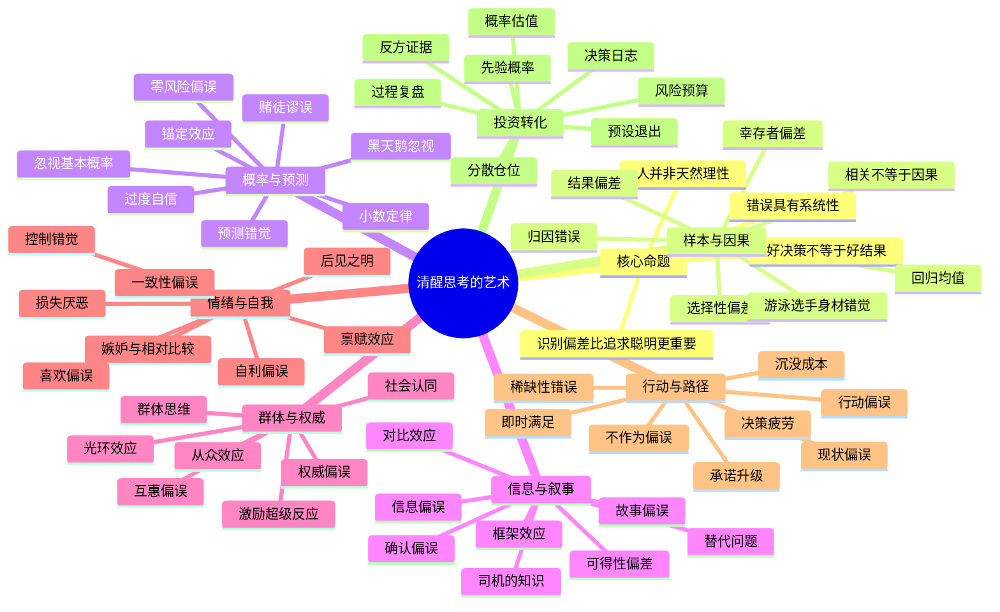
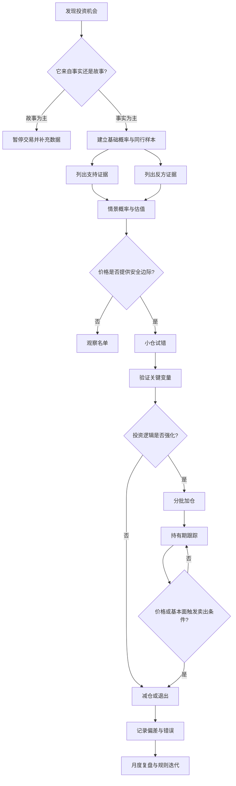

# 《清醒思考的艺术》思维导图

## 一、全书主干

## 二、投资决策闭环

## 三、六类偏差与投资症状

| 偏差类别 | 典型症状 | A股常见表达 | 纠偏工具 |
|---|---|---|---|
| 样本与因果 | 只看赢家、把相关当因果 | “同赛道上一只涨10倍，这只也能” | 失败样本库、因果链、反事实 |
| 概率与预测 | 高估确定性、忽视基准率 | “这个临床数据好，获批和商业化必然成功” | 阶段概率、贝叶斯更新、情景树 |
| 信息与叙事 | 只找支持材料、迷信宏大叙事 | “国产替代、全球首创，所以估值没有上限” | 反方清单、数据源分级、证伪条件 |
| 群体与权威 | 跟随机构、专家、游资和热榜 | “大机构调研过，肯定不会错” | 独立估值、利益冲突检查、延迟决策 |
| 情绪与自我 | 不愿认错、利润归功自己 | “亏损只是洗盘，卖出才是真亏” | 预设止损、决策日志、外部审计 |
| 行动与路径 | 频繁交易、补仓摊薄、承诺升级 | “已经跌30%，再补一点就回本” | 仓位上限、冷静期、重新立项 |

## 四、投资者最危险的十条心理链

1. **上涨 → 关注增加 → 搜索利好 → 确认偏误 → 追高。**
2. **首次盈利 → 自我归因 → 过度自信 → 仓位扩大 → 回撤失控。**
3. **买入后下跌 → 禀赋效应 → 沉没成本 → 补仓 → 风险集中。**
4. **专家看多 → 权威偏误 → 跳过估值 → 高价买入。**
5. **行业景气 → 线性外推 → 忽视周期 → 高点重仓。**
6. **临床数据优秀 → 故事偏误 → 忽视患者规模、竞争和支付能力。**
7. **短期事件发生 → 可得性偏差 → 高估持续时间 → 追逐事件股。**
8. **连续上涨 → 从众效应 → 稀缺感 → 放弃等待回撤。**
9. **卖出后继续涨 → 后悔厌恶 → 冲动追回 → 打乱纪律。**
10. **一次判断正确 → 结果偏差 → 复制错误过程 → 下一次重亏。**

## 五、清醒投资者的四个核心问题

- **我看到的事实是什么？**
- **我忽略的基础概率是什么？**
- **什么证据能够证明我错了？**
- **即使判断错误，我会亏多少？**
