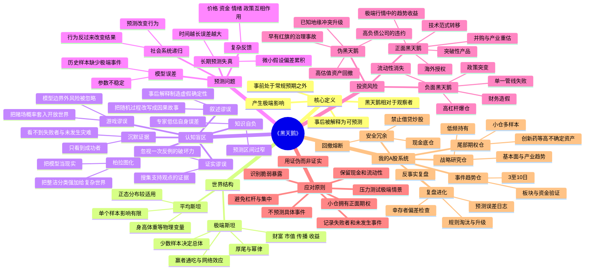

# 《黑天鹅》思维导图

## Mermaid版



---

## 纯Markdown层级版

- 《黑天鹅》
  - 一、黑天鹅三特征
    - 常规经验无法充分推出
    - 影响巨大
    - 事后被编造成“本来就能预测”的故事
  - 二、两种世界
    - 平均斯坦：单个样本不能改变总体
    - 极端斯坦：少数极端样本决定总体
  - 三、人类为何看不见黑天鹅
    - 证实谬误
    - 叙述谬误
    - 沉默证据
    - 游戏谬误
    - 专家预测自负
    - 把模型误当现实
  - 四、投资中的尾部风险
    - 高杠杆
    - 高集中
    - 流动性错配
    - 单一产品/客户/管线
    - 财务真实性
    - 政策和监管突变
  - 五、投资中的正面尾部机会
    - 创新药授权和全球商业化
    - 新技术、新平台、新商业模式
    - 趋势突破和极端行情
    - 市场恐慌后的优质资产重估
  - 六、正确应对
    - 不追求预测所有事件
    - 先保证生存
    - 用有限损失换取开放上行
    - 保留现金、流动性和选择权
    - 用多次小实验替代一次豪赌
    - 以反证和压力测试审查投资逻辑
  - 七、最终目标
    - 不被负面黑天鹅淘汰
    - 能持续参与正面黑天鹅
    - 用长期复利而非单次暴利完成职业化

---

## 投资者版逻辑主线

```text
世界存在不可预测的极端事件
        ↓
历史数据和专家模型会低估尾部
        ↓
单点预测不可靠，复杂叙事会制造幻觉
        ↓
应从“猜事件”转为“看暴露”
        ↓
限制杠杆、集中、流动性和永久损失
        ↓
用小仓、多样本、正凸性参与巨大上行
        ↓
通过复盘记录未知、反例和失败者
        ↓
形成能够穿越极端事件的职业投资系统
```
