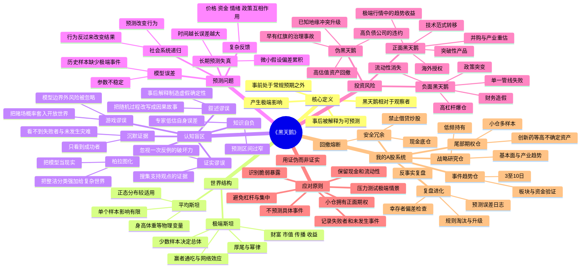

# 《黑天鹅》A股投资学习包（合订版）


---

# 《黑天鹅》投资学习包总览

> 作者：纳西姆·尼古拉斯·塔勒布（Nassim Nicholas Taleb）  
> 学习目标：把“无法预测的极端事件”转化为一套可执行的A股生存、识别、下注与复盘机制。  
> 适用对象：以100万元本金为基础、计划在5年内完成职业投资者转型的个人投资者。  
> 资料截止：2026-07-24。

---

## 一、文件清单

1. `01_黑天鹅_思维导图.md`：全书核心结构与投资映射。
2. `02_黑天鹅_自己的读书笔记.md`：第一人称深度读书笔记。
3. `03_黑天鹅_20条投资原则.md`：可直接纳入交易纪律的20条原则。
4. `04_黑天鹅_A股案例验证.md`：迪哲医药、通源石油、康美药业案例。
5. `05_黑天鹅_我的投资体系.md`：基于100万元本金和5年目标的个人投资系统。
6. `06_黑天鹅_买入前尾部风险检查表.md`：盘前、买入前、持仓中和复盘清单。

---

## 二、全书一句话

> 世界并不是由大量普通事件平滑推动，而是经常被少数极端事件改写；投资者的任务不是准确预测下一只黑天鹅，而是避免被负面黑天鹅淘汰，同时保留参与正面黑天鹅的权利。

---

## 三、本学习包对既有投资体系的增量

此前的体系强调：

```text
国际局势 → 宏观逻辑 → 资金轮动 → 行业受益 → 商品验证
→ 板块验证 → 个股筛选 → 持有逻辑 → 逻辑失效退出
```

《黑天鹅》不是推翻这条链，而是在链条外增加四个约束：

1. **链条可能遗漏未知变量**：逻辑完整不等于世界完整。
2. **预测误差可能非线性放大**：小概率错误也可能造成大损失。
3. **事后解释不等于事前可预测**：不能用成功故事证明模型有效。
4. **仓位必须由失败后果决定**：不是由主观确信程度决定。

因此，升级后的总框架为：

```text
识别领域分布
→ 区分平均斯坦与极端斯坦
→ 建立因果链和证据链
→ 审计未知与隐藏暴露
→ 设计有限损失、开放收益的仓位
→ 用市场和基本面逐级验证
→ 逻辑证伪退出
→ 记录幸存者偏差与遗漏变量
```

---

## 四、最重要的结论

- 黑天鹅无法靠更多新闻和更复杂模型被彻底消除。
- 真正可管理的是暴露、杠杆、集中度、流动性和退出机制。
- 好公司可能遭遇负面尾部事件；坏公司也可能获得一次性正面刺激。
- 正面黑天鹅的关键不是提前押中唯一赢家，而是用小成本持有多个有上行期权的机会。
- 职业投资者的第一目标不是收益最大化，而是不因一次错误永久退出市场。

---

## 五、使用方法

建议按以下顺序执行：

```text
先读思维导图
→ 再读自己的读书笔记
→ 把20条原则录入交易规则库
→ 用A股案例校正“黑天鹅”概念
→ 将个人投资体系写入每日复盘模板
→ 每笔交易使用尾部风险检查表
```

---

## 六、重要说明

本学习包是对《黑天鹅》核心思想的重构、批判性理解和A股应用，不是原书逐章逐句复述，也不构成任何个股买卖建议。文件中“迪泽医药”统一校正为 **迪哲医药-U（688192.SH）**。


---

# 《黑天鹅》思维导图

## Mermaid版



---

## 纯Markdown层级版

- 《黑天鹅》
  - 一、黑天鹅三特征
    - 常规经验无法充分推出
    - 影响巨大
    - 事后被编造成“本来就能预测”的故事
  - 二、两种世界
    - 平均斯坦：单个样本不能改变总体
    - 极端斯坦：少数极端样本决定总体
  - 三、人类为何看不见黑天鹅
    - 证实谬误
    - 叙述谬误
    - 沉默证据
    - 游戏谬误
    - 专家预测自负
    - 把模型误当现实
  - 四、投资中的尾部风险
    - 高杠杆
    - 高集中
    - 流动性错配
    - 单一产品/客户/管线
    - 财务真实性
    - 政策和监管突变
  - 五、投资中的正面尾部机会
    - 创新药授权和全球商业化
    - 新技术、新平台、新商业模式
    - 趋势突破和极端行情
    - 市场恐慌后的优质资产重估
  - 六、正确应对
    - 不追求预测所有事件
    - 先保证生存
    - 用有限损失换取开放上行
    - 保留现金、流动性和选择权
    - 用多次小实验替代一次豪赌
    - 以反证和压力测试审查投资逻辑
  - 七、最终目标
    - 不被负面黑天鹅淘汰
    - 能持续参与正面黑天鹅
    - 用长期复利而非单次暴利完成职业化

---

## 投资者版逻辑主线

```text
世界存在不可预测的极端事件
        ↓
历史数据和专家模型会低估尾部
        ↓
单点预测不可靠，复杂叙事会制造幻觉
        ↓
应从“猜事件”转为“看暴露”
        ↓
限制杠杆、集中、流动性和永久损失
        ↓
用小仓、多样本、正凸性参与巨大上行
        ↓
通过复盘记录未知、反例和失败者
        ↓
形成能够穿越极端事件的职业投资系统
```


---

# 《黑天鹅》自己的读书笔记

> 我的阅读问题：我习惯从国际局势、宏观、商品、板块、资金和个股构建一条完整逻辑链。但如果真正决定收益的是逻辑链之外的少数极端事件，我怎样避免“分析越完整，仓位越失控”？

---

# 一、我对本书的总理解

《黑天鹅》首先不是一本教我预测灾难的书，而是一本摧毁“预测自信”的书。

过去我容易认为，只要把信息搜集得足够全面，把国际局势、政策、产业、公司和资金关系梳理清楚，就能提高正确率。塔勒布提醒我：这套方法在普通波动中有效，但在极端斯坦中存在根本缺陷——真正改变结果的变量，可能根本没有进入我的模型。

这并不意味着研究无用。它意味着研究必须接受边界：

```text
研究可以改善常规情景判断，
但不能证明尾部事件不存在；
逻辑可以提高胜率，
但不能替代仓位与生存管理。
```

本书对我最大的改变，是把投资问题从：

> “下一步最可能发生什么？”

改成：

> “无论发生什么，我的组合会怎样？哪种结果会让我永久失去继续投资的能力？”

---

# 二、黑天鹅的三项特征

塔勒布对黑天鹅的经典定义包含三点：

1. **它处在常规预期之外**：过去经验不能令人信服地推出它。
2. **它产生极端影响**：不是普通噪声，而是改变路径和结果。
3. **它在事后被合理化**：事件发生后，人们迅速拼出一条“早有征兆”的故事。

这三个条件必须同时理解。

## 2.1 低概率不等于黑天鹅

一件事即使概率低，只要风险早已被清楚识别、可以建立情景并可以买保险，它更接近“灰天鹅”。例如：

- 中东冲突升级；
- 霍尔木兹海峡短期受阻；
- 高负债企业再融资失败；
- 创新药临床试验失败；
- 高估值成长股因业绩不及预期而暴跌。

这些结果未必容易预测时间，但并非完全不可想象。

## 2.2 黑天鹅相对于观察者

同一事件对不同人性质不同。内幕参与者、专业研究者和普通投资者掌握的信息不同。一个事件可能对市场大众是黑天鹅，对少数知情者不是。

因此，我不能简单说“市场没想到，所以是黑天鹅”。我必须追问：

- 是真正没有可用信息；
- 还是我没有做研究；
- 是模型无法覆盖；
- 还是我忽略了不利证据；
- 是不可能预见；
- 还是不愿意预见。

## 2.3 高概率事件未发生也可能是黑天鹅

市场常常只关注“意外发生”，却忽略“高度确信的事情没有发生”。

例如：

- 市场一致预期的政策没有落地；
- 被认为必然获批的药物被拒；
- 被认为必然封锁的海峡没有封锁；
- 被认为必然增长的订单没有兑现；
- 被认为必然降息的时间点落空。

投资中，预期落空与突发事件具有对称性。价格交易的是预期，不是新闻标题。

---

# 三、平均斯坦与极端斯坦

## 3.1 平均斯坦

在平均斯坦中，单个样本很难改变总体。随机找一个巨人加入一千人的身高样本，平均身高不会发生根本变化。

这类领域更适合使用平均数、方差、正态分布和历史频率。

## 3.2 极端斯坦

在极端斯坦中，一个样本可以决定总体：

- 一家公司可能贡献指数大部分收益；
- 一只超级牛股可能覆盖大量小亏；
- 一次财务造假可能抹去多年收益；
- 一次技术突破可能改写产业格局；
- 少数交易日可能贡献全年大部分涨幅；
- 少数极端亏损可能摧毁长期复利。

股票市场、财富分布、传播、创新、科技平台和生物医药研发都高度接近极端斯坦。

## 3.3 对我的意义

我不能用平均思维管理极端斯坦资产。

错误示范：

- “这只股票过去最大单日只跌8%，所以风险可控。”
- “公司过去从未临床失败，所以这次也不会。”
- “战争过去几次都很快结束，所以这次也一样。”
- “策略连续20次盈利，说明风险很低。”

正确做法是研究：

- 是否存在跳空、停牌、跌停、流动性消失；
- 是否依赖一次审批、单一产品或单一客户；
- 是否有高杠杆、质押、融资和强制平仓；
- 单次极端损失能否覆盖此前全部盈利；
- 是否存在理论上无限损失、收益却有限的结构。

---

# 四、证实谬误：一千只白天鹅不能证明没有黑天鹅

人类天然喜欢寻找支持自己观点的证据。

我看好通源石油时，容易主动关注：

- 地缘冲突升级；
- 原油上涨；
- 石油板块异动；
- 公司低位放量；
- 资金流入。

但更重要的是主动寻找反例：

- 冲突是否可能迅速降温；
- 油价上涨是否只是风险溢价而非持续供需缺口；
- 油服公司的利润是否真正受益；
- 海外业务是否面临成本、汇率、税收和回款风险；
- 板块是否只有情绪脉冲，没有订单与盈利验证；
- 股价是否已经提前反映最乐观情景。

投资逻辑不能靠“支持证据数量”取胜。一个关键反例可能摧毁整条链。

我的新规则：

```text
每次买入前，必须写出至少三条可能推翻我的证据；
持仓中优先搜索证伪信息，而不是继续收集利好。
```

---

# 五、叙述谬误：故事让随机看起来有秩序

事件发生后，人脑会自动压缩复杂性，把结果改写成线性故事。

例如一只创新药股票大涨后，市场会说：

```text
公司技术领先
→ 临床数据优秀
→ 全球药企认可
→ 海外授权是必然结果
→ 股价上涨早有逻辑
```

但在授权发生前，仍存在：

- 交易对手不确定；
- 条款不确定；
- 时间不确定；
- 监管不确定；
- 临床和商业化不确定；
- 市场是否已计价不确定。

事后故事删除了这些分叉路径。

## 我的修正

复盘不能只记录“为什么涨”。必须同时记录：

1. 事前我掌握了什么；
2. 哪些信息当时不存在；
3. 哪些结果只是运气；
4. 哪些结果可由体系重复；
5. 相同逻辑失败的样本有哪些；
6. 假如事件没有发生，我会亏多少。

这能防止我把一次幸运交易误判为稳定能力。

---

# 六、沉默证据：我看到的只是活下来的样本

市场喜欢展示：

- 十倍股；
- 押中政策的人；
- 抓住战争行情的人；
- 靠一只创新药实现财富跃迁的人；
- 连续涨停中的成功交易者。

但看不到：

- 同类逻辑中大量失败公司；
- 因满仓单一管线失败而离场的人；
- 油价上涨但股价未涨的油服公司；
- 连续止损后停止公开发言的投资者；
- 依靠杠杆成功多年后一次爆仓的人。

这就是沉默证据。

## 我的复盘必须增加失败样本库

研究迪哲医药时，不能只研究成功的舒沃哲和授权交易，还要研究：

- 同靶点失败药物；
- 获批后销售不及预期的创新药；
- 大额BD后续里程碑未兑现案例；
- 单一产品依赖导致估值坍塌的公司；
- 临床数据优秀但商业化失败的公司。

只有把失败者重新放回样本，成功概率和估值才不会被高估。

---

# 七、游戏谬误：市场不是赌场

赌场风险可以被定义，因为：

- 规则固定；
- 概率大体已知；
- 结果集合有限；
- 赌场可以通过大量重复获得稳定优势。

市场不同：

- 规则会改变；
- 政策会改变；
- 参与者会学习；
- 预测会改变价格；
- 新事件会创造原本不在结果集合中的路径；
- 流动性在压力下会消失。

因此，回测中“最大回撤12%”不等于真实最大回撤只有12%。历史没有发生过的事情不代表不能发生。

## 我的量化认知边界

量化模型可以帮助：

- 过滤趋势；
- 识别波动；
- 统计胜率；
- 约束执行；
- 比较不同策略。

但不能替代：

- 模型边界审查；
- 数据污染检查；
- 极端流动性假设；
- 政策与制度变化；
- 黑天鹅下的相关性跃升。

个人投资者不必在盘口速度上击败量化，应在**低频研究、长期等待、结构性赔率和仓位纪律**上绕开其优势区。

---

# 八、专家问题与预测自负

塔勒布批评的不是所有专业知识，而是某些领域中“预测记录很差，却用复杂语言制造权威感”的专家。

投资中，我需要把专家分成两类：

## 8.1 可验证型专家

- 工程参数；
- 会计准则；
- 药理机制；
- 法律条款；
- 生产流程；
- 已披露财务数据。

这些知识通常可以核验，专家有真实优势。

## 8.2 预测型专家

- 明年指数点位；
- 油价精确目标；
- 战争结束日期；
- 某药最终峰值销售；
- 某板块何时见顶；
- 三年后的估值倍数。

这些预测应被大幅折价。

我的做法不是拒绝专家，而是：

```text
使用专家解释机制，
不盲信专家预测路径；
使用区间和情景，
不使用单点结论控制大仓位。
```

---

# 九、可扩展性、赢家通吃与正面黑天鹅

极端斯坦不仅制造风险，也制造巨大上行。

数字产品、平台、创新药和知识产权具有可扩展性：研发成本可能很高，但成功后边际复制成本较低，全球授权和销售可显著放大价值。

迪哲医药的舒沃哲就是典型的“资产期权化”案例：

- 前期长期研发；
- 临床和监管节点逐级验证；
- 中国和美国获批；
- 一线适应症推进；
- 全球药企支付首付款和里程碑；
- 公司保留未来特许权使用费。

但我必须清楚：

- 公司资产具有正面尾部，不代表股票在任何价格都具有正面尾部；
- 一次授权可能增加现金和确定性，也可能使市场短期过度定价；
- 里程碑总额不等于无条件应收款；
- 研发、审批、销售和竞争风险仍然存在。

正面黑天鹅投资需要“开放上行”，同时也需要“买入价格和仓位限制下行”。

---

# 十、为什么不能试图预测黑天鹅

若黑天鹅能够被可靠预测，它往往会改变参与者行为，进而不再以原形发生。

例如：

- 所有人都预期某海峡将被封锁，库存、航线、价格和军事部署会提前改变；
- 所有人都预期某股票将获得大额授权，股价会提前上涨，交易价值下降；
- 所有人都预期某公司资金链断裂，融资会更快关闭，危机路径改变。

社会系统具有反身性。预测本身参与了因果链。

因此，我要做的不是押中事件名称和日期，而是识别：

- 哪些资产对未知极其脆弱；
- 哪些资产有冗余和现金；
- 哪些投资的损失有限；
- 哪些投资可能从极端变化中获得巨额收益；
- 哪些仓位在错误时不会杀死账户。

---

# 十一、我对《黑天鹅》的批判性理解

## 11.1 不能把“不可预测”变成“不做研究”

黑天鹅不是懒惰的借口。常规风险、财务风险、估值风险和治理风险仍然可以研究。很多被称为黑天鹅的事件，其实是被忽视的灰犀牛。

## 11.2 不是所有市场变量都服从同一种厚尾分布

不同资产、不同时间尺度、不同制度下的分布并不相同。不能因为市场有厚尾，就拒绝所有统计模型。正确做法是承认模型适用区间，并为模型外损失设置冗余。

## 11.3 尾部保护并非免费

长期持有保护性资产、低仓位或期权会产生成本。若保护成本过高，也会侵蚀复利。因此需要在生存与效率之间做动态平衡，而不是永远极度保守。

## 11.4 正面黑天鹅也可能被高价透支

市场知道创新药存在巨大上行，就可能提前给出极高估值。即使公司后来成功，投资者也可能因买得太贵而收益有限。

---

# 十二、对我的投资行为的具体修正

## 12.1 从“逻辑完整”升级为“暴露完整”

过去重点检查逻辑链是否完整；今后还要检查：

- 哪个未知变量能让整条链失效；
- 哪个变量会造成跳空而无法止损；
- 哪个相关性会在危机中突然上升；
- 哪个融资或流动性条件被我默认永远存在。

## 12.2 从“概率判断”升级为“后果判断”

即使某事件只有5%概率，只要会造成50%账户损失，也不可接受。相反，即使某机会成功率不高，只要单次损失被限制在0.5%，而成功可获得数倍收益，就值得纳入小样本试验。

## 12.3 从“押注唯一答案”升级为“情景组合”

我不再要求自己准确预测：

- 战争是否全面升级；
- 油价是否突破100美元；
- 某药是否必然获批；
- 某板块是否必然成为月度主线。

我会建立至少三种情景：基准、乐观、悲观，并把仓位设计为悲观情景仍可生存。

## 12.4 从“盈利复盘”升级为“反事实复盘”

每次盈利后必须回答：

- 假如核心催化没有发生，我会亏多少；
- 盈利来自研究、执行、市场贝塔还是运气；
- 同样规则重复100次是否仍有正期望；
- 是否因为盈利而忽略了原有违规行为。

---

# 十三、本书对通源石油交易的重新评价

我此前的逻辑是：

```text
中东冲突升级预期
→ 原油价格上行
→ 石油板块资金切换
→ 通源石油低位放量
→ 持有约一周等待冲突和板块强化
```

这条逻辑有合理性，但《黑天鹅》要求补充：

1. 战争升级是灰天鹅，不应把“可能”当“必然”。
2. 油价上涨到油服利润改善之间存在时滞和传导损耗。
3. 板块大涨可能只是情绪溢价，不是订单和现金流改善。
4. 停火、外交突破或库存释放可能造成隔夜反向跳空。
5. 事件仓必须小于基本面仓，不能因新闻强度扩大到满仓。
6. 退出条件应包含时间止损，而不是只等“战争停手”。

正确结构不是预测战争，而是：

```text
小仓参与已被价格确认的趋势，
冲突升级时保留上行，
冲突缓和时损失受限，
板块不扩散或商品背离时快速退出。
```

---

# 十四、本书对迪哲医药研究的重新评价

迪哲医药是一家典型的极端斯坦公司：少数产品、少数临床节点和少数商业化事件可能决定大部分价值。

2025年公司销售收入8.01亿元，同比增长122.60%；舒沃哲和高瑞哲进入医保，舒沃哲在美国获得加速批准。2026年7月，公司公告与阿斯利康签署舒沃哲全球独家开发和商业化许可协议，披露6亿美元不可退还首付款、最高4亿美元临床开发里程碑、最高5亿美元销售里程碑，以及最高到低双位数的阶梯式特许权使用费。

这构成一次显著的正面尾部事件，但不能机械称为“完全不可预测”：

- 舒沃哲此前已有中美获批和临床验证；
- 阿斯利康长期为重要股东；
- 全球商业化合作具有产业逻辑；
- 大额条款的具体时点和金额仍具有高度意外性。

因此，更准确的定义是：

> 对多数二级市场投资者而言，这是一次“可想象方向、难预测规模与时间”的正面灰黑天鹅事件。

我的投资应对：

- 不在事件发生前满仓押注；
- 用小仓位拥有研发和BD期权；
- 事件落地后重新估算现金底、产品价值和剩余管线；
- 不把最高里程碑总额等同于确定收入；
- 关注协议生效、监管批准、适应症审批、销售竞争和市场计价程度。

---

# 十五、我最终形成的认知

《黑天鹅》不是让我变得悲观，而是让我把乐观建立在不会破产的结构上。

我的最终原则是：

```text
对预测保持怀疑，
对暴露保持精确；
对负面尾部保持冗余，
对正面尾部保持小额、持续和开放；
不因一次成功相信自己能预测世界，
不因无法预测世界而放弃研究和纪律。
```

真正的职业投资能力，不是每次都知道下一步，而是：

> 在不知道下一步时仍能活下来；在极端机会出现时，账户中仍有现金、仓位和心理能力参与。

---

# 十六、资料来源

1. Nassim Nicholas Taleb, *The Black Swan: The Impact of the Highly Improbable*, Random House.  
   https://www.fooledbyrandomness.com/TheBlackSwan.pdf
2. Penguin Random House, *The Black Swan: Second Edition*.  
   https://www.penguinrandomhouse.com/books/176226/the-black-swan-second-edition-by-nassim-nicholas-taleb/
3. 迪哲医药2025年年度报告。  
   https://stockmc.xueqiu.com/202603/688192_20260331_HJPD.pdf
4. 迪哲医药《关于与阿斯利康签署授权许可协议暨关联交易的公告》，2026-07-14。  
   https://www.dizalpharma.com/static/pdf/688192_20260714_LOKU.pdf
5. AstraZeneca官方新闻稿，2026-07-14。  
   https://www.astrazeneca.com/media-centre/press-releases/2026/astrazeneca-licenses-novel-egfr-inhibitor.html
6. 中国证监会对康美药业行政处罚决定书〔2020〕24号。  
   https://www.csrc.gov.cn/csrc/c101928/c1042341/content.shtml

> 本笔记为个人投资方法论重构，不构成投资建议。


---

# 《黑天鹅》提炼的20条投资原则

## 原则1：先判断自己身处平均斯坦还是极端斯坦

银行存款利息、成熟公用事业经营通常更接近平均斯坦；创新药、科技平台、事件驱动、小盘题材和衍生品更接近极端斯坦。领域越接近极端斯坦，越不能依赖历史平均值管理风险。

## 原则2：任何模型都必须附带适用边界

估值模型、技术指标、回测和宏观框架只能在特定条件下有效。每个模型都要写出“何时失效”和“模型外损失”。

## 原则3：不以历史最大回撤代替未来最大损失

历史只记录发生过的路径。仓位应按压力情景和跳空损失设计，而不是按过去波动率设计。

## 原则4：把避免永久损失置于收益最大化之前

一次50%亏损需要100%收益才能回本。职业投资者必须优先保护继续参与市场的资本和心理能力。

## 原则5：严禁用借款、消费贷、经营贷或高杠杆追逐不确定收益

杠杆把可承受波动转化为强制平仓风险，使负面黑天鹅具备淘汰性。

## 原则6：仓位由失败后果决定，不由信心强度决定

“我非常看好”不是扩大仓位的充分条件。应计算最坏情景下的账户损失、流动性和退出能力。

## 原则7：高不确定资产只能用小仓拥有期权

单一临床、单一审批、单一订单、单一政策和单一地缘事件标的，初始仓位必须小；证据增加后再逐级放大。

## 原则8：主动寻找能够推翻观点的证据

买入前至少写三条证伪条件；持仓中优先追踪反例，而不是继续搜集支持信息。

## 原则9：不把新闻突发自动称为黑天鹅

可预见但时间不确定的是灰天鹅；长期积累、红旗明显的是灰犀牛；概念分类错误会导致风险管理错误。

## 原则10：区分“方向可推演”与“规模、时间不可预测”

迪哲医药海外授权方向具有产业逻辑，但具体交易时间、对手、金额和市场反应难以预测。投资应围绕不确定分布，而不是押单点答案。

## 原则11：正面尾部机会需要多样本，而非单一豪赌

用多个独立小仓位参与创新、技术突破和事件机会；少数大成功覆盖多数小失败，前提是失败不会相互高度相关。

## 原则12：现金是对未知世界的看涨期权

现金降低短期收益率，却提供危机买入、避免被迫卖出和等待高赔率机会的权利。

## 原则13：流动性在平时被高估，在危机时被低估

小盘股、连续跌停、停牌和高波动事件股可能无法按计划止损。仓位必须在买入时预留流动性折价。

## 原则14：警惕收益有限、损失开放的负凸性策略

无保护卖期权、高杠杆套利、满仓赌停牌重组、不断摊低问题公司，往往平时小赚、极端时巨亏。

## 原则15：不要用事后故事证明事前能力

盈利复盘必须区分：研究贡献、执行贡献、市场贝塔、事件运气和不可重复部分。

## 原则16：把失败者重新放回样本

研究十倍股时同步研究同赛道退市、临床失败、商业化失败和高位回撤样本，纠正幸存者偏差。

## 原则17：专家用于解释机制，不用于替代仓位决策

重视专家对药理、工程、会计和法律的解释；对价格目标、战争日期和长期单点预测保持折价。

## 原则18：相关性会在危机中上升

持有多只创新药、油气股或高贝塔小盘股并不是真正分散。分散要按失败原因、现金流来源和风险因子划分。

## 原则19：每个投资都要进行反事实测试

问：如果核心催化不发生、延迟一年或结果相反，这个投资还能否成立？不能成立的交易只能使用事件仓，不得伪装成长线价值仓。

## 原则20：长期目标是保留下一次下注权

一次交易、一个月或一年都不是终局。真正的复利优势来自长期存活、持续学习和在极端机会出现时仍有资本。

---

# 20条原则的执行压缩版

```text
1. 先分类领域；2. 写模型边界；3. 做极端压力测试；4. 生存优先；
5. 禁止杠杆；6. 后果定仓位；7. 高不确定小仓；8. 主动证伪；
9. 区分黑天鹅/灰天鹅/灰犀牛；10. 不押精确时间和规模；
11. 多样本获取正面尾部；12. 保留现金；13. 计入流动性折价；
14. 拒绝负凸性；15. 不做事后神话；16. 建失败样本库；
17. 专家不替代决策；18. 按风险因子分散；19. 做反事实；
20. 永远保留下一次下注权。
```


---

# 《黑天鹅》A股真实案例验证

> 核心目的：不是给历史事件贴标签，而是训练“事前信息、事件冲击、暴露结构、事后叙事”四步分析法。  
> 名称校正：用户常说的“迪泽医药”指 **迪哲医药-U（688192.SH）**。

---

# 一、案例判定框架

一个事件是否构成黑天鹅，至少要回答：

| 维度 | 关键问题 |
|---|---|
| 观察者 | 对谁不可预见？普通投资者、专业研究者还是公司内部人？ |
| 事前信息 | 事件发生前是否已有明确红旗、产业线索或公开概率？ |
| 影响 | 是否改变公司价值、行业结构或账户生存？ |
| 叙事 | 事后是否被改写成“早就应该知道”？ |
| 可管理性 | 即使不能预测，是否能通过仓位、现金和分散降低损失？ |

分类：

- **黑天鹅**：常规认知外、影响极端、事后合理化。
- **灰天鹅**：结果可以想象，但时间、规模和路径难预测。
- **灰犀牛**：风险明显、长期存在，却被忽视或拖延处理。
- **普通波动**：历史和模型可以较合理覆盖，不改变系统结构。

---

# 二、案例一：迪哲医药——正面“灰黑天鹅”与创新药期权

## 2.1 事前基础

迪哲医药是一家处于商业化阶段的创新药公司，价值高度集中在少数产品和研发管线，天然属于极端斯坦。

公司2025年年度报告披露：

- 2025年销售收入8.01亿元，同比增长122.60%；
- 舒沃哲和高瑞哲进入国家医保目录；
- 舒沃哲于2025年7月获美国FDA加速批准；
- 公司仍未盈利并存在累计未弥补亏损。

这些信息说明公司已从“纯研发期权”向“商业化+全球化期权”转变，但仍具有研发、审批和销售不确定性。

## 2.2 事件

2026年7月14日，公司公告与阿斯利康签署舒沃哲全球独家开发和商业化许可协议：

- 6亿美元一次性、不可返还首付款；
- 最高4亿美元临床开发里程碑；
- 最高5亿美元销售里程碑；
- 按全球销售额收取最高到低双位数的阶梯式特许权使用费。

公告同时提示：交易仍需股东会及境外反垄断等批准，里程碑和特许权使用费取决于临床、监管和销售条件。

## 2.3 为什么它不是“纯黑天鹅”

事前存在可推演线索：

1. 舒沃哲已获得中美监管验证；
2. 一线适应症临床数据和申请在推进；
3. 阿斯利康长期为公司重要股东；
4. 创新药全球化通常通过自建商业化或License-out实现；
5. 海外授权属于产业中已知的价值实现路径。

所以，“可能发生全球合作”并非完全不可想象。

## 2.4 为什么它又具有黑天鹅属性

难以事前准确预测的部分包括：

- 具体发生日期；
- 是否由阿斯利康承接；
- 是否覆盖全球权利；
- 首付款和总里程碑规模；
- 特许权使用费率；
- 市场短期价格反应。

因此它更适合定义为：

> **方向可推演、时间和规模难预测、影响显著的正面灰黑天鹅。**

## 2.5 投资验证

### 错误方法

```text
认为授权必然发生
→ 提前重仓或满仓
→ 用最高里程碑总额直接计算确定价值
→ 忽略交易审批和后续临床销售条件
```

### 正确方法

```text
识别公司拥有全球化期权
→ 用小仓位参与正面尾部
→ 临床、获批、医保、销售逐级验证后加仓
→ 授权落地后重估现金底和产品权利变化
→ 对未确定里程碑进行概率折价
→ 检查股价是否已经过度反映最乐观情景
```

## 2.6 对估值框架的改变

事件前：

```text
公司价值 = 现金 + 国内产品价值 + 海外商业化期权 + 后续管线期权 - 研发消耗
```

事件后：

```text
公司价值 = 现金底显著增厚
         + 保留区域/过渡期经济利益
         + 概率折价后的里程碑
         + 概率折价后的销售分成
         + 后续管线期权
         - 研发与经营消耗
         - 协议生效和商业化风险
```

关键点：**最高15亿美元潜在付款不是15亿美元确定应收款。**

## 2.7 我的结论

迪哲医药验证了《黑天鹅》的正面一面：

- 少数重大事件可能决定公司大部分价值变化；
- 精确预测事件不现实；
- 可以通过小仓、分阶段验证和开放上行参与；
- 事件落地后必须重新分析，而不是沉浸在成功叙事中。

---

# 三、案例二：通源石油——地缘事件多为灰天鹅，不是纯黑天鹅

## 3.1 公司暴露

通源石油主要为石油、天然气开发提供技术支持和服务，覆盖定向钻井、测井、射孔、压裂增产、天然气回收处理和CCUS等业务，射孔为核心业务。

市场经常把它交易为：

- 国际油价上涨弹性；
- 中东冲突和能源安全题材；
- 海外油气资本开支上行；
- 油服板块低位补涨。

## 3.2 地缘冲突为什么通常是灰天鹅

战争全面升级、海峡封锁、能源设施受袭虽然影响巨大，但并非无法想象。市场、军方、政府、航运公司和能源企业都长期进行情景推演。

真正难预测的是：

- 具体发生时间；
- 冲突持续长度；
- 供应实际中断规模；
- 各国政策响应；
- 油价冲高后的持续性；
- A股资金选择哪只弹性标的。

因此，这类交易应按灰天鹅管理。

## 3.3 价格传导不能被故事替代

常见叙事：

```text
战争升级 → 油价上涨 → 油企赚钱 → 油服订单增加 → 通源石油利润上升
```

但真实链条中存在：

- 油价风险溢价可能很快回落；
- 油企资本开支调整存在时滞；
- 服务合同价格和成本同步变化；
- 海外业务存在回款、汇率和地缘风险；
- 股价可能先于利润大幅上涨；
- 板块资金可能只做数日情绪交易。

## 3.4 我的交易修正

事件趋势仓规则：

1. 初始仓位3%—5%，不得当作确定性重仓。
2. 必须同时看到商品、板块和个股三层确认。
3. 板块不扩散、油价背离或分时承接恶化时减仓。
4. 设3—10个交易日时间窗口，催化未强化则退出。
5. 不以“战争迟早升级”作为无限期持有理由。
6. 对隔夜停火和外交突破预留跳空损失。

## 3.5 我的结论

通源石油案例说明：

> 能想到的极端情景不是黑天鹅；真正的优势来自承认时间和规模不可预测，用小仓和市场确认参与，而不是用宏大叙事替代风险控制。

---

# 四、案例三：康美药业——对投资者像黑天鹅，本质更接近被忽视的灰犀牛

## 4.1 事件事实

中国证监会行政处罚决定认定，康美药业在2016年、2017年、2018年半年度及2018年年度等定期报告中存在严重虚假记载，包括虚增营业收入、利润、货币资金和资产，并存在控股股东及关联方非经营性资金占用未披露等问题。

证监会认定的部分数据包括：

- 2016年虚增货币资金约225.49亿元；
- 2017年虚增货币资金约299.44亿元；
- 2018年半年度虚增货币资金约361.88亿元；
- 多期营业收入和营业利润被虚增；
- 存在大额关联方资金占用未披露。

## 4.2 为什么普通持有人会感觉是黑天鹅

- 公司曾被视为大型白马；
- 财务造假规模巨大；
- 公开报表与真实经营严重偏离；
- 风险暴露后价值和信用发生断裂式变化。

对只依赖审计报告和表面财务数据的投资者，冲击具有黑天鹅式特征。

## 4.3 为什么它又不是完全不可识别

治理和财务风险通常会留下红旗：

- 货币资金巨大却仍高额融资；
- 利息收入、现金流和账面资金不匹配；
- 关联交易与大股东资金行为复杂；
- 商业模式、收入增长与现金回收存在异常；
- 投资者只相信“白马”标签而停止质疑。

这些红旗不一定足以提前证明造假，但足以降低仓位和提高怀疑。

## 4.4 正确的风险管理

1. 现金很多但融资也很多时，必须解释资金受限和真实可用性。
2. 经营现金流长期弱于利润时，不接受“会计利润即价值”。
3. 治理结构不透明时，估值折价不能只靠低市盈率补偿。
4. 财务真实性无法建立信任时，最优决策可能是不参与。
5. 出现重大会计疑点后，不以价格下跌为由无条件补仓。
6. 单只所谓白马也不能突破组合集中度上限。

## 4.5 我的结论

康美药业说明：

> 很多“黑天鹅”并非完全不可预见，而是投资者被品牌、历史业绩和一致叙事麻醉，忽略了沉默证据和异常暴露。

---

# 五、三个案例的对照

| 案例 | 类型 | 事前可识别部分 | 难预测部分 | 正确应对 |
|---|---|---|---|---|
| 迪哲医药授权 | 正面灰黑天鹅 | 产品质量、临床、股东关系、全球化路径 | 时间、对手、金额、条款、市场反应 | 小仓拥有期权，节点验证后加仓，事件后重估 |
| 通源石油地缘行情 | 灰天鹅事件交易 | 冲突情景、油价敏感、板块属性 | 持续时间、供应缺口、资金选择 | 小仓、三层验证、时间止损、隔夜风险预算 |
| 康美药业造假 | 灰犀牛向黑天鹅冲击 | 财务与治理异常可形成怀疑 | 造假全貌、暴露时间、司法后果 | 财务真实性优先、治理折价、分散、不补问题仓 |

---

# 六、案例验证后的统一规则

```text
第一步：判断事件是否真的不可想象；
第二步：列出事件发生前已经存在的公开线索；
第三步：识别最难预测的是方向、时间、规模还是传导；
第四步：计算事件相反时的最大损失；
第五步：用仓位而不是故事表达不确定性；
第六步：事件发生后重新估值，不把结果神话成必然。
```

---

# 七、参考资料

- 迪哲医药2025年年度报告：  
  https://stockmc.xueqiu.com/202603/688192_20260331_HJPD.pdf
- 迪哲医药2026年7月14日授权许可公告：  
  https://www.dizalpharma.com/static/pdf/688192_20260714_LOKU.pdf
- AstraZeneca官方新闻稿：  
  https://www.astrazeneca.com/media-centre/press-releases/2026/astrazeneca-licenses-novel-egfr-inhibitor.html
- 通源石油2025年年度报告摘要：  
  https://static.cninfo.com.cn/finalpage/2026-04-11/1225094987.PDF
- 中国证监会康美药业行政处罚决定书〔2020〕24号：  
  https://www.csrc.gov.cn/csrc/c101928/c1042341/content.shtml

> 案例仅用于方法验证，不构成个股推荐。


---

# 基于《黑天鹅》的我的投资体系

> 目标：以100万元本金为基础，在5年内完成从个人投资者向职业投资者的能力转型。  
> 核心约束：不依赖借贷、不因一次判断失误遭受永久损失、保留参与正面尾部机会的资本。  
> 体系定位：认知驱动 + 风险预算 + 分层策略 + 证据加仓 + 反事实复盘。

---

# 一、我的总原则

```text
不预测具体黑天鹅，预测自己的暴露；
不追求每次正确，追求错误可承受；
不因高信心重仓，按最大损失定仓；
不把所有资金放在中等风险区，保留安全冗余和正面期权；
不以单次暴利证明能力，以5年复利、最大回撤和规则执行评价自己。
```

---

# 二、五年目标的正确拆解

成为职业投资者不能只用收益率定义，必须同时达到五项标准：

1. **生存能力**：任何一年不因单一事件、杠杆或流动性危机退出市场。
2. **稳定流程**：买入、加仓、减仓、退出和复盘均有书面规则。
3. **可验证优势**：至少积累100—200笔可分类交易样本，知道收益来自哪里。
4. **风险控制**：最大回撤、单笔风险、策略相关性和现金比例可量化。
5. **收入替代准备**：投资收益不能建立在必须每月从账户提款的压力上。

我的阶段目标：

| 阶段 | 时间 | 重点 |
|---|---:|---|
| 体系成型 | 第1年 | 建立规则库、复盘库、失败样本库；控制回撤 |
| 样本积累 | 第2年 | 验证事件、趋势、基本面三类策略的真实期望 |
| 优势聚焦 | 第3年 | 淘汰低效策略，集中在2—3个可重复优势 |
| 职业化模拟 | 第4年 | 按职业投资要求管理现金流、回撤和研究节奏 |
| 转型评估 | 第5年 | 以连续24个月记录决定是否全职，而非凭一轮牛市 |

---

# 三、100万元账户的四层结构

以下比例是风险框架，不是固定资产配置；可根据市场赔率调整，但不得突破硬约束。

## 3.1 安全与选择权层：30%—40%

用途：

- 现金或高流动性低风险资产；
- 应对市场极端下跌；
- 避免因生活支出被迫卖出；
- 在高赔率机会出现时提供加仓能力。

硬规则：

- 常态现金不低于20%；
- 市场拥挤、估值高或事件风险集中时提高到40%—60%；
- 不用安全层为亏损交易无限补仓。

## 3.2 战略研究仓：30%—40%

适用：

- 产业趋势清晰；
- 公司竞争优势可验证；
- 现金流或商业化路径逐步改善；
- 估值存在安全边际；
- 持有周期数周至数月。

单只规则：

- 初始3%—5%；
- 多轮证据确认后可提高到8%—10%；
- 极少数高确定性核心仓上限12%；
- 未盈利创新药不能直接进入12%核心仓。

## 3.3 事件与趋势仓：15%—25%

适用：

- 地缘冲突；
- 政策催化；
- 商品价格；
- 板块扩散；
- 放量突破；
- 3—10个交易日持有。

规则：

- 单笔初始3%—5%；
- 只有商品、板块、个股三层确认才允许增加；
- 单一事件主题总暴露不超过15%；
- 时间止损与逻辑止损同时存在；
- 隔夜风险高时主动降低仓位。

## 3.4 正面尾部期权仓：5%—10%

适用：

- 创新药临床和授权；
- 新技术商业化；
- 高不确定但上行巨大的产业早期机会；
- 多个独立小试验。

规则：

- 单个标的1%—3%起步；
- 总数控制在3—6个；
- 任何单一失败不得损失账户1%以上；
- 证据增强才加仓，不能因价格下跌加仓；
- 重大事件落地后转入战略仓或兑现，不长期停留在“故事仓”。

---

# 四、账户级风险预算

## 4.1 回撤红线

| 指标 | 阈值 | 动作 |
|---|---:|---|
| 单日净值回撤 | 1.5% | 当日停止新增高风险仓 |
| 单周回撤 | 3% | 次周仓位降至正常值的70%，复盘全部交易 |
| 单月回撤 | 6% | 暂停事件仓5个交易日，只保留研究仓和现金 |
| 峰值回撤 | 10% | 总仓位降至50%以下，启动系统审计 |
| 峰值回撤 | 15% | 进入防御模式，停止主动交易，重建规则 |

这些阈值的目的不是保证永远不触发，而是阻止小错误通过心理失控演化为毁灭性回撤。

## 4.2 单笔风险

```text
计划损失 = 仓位金额 × 从买入价到失效价的跌幅
```

- 普通交易计划损失：账户的0.5%—0.8%，即5000—8000元。
- 高不确定事件交易：不超过0.5%。
- 极高确定性、流动性良好战略仓：不超过1%。
- 存在跌停或跳空风险时，按压力跌幅而不是止损价计算。

示例：

```text
账户100万元，允许单笔损失6000元；
逻辑失效跌幅为8%；
最大仓位约为6000 / 8% = 7.5万元，即7.5%。
若存在隔夜20%跳空可能，则按20%压力损失计算，
最大仓位应降为3万元，即3%。
```

---

# 五、买入决策的七层证据链

每个候选标的必须经过：

## 第1层：证券权利与生存

- 买的是股权、债权还是衍生品；
- 清偿顺序和潜在稀释；
- 公司是否依赖再融资；
- 是否存在高质押、高负债和退市风险。

## 第2层：领域分布

- 属于平均斯坦还是极端斯坦；
- 价值是否由少数节点决定；
- 历史平均和波动率是否具有参考意义。

## 第3层：产业与宏观

- 政策、供需、技术和资本开支处于什么阶段；
- 是否存在结构性增长；
- 宏观逻辑能否传导到公司收入和现金流。

## 第4层：公司与估值

- 核心竞争力；
- 现金流和资产负债表；
- 正常化盈利；
- 当前价格隐含了哪些成功假设；
- 悲观情景下价值底在哪里。

## 第5层：催化与时间

- 公告、临床、政策、订单、价格或业绩催化；
- 时间窗口；
- 事件延期时如何处理；
- 是否存在“高度预期但没有发生”的风险。

## 第6层：市场确认

- 板块强度；
- 成交量；
- 主力承接；
- 分时均价线；
- 同类股票扩散；
- 大盘风险偏好。

## 第7层：尾部暴露

- 最大跳空损失；
- 流动性消失；
- 单一管线或客户；
- 政策和监管；
- 财务真实性；
- 与现有持仓的隐藏相关性。

只有七层都完成，才允许下单。

---

# 六、证据分级与加仓规则

## 6.1 四级证据

| 级别 | 证据 | 仓位动作 |
|---|---|---|
| E0 | 传闻、小作文、主观推演 | 不交易或观察仓≤1% |
| E1 | 官方政策方向、产业数据早期变化 | 试仓1%—3% |
| E2 | 公司公告、业绩、临床数据、商品与板块共振 | 增至3%—6% |
| E3 | 商业化、现金流、订单或趋势持续验证 | 战略仓6%—10% |

## 6.2 加仓必须满足

```text
新证据增加
+ 原逻辑未被证伪
+ 价格仍有赔率
+ 组合风险未超限
+ 流动性允许
```

禁止以下加仓理由：

- “已经跌很多”；
- “成本太高，想摊低”；
- “不甘心止损”；
- “网上都说有第二波”；
- “这次一定会回来”。

---

# 七、三类策略的完整模板

## 7.1 战略基本面策略

```text
产业趋势
→ 公司竞争位置
→ 现金流/商业化
→ 估值安全边际
→ 催化验证
→ 分批建仓
→ 逻辑与估值双重退出
```

卖出条件：

- 核心竞争优势受损；
- 现金流或商业化不及预期；
- 管理层治理恶化；
- 估值透支多年乐观情景；
- 出现更高赔率替代机会。

## 7.2 事件趋势策略

```text
事件推演
→ 商品/政策验证
→ 板块扩散
→ 个股放量与承接
→ 小仓试入
→ 趋势强化加仓
→ 时间或逻辑失效退出
```

卖出条件：

- 商品与股票背离；
- 板块涨停数和成交额下降；
- 龙头高开低走并带动退潮；
- 个股跌破关键均价且不能收回；
- 催化没有进一步升级；
- 达到预定3—10日窗口。

## 7.3 正面尾部策略

```text
寻找上行巨大、损失可限的资产
→ 多标的小仓布局
→ 等待临床/技术/商业化节点
→ 成功者加仓或转战略仓
→ 失败者快速淘汰
```

卖出条件：

- 关键节点失败；
- 现金无法覆盖下一验证点；
- 管线同质化、竞争显著恶化；
- 事件成功但价格已极端透支；
- 上行权利被交易条款大幅转移。

---

# 八、迪哲医药在体系中的定位

迪哲医药不是普通稳定盈利公司，应放在“战略研究仓 + 正面尾部仓”的交界处。

## 建仓逻辑

- 产品与临床质量；
- 中美监管验证；
- 医保和销售放量；
- 全球授权与现金底；
- 后续适应症和管线。

## 主要风险

- 交易生效条件；
- 里程碑并非确定收入；
- 一线适应症审批；
- 商业化竞争；
- 后续管线失败；
- 股价提前透支。

## 仓位原则

- 事件前不能因“可能授权”满仓；
- 事件后不能因“15亿美元总额”机械追高；
- 必须根据确定现金、概率里程碑、销售分成和剩余管线分层估值；
- 未盈利创新药单股上限原则上不超过账户6%—8%，只有在现金、产品销售和估值均形成强支撑时才讨论更高仓位。

---

# 九、通源石油在体系中的定位

通源石油更适合事件趋势仓，而不是因战争故事直接转成长线重仓。

## 交易条件

- 原油价格趋势确认；
- 油气/油服板块扩散；
- 公司个股放量和承接；
- 市场资金从高位科技切向资源；
- 事件仍在强化而非只剩媒体重复。

## 风险条件

- 冲突降温；
- 油价冲高回落；
- 板块仅一日脉冲；
- 公司股价涨幅远超盈利传导；
- 高换手后承接失败。

## 仓位原则

- 3%—5%起步；
- 同主题总仓不超过15%；
- 不持有到“战争必然结束”的模糊终点；
- 使用时间止损和板块退潮止损。

---

# 十、组合相关性管理

表面分散不等于真实分散。我的持仓要按风险因子分组：

| 风险因子 | 代表标的 | 组合上限 |
|---|---|---:|
| 创新药临床/监管 | 迪哲医药、其他创新药 | 20%—25% |
| 地缘与能源价格 | 通源石油、油气资源 | 15% |
| 高贝塔主题与小盘 | 商业航天、脑机接口等 | 20% |
| 稳定现金流/防御 | 低波动、现金流型资产 | 20%—30% |
| 现金与低风险 | 安全层 | ≥20% |

在市场恐慌中，创新药、科技、小盘和事件股可能同时下跌。因此应按共同风险源，而不是股票数量计算分散度。

---

# 十一、尾部风险压力测试

每周至少测试六种情景：

1. 指数单日下跌5%；
2. 持仓出现20%隔夜跳空；
3. 创新药核心临床失败；
4. 地缘冲突突然停火，资源股低开；
5. 市场成交额骤降30%，小盘流动性收缩；
6. 所有高贝塔持仓相关性上升到0.8以上。

输出：

```text
组合预计损失
+ 最差单股贡献
+ 可变现现金
+ 是否触发融资/生活压力
+ 第二天能够执行的减仓方案
```

---

# 十二、每日、每周、每月工作流

## 12.1 每日

盘前：

- 国际局势、商品、政策；
- A股主线和风险事件；
- 持仓证伪信息；
- 今日最大允许风险。

盘中：

- 只执行预案；
- 观察板块扩散与承接；
- 不因分时刺激临时扩大仓位。

盘后：

- 记录事实、判断、动作、结果；
- 区分计划内和计划外交易；
- 更新逻辑失效条件。

## 12.2 每周

- 组合风险因子暴露；
- 最大回撤和单笔损失；
- 失败样本补充；
- 预测误差统计；
- 下周催化和压力测试。

## 12.3 每月

- 分策略收益：战略仓、事件仓、尾部仓；
- 胜率、盈亏比、期望值；
- 最大有利/不利波动；
- 事后叙述偏差；
- 是否存在靠一笔幸运掩盖系统问题；
- 删除一条无效规则，强化一条有效规则。

---

# 十三、我的交易日志字段

```text
日期：
标的：
策略类型：战略 / 事件 / 尾部
领域：平均斯坦 / 极端斯坦
核心假设：
证据等级：E0/E1/E2/E3
反证条件：
最大跳空压力：
计划仓位：
计划损失：
催化时间窗：
加仓条件：
减仓条件：
退出条件：
实际结果：
结果中有多少来自运气：
相同逻辑的失败样本：
下一次规则修正：
```

---

# 十四、禁止清单

1. 禁止借款和融资满仓炒股。
2. 禁止无保护卖出期权或承担收益有限、损失开放的结构。
3. 禁止单一临床、单一政策或单一战争逻辑超过账户10%。
4. 禁止因亏损扩大而提高信心。
5. 禁止将传闻升级为事实。
6. 禁止在未写退出条件时买入。
7. 禁止用成本价代替公司价值。
8. 禁止把一次盈利交易改写成“我早就知道”。
9. 禁止只研究成功者，不研究失败样本。
10. 禁止因职业转型焦虑而强行提高月收益目标。

---

# 十五、绩效评价体系

收益率只占一部分。每月总分100分：

| 维度 | 权重 |
|---|---:|
| 收益与风险调整后收益 | 25 |
| 最大回撤控制 | 20 |
| 规则执行率 | 20 |
| 研究与证据质量 | 15 |
| 复盘和错误修正 | 10 |
| 现金、相关性与尾部管理 | 10 |

若当月盈利但违反仓位、杠杆或止损规则，不能评为优秀。因为《黑天鹅》告诉我：违规盈利可能只是在尾部事件到来前获得的小额保费。

---

# 十六、最终投资宣言

> 我不需要知道下一只黑天鹅是什么。我要知道的是：任何负面黑天鹅出现时，我都不会被迫离场；任何正面黑天鹅出现时，我仍有资本、研究和仓位参与。

我的职业投资道路不是靠一次押中战争、创新药或产业风口完成，而是靠：

```text
长期生存
+ 有限损失
+ 开放上行
+ 多次小试验
+ 证据加仓
+ 反事实复盘
+ 5年持续复利
```


---

# 《黑天鹅》买入前尾部风险检查表

> 使用规则：任何一笔超过账户3%的交易，下单前必须完成。不能回答的问题视为风险，而不是空白。

---

# 一、领域分类

- [ ] 该标的是平均斯坦还是极端斯坦？
- [ ] 单一事件能否决定公司大部分价值？
- [ ] 历史波动率是否可能严重低估未来风险？
- [ ] 是否存在赢者通吃、网络效应或单一管线特征？

# 二、核心逻辑

- [ ] 我买入的是基本面、事件、趋势还是正面尾部期权？
- [ ] 核心假设能否用一句话表述？
- [ ] 逻辑是否依赖三个以上条件同时成立？
- [ ] 价格是否已反映大部分乐观预期？

# 三、证伪

- [ ] 哪三条证据可以推翻我？
- [ ] 我是否主动搜索了反对观点？
- [ ] 是否存在我不愿意看到的信息？
- [ ] 如果核心催化不发生，这笔交易是否仍成立？

# 四、尾部风险

- [ ] 单日20%跳空时损失多少？
- [ ] 连续跌停或停牌时能否退出？
- [ ] 是否存在财务造假、监管、诉讼或退市风险？
- [ ] 是否依赖单一客户、产品、管线、融资或政策？
- [ ] 与现有持仓是否共享同一个风险因子？

# 五、仓位

- [ ] 计划仓位是多少？
- [ ] 计划损失占账户多少？
- [ ] 仓位是按最大损失计算，还是按“我很看好”决定？
- [ ] 若判断错误，是否影响下一次下注？
- [ ] 是否使用任何借款或杠杆？如是，禁止下单。

# 六、催化和时间

- [ ] 催化是什么？官方事实还是传闻？
- [ ] 时间窗口是多少？
- [ ] 催化延期如何处理？
- [ ] 高概率事件未发生时如何处理？
- [ ] 是否设置时间止损？

# 七、市场确认

- [ ] 商品、行业、板块是否共振？
- [ ] 个股是否放量并有承接？
- [ ] 是板块扩散还是单股独涨？
- [ ] 大盘风险偏好是否支持？
- [ ] 是否出现高开低走、放量滞涨或资金背离？

# 八、退出

- [ ] 逻辑失效价或条件是什么？
- [ ] 技术止损和逻辑止损是否一致？
- [ ] 止盈条件是什么？
- [ ] 事件兑现后是转战略仓还是卖出？
- [ ] 是否可能因成本价、情绪或不甘心拒绝退出？

---

# 九、一票否决项

出现任一项，不得买入：

- [ ] 使用消费贷、经营贷、融资或借款。
- [ ] 无法解释最大损失。
- [ ] 只知道上涨理由，不知道证伪条件。
- [ ] 需要“必然发生”的事件才能成立。
- [ ] 单一高不确定标的拟超过账户10%。
- [ ] 流动性不足但仓位无法快速退出。
- [ ] 公司财务真实性存在重大疑点。
- [ ] 买入目的主要是摊低成本或追回亏损。
- [ ] 事件已经大幅计价，却只用故事解释空间。
- [ ] 没有书面交易计划。

---

# 十、盘后反事实复盘

- [ ] 盈利是来自研究、执行、贝塔还是运气？
- [ ] 假如核心事件没有发生，结果会怎样？
- [ ] 是否违反规则但碰巧赚钱？
- [ ] 相同逻辑的失败者有哪些？
- [ ] 哪个未知变量本次没有伤害我，但下次可能伤害？
- [ ] 下一次应减少什么，而不是增加什么指标？
