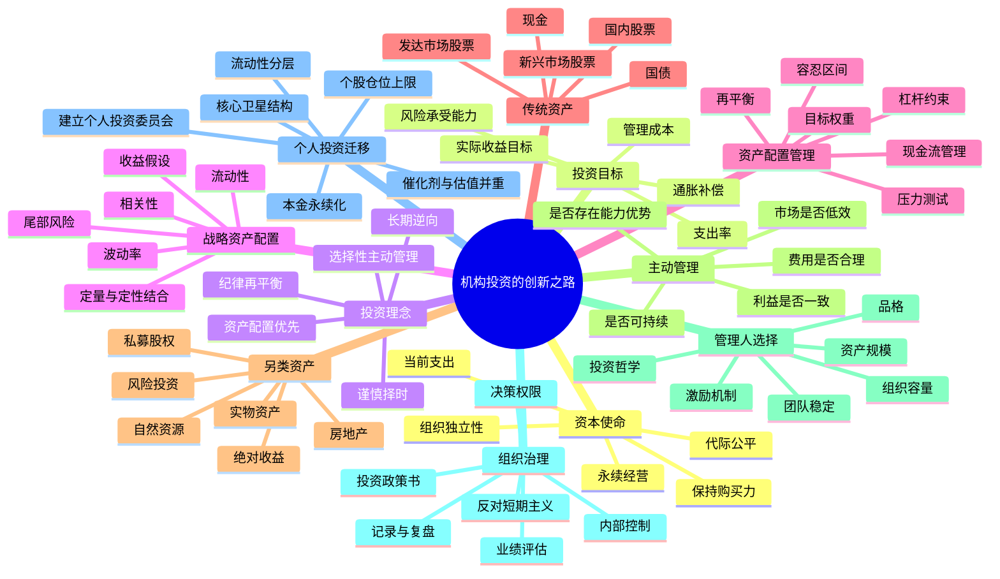

# 《机构投资的创新之路》思维导图

## 一、Mermaid 思维导图



## 二、文本树形导图

```text
机构投资的创新之路
├─ 1. 为什么投资：资本必须服务于使命
│  ├─ 支持当前经营和生活
│  ├─ 保持未来购买力
│  ├─ 降低对外部融资和收入的依赖
│  └─ 在当前需求与未来需求之间保持代际公平
│
├─ 2. 目标函数：不是追求最高收益率
│  ├─ 名义收益目标
│  ├─ 通货膨胀补偿
│  ├─ 年度支出需求
│  ├─ 管理费用和税费
│  └─ 可接受的永久损失概率
│
├─ 3. 收益的第一来源：战略资产配置
│  ├─ 各资产的长期经济属性
│  ├─ 收益、风险、相关性和流动性
│  ├─ 定量模型只能提供边界
│  └─ 定性判断负责识别制度变化与模型失效
│
├─ 4. 三类主动决策
│  ├─ 资产配置：长期有效，最重要
│  ├─ 市场择时：预测难、交易成本高、容易破坏纪律
│  └─ 证券选择：只在能力和市场低效同时存在时使用
│
├─ 5. 组合结构
│  ├─ 股权导向：分享长期经济增长
│  ├─ 充分分散：避免单一风险摧毁使命
│  ├─ 非传统资产：利用低流动性和市场低效
│  └─ 防御资产：为支出、再平衡和危机购买力服务
│
├─ 6. 再平衡
│  ├─ 上涨资产自动减仓
│  ├─ 下跌资产自动加仓
│  ├─ 把逆向投资制度化
│  ├─ 防止组合被市场行情重新定义
│  └─ 前提是资产长期逻辑未破坏
│
├─ 7. 流动性管理
│  ├─ 流动性有价值但有成本
│  ├─ 非流动性可获得风险溢价
│  ├─ 不能用短期负债持有长期资产
│  ├─ 危机时必须有现金承担支出和加仓
│  └─ 高收益资产也可能因被迫出售而变成失败投资
│
├─ 8. 另类资产
│  ├─ 绝对收益：依赖真正的管理能力，不是高收费包装
│  ├─ 实物资产：通胀敏感，但经营和估值风险复杂
│  ├─ 私募股权：回报高度集中于少数顶级管理人
│  └─ 复制配置比例无法复制管理人网络和准入优势
│
├─ 9. 管理人选择
│  ├─ 品格优先于短期业绩
│  ├─ 投资哲学必须清晰且可重复
│  ├─ 团队稳定性决定策略是否可持续
│  ├─ 资产规模扩张可能稀释超额收益
│  ├─ 收费结构必须利益一致
│  └─ 长期合作优于频繁追逐排行榜
│
├─ 10. 组织治理
│  ├─ 投资政策书
│  ├─ 明确决策权限
│  ├─ 使用独立托管、审计和内部控制
│  ├─ 用完整周期评价而非单季度排名
│  ├─ 对错误进行归因
│  └─ 建立能够承受逆风期的组织文化
│
└─ 11. 个人职业投资者版本
   ├─ 把100万元本金视为“个人捐赠基金”
   ├─ 生活现金与投资本金分离
   ├─ 核心资产负责生存，主动组合负责超额收益
   ├─ 高风险创新药和事件股只能进入受限风险预算
   ├─ 不通过融资或贷款放大不确定性资产
   ├─ 设定仓位区间并定期再平衡
   └─ 通过投资日志、月报和年度审计提升决策质量
```

## 三、全书关键因果链

### 1. 资本使命链

```text
明确使命
→ 确定支出需求与期限
→ 确定实际收益目标
→ 评估风险承受能力
→ 设计战略资产配置
→ 建立再平衡和流动性规则
→ 选择证券与管理人
→ 评估结果是否支持使命
```

### 2. 超额收益链

```text
市场低效
+ 独特信息或分析能力
+ 长期资金
+ 低强制交易概率
+ 利益一致的执行者
= 可持续超额收益的可能性
```

缺少其中任何一项，主动管理都可能只是高成本随机波动。

### 3. 失败链

```text
追逐近期高收益
→ 高位增加热门资产
→ 流动性与估值被忽视
→ 市场反转
→ 赎回、支出或融资压力出现
→ 被迫低价卖出
→ 临时波动转化为永久损失
```

### 4. 个人投资成功链

```text
保住本金
→ 建立稳定流程
→ 获取可重复的小优势
→ 通过复利扩大资本
→ 提升信息与研究资源
→ 扩大能力圈
→ 逐步职业化
```

## 四、最值得记住的五个节点

1. **资产配置是组合的宪法。** 个股研究只是宪法之下的行政行为。
2. **再平衡是制度化逆向投资。** 它不依赖临场勇气，但依赖事前规则。
3. **流动性不是越高越好。** 流动性是一种保险，保险不足会破产，保险过多会拖累长期收益。
4. **主动管理是一项组织能力。** 仅有观点，没有研究、纪律和治理，不能形成可持续阿尔法。
5. **长期主义的核心是长期坚持正确流程。** 持有错误资产十年不叫长期主义。
