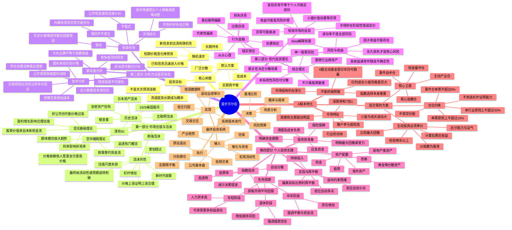

# 《漫步华尔街》思维导图

> 本导图按“市场为什么难预测—专业人士为何难持续胜出—现代投资理论—个人如何执行”四层结构重构。


```mermaid
mindmap
  root((漫步华尔街))
    核心命题
      随机漫步
        短期价格变化难预测
        新信息到达具有随机性
        已知信息迅速进入价格
      投资目标
        不是天天预测涨跌
        而是提高长期成功概率
      默认方案
        低成本
        广泛分散
        长期持有
        定期再平衡
    第一部分 市场估值与泡沫
      坚实基础理论
        股票价值来自未来现金流
        利率影响折现率
        盈利增长影响合理估值
        好公司也可能价格过高
      空中楼阁理论
        价格依赖他人愿意支付更高价格
        叙事替代现金流
        追逐热门概念
        群体模仿放大趋势
      历史泡沫
        郁金香
        南海泡沫
        1929美国股市
        漂亮50
        日本资产泡沫
        互联网泡沫
        加密资产狂热
      泡沫共性
        新时代叙事
        估值尺度失效
        杠杆增加
        害怕错过
        价格上涨证明上涨合理
        最终由流动性或预期逆转刺破
    第二部分 分析方法是否有效
      技术分析
        图形来自历史价格
        公开规则易被套利消除
        频繁交易增加成本
        存在动量但难稳定提取
        交易规则必须经过样本外验证
      基本面分析
        方向正确不等于超额收益
        预测误差不可避免
        会计数据具有滞后性
        竞争者同时研究
        好消息可能已计价
      有效市场
        弱式
          历史价格难提供稳定超额收益
        半强式
          公开信息通常迅速计价
        强式并不成立
          内幕和信息优势可能存在
        实务结论
          市场并非永远正确
          但市场通常比个人想象得更难战胜
    第三部分 现代投资理论
      组合理论
        单一股票风险
        非系统性风险可分散
        相关性决定分散效果
        不只看股票数量
        要跨行业跨资产
      风险与收益
        高收益通常伴随高不确定性
        波动率不是全部风险
        永久损失才是核心风险
        Beta解释有限
        因子收益可能存在
      行为金融
        过度自信
        损失厌恶
        锚定效应
        代表性偏差
        从众心理
        处置效应
        事后聪明偏差
      有效市场的反驳
        小盘价值动量等异常
        市场存在阶段性错误定价
        异常可能衰减
        收益可能是风险补偿
        发现异常不等于个人可稳定获利
    第四部分 个人投资实践
      投资前准备
        应急资金
        保险保障
        清理高成本负债
        明确资金期限
        明确最大回撤承受力
      资产配置
        股票
        债券
        现金
        房地产类资产
        海外资产
        黄金等分散资产
      生命周期
        年轻阶段
          人力资本高
          可承受更多权益波动
        中年阶段
          责任增加
          强调平衡与现金流
        退休阶段
          强调提款安全
          降低顺序风险
      指数投资
        低费率
        高透明
        自动分散
        减少决策错误
        获取市场平均回报
      定投与再平衡
        持续投入
        低位自动多买
        高位自动少买
        偏离目标比例时再平衡
        逆向约束情绪
    A股本地化
      市场特征
        散户参与度较高
        政策和主题驱动明显
        行业轮动快
        涨跌停和T加1
        小盘与成长波动大
      不能机械照搬
        A股主动基金部分年份可跑赢
        市场结构仍在变化
        指数选择本身重要
        红利成长小盘风格差异大
      适合我的方案
        核心卫星
          核心指数仓
          主动产业仓
          事件战术仓
          现金缓冲仓
        主动投资必须审计
          以指数为基准
          计算扣费后收益
          比较最大回撤
          检验两年以上
          区分能力与运气
        仓位约束
          单票原则上不超过15%
          单行业原则上不超过30%
          事件仓单票不超过8%
          不借贷炒股
          不用高杠杆证明能力
    最终投资系统
      输入
        宏观流动性
        产业趋势
        公司基本面
        估值
        催化与资金
      决策
        场景分析
        概率与赔率
        基准比较
        风险预算
      执行
        分批建仓
        低频交易
        预设退出
        定期再平衡
      反馈
        交易日志
        组合归因
        错误数据库
        滚动业绩审计
        系统版本迭代
```

## 导图的核心决策链

```text
承认短期不可预测
→ 不把单一判断当确定性
→ 用分散和仓位管理未知风险
→ 用低成本指数获得基准收益
→ 仅在存在可验证优势时主动偏离指数
→ 用长期数据检验主动优势是否真实
```
