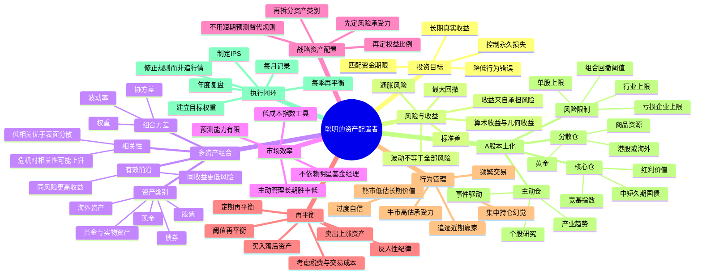

# 《聪明的资产配置者》思维导图

## Mermaid版

## 纯Markdown层级版

- 聪明的资产配置者
  - 一、投资目标
    - 追求长期、可持续、扣除通胀后的真实回报
    - 防止单一判断错误摧毁本金
    - 让组合与资金使用期限匹配
    - 通过制度降低情绪化操作
  - 二、风险与收益
    - 高预期收益通常伴随更高不确定性
    - 波动率是风险的代理变量，不是风险的全部
    - 几何收益决定财富终值
    - 深度回撤会显著破坏复利
  - 三、组合原理
    - 组合风险取决于资产波动和资产之间的相关性
    - 持有很多股票不等于真正分散
    - 资产类别分散通常比同一行业内分散更有效
    - 有效前沿用于寻找风险收益更优的组合
  - 四、资产类别
    - 股票：长期增长引擎
    - 债券：稳定器与再平衡弹药
    - 现金：流动性与选择权
    - 黄金：货币、通胀和极端风险分散器
    - 海外资产：降低单一国家风险
  - 五、市场效率
    - 大部分公开信息会较快进入价格
    - 选股和择时比事后看起来更困难
    - 低成本、宽分散工具应成为核心仓
    - 主动投资应被限制在可验证的能力圈内
  - 六、战略配置
    - 根据风险承受能力决定股票比例
    - 根据资金期限决定债券和现金比例
    - 根据单一国家暴露决定海外配置
    - 根据职业收入稳定性调整组合风险
  - 七、再平衡
    - 目标：恢复风险结构，而不是预测涨跌
    - 方法：年度、季度或偏离阈值
    - 来源：新增资金优先，必要时卖出高配资产
    - 约束：手续费、税费、流动性、涨跌停
  - 八、行为纪律
    - 不追逐近期排名第一的资产
    - 不在上涨后提高战略权益上限
    - 不在下跌后取消长期计划
    - 不把一次成功归因于稳定能力
  - 九、A股应用
    - 核心仓负责市场平均收益
    - 主动仓负责有限度追求超额收益
    - 防守仓负责流动性和回撤控制
    - 分散仓负责应对通胀、汇率和地缘风险
  - 十、执行系统
    - 书面投资政策声明IPS
    - 目标权重与允许区间
    - 单股、行业、主题和事件风险上限
    - 月度记录、季度再平衡、年度归因

## 参考资料

1. William J. Bernstein, *The Intelligent Asset Allocator: How to Build Your Portfolio to Maximize Returns and Minimize Risk*, McGraw-Hill, 2000。Google Books 书目信息与目录：<https://books.google.com/books/about/The_Intelligent_Asset_Allocator_How_to_B.html?id=S2pgMSMX64QC>
2. William J. Bernstein, “The Online Asset Allocator” 与 *Efficient Frontier* 资产配置文章：<https://www.efficientfrontier.com/aa/>；<https://www.efficientfrontier.com/ef/>
3. William J. Bernstein, “Rebalancing”：<https://efficientfrontier.com/ef/197/rebal197.htm>
4. 华泰柏瑞沪深300ETF 2022年年度报告（510300）：<https://www.sse.com.cn/disclosure/fund/announcement/c/new/2023-03-31/510300_20230331_TLSG.pdf>
5. 迪哲医药2024年年度报告：<https://stockn.xueqiu.com/SH688192/20250429058109.pdf>
6. 迪哲医药2025年半年度报告摘要：<https://star.sse.com.cn/disclosure/listedinfo/announcement/c/new/2025-08-23/688192_20250823_DZS6.pdf>
7. 迪哲医药2026年半年度业绩预告：<https://static.cninfo.com.cn/finalpage/2026-07-24/1225439148.PDF>
8. 迪哲医药关于与阿斯利康签署授权许可协议暨关联交易的公告：<https://www.dizalpharma.com/static/pdf/688192_20260714_LOKU.pdf>
9. 国泰上证5年期国债ETF产品说明（511010）：<https://www.gtfund.com/product/productlist/zhishu/511010/index.html>
10. 华安黄金ETF产品页（518880）：<https://www.huaan.com.cn/funds/518880/index.shtml>

> 注：本学习包是对原书思想的结构化转述与A股本土化应用，不替代原书，也不构成具体证券买卖建议。案例数据截至2026年7月24日前后公开披露信息。
