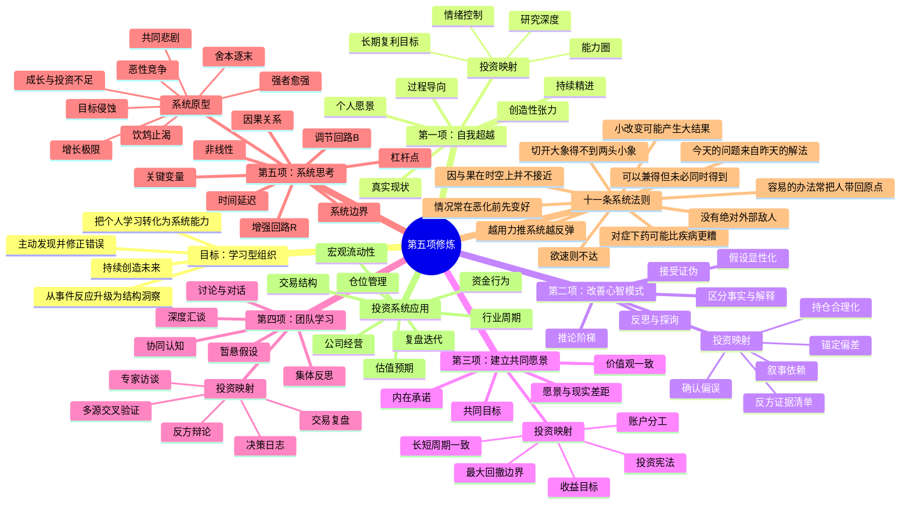
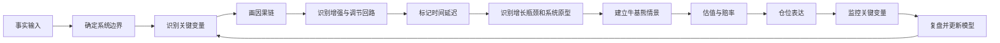

# 《第五项修炼》思维导图

## 一、Mermaid思维导图

## 二、文本版结构

### 1. 学习型组织的目标

- 不停吸收信息并不等于学习；
- 真正的学习是改变决策结构和行为结果；
- 组织学习的敌人包括岗位局限、归罪外部、事件导向、经验错觉和团队迷思；
- 投资中的对应问题是只看涨跌、不看系统，只记盈亏、不改流程。

### 2. 五项修炼

#### 2.1 自我超越

核心公式：

> 愿景 − 当前现实 = 创造性张力

投资应用：

- 目标不是每笔赚钱，而是五年内形成可复制的正期望系统；
- 承认认知不足和交易缺陷，而不是用行情解释失败；
- 研究质量、执行纪律和复盘能力比短期收益更可控。

#### 2.2 改善心智模式

投资者看到的不是市场本身，而是经过自身模型过滤后的市场。

必须把以下内容写出来：

- 我相信什么；
- 这个判断依赖哪些假设；
- 哪些证据支持；
- 哪些证据反对；
- 什么事实出现时，我承认自己错了。

#### 2.3 建立共同愿景

个人投资者的“共同愿景”不是与别人统一口号，而是让自己的长期目标、账户结构、风险预算、研究流程和交易动作保持一致。

若目标是长期复利，却天天追逐无逻辑题材，系统内部已经冲突。

#### 2.4 团队学习

个人投资者同样需要团队学习机制：

- 公告、财报、临床数据和产业资料是“事实成员”；
- 市场观点、研报和专家意见是“外部成员”；
- 决策日志中的过去自己是“历史成员”；
- 反方清单是“制度化反对者”。

#### 2.5 系统思考

系统思考负责把其他四项修炼连接起来。

分析对象不再是单一公司，而是：

> 宏观环境 → 行业供需 → 公司竞争力 → 财务状态 → 市场预期 → 资金行为 → 股价变化 → 管理层和投资者反应

### 3. 三种核心结构

#### 3.1 增强回路 R

变化自我强化。

例：优秀临床数据 → 获批概率提高 → 商业价值提高 → 融资与合作能力增强 → 研发投入增加 → 更多临床数据。

#### 3.2 调节回路 B

系统试图回到某种平衡。

例：股价快速上涨 → 估值透支、获利盘增加 → 卖压增强 → 涨幅受限。

#### 3.3 时间延迟 ||

原因发生后，结果不会立即出现。

例：研发投入到临床数据、临床数据到审批、医保准入到销售放量，均存在显著延迟。

### 4. 投资中最常见的系统原型

| 系统原型 | 投资中的典型表现 |
|---|---|
| 增长极限 | 产品高速放量后受患者池、竞争、价格、产能或渠道约束 |
| 舍本逐末 | 用频繁交易缓解收益焦虑，却不提升研究能力 |
| 饮鸩止渴 | 亏损后加杠杆或补仓，短期降低成本，长期放大风险 |
| 目标侵蚀 | 连续失误后降低买入标准，把“必须有逻辑”改成“可能反弹” |
| 强者愈强 | 龙头获得资金、人才、渠道和估值资源，进一步扩大领先 |
| 共同悲剧 | 拥挤交易中每个人都想先跑，最终共同破坏流动性 |
| 恶性竞争 | 行业价格战、营销战、资本开支竞赛压缩全行业回报 |
| 成长与投资不足 | 需求出现但产能、渠道、研发或组织能力没有同步建设 |

## 三、投资分析主链

## 四、一句话总纲

> 不预测某个点会发生什么，而是识别系统在什么条件下会迁移到什么状态，并用仓位表达概率与赔率。
