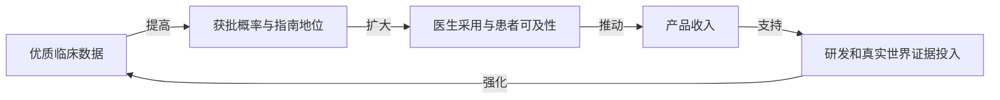

# A股案例验证：迪哲医药（688192.SH）

> 资料截点：2026-07-27  
> 说明：用户常写作“迪泽医药”，正确名称为**迪哲医药**。  
> 目的：不是给出目标价，而是用真实企业验证《第五项修炼》的系统思考方法。

## 一、事实快照

1. 迪哲医药是一家处于商业化阶段的生物制药公司，聚焦肿瘤及血液系统疾病；截至2025年年报，已建立七款产品管线，其中两款药物已获批。[1]
2. 2025年公司营业收入8.01亿元，同比增长122.60%；舒沃哲和高瑞哲进入国家医保后的首个完整年度推动销售放量，但公司仍未盈利。[1]
3. 2026年半年度业绩预告显示：预计营业收入5.22亿元，同比增长47.04%；研发费用约4.02亿元，同比下降1.54%；归母净亏损约2.10亿元，同比减亏44.35%。[2]
4. 2026年ASCO披露的“悟空28”国际多中心随机对照III期研究中，舒沃哲一线治疗组中位PFS为10.3个月，化疗组为7.5个月，HR=0.65；最佳客观缓解率为68.1%，化疗组为35.4%。[3]
5. 2026年7月，公司与阿斯利康签署舒沃哲全球独家开发、商业化许可协议：一次性不可返还首付款6亿美元，最高4亿美元临床开发里程碑、最高5亿美元销售里程碑，并约定阶梯式特许权使用费。协议截至资料截点仍需满足股东会、反垄断审批等生效条件。[4]

这些数据不能被简单归纳为“利好”或“利空”。系统思考要求研究它们如何改变企业系统的反馈结构。

## 二、先划分三个系统

### 2.1 企业经营系统

关键变量：

- 临床价值；
- 获批适应症；
- 医保与患者可及性；
- 商业化能力；
- 收入和毛利；
- 研发投入；
- 现金储备；
- 后续管线质量；
- 全球合作能力。

### 2.2 资本与财务系统

关键变量：

- 现金消耗；
- 融资能力；
- 股权稀释；
- 授权首付款和里程碑；
- 研发费用强度；
- 盈亏平衡时间；
- 资本成本。

### 2.3 股票交易系统

关键变量：

- 市场对临床成功率的定价；
- 对BD收入可持续性的判断；
- 创新药板块风险偏好；
- 机构持仓和交易拥挤；
- 催化兑现程度；
- 股价相对估值和流动性。

**核心原则**：企业系统变强，不代表股票系统在任何价格都具有高赔率。

## 三、关键反馈回路

### R1：临床价值—商业价值增强回路

“悟空28”的临床结果不仅是一条新闻，它可能改变舒沃哲从二/后线走向一线的市场空间和临床定位。若审批、指南、支付和商业化顺利衔接，增强回路成立。

### R2：医保—销售放量增强回路

> 医保覆盖 → 患者支付能力提高 → 用药人数增加 → 医生使用经验增加 → 市场教育效率提高 → 销售继续增长

2025年收入同比大幅增长，2026年上半年继续增长，说明医保和商业化回路正在发挥作用。[1][2]

但收入增长率从超高基数向正常化回落并不必然代表逻辑恶化，需要结合基数、适应症扩展和市场份额判断。

### R3：全球授权—研发平台增强回路

> 高质量资产 → 全球药企合作 → 首付款与里程碑 → 现金压力下降 → 后续管线投入能力增强 → 形成更多高质量资产

阿斯利康授权协议的系统价值不只是一次性现金，而是可能同时改善：

- 全球开发能力；
- 商业化覆盖；
- 研发资金来源；
- 平台可信度；
- 后续BD议价能力。

如果后续管线持续兑现，这会从“单品授权”升级为“研发平台被验证”。

### B1：研发投入—现金消耗调节回路

> 管线增加 → 研发费用上升 → 现金消耗加快 → 融资需求上升 → 稀释或资本成本增加 → 研发扩张受到约束

创新药公司的核心矛盾通常不是有没有好项目，而是能否在现金耗尽前完成关键价值跃迁。

授权首付款可显著减轻现金压力，但不能消除临床失败、开发延迟和资本配置错误。

### B2：商业化增长极限

销售增长可能受到以下约束：

- 目标患者数量；
- 基因检测渗透率；
- 医保支付和价格；
- 医院准入速度；
- 竞争药物和治疗方案；
- 适应症审批进度；
- 全球商业化执行。

因此，不能把初期高速增长永久外推。

### B3：估值—预期调节回路

> 重大临床或BD利好 → 股价上涨 → 市场隐含成功率提高 → 安全边际下降 → 边际买盘减少 → 股价波动加大

利好越大，越需要判断其中多少已经进入价格。

### B4：授权依赖调节回路

BD可以改善现金和全球化效率，但若市场将公司价值完全依赖于单一资产授权，可能出现新脆弱性：

- 里程碑受开发和审批条件制约；
- 特许权使用费取决于最终销售；
- 核心资产全球控制权转移后，公司自身商业化能力的价值权重改变；
- 后续管线若不能复制成功，平台溢价会收缩。

## 四、时间延迟地图

| 起点 | 终点 | 典型延迟 | 投资含义 |
|---|---|---:|---|
| III期数据 | 监管审批 | 数月到更长 | 数据优秀不等于立即形成销售 |
| 获批 | 医院准入与医生使用 | 数月 | 上市初期收入可能慢于预期 |
| 医保纳入 | 处方放量 | 多季度 | 需要观察真实渗透率 |
| BD签约 | 协议生效和首付款确认 | 取决于审批与交割 | 不能把未生效合同等同于到账现金 |
| 首付款到账 | 后续管线价值提升 | 数年 | 关键取决于资本配置效率 |
| 研发投入 | 临床价值读出 | 数年 | 短期利润下降可能是长期投入，也可能是低效消耗 |

创新药投资最容易犯的错误，就是忽略延迟后，用每日价格评价多年因果链。

## 五、用系统原型检验迪哲医药

### 5.1 增长极限

舒沃哲即使进入一线治疗，也会受到患者池、检测、支付、竞争和商业化能力约束。

需要跟踪的不是“空间很大”这种定性口号，而是：

- 目标患者数量与诊断率；
- 一线适应症审批；
- 市场份额；
- 净价格；
- 全球放量速度。

### 5.2 成长与投资不足

若产品临床价值强，但全球临床、注册、供应和商业化投入不足，价值可能无法充分实现。与阿斯利康合作，本质上是在引入全球能力以解除这一瓶颈。

### 5.3 强者愈强

优秀临床数据和成功BD会提高人才、资本、合作伙伴和市场关注度，形成资源向强管线集中的增强回路。

但股票层面也可能形成拥挤和高预期，强者愈强最终会受到估值调节。

### 5.4 舍本逐末

若投资者只盯着BD金额和股价涨幅，不研究临床、审批和现金流结构，就是用显眼结果替代底层系统研究。

### 5.5 成功者获得更多资源

公司可能将更多资源投入舒沃哲等已验证项目。这可以提高成功率，但也可能挤压早期管线，形成“成功者愈成功”的资源配置偏差。

投资者需要观察后续管线是否继续产生独立价值，而不是只依赖单一核心资产。

## 六、估值框架：不能只用PE

迪哲医药仍处于高研发投入和亏损阶段，普通PE缺乏解释力。更合适的是SOTP：

> 企业价值 = 现金净值 + 已上市产品风险调整价值 + 授权首付款/里程碑风险调整价值 + 后续管线期权价值 − 未来研发与商业化资金需求

### 6.1 现金部分

关注：

- 账面现金；
- 授权协议是否生效；
- 首付款到账及税务处理；
- 年度现金消耗；
- 是否仍需股权融资。

### 6.2 已上市产品

关注：

- 舒沃哲和高瑞哲销售；
- 医保后渗透；
- 国内外净价格；
- 适应症扩展；
- 销售费用效率。

### 6.3 授权资产

不能把最高里程碑总额直接计入价值。应按每个节点：

> 风险调整价值 = 里程碑金额 × 达成概率 × 折现因子

特许权使用费则需基于未来销售峰值、份额、持续时间和概率进行折现。

### 6.4 后续管线

关注：

- birelentinib；
- DZD6008；
- 高瑞哲适应症扩展；
- 其他早期管线。

每条管线独立估值，并避免把同一临床成功概率重复计价。

## 七、三种情景推演

### 7.1 牛市情景

条件：

- 授权协议顺利生效，首付款确认；
- 舒沃哲一线适应症中美审批推进顺利；
- 商业化收入持续高增长；
- 后续管线出现高质量数据；
- 现金流结构明显改善；
- 创新药板块风险偏好较强。

系统结果：

> 单品价值提升 + 平台能力验证 + 融资风险下降 + 全球化溢价提升

### 7.2 基准情景

条件：

- 授权顺利完成；
- 国内销售继续增长但增速正常化；
- 一线适应症审批符合正常节奏；
- 后续管线有进展但未出现超预期；
- 公司继续亏损但减亏。

系统结果：

> 企业基本面改善，但股价回报主要取决于市场预期和买入估值。

### 7.3 熊市情景

条件：

- 协议审批或交割出现延迟；
- 里程碑兑现低于市场想象；
- 一线审批、商业化或竞争出现不利变化；
- 后续管线数据不及预期；
- 研发和销售费用继续高企；
- 板块风险偏好下降。

系统结果：

> 预期回落、估值压缩与高波动叠加，即使公司仍有长期价值，股票也可能经历显著回撤。

## 八、监控仪表盘

### 8.1 月度/季度数据

- 舒沃哲、高瑞哲收入和增速；
- 销售费用率；
- 研发费用及现金消耗；
- 账面现金与预计可支持年限；
- 应收账款、存货和经营现金流；
- 商业化团队效率。

### 8.2 关键事件

- 阿斯利康许可协议股东会和反垄断审批；
- 首付款到账及会计确认；
- 舒沃哲一线适应症中美审批；
- 新指南和医保变化；
- birelentinib、DZD6008等临床数据；
- 竞争药物进展。

### 8.3 股票系统

- 重大利好后的换手和承接；
- 板块相对强弱；
- 机构持仓变化；
- 估值与隐含成功率；
- 成交拥挤与波动率。

## 九、交易规则示例

### 9.1 中长期账户

买入前提：

- 核心临床和商业逻辑可验证；
- 现金流风险可控；
- 当前估值未计入过高成功率；
- 至少存在两条独立价值来源；
- 熊市情景损失可以承受。

仓位：

- 初始观察仓；
- 协议生效、审批、收入等关键节点验证后提高仓位；
- 单一二元事件前避免满仓。

退出：

- 临床或审批逻辑实质失败；
- 商业化远低于预期；
- 现金流重新恶化；
- 后续管线无法支撑平台价值；
- 估值已明显透支牛市情景。

### 9.2 事件交易账户

仅交易：

- 明确事件；
- 预期差；
- 板块协同；
- 放量后真实承接；
- 可定义止损。

不得因为事件交易失败而自动转成长线。

## 十、案例结论

迪哲医药验证了《第五项修炼》的核心观点：

1. 企业价值来自多条反馈回路，而不是某一条公告；
2. 临床成功、审批、医保、销售和利润之间存在显著延迟；
3. BD既是现金流杠杆点，也会改变公司价值结构和风险来源；
4. 高增长最终会遇到市场、竞争和估值的调节回路；
5. 正确的公司判断只有与合理价格、仓位和退出纪律结合，才会成为正确投资。

> 对迪哲医药最重要的问题，不是“它是不是好公司”，而是：公司系统正迁移到什么状态，市场已经为该状态支付了什么价格，剩余赔率是否值得承担不确定性。

## 十一、资料来源

[1] 迪哲（江苏）医药股份有限公司：《2025年年度报告》，披露日期2026-03-31。  
[2] 迪哲（江苏）医药股份有限公司：《2026年半年度业绩预告的自愿性披露公告》，公告编号2026-037，披露日期2026-07-24。  
[3] 迪哲（江苏）医药股份有限公司：《关于在2026年美国临床肿瘤学会（ASCO）年会公布多项肺癌领域最新研究进展的公告》，公告编号2026-032，披露日期2026-06-01。  
[4] 迪哲（江苏）医药股份有限公司：《关于与阿斯利康签署授权许可协议暨关联交易的公告》，公告编号2026-034，披露日期2026-07-14。
