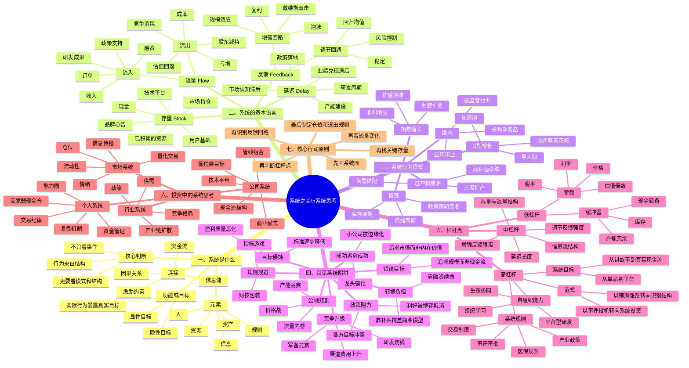

# 《系统之美》思维导图

> 说明：本图基于 Donella H. Meadows《Thinking in Systems: A Primer》（中文常译《系统之美》）的核心框架整理，并结合投资决策场景重构。不是原文摘抄，而是投资者视角的系统化笔记。

## 一页版总览

- 系统 = 元素 + 连接 + 目标。投资中，元素是公司、政策、资金、产品、竞争者；连接是资金流、信息流、产业链、监管规则；目标是利润、份额、市值、临床价值、资本回报。
- 不要只问“今天为什么涨”，要问“哪个存量变了、哪个流量变了、哪个反馈回路被触发了、哪个规则或范式发生变化”。
- 股票上涨通常不是单个利好导致，而是“真实业务改善 + 资金认知扩散 + 估值规则改变”的反馈回路启动。
- 最有价值的投资机会，常出现在系统高杠杆点被触发时：审批、医保、全球授权、产业政策、供需拐点、平台能力被验证。
- 最大的风险，常来自延迟和错配：基本面还没兑现、估值先透支；产能刚释放、需求已见顶；政策刚刺激、资金已提前撤退。
