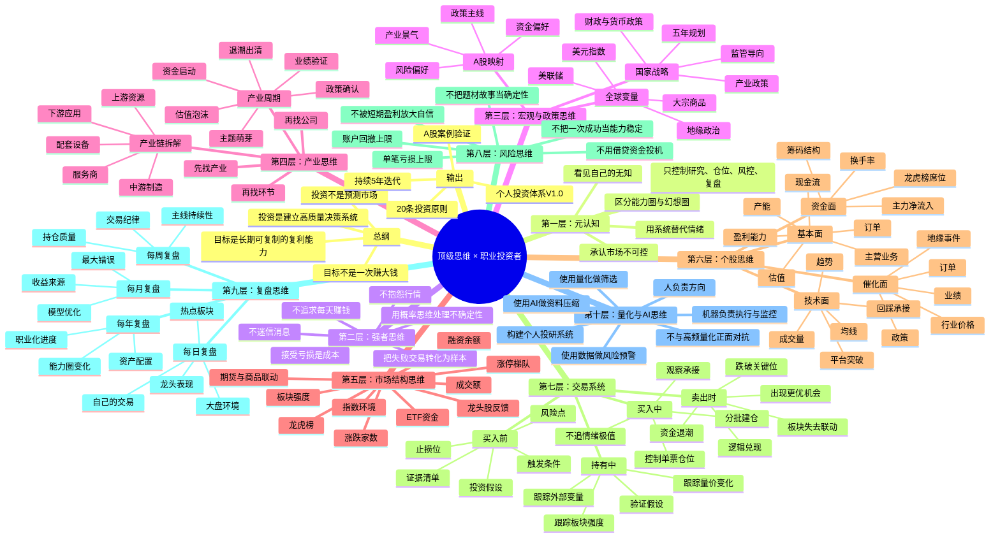

# 《顶级思维》× 职业投资者成长：思维导图

> 说明：本思维导图不是对原书的逐字摘录，而是围绕“5年内成长为职业投资者”的目标，对《顶级思维》中关于投资人思维方式的公开信息与投资实践进行结构化重构。可在支持 Mermaid 的 Markdown 工具中渲染。



---

## 文字版结构

### 1. 一本书真正要转化成三类资产

1. **认知资产**：我如何理解市场、风险、周期、人性。
2. **规则资产**：我在什么条件下买、卖、加仓、减仓、休息。
3. **数据资产**：我每天、每周、每月跟踪哪些指标，并把它们沉淀为样本。

### 2. 职业投资者的核心思维链

```text
宏观方向 → 产业主线 → 板块强度 → 个股弹性 → 买卖规则 → 仓位控制 → 复盘迭代
```

### 3. 个人投资者对抗量化的正确姿势

```text
不对抗高频量化
不追逐毫秒级交易
不在无主线的盘面里频繁交易
不把K线噪音当机会

用量化做：筛选、回测、预警、风控、复盘
用人脑做：政策判断、产业理解、商业逻辑、风险取舍
```

### 4. 最终目标

> 不是成为“更会炒股的人”，而是成为“能运营资金、管理风险、构建研究系统、持续复利的人”。

